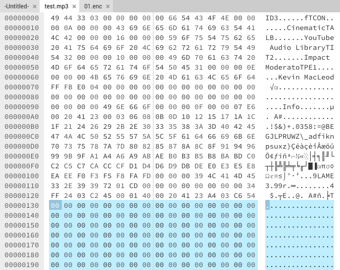
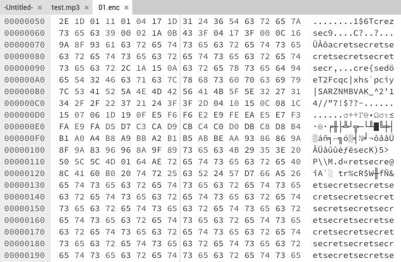
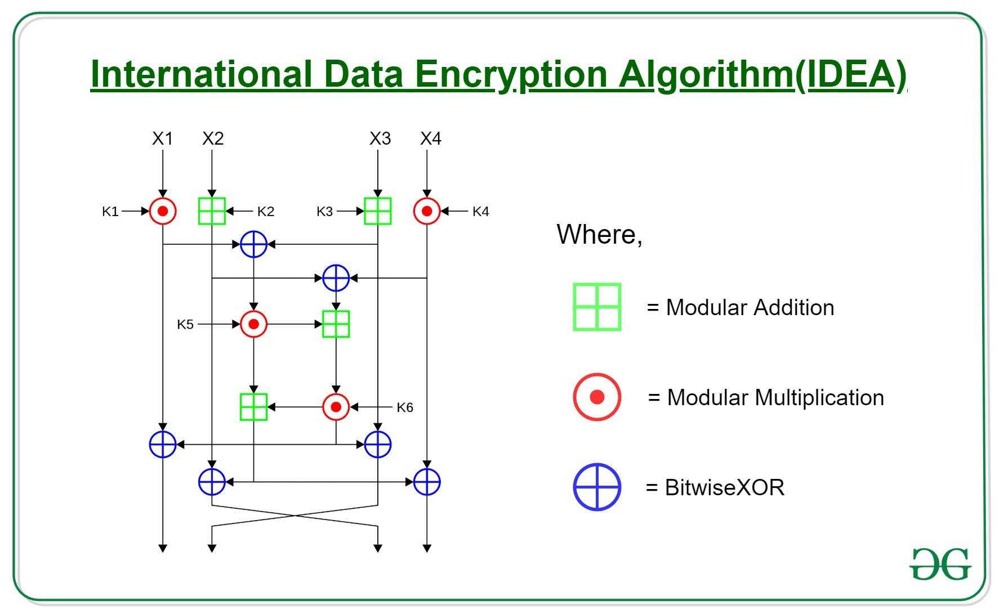

<style>
    /* You can add custom style here. VSCode supports this.
    Other editor might need these custom code in
    the YAML header: section: | */
</style>

# Criptografía y Teoría de Códigos
<!-- _class: first-slide -->

**Tema 1: Conceptos básicos**

Juan Vera del Campo

juan.vera@campusviu.es

# Hoy hablamos de...

- [Servicios criptográficos](#3): objetivos, seguridad por oscuridad, Cuentacuentos, principios de Kerckhoffs y máxima de Shannon, 
- [Primitivas criptográficas](#19): hash, cifrado simétrico, cifrado asimétrico
- [Procolos criptográficos](#27): composición de primitivas
- [Conclusiones](#33): resumen y referencias
- Anexo recomendado: [Glosario](A1-glosario.html)

# Servicios criptográficos
<!--
_class: lead
header: 'Servicios criptográficos'
-->

## Objetivos de la criptografía

Protección de la comunicaciones a través de **medios desprotegidos** entre un emisor y uno o varios destinatarios.

---

¿Qué queremos proteger? No solo el mensaje que se transmite:

Recurso|Ejemplo
--|--
**El contenido de un mensaje**|¿Cuánto dinero se está transfiriendo?
**Las veces que se envía un mensaje**|¿Han sido una transferencia o dos? No queremos que un atacante repita una transferencia, aunque no sepa de cuánto es.
**Los participantes**|¿Seguro que el ordenante es D. Paco Pérez? ¿Seguro que está hablando con su banco?
**El no repudio**|Paco Pérez no podrá decir que no ordenó la transferencia.

## Servicios de seguridad

- **Confidencialidad**: solo el legítimo destinatario debe poder ser capaz de leer el contenido del mensaje original o de sacar cualquier información estadística.
- **Integridad**: el destinatario debe ser capaz de verificar que el contenido del mensaje original no ha sido modificado
- **Autenticidad**: el destinatario debe ser capaz de verificar que el emisor es realmente el autor del mensaje
- **No repudio**: el emisor no debe ser capaz de negar que es el autor del mensaje
- **Otros**: autorización, acuerdo de claves, partición de secretos, PRNG...

> Enunciados con otro nombre: [New Directions in Cryptography](https://www.cs.utexas.edu/~shmat/courses/cs395t_fall06/dh.pdf), Whitfield Diffie y Martin Hellman en 1976. Pero hablaremos más de este paper en el capítulo 4
> Estándar: [NIST Special Publication 800-57 Part 1, Section 3](https://doi.org/10.6028/NIST.SP.800-57pt1r5)


<!--

El objetivo más evidente de un sistema criptográfico es alcanzar confidencialidad: no queremos que nadie pueda leer nuestras comunicaciones aparte de la persona a la que están destinadas

Pero un sistema que solo ofrezca confidencialidad no es seguro casi nunca. Por ejemplo, si estamos hablando con un adversario en vez de nuestro banco, da igual que nadie más pueda leer nuestras comunicaciones. Tenemos que estar seguros de que al otro lado está realmente el banco: autenticidad

En ocasiones, un adversario puede modificar un mensaje a pesar de que no sepa qué es lo que hay en él. O puede que lo realmente importante para un banco es asegurar que uno de sus clientes ordenó una trasferencia desde sus cuentas y no hacia sus cuentas.

Los objetivos de un sistema criptográfico son los servicios de seguridad que ofrece

El NIST es la agencia de estandarización de EEUU, y entre las cosas que estandariza también está la seguridad del gobierno de EEUU. Sus estándares son sencillos de leer e incluyen un glosario que viene muy bien para introducirse en la criptografía.

-->

## Grados de seguridad teórica

Esta protección debe soportar ataques de una **complejidad razonable**:

- **Seguridad incondicional**: un atacante no puede descifrar el mensaje aunque tenga infinito poder computacional.
- **Seguridad computacional**: un atacante podría teóricamente descifrar el mensaje, pero no es razonable que lo haga: lleva demasido tiempo, dinero o recursos (por ejemplo, millones de años o más memoria de la que cabe en el universo).

<!--

Tenemos que **poder** **proteger** los mensajes.

Veremos que existen protocolos que ofrecen seguridad incondicional, pero su utilización es tan pesada que no es práctica, y se prefiere la seguridad computacional

-->

## Seguridad por oscuridad
<!-- _class: with-info -->

**Falacia**: "Nadie sabe cómo es nuestro sistema, y por tanto es seguro"

- Mantener el secreto del código fuente del software.
- Mantener el secreto de algoritmos y protocolos utilizados, o utilizar un protocolo ad-hoc o inventado.
- Adopción de políticas de no revelación pública de la información sobre vulnerabilidades.
- Confiar en configuraciones no estándar (por ejemplo, poner el servidor en el puerto 3181)

Confiar en "la oscuridad" para ofrecer seguridad no es buena idea.

<!--
La seguridad por oscuridad es pensar que un sistema secreto es más seguro que un sistema conocido. En realidad, es muy difícil mantener un sistema en secreto. Además, la criptografía está llena de "trampas" y razonamientos no evidentes. Es muy difícil que unas pocas personas puedan diseñar un sistema realmente seguro y además mantenerlo en secreto. Eso es lo que se llama "seguridad por oscuridad", y fiar la seguridad a la oscuridad no es buena idea, como nos ha enseñado la experiencia.

Mantener las cosas en secreto no significa mantener los protocolos de seguridad en secreto.
-->

---


> https://www.robohara.com/?p=1439
> <https://dev.to/ctrlshifti/what-security-through-obscurity-is-and-why-it-s-evil-47d5>


## Pero tenemos malas noticias...


## Ejemplo: Audiocuentos


https://www.mikrocontroller.net/topic/503014

<!--
Hay dos editoriales española que están comercializando un coleccionable de cuentos infantiles. El producto de ambas es similar: un altavoz con figuras coleccionables, el cuento suena cuando se acerca la figura al altavoz.

En ambas, los cuentos se guardan en una tarjeta SD en el altavoz. Una de ellas cifra esos cuentos para que no puedan escucharse ni cambiarse sin las figuras...

...pero han confiado en la seguridad por oscuridad

(la otra no ha protegido los cuentos y ha confiado en que un particular no comprará etiquetas RFID, que son la que llevan las figuras)

El enlace es un foro en alemán, pero pasan poco después al inglés. Hay también un foro en castellano sobre estas figuras que no es difícil de encontrar
-->

---

Visor hexadecimal: https://hexed.it/

MP3 de ejemplo: https://file-examples.com/index.php/sample-audio-files/sample-mp3-download/

Archivo cifrado: `01.enc` en los recursos de la asignatura.

<!--

Ojo: el archivo cifrado no es un original de Audiocuentos. Es el propio MP3 de ejemplo cifrado con una contraseña. Los Audiocuentos reales están cifrados con otra contraseña, pero se pueden analizar igual.

-->

---



<!--
Que el archivo es un MP3 y no otro formato es una suposición razonable. Podría ser también WAB, OGG, o algún otro formato de audio. En este caso son MP3. Si no lo hubiesen sido, un adversaria tardaría un poco pero no demasiado más: la idea es la misma.

En la figura hemos abierto un archivo MP3 de ejemplo en un editor hexadecimal. Podemos observar qe los archivos MP3 contienen todos una cabecera conocida, empiezan por ID3, y de vez en cuando tienen espacios "de ceros" que se usan como secciones de padding.

Es muy común que los archivos empiecen con unas pocos letras que los identifican: DOCX, JPG, ZIP... tienen todos una cabera inicial que los identifica.
-->

---



<!--
Si abrimos el archivo cifrado, observanos que no tiene cabecera inicial (eso es común en archivos cifrados, y de hecho podemos usarlo para distinguir cuando un archivo está cifrado, con gran probabilidad)

Además, las secciones que en un MP3 se corresponden a ceros incluyen un patrón repetitivo y sospechoso...  que efectivamente es la clave de cifrado del resto de archivo. Eso es porque el cifrado es un XOR con secret.

(como veremos: un cifrado de bloque en modo ECB, y similar a un vigenere)

Este sistema no cumple una de las máximas que veremos en cifrado: la clave de cifrado se está reutilizando en todo el archivo. Aunque el XOR es un sistema real de cifrado, la gestión de la clave es completamente incorrecta y permite descifrar cualquier audiocuento, o cambiarlo.

Comandos de descifrado (con la clave conocida)

```
# pip install xortool & hash xortool-xor
file test.mp3
hexdump -C -n 32 test.mp3 
hexdump -C 01.enc | less 
cat 01.enc |  xortool-xor -r "secret" -f - > 01.mp3
```
 -->


## (inciso)

* "Seguridad por oscuridad" es mala práctica
* Pero "seguridad **y además** oscuridad" puede ser buena idea

<!--

Un sistema no es inseguro por ser oscuro. Es simplemente oscuro. Basar tu seguridad en la oscuridad lo consideramos una mala idea porque los hackers pueden saber más que tú. No hay ningún error lógico en querer basar tu seguridad en la oscuridad. Simplemente, la experiencia nos dice que no es buena idea, y que los sistemas cuya seguridad se basa en la oscuridad caen antes.

PERO que un sistema sea seguro de por sí, utilizando protocolos realmente seguros y buenas prácticas criptográficas, Y ADEMÁS lo ocultamos al mundo, es sin duda una buena idea que no perjudica. Tendrás a los adversarios entretenidos para intentar entender tu sistema, y cuando lo consigan verán que es un indescifrable AES-512.

No bases tu seguridad en la oscuridad, pero añadir un poco de oscuridad siempre ayuda.

-->

## Principios de Kerckhoffs
<!-- _class: smallerfont -->

<https://en.wikipedia.org/wiki/Kerckhoffs%27s_principle>


1. **Si el sistema no es teóricamente irrompible, al menos debe serlo en la práctica.**
1. **La efectividad del sistema no debe depender de que su diseño permanezca en secreto.**
1. ~~*La clave debe ser fácilmente memorizable de manera que no haya que recurrir a notas escritas*~~
1. *Los criptogramas deberán dar resultados alfanuméricos*
1. ~~*El sistema debe ser operable por una única persona*~~
1. **El sistema debe ser fácil de utilizar.**

<!-- Kerckhoffs enunció sus principios en 1883.

Los principios 1, 2 y 6 guiarán todo el desarrollo de la criptografía actual

1. Confidencialidad computacional (capítulo 3)
2. No basarse en seguridad por oscuridad
3. Requisito de complejidad (capítulo 4)

Pero atención: la criptografía actual

- En cuanto a clave, tienen que ser específicamente aleatorias y por tanto no
  fácilmente memorizables.
- Los resultados son binarios, y por tanto no son alfanuméricos en general. Aún
  así y aunque no sea estrictamente necesario, la criptografía tiene como
  "costumbre" guardar claves codificadas en Base65, es decir, usando solo
  caracteres imprimibles. El principio 4 se sigue cumpliento parcialmente, aunque
  no sea estrictamente necesaria.
- El sistema completo suele necesitar de varias personas para operar, y en
  particular una "tercera parte de confianza"

Kerckhoffs definió sus principios para un contexto en que una persona solitaria
pudiese utilizar el criptosistema fácilmente y escribir el resultado. Ahora
tenemos la ayuda de ordenadores y esos principios no son ni necesarios, ni
recomendables.

Eso nos lleva a que: la seguridad a veces es cuestión de opinión. "Buenas
prácticas". "Recomendaciones". Por ejemplo, el NIST solo emite recomendaciones.
Pero son recomendaciones muy informadas.

-->

## Máxima de Shannon


*El adversario conoce el sistema*

**Claude Elwood Shannon (1906-2001)**

> [Communication Theory of Secrecy Systems](http://netlab.cs.ucla.edu/wiki/files/shannon1949.pdf), Claude E. Shannon, Bell System Technical Journal, vol.28-4, page 656--715, Oct. 1949.

<!-- Shanon es un gran matemático del siglo XX, que creó la teoría de la información. Le debemos la teoría detrás de la criptografía, los archivos comprimidos, la codificación digital...

Su máxima se contrapone a la "seguridad por oscuridad". Es decir, tratar de dejar el sistema secreto. No funciona.

El paper enlazado es una estupenda introducción a los conceptos fundamentales de la criptografía y se recomienda mucho su lectura
-->

## Confusión y difusión
<!-- _class: smaller-font -->

Según Shannon, la criptografía debe **maximizar la confusión y difusión de los mensajes cifrados**


- **Confusión**: cada bit de un mensaje cifrado depende de varios bits de la clave.
- **Difusión**: un cambio de un bit en el mensaje original cambia la mitad de los bits en el mensaje cifrado.

> Fuente: <https://en.wikipedia.org/wiki/Confusion_and_diffusion>

<!--
Shannon fue quien recomendó que la criptografía se centrase en maximizar esos dos parámetros



Algunos algoritmos de cifrado no son complejos y están formados por pequeños módulos o pasos que actúan en cascada. Cada uno de estos pasos aumenta la difusión y confusión del mensaje original, hasta que es totalmente indescifrable

La unión de pequeños pasos sencillos (llamados puertas criptográficas, o gates), crea una primitiva criptográfica, que es lo que veremos a continuación
-->

# Primitivas criptográficas
<!--
_class: lead
header: 'Primitivas criptográficos'
-->

---

La criptografía actual se basa en **composición** de técnicas primitivas:

- Composición de operaciones matemáticas que crean "puertas criptográficas" (*criptographics gates*).
- Composición de puertas que crean **algoritmos**.
- Composición de algoritmos que crean protocolos de seguridad.

La composición es compleja y todo debe funcionar como un reloj.

---

- **Sin clave**: el emisor usa sólo el mensaje $m$ como argumento de la función criptográfica. Ejemplo: hash.
- **Clave simétrica**: misma clave $k$ para cifrar y descifrar un mensaje $m$. Emisor y receptor deben tener la misma clave. Ejemplo: AES, ChaCha...
- **Clave asimétrica**: claves diferentes para cifrar (pública) y descifrar (privada) un mensaje $m$. El emisor debe conoce la clave pública del receptor. Ejemplo: RSA

---


## Primitivas: hash

Calcula un resumen sobre un mensaje. Para validar el resumen, se vuelve a calcular y se compara

```sh
> cat test.mp3| sha256sum 
71a3644f14bdd5d2ebf56aaca440ad3c2b76b13f6a0708a9918e6b8bfabaeff3  -
```

**Fíjate**: el resumen **no es único**. Hay un número infinito de mensajes con el mismo resumen. Como consecuencia, a partir del resumen no se puede obtener el mensaje original.

## Primitivas: clave simétrica
<!-- _class: with-warning -->


- Un algoritmo para cifrar y otro para descifrar. Pueden ser el mismo (por ejemplo, en los audiocuentos era el mismo)
- Una sola clave para cifrar y descifrar.

```
> openssl aes-256-cbc -a -salt -in test.mp3 -out test.aes -pass pass:1234

> openssl aes-256-cbc -d -a -salt -in test.aes -out test2.mp3 -pass pass:1234

> open test2.mp3 
```

**AVISO**: pasar el password como argumento no es buena práctica. Solo se presenta aquí como ejemplo

## Primitivas: clave asimétrica

<!-- _class: smaller-font -->

- Un algoritmo para cifrar y otro para descifrar.
- Una sola clave para cifrar y otro para descrifrar.
- Casi nunca se cifra directamente, sino que se cifra una clave simétrica.

```sh
# Generar par de claves
> openssl genrsa -aes256 -out private.key 2048
> openssl rsa -in private.key -pubout -out public.key
> cat public.key

> openssl rsautl -encrypt -pubin -inkey public.key -in test.mp3 -out test.rsa  
RSA operation error
4345576940:error:04FFF06E:rsa routines:CRYPTO_internal:data too large for key size
```

<!--
Aquí vemos un error provocado porque estamos usando la primitiva defectuosa. Las primitivas deben utilizarse en los contextos en que fueron diseñadas, y apoyarse entre ellas.
-->

## Servicios de seguridad a primitivas

Objetivo|Primitiva
--|--
**confidencialidad**|cifrado simétrico, cifrado asimétrico
**integridad**|hash, firma simétrica, firma asimétrica
**autenticidad**|firma simétrica, firma asimétrica
**no repudio**|firma asimétrica
**compartir**|clave simétrica, acuerdo de clave

<!--
Ya hemos visto unas pocas primitivas. ¿Qué servicios de seguridad ofrece cada una?

Lo normal será que no queramos que el sistema ofrezca un solo servicio sino varios de ellos. Es decir, juntar primitivas criptográficas.

La unión de primitivas criptográficas crea un protocolo criptográfico
-->

# Prococolos criptográficos
<!--
_class: lead 
header: 'Protocolos criptográficos'
-->

## Composición de algoritmos

Habitualmente no usamos una única primitiva/función criptográfica:

- **objetivos múltiples**: me interesa confidencialidad, integridad y autenticidad simultáneamente para la transmisión del mensaje $m$
- **eficiencia**: los algoritmos simétricos son varios órdenes de magnitud más rápidos que los asimétricos
- **robustez**: muchas primitivas (individuales) no devuelven error en caso de que algo vaya mal (una firma asimétrica simplemente devuelve un mensaje firmado distinto)
- **secuencias de mensajes**: nos interesa proteger no sólo los mensajes individuales si no secuencias de mensajes {m1,m2…mn} o diálogos {ma1,mb1,ma2,mb2…} u otros tipos de combinaciones de

## Ejemplo de composición: cifrado eficiente

```sh
# Generar par de claves
> openssl genrsa -aes256 -out private.key 2048
> openssl rsa -in private.key -pubout -out public.key
> cat public.key

# Generar clave simétrica y cifrar con ella
> openssl rand -hex 64 -out key.bin
> openssl aes-256-cbc -a -salt -in test.mp3 -out test.aes-rsa -pass file:./key.bin

# Cifrar clave simétrica con clave pública
> openssl rsautl -encrypt -inkey public.key -pubin -in key.bin -out key.bin.enc

# Descrifrar clave simétrica con clave privada
> openssl rsautl -decrypt -inkey private.key -in key.bin.enc -out key.bin

# Descifrar archivo con clave simétrica
> openssl aes-256-cbc -d -a -salt -in test.aes -out test2.mp3 -pass file:./key.bin

```

<!--
Aquí vemos la manera correcta de usar la primtiva que dio error en el caso anterior:

- Ciframos la información de gran tamaño con una clave simétrica
- Usamos la primitiva de cifrado asimétrico para cifrar la clave simétrica, y solo ella
- Enviamos a la otra parte el archivo cifrado y el cifrado de la clave simétrica
- La otra parte primero descifra la clave simétrica y después con ella descifra el mensaje.
-->

## Ejemplo de composición: secuencias

La sesión protege de que los mensajes (integridad de sesión):

- no se pierdan
- no se dupliquen
- no se desordenen

Las primitivas criptográficas anteriores no cumplen con estos objetivos (e.g. un atacante borrando un mensaje no tiene contramedida); puede considerarse la sesión como una primitiva criptográfica adicional

---

Se puede solucionar con:

- añadiendo un identificador de secuencia ${1||m_1,2||m_2,...}$
- añadiendo el hash del mensaje anterior {${1,2||hash(m_1),3||hash(m_2),...}$

<!--
Es decir, los mensajes son eslabones de una cadena, cada mensaje tiene el hash del eslabón anterior.

Casi, casi, hemos definido una blockchain como bitcoin
-->

## Protocolo de seguridad

La secuenciación de mensajes y la composición de primitivas se materializa en un "protocolo"

El protocolo (el lenguaje) se define a partir de:

- Formatos/estructuras de los mensajes o "sintaxis" (funciones/algoritmos, secuenciación)
- "Máquina de estados" (que tipos de mensajes son posibles después de otros)
- Especificación del significado de mensajes y/o estado, "semántica"

El protocolo es un eslabón de la cadena de seguridad, tan importante como pueden ser las primitivas (o sea , los algoritmos criptográficos)

## Seguridad del protocolo de seguridad.

La fortaleza (o debilidad) de la criptografía depende de todos los eslabones de la cadena:

- **algoritmos** (diseño, criptoanálisis)
- **algoritmos** (dimensionado, longitud de claves, security strength)
- **protocolos** (estructura, secuenciación)
- **implementación** (condiciones de uso, abuso de buffers, abuso de la máquina de estados)
- **gestión** (PKI, gestión de certificados...)


## Objetivos: "otros"

- **Autorización**: ¿está el interlocutor autorizado a acceder a estos datos?
- **Acuerdo de claves**: permite que un grupo de actores generen un número (pseudo) aleatorio sin que nadie externo al grupo pueda conocerlo
- **Partición de secretos**: permite repartir un secreto entre un grupo de actores, exigiendo un mínimo de actores para recomponerlas
- **PRNG** (Pseudo Random Number Generation): permite generar una secuencia aparentemente aleatoria para cualquiera que no conozca la semilla
- etcétera

<!--
Nos centraremos en los servicios de confidencialidad, integridad y autenticación. Además, podemos conseguir no-repudio como consecuencia de juntar autenticidad e integridad.

También veremos, aunque a más alto nivel, los servicios de acuerdo de claves, PRNG, partición de secretos... porque están relacionados con los primeros

Otros servicios como la autorización, aunque sin duda son importantes para que un sistema sea seguro, quedan fuera de este curso por limitación de tiempo.
-->

# Conclusiones
<!--
_class: lead
header: ''
-->

---

- Diseña el sistema pensando que el atacante lo conoce.
- Servicios básicos de seguridad: **confidencialidad**, **integridad**, **autenticación**, **no repudio**.
- Técnicas para ofrecer estos servicios: criptografía simétrica, criptografía asimétrica, intercambio de claves, firma digital, funciones de hash, protocolos (composisión de técnicas)
- La seguridad del sistema depende de que todos los engranajes encajen totalmente: algoritmos escogidos, sus parámetros de configuración, los protocolos utilizados...

## Referencias

- [Recommendation for Key Management: Part 1 – General](https://nvlpubs.nist.gov/nistpubs/SpecialPublications/NIST.SP.800-57pt1r5.pdf), NIST SP 800-57 Part 1, Revision 5, mayo 2020. Capítulos 2 (glosario) y 3 (servicios), aunque el resto serán de utilidad en el resto del curso
- [Communication Theory of Secrecy Systems](http://netlab.cs.ucla.edu/wiki/files/shannon1949.pdf), Claude E. Shannon, Bell System Technical Journal, vol.28-4, page 656--715, Oct. 1949.

---
<!-- _class: center -->

Continúa en: [Criptografía clásica](02-historia.html)
