<style>
    /* You can add custom style here. VSCode supports this.
    Other editor might need these custom code in
    the YAML header: section: | */
</style>

# Historia de la criptografía
<!-- _class: first-slide -->

Juan Vera del Campo - <juan.vera@professor.universidadviu.com>

---

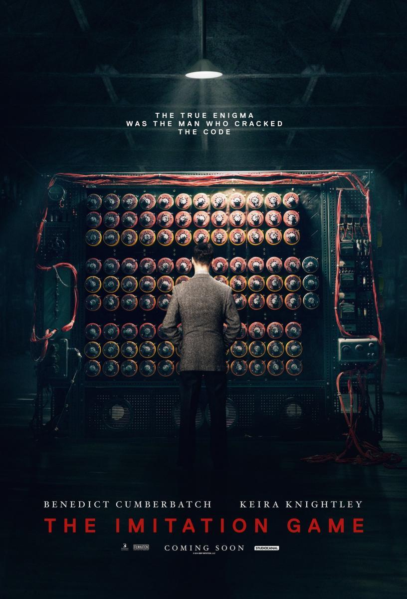

Años 40: Alemania controla Europa y amenaza al resto del mundo

Sus comunicaciones radio están protegidas con "la cifra indescifrable"

¿Por qué pensaban que era indescifrable?

¿Cómo se descifró?

¿Qué hemos aprendido desde entonces?

# Hoy hablamos de...
<!-- _class: cool-list toc -->

1. [Criptografía clásica](#4)
1. [Cifrado César](#9)
1. [Mejoras al cifrado César: sistemas polialfabéticos](#26)
1. [Confidencialidad perfecta](#41)
1. [Resumen y referencias](#53)

# Criptografía clásica
<!--
_class: lead
header: Criptografía clásica
-->


## Criptografía = cifrado

Hasta los años 70 del siglo XX, la criptografía se usaba solo en el ámbito militar y solo ofrecía confidencialidad:

**El enemigo no puede saber nuestros planes**

El resultado debería ser un mensaje igual que el original


<!--

¿Recordáis la máxima de Shanon y los principios de Kerckhoffs? "El adversario conoce el sistema". Es decir: los único que debe ser secreto (a parte del mensaje, claro) es la clave de cifrado/descifrado. Se tiene que asumir que el adversario conoce las funciones e() y d()

Aún no estaban preocupados de identificar con quién estaban hablando: "si conoce la clave, será un interlocutor legítimo".

Nota: ¿Cifrar o encriptar? En este curso llamaremos a la ciencia "criptogafía" y al acto "cifrado". Encontrarás gente que utiliza "encriptar" como sinónimo de "cifrar". La RAE ha aceptado recientemente el verbo "encriptar", pero la polémica sobre si usar o no ese verbo sigue abierta en nuestro sector.
-->

## Mecanismos clásicos de cifrado

- Cifrados por **sustitución**: cambiar una letra por otra.
    - Monoalfabéticos: mismo algoritmo para toda las letras
    - Polialfabéticos: algoritmos diferentes para cada letra
- Cifrados por **transposición**: mover letras de sitio.

<!--
Con "clásicos" queremos decir que se usaban desde tiempos del imperio egipcio, pasando por hebreos, griegos, romanos, edad media, edad moderna (incluidas las guerras mundiales)... es decir, desde que se inventó la escritura hasta ayer mismo.

Estos dos métodos de cifrado se han utilizado durante miles de años, y nuestros algoritmos de cifrado simétrico actual aún los tienen como parte de sus pasos
-->

## Transposición: escítala griega


- Dos varas del mismo grosor
- Envío: se enrolla una cinta de forma espiral a uno de los bastones y se escribía el mensaje longitudinalmente.
- Recepción: se enrollaba la cinta en la vara gemela para leer el mensaje original.

<!-- 
Recordad: la criptografía quiere mejorar la dispersión y la difusión del mensaje original. La transposición simple como la de la escítala ayuda en ambos casos.

Prácticamente todos los algoritmos actuales de cifrado simétrico utilizan sistemas de transposición como uno de los pasos del cifrado.

Imagen: https://upload.wikimedia.org/wikipedia/commons/5/51/Skytale.png
-->

## Sustitución: cifrado César


- Es un cifrado **monoalfabético**: "sustituimos una letra por otra que viene $k$ posiciones detrás"
- Es más antiguo que los romanos: incluso la Biblia hebrea incluye palabras con cifrado de sustitución y evitar así escribir la palabra real.

<!--
Desde tiempos de los romanos, el cifrado por excelencia hasta la década de los '70  ha sido algún tipo de cifrado por sustitución más o menos complejo. Los estudiaremos a continuación con más detalle en el resto de capítulos

Imagen: https://upload.wikimedia.org/wikipedia/commons/2/2b/Caesar3.svg
-->

# Cifrado César
<!--
_class: lead
header: César y la fortaleza
-->

Fuerza bruta, análisis frecuencial y fortaleza de un algoritmo

## Historia

- Leyenda: Julio César lo usaba para comunicarse con sus generales
- Como todos los cifrados de sustitución monalfabética, se descifra con facilidad y en la práctica no ofrece apenas seguridad en la comunicación.

El cifrado César forma parte de sistemas más complejos de codificación, como el cifrado Vigenère, e incluso tiene aplicación en el sistema ROT13, y su estudio sirve para entender por qué los cifrados fallan.

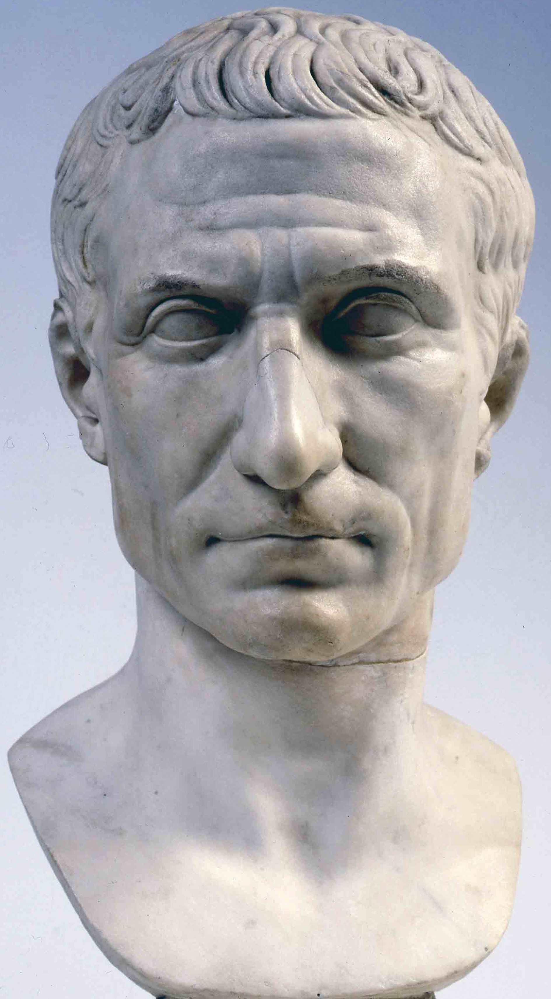

<!--
Es muy posible que César utilizase sistemas más complejos de cifrado que no conocemos:

"There is even a rather ingeniously written treatise by the grammarian Probus concerning the secret meaning of letters in the composition of Caesar's epistles."
— Aulus Gellius, Attic Nights 17.9.1–5

Imagen: https://upload.wikimedia.org/wikipedia/commons/8/8f/Gaius_Iulius_Caesar_%28Vatican_Museum%29.jpg
-->

## Cifrado


$c = e(k, m) = m + k \mod {26}$

Por ejemplo, clave $k=3$:

$$
\begin{aligned}
X &\rightarrow A \\
Y &\rightarrow B \\
Z &\rightarrow	C \\
A &\rightarrow	D \\
B &\rightarrow	E
\end{aligned}
$$

> Si necesitas repasar la aritmética modular, consulta el [glosario](A1-glosario.html)

<!-- En las transparencias que siguen, asumimos que el alfabeto es el latino y solo hay 26 posibles letras-->

## Descifrado

$$
m' = d(k, d) = c - k \mod {26} = e(26 - k \mod 26, c)
$$

Giramos la tabla. Fíjate: para $k=3$, el descifrado es equivalente a cifrar con $k'=26-3=23$:

$$
\begin{aligned}
X &\leftarrow A \\
Y &\leftarrow B \\
Z &\leftarrow	C \\
A &\leftarrow	D \\
B &\leftarrow	E
\end{aligned}
$$

<!-- El descifrado césar sigue exactamente el mismo algoritmo que el cifrado, pero usando una clave diferente.

Esto pasará a menudo: la función de cifrado (o al menos algunos de los pasos de la función de cifrado) es muy parecida a la función de descifrado. Esto es una enorme ventaja porque nos permite utilizar los mismos programas, o parte de los mismos, para cifrar y descifrar:

- menos errores, al reutilizar código
- si usamos hardware especializado, podemos reaprovecharlo en el envío y la recepción
-->

## Seguridad del cifrado del César: fuerza bruta

`HOLAMUNDO`
`ELIXJRKAL`

¿qué podemos hacer si solo tenemos el texto cifrado `ELIXJRKAL`?

$0\leq k < 26$ , así que podemos probar las 26 claves una a una: **ataque de fuerza bruta**

## Ataque de fuerza bruta

Un ataque de fuerza bruta implica probar sobre el mensaje cifrado $c$ todas las posibles claves $k_i$ hasta que encontremos la "buena":

- descifrar con la clave $m^?=d(c,k_i)$
- y validar si $m^?$ es válido. Es decir, si $m=m^?$

<!-- Observación: de media, tenemos que probar 13 claves: ¡la mitad! -->

---

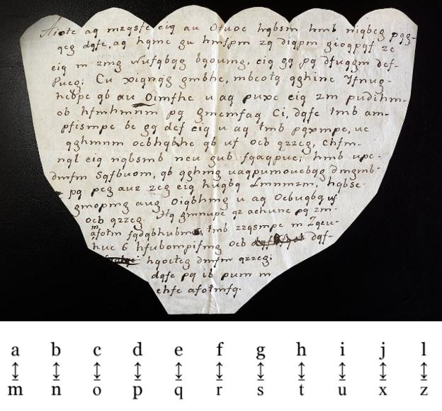

Descifrada una carta encriptada de las guerras carlistas escrita en Bizkaia

"*...han llegado a Leqitio 6 trincaduras con pertrechos para ellos....*"

> https://www.elcorreo.com/culturas/descifra-carta-encriptada-20211108081121-nt.html

<!--
José Ramón Cuesta, archivero, investigador y escritor, que explica que el mensaje "está codificado mediante el sistema de sustitución simple o de letras emparejadas". Para poder interpretarlo hay que sustituir cada letra por su par. Cada vez que aparece una a hay que sustituirla por una eme, la be por una ene y la ce por una o. Y así de forma sucesiva.

Es decir, es un César con k=12. Fíjate en algunas curiosidades típicas en el ámbito militar para simplificar el proceso de cifrado manual:

"no tiene en cuenta la uve, sustituida por la be, que es representada por la ene. Tampoco consta la ka ni la eñe. La u sirve para representar tanto la i latina como la i griega."

Estas simplificaciones de letras dependen de la lengua original. Fíjate también que para interpretar el texto necesitas información de contexto, porque son telegramas y no novelas. Estas características (letras de menos, jerga) ya no las estudia la criptografía moderna aunque sí que sean necesarias para interpretar correctamente un mensaje, y fueron importantes para descifrar textos en el pasado. Por ejemplo con la máquina enigma, como veremos más tarde.

Además, la forma del papel sugiere que estaba oculto en algún sitio y tenía esa forma para que no fuese reconocible. Sí que hay un rama de la criptografía moderna que estudia cómo ocultar un mensaje: la esteganografía.
-->

---

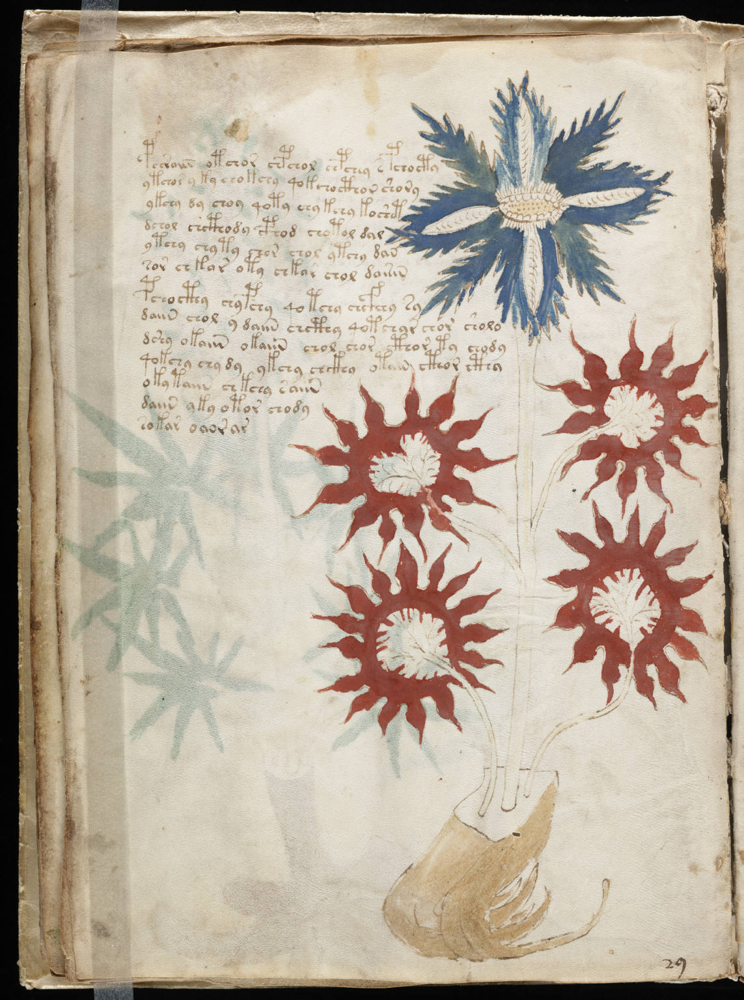

Pero no siempre es posible saber si un mensaje se ha descifrado correctamente:

- El [manuscrito Voynich](https://es.wikipedia.org/wiki/Manuscrito_Voynich) aún no ha sido descifrado. Suponiendo que use César, no se sabe en qué lengua está escrito originalmente.
- Imagina que solo está cifrada la hora "atacamos a las X"... Si una clave descifra "a las 5" y otra "a las 7" ¿cómo validamos qué hora es correcta? 

<!--

El manuscrito Voynich podría ser una broma de textos sin sentido. Los expertos parecen hacer descartado que el manuscrito Voynich tenga un cifrado simple como el César. Aún así, han analizado los textos y han encontrado que siguen pautas estadísticas de un lenguaje real. El misterio sigue abierto.

Imagen: https://upload.wikimedia.org/wikipedia/commons/9/93/Voynich_Manuscript_%2832%29.jpg

-->

## Contramedidas
<!-- _class: center with-success -->

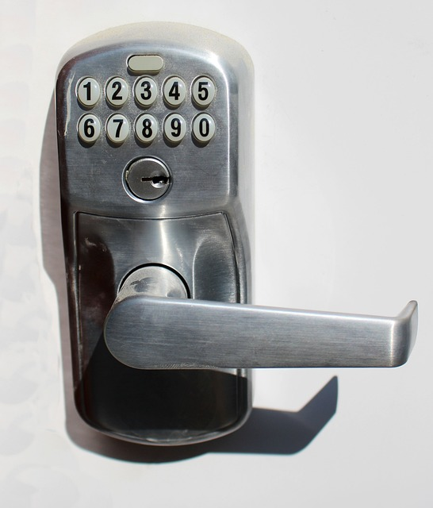 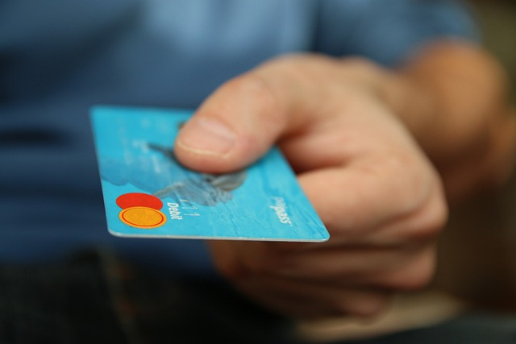

¿Cómo podemos proteger estos sistemas contra la fuerza bruta?

<!--
Estos no son exactamente sistemas de cifrado, pero nos sirven para explicar lo que es la fuerza bruta.

¿Cómo abrirías la cerradura de la puerta? ¿Cómo puede un ladrón utilizar una tarjeta de crédito robada? ¿Qué estrategias se usan en cada caso para proteger el sistema?

Images: free for commercial use:

- https://pixabay.com/photos/money-cards-business-credit-card-256319/
- https://pixabay.com/photos/lock-combination-security-safety-1929089/
-->

---

La defensa contra los ataques de fuerza bruta son:

- Tarjeta de crédito: que la operación de descifrado sea costosa, o intentos limitados
- Cerradura: que el descifrado sea sencillo, pero que el atacante tenga que realizar muchas operaciones de descifrado. Es decir, aumentar el tamaño de la clave

Que el descifrado sea costoso tiene el problema de que también le costará al receptor, que descifra legítimamente. Actualmente no se recomienda

Queda por tanto "**que el adversario tenga que hacer muchas operaciones de descifrado**". Es decir: que el atacante tenga que probar muchas claves.

## Fuerza bruta

- En una CPU "estándar" se prueban 1.000.000 clave/CPU/s
- es decir: $10^6$ clave/CPU/s
- es decir: se prueban $10^9$ claves/s en 1000 CPU
- es decir: se prueban 3.6 * $10^{12}$ claves/h en 1000 CPU
- en AWS EC2 una *c4.large* cuesta 10 céntimos/h
- es decir $3.6\ 10^{11}$ claves/€/h

Si tenemos capacidad de diseñar/fabricar $d()$ en hardware ([ASIC](https://en.wikipedia.org/wiki/Application-specific_integrated_circuit)) los costes bajan después de un periodo de amortización

<!-- Estos cálculos están desactualizados y son más rápidos cada año. En cualquier caso sirven para hacernos una idea de lo rápido que pueden hacer fuerza bruta los ordenadores actuales -->

---
<!-- _class: smaller-font with-success -->

Alquilando equipos en la nube por segundos, con un euro cada segundo podemos probar $10^{11}$ claves

Si estimamos que nuestro "secreto" vale 1000 €:

Nos hacen falta un sistema criptográfico que permita escoger entre $2·10^{14}$ claves diferentes ($\approx 2^{48}$) para guardar el secreto durante una hora.

Este sistema tendría fortaleza 48 bits: un atacante tiene que probar $2^{48}$ claves si quiere romperlo por fuerza bruta

Observa: aumentando el número de bits de la clave aumentamos exponencialmente el tiempo necesario para romper el sistema. Con 128 bits... necesitaríamos miles de años.

**La fortaleza o seguridad de un algoritmo es el tamaño en bits de su espacio de claves.** Es decir, el número de claves diferentes posibles. Normalmente se expresa en bits.

## Aumentando el espacio de claves en César: mapeo aleatorio

Hemos visto que el César original tiene como máximo 26 claves, aproximadamente $2^5$, es decir, entre 4 y 5 bits de fortaleza.

Podemos mejorarlo permitiendo cualquier mapeo aleatorio:

$$
\begin{aligned}
X &\rightarrow F \\
Y &\rightarrow B \\
Z &\rightarrow	M \\
A &\rightarrow	Y \\
B &\rightarrow	B
\end{aligned}
$$

Ahora tenemos $26!$ posibles claves, $\approx 2^{88}$, 88 bits de fortaleza.

## ¿Cuánto tiempo necesitamos guardar un secreto?

- "Atacaremos a las 11" dejará de ser secreto a las 11: 1 día
- "Mis cartas personales": 10 años
- "La fórmula de la Coca-Cola": 100 años

Piensa: en 10 años la tecnología ha avanzado mucho: lo que ahora cuesta 100 años, ¡en 10 años podría ser automático!

Más sobre esto en el [tema 3](03-simetrica.html)

## Mejorando la fuerza bruta

¿Podemos encontrar un método más rápido que probar las claves una a una?

**Hq** fulswrjudild, ho fliudgr Fhvdu, wdpelhq frqrflgr frpr fliudgr sru
ghvsodcdplhqwr, frgljr **gh** Fhvdu **r** ghvsodcdplhqwr **gh** Fhvdu, hv xqd gh
odv whfqlfdv gh fliudgr pdv vlpsohv b pdv xvdgdv. **Hv** xq wlsr gh
fliudgr sru vxvwlwxflrq hq ho txh xqd ohwud **hq** ho whawr ruljlqdo hv
uhhpsodcdgd sru rwud ohwud 

https://www.dcode.fr/caesar-cipher

Si el mensaje es suficientemente largo, **podemos analizar la frecuencia de aparición de los carácteres**

<!-- No recuerdo qué cifré aquí, ni con que clave, pero no parece difícil descubrirlo.

- Hay letras solas, que en castellano solo pueden ser a, y, o. También e, u, pero es muy improbable. Cualquier otra letra será aún más improbable. Por eso la criptografía clásica en realidad nunca ha usado espacios: da mucha información al adversario
- Haciendo análisis de frecuencias, la h aparece muchas veces: es muy probable que sea a ó e
- Los dígrafos hv gh (varias veces...) podrían ser es, el, me, le ó se

**La información de contexto nos ayuda a descifrar (espacios, lenguaje...)**. Eso también pasa en una web actual: ¿qué es lo que tiene un mensaje cifrado a un banco inmediatamente después de visitar una tienda?
-->


## Análisis de frecuencias

 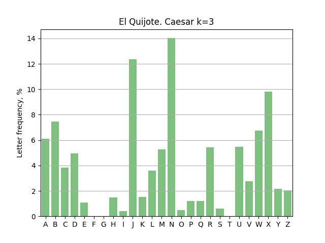

¡La estadística se mantiene igual (pero movida) después del cifrado César!

## Rotura de algoritmos criptográficos
<!-- _class: with-success -->

El cifrado César, incluso con mapeos aleatorios, lleva roto como mínimo desde el siglo IX, cuando Al-Kindi describió por primera vez el análisis de frecuencia contra el cifrado César

**Un algoritmo está roto desde el punto de vista criptográfico cuando se conoce un ataque más eficiente que la fuerza bruta**.


# Mejoras al cifrado César: sistemas polialfabéticos
<!--
_class: lead
header: Vigenère y Enigma
-->

Vigenère y Enigma


## Transponer y sustituir
<!-- _class: smaller-font -->

Podemos añadir una transposición a la vez de una substitución:

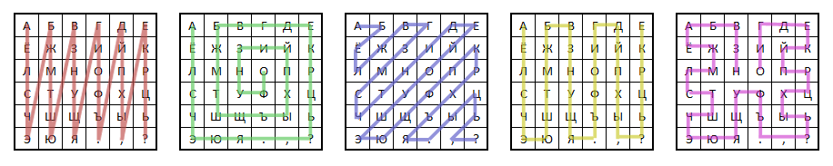

Podemos mapear cualquier letra a cualquier otra letra

```
ABCDEFGHIJKLMNOPQRSTUVWXYZ
XZCTEROSIULKWNGYQFHDJVMAPB
```

Todo esto aumenta el espacio de claves, pero sigue siendo vulnerable a análisis de frecuencia.

<!-- En vez de usar un movimiento en el alfabeto, podemos cambiar totalmente el alfabeto. Eso aumenta espectacularmente el espacio de claves, hasta el punto de que no es posible para un humano hacer fuerza bruta...

... pero no impide hacer análisis frecuencial. Cualquiera de estas propuestas está tan rota como el cifrado César.

Imagen: https://i1.wp.com/nozdr.ru/_media/games/quest/for/cipher/marshrut.png
-->

## Tabula recta


Johannes Trithemius en 1508, con el primer libro conocido dedicado a la criptografía, inició el sistema de cifrados polialfabéticos...

...al principio sin clave.

<!-- La primetra letra del mensaje se cifra con la primera columna, la segunda con la segunda... y así. ¡El texto ya no es analizable por frecuencias!

Pero no comple la máxima de Shanon: el sistema es seguro solo mientras que la table se mantenga en secreto.

La tabula recta abrió el camino de los cifrados polialfabéticos. Solo unos 20 años después, Battista Bellaso añadió una clave al sistema -->

## Cifrado de Vigenère

[Cifrado polialfabético de Giovan Battista Bellaso en 1553](https://es.wikipedia.org/wiki/Cifrado_de_Vigen%C3%A8re), pero atribuido a Vigenère


$k$ ahora será una secuencia de números.

$k=\{23,8,3\}$

Es decir: la primera letra se desplaza 23 posiciones, la segunda 8, la tercera 3, luego 23 otra vez, luego 8, luego 3...

Habitualmente se escriben las letras que cifran el texto "AAA":

$k=e(\{23,8,3\}, ``AAA") =XID$

<!--
Fíjate: el "tabula recta" es un Vigenère con una clave fija que se se puede cambiar $k=ABCD...WXYZ$
-->

---
<!-- _class: center -->

$c_i = e(k, m_i) = m_i + k_{(i \mod ||k||)} \mod 26$

$m'_i = d(k, d_i) = c_i - k_{(i \mod ||k||)} \mod 26$

Siendo $||k||$ la longitud de la clave


Ejemplo. $k=XID=\{23,8,3\}$

```
HOL AMU NDO
||| ||| |||
XID XID XID
||| ||| |||
EWO XUX KLR 
```

---

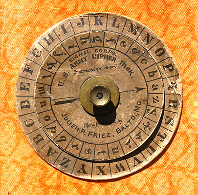 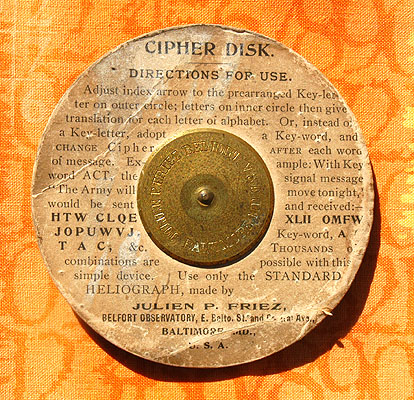 

"*Le chiffre indéchiffrable*" se utilizó desde el siglo XVI hasta bien entrado el siglo XX.

...aunque ya había expertos en romperlo en el siglo XIX.

<!--
Images: https://people.duke.edu/~ng46/collections/crypto-disk-us-ww1-front.jp
-->

## Ejemplo

**W**r urutlsyrmjae, **w**l omxvsda Gwwsr, feefaez ggrgcuhg ggma gajjaps hsj dqwhpszmqaifta, gghaga hw Gwsmv g hwsbpsdsmuifxg dq Gwwsr, qw mrs dq psw leoragss pi umxrmhg qss emetdee c eek ueevek. Ee yf xapa hw gafdevs hod wmwlifyumgn qr wp iuq yfe defvs if ex xwblo avakanmp **ww** jeqqhpszmhs tgr axje defvs

https://www.dcode.fr/vigenere-cipher

<!-- clave: SESAME

Ahora el análisis frecuencil es mucho más complejo... ¡pero podemos agrupar los textos en grupos de 6 y aplicar frecuencias a cada columna!

¿Por qué 6? No lo sabemos. Podemos probar, o buscar ciclos (que son comunes) y estimar la longitud de la clabe. En ejemplo, la w está muchas veces en grupos de palabras solos: ¿quizá es la E cifrada con una de esas S de la clave?

-->

## Seguridad de Vigenére

Ahora el espacio de claves es (clave de 3 carácteres):

$$
\begin{aligned}
0 &<k<26^3 \\
0 &<k<17576
\end{aligned}
$$

Se puede aumentar el espacio de claves indefinidamente con contraseñas más largas.

Para contraseñas de $n$ carácteres:

$$
0<k<26^n
$$

Ejemplos :

- Si $n=8$, existen $26^8 = 2·10^{11}$ claves diferentes. Coste de fuerza bruta: 0,5 €
- Si $n=16$, existen $26^{16} = 4·10^{22}$ claves diferentes. Coste: 100 mil millones de €

---
<!-- _class: with-success -->

Vulnerabilidad: la repetición de la clave, que además es de longitud adivinable y normalmente corta.

Si segmentamos el texto cifrado de acuerdo a la longitud de la contraseña, cada fragmento de texto mostrará las mismas estadísticas del idioma (cifrado César)...

Sólo hace falta adivinar la longitud de la "contraseña" ([Hamming](https://crypto.stackexchange.com/questions/8115/repeating-key-xor-and-hamming-distance/8118#8118), [Kasiski](https://en.wikipedia.org/wiki/Kasiski_examination)) o...

...como el espacio de longitudes será probablemente limitado, podemos probarlos uno por uno hasta que tenemos una estadística reconocible.

Vigenère está también roto. Su análisis es más laborioso que César, pero no es necesaria la fuerza bruta sobre todo el espacio de claves.

**Un espacio de claves grande no es suficiente**
**No se debe cifrar dos trozos del mensaje con la misma clave**

## Máquina Enigma

- Inventada por Arthur Scherbius y usada a partir de los años 20 del siglo XX
- Existía versión comercial y versión militar
- Finalmente "vencida" por Alan Turing.
- [Ejemplo de uso](https://www.101computing.net/enigma-machine-emulator/)


<!--
Entreguerras, guerra civil española, ejército alemán. En la guerra civil española, el bando sublevado utilizaba la versión comercial (que los ingleses sabían leer)

Fijate:

- Los rotores podían extraerse e intercambiar sus posiciones
- Los rotores podían empezar en cualquier letra
- El panel conectaba (o no) pares de letra entre sí. Al principio tenía 4 cables, luego aumentó a 6. El panel era exclusivo de la versión militar.

La clave era: posición de los rotores, letras iniciales en los rotores, posición de los cables. Todo esto cambiaba cada día.

Además, para evitar que todos los alemanes usasen cada día la misma clave en todos sus mensajes, había al inicio un pequeño paso adicional de anuncio de "clave de sesión".

-->
---
<!-- _class: center -->

 

<!-- 

https://res.cloudinary.com/practicaldev/image/fetch/s--2qwhwBZd--/c_limit%2Cf_auto%2Cfl_progressive%2Cq_auto%2Cw_880/https://raw.githubusercontent.com/maxime1992/my-dev.to/master/blog-posts/enigma-part-1/assets/enigma-schema.jpg

El ejemplo de la derecha solo muestra la versión comercial sin el panel frontal de cables.

Los aliados tenían copias de la versión comercial pero no la versión militar. No sabían, entre otros detalles, cómo estaban cableados los rotores por dentro. Además, la versión militar tenía 5 rotores disponibles, de los que cada día se usaban tres.

-->

## Máquina Enigma: seguridad

- Sistema polialfabético como Vigenère, con una clave muy larga que se define con la posición inicial de los rotores
- Con la tecnología de la época no era posible hacer fuerza bruta antes de que cambiase la clave (cada día)
- "Indescifrable" según casi todos los expertos.

> Información adicional: <https://en.wikipedia.org/wiki/Cryptanalysis_of_the_Enigma>

---

Protocolo alemán de uso:


- La posición de los rotores se cambiaba cada día
- Parte de la clave la escogían los operadores de radio y se enviaba por las ondas al inicio
- El texto era natural

---
<!-- _class: smaller-font -->


Se rompió más "por mal protocolo" que porque el sistema fuese defectuoso

- Los rotores se cambiaban cada día para que no coincidiesen las letras: A no podía cifrarse como A, ni igual que ayer. Eso limitaba el espacio de claves: ya no hay que probar nada que se parezca a la configuración de ayer.
- Parte de la clave la escogían los operadores de radio:
    - se enviaba por ondas radio al inicio... **dos veces** (aunque esto cambió en 1940)
    - Los operadores en medio de una guerra no siempre escogían claves perfectamente aleatorias. A veces era AAA, ó ABC...
- El texto era natural: *nada que reportar*, *hitler*, *meteorología*... aparecían con mucha frecuencia


---


Una vez reducido el espacio de clave, identificados qué textos es probable que apareciesen y otros atajos...

...el cifrado del día se podía romper por fuerza bruta en 20 minutos, cada mañana, utilizando una batería de máquinas llamada "Bombe"

La "Bombe" fue una de las primeras máquinas de procesado binario.

El descifrado de Enigma fue una de las claves que permitió a los aliados ganar la Segunda Guerra Mundial

# Confidencialidad perfecta
<!--
_class: lead
header: Confidencialidad perfecta
-->

One-time-pad (cifrado Vernam)

## Confidencialidad perfecta


**Seguridad perfecta o incondicional**: no se puede deducir ninguna propiedad del texto original en claro, incluso aunque el atacante tenga recursos infinitos (tiempo, dinero)

- Gilbert Sandford Vernam inventó y patentó una máquina de cifrado en 1917
- Shannon demostró en 1945 que esa máquina tenía cifrado perfecto

> [Communication Theory of Secrecy Systems](http://netlab.cs.ucla.edu/wiki/files/shannon1949.pdf), Claude E. Shannon, Bell System Technical Journal, vol.28-4, page 656--715, Oct. 1949.

<!-- 
excepto la longitud... y el momento de enviarlo, ...y el número de mensajes
 -->

---

Definición exacta:

**Confidencialidad perfecta** (*perfect secrecy*): un sistema es perfectamente seguro si y solo si para cualquier distribución de probabilidad sobre el espacio de mensajes en claro $m$, y para todos los mensajes en claro y para todos los textos cifrados posibles $c$, la probabilidad condicionada de $m$ dada $c$ y la probabilidad de $m$ coinciden

$$
P[m|c] = P[m]
$$

<!-- Desde que los matemáticos entraron en la criptografía, existe definiciones de todos los términos tan exactas y formales como incomprensibles para un profano

Cosas que implica:

- Lo que dijimos antes: dado un texto cifrado, no conocemos nada de su texto en claro
- Dado un texto cifrado, el mensaje en claro podría ser cualquiera:
-->

---
<!-- _class: with-success -->

Si un cifado perfecto teórico cifra como XHAJSJXXNFHFDOIOJUMNFNNNF:

- existe una clave que descifra "ATACAREMOS A LAS 8 EN PUNTO"
- existe otra clave que descifra "SE HA QUEDADO BUENA TARDE"
- un atacante no sabe qué mensaje es el que realmente se cifró, así que nosabe si ha acertado la clave

Un cifrado perfecto no puede descifrarse ni siquiera por fuerza bruta porque un atacante no puede distinguir el mensaje real de todos los mensajes falsos posibles

## ¿A qué hora atacamos?


Imagina que un ejército decide el siguiente mapeo, es decir, clave:

- A = 16
- B = 7
- C = 13
- ...

El enemigo captura este mensaje: "Atacamos a las F horas"

¿Tiene alguna forma el enemigo de conocer a qué hora le atacarán?

---
<!-- _class: smaller-font -->

- Si el enemigo, que no conoce la clave no tiene forma saber a qué hora se atacará ni aunque pruebe todas las claves. **Este cifrado es perfecto**
- Pero el enemigo puede aprovechar un mensaje para descifrar los siguientes que usen la misma clave:
    - Si no le han atacado a la 1, F no es 1
    - Si no le han atacado a las 2, F no es 2
    - Si le atacan a las 3, F es 3
- Solo se puede usar esta clave **una vez**. A la siguiente, el enemigo ya tendrá mucha información. **La clave no puede reutilizarse nunca más**
- Fíjate: el mapeo tiene que ser de números completos. Si no y el enemigo intercepta un mensaje HK, sabe que H es 1 ó 2 porque no hay "hora 37": el mapeo tiene que ser completo (es decir: clave tan larga como el mensaje)
- Hay que volver a enviar una nueva clave cada vez que queramos enviar un mensaje nuevo, con el riesgo de que el enemigo intercepte el mensaje de envío de clave

<!--

Un sistema tan sencillo como este se utilizó en la realidad: los espías tenían "libros de claves" de un colo uso que tenían que llevar escondidos.
-->

## Convirtiendo Vigènere en cifrado perfecto: cifrado Vernam

El cifrado de Vigenère sufría un problema similar al del César (aunque camuflado): manifestaba la estadística del mensaje en claro en el mensaje cifrado

Podemos evitar que se manifieste la estadística en el texto cifrado si utilizamos cada letra de la clave una sola vez

**Tenemos confidencialidad perfecta si y solo sí usamos un cifrado Vigenère con las siguientes características**:

- una clave tan larga como el mensaje
- no conocida por el atacante. Es decir: totalmente aleatoria
- la clave no se usa nunca más

<!--
En realidad esto ya se sabía antes de que Vernan inventase su máquina. Pero el invento de Vernan permitió usar este tipo de cifrado, y además Shannon acabó formalizando la teoría matemática que empezó la criptografía moderna
-->

---
<!-- _class: smaller-font -->

Vernam patentó el *one-time-pad* de una manera similar pero equivalente:

$c = e(k,m)=k \otimes m$
$m' = d(k,c) = e(k,c)=k \otimes c$

La longitud en bytes de $k$ es igual que la longitud en bytes de $m$.

Las claves se guardaban en hojas de papel de un solo uso. Las dos partes tenían una colección de estas hojas y se destruía en cuanto se usaba.

La NSA tenía 86.000 *one-time-pads* solo para el año 1972.

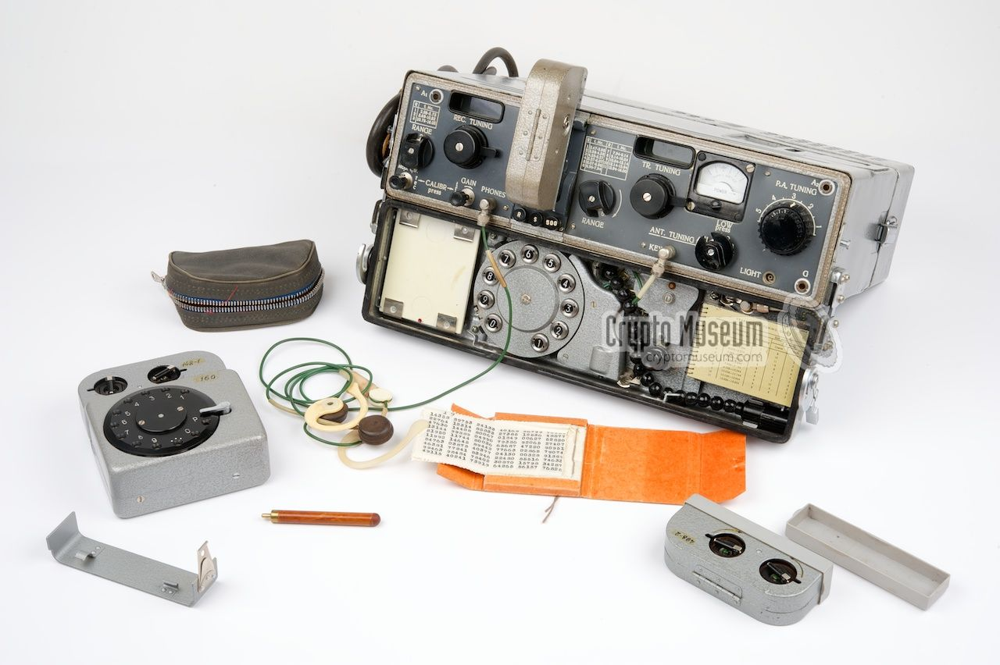

> Si lo necesitas, mira la operación XOR en [el glosario](A1-glosario.html)

---

El teléfono rojo entre Washington y Moscú fue en realidad un teletipo que usaba cifrado de bloque de un solo uso

La clave $k$ se intercambiaba por valija diplomática en cinta perforada que se entregaba en ambos sentidos. Mientras no hacía falta, se guardaba protegida y  se destruía después de ser usada

Además, el *one-time-pad* permitía trabajar de forma segura sin intercambiar ningún algoritmo secreto que diera ventaja técnica al enemigo

Para poder usar un *one-time-pad*, la clave se prepara por adelantado para cuando haga falta enviar algún mensaje inmediatamente.

## Vulnerabilidades

Ninguna. Ni siquiera por fuerza bruta: si pruebas claves, puedes "descifrar" el texto cifrado y conseguir cualquier mensaje que se te ocurra...

...**mientras se cumplan las hipótesis de trabajo para la clave $k$**:

- tan larga como el mensaje
- un solo uso
- aleatoria (i.e. uniformemente distribuida)

Los humanos somos muy malos para distinguir qué es y qué no es aleatorio

---

Pero el principal problema es que la longitud en bytes de $k$ es igual a la longitud en bytes de $m$.

Cuesta tanto enviar $k$ de forma segura como enviar directamente $m$ en claro por el mismo canal seguro

> Más ejemplos: https://www.cryptomuseum.com/covert/conceal/index.htm

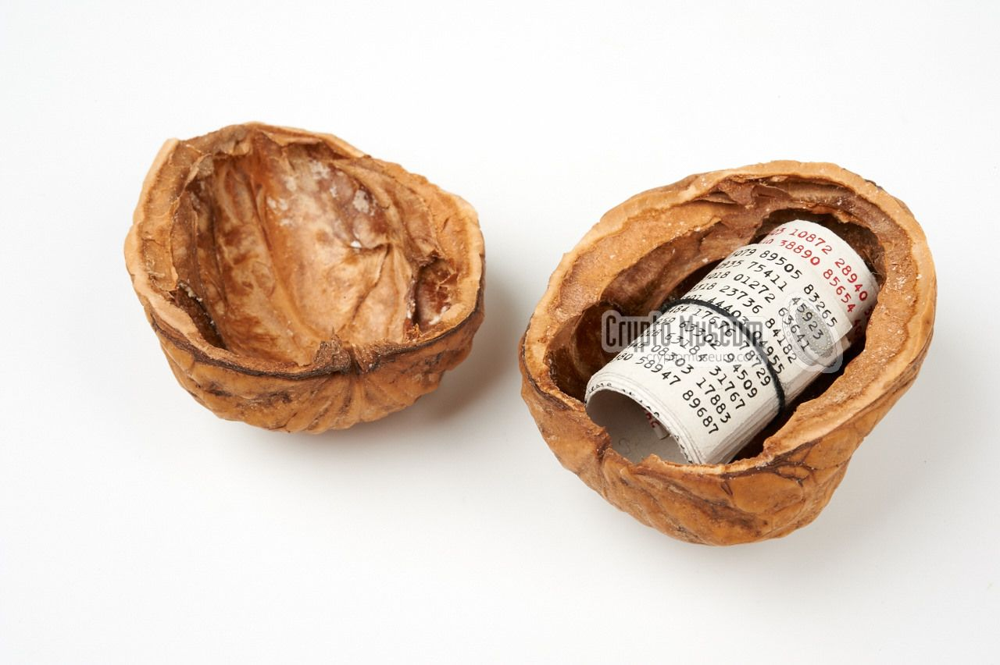

---

- Al final de la segunda guerra mundial, EEUU descifró el *one-time-pad* usado por los diplomáticos alemanes porque utilizaban contraseñas no totalmente aleatorias y podían adivinarse.
- 1944: EEUU descifró mensajes de la URSS a Australia... porque utilizaban el mismo *one-time-pad* que la URSS usaba con EEUU.
- 1962 (ataque canal lateral): las máquinas usadas para cifrar eran eléctricas y emitían un campo magnético, que Japón podría haber aprovechado para captar qué cifraba la embajada de EEUU: [TEMPEST](https://www.governmentattic.org/18docs/Hist_US_COMSEC_Boak_NSA_1973u.pdf)


# Resumen y referencias
<!--
_class: lead
header: ""
-->

---

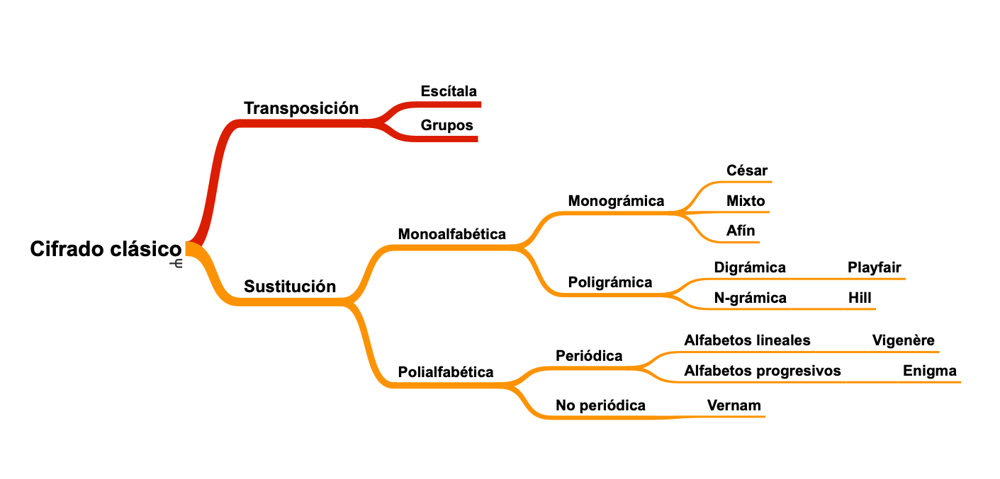

---

- La información de contexto puede ayudar a descifrar un mensaje
- Definimos la fortaleza de un algoritmo como el tamaño de la clave en bits, si no se puede romper más que por fuerza bruta
- Un algoritmo se considera bueno mientras no se conozca ningún otro ataque aparte de la fuerza bruta
- La criptografía perfecta es posible, pero no práctica
- El mejor sistema de cifrado puede caer si se usa de forma incorrecta:
    - no hay que reutilizar claves
    - la fuente de aletoriedad tiene que ser realmente aleatoria
    - el diseño de buenos protocolos no es evidente
- Hasta los '70 la criptografía o era "insegura" (cifrados César, Vigenere, Enigma) o no era "práctica" (*one-time-pad*)

## 1976, el año que empezó todo...

La NSA selecciona un algoritmo de cifrado simétrico de IBM para comunicaciones de la administración: DES (Data Encryption Standard), que es "casi" perfecto.

Whitfield Diffie y Martin Hellman generan el primer algoritmo práctico de criptografía asimétrica, que permite distribuir fácilmente claves seguras.

<!-- La criptografía actual empezó en 1976: se escogió un algoritmo de cifrado simétrico que es casi perfecto y además práctico, y se
descubrió la criptogradía asimétrica que permitía publicar parte de la clave. -->
## Referencias

- <https://www.youtube.com/watch?v=ncL2Fl6prH8>: resumen de criptografía clásica y máquina Enigma.
- <https://www.bbvaopenmind.com/tecnologia/innovacion/los-fallos-humanos-que-derrotaron-a-enigma/>
- <https://www.ugr.es/~aquiran/cripto/enigma/boletin_enigma_18.htm#1>, y siguientes, con la historia de la criptografía en la Segunda Guerra Mundial.
- https://www.cryptomuseum.com/, con fotografías de aparatos criptográficos históricos.
- Película: <https://en.wikipedia.org/wiki/The_Imitation_Game>
- [The Cryptograhic Mathematics of Enigma](https://www.nsa.gov/portals/75/documents/about/cryptologic-heritage/historical-figures-publications/publications/wwii/CryptoMathEnigma_Miller.pdf) Dr. A. Ray Miller, NSA 2019

---
Ejercicios opcionales pero muy recomendables:

- Del profesor: <https://colab.research.google.com/github/Juanvvc/crypto/blob/master/ejercicios/01/Seguridad%20por%20oscuridad.ipynb>
- "Introducción a cryptohack" en <https://cryptohack.org/>

Continúa en: [Criptografía simétrica](03-simetrica.html)

# ¡Gracias!
<!-- _class: last-slide -->
