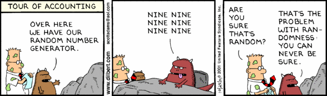
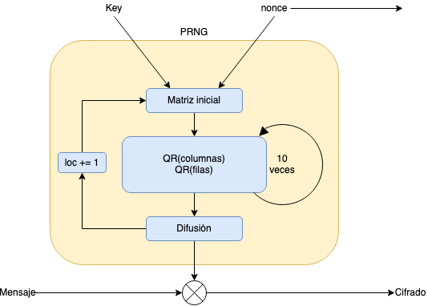

<style>
    /* You can add custom style here. VSCode supports this.
    Other editor might need these custom code in
    the YAML header: section: | */
	/* section header { display: none; } */
	/* section footer { display: none; } */
</style>

# Cifrado simétrico o de clave privada
<!-- _class: first-slide -->

**AES y ChaCha**

Juan Vera del Campo - <juan.vera@professor.universidadviu.com>

# Como decíamos ayer...

Sabemos conseguir **confidencialidad perfecta** que nadie puede descifrar (tema 2)

Pero implica claves de un solo uso tan grandes como el mensaje: $\|k\|=\|m\|$

Hasta los '70 la criptografía o era "muy imperfecta" o no era "práctica". A partir de 1976:

- **Criptografía simétrica**: es "casi perfecta" con claves cortas
- **Criptografía asimétrica**: distribución de claves de cualquier tamaño


> Más ejemplos: https://www.cryptomuseum.com/covert/conceal/index.htm


<!--
La confidencialidad es perfecta en cifrados tipo Vernam si la clave:

- Es perfectamente aleatorio
- Solo se usa una vez
- Es tan larga como el mensaje

Es decir: hay que distribuir claves tan grandes como mensajes de una forma secreta antes de poder distribuir un mensaje. Esto no es práctico.

Hoy veremos como solucionarlo:

- Relajando la confidencialidad perfecta a la confidencialidad computacional
- Usando algoritmos de cifrado simétrico
-->

# Hoy hablamos de...
<!-- _class: cool-list toc -->

1. [Confidencialidad computacional](#4)
1. [Cifrado de flujo](#15)
1. [ChaCha20](#33)
1. [Cifrado de bloque](#44)
1. [Cifrado AES](#52)
1. [Resumen](#77)

# Confidencialidad computacional
<!-- _class: lead
header: Confidencialidad computacional -->

## Relajando la perfección

- **Confidencialidad perfecta**: a partir del texto cifrado no es posible deducir ninguna propiedad del texto en claro aunque el atacante tenga **capacidad computacional infinita**
- **Confidencialidad computacional**: a partir del texto cifrado no es posible deducir ninguna propiedad del texto en claro aunque el atacante tenga **capacidad computacional razonable**


>  Imagen: Nitin Jain, Birgit Stiller, Imran Khan, Dominique Elser, Christoph Marquardt & Gerd Leuchs (2016) "Attacks on practical quantum key distribution systems (and how to prevent them)". [DOI: 10.1080/00107514.2016.1148333](https://www.tandfonline.com/doi/abs/10.1080/00107514.2016.1148333)

---

<!-- _class: extra-slide -->

**Confidencialidad perfecta** (*perfect secrecy*): un sistema es perfectamente seguro si y solo si para cualquier distribución de probabilidad sobre el espacio de mensajes en claro, y para todos los mensajes en claro y para todos los textos cifrados posibles, la probabilidad condicionada de $m$ dado $c$ y la probabilidad de $m$ coinciden:

$$
P[m|c] = P[m]
$$

Puede demostrarse matemáticamete que es necesario:

- Que la clave sea tan larga como el mensaje
- Que la clave sea totalmente aleatoria
- Que la clave se use solo una vez, y después se descarte

**La confidencialidad prerfecta no es práctica**

<!--
Transparencia recordatorio

Desde que los matemáticos entraron en la criptografía, existe definiciones de todos los términos tan exactas y formales como incomprensibles para un profano

Cosas que implica:

- Dado un texto cifrado, no conocemos nada de su texto en claro
- Dado un texto cifrado, el mensaje en claro podría ser cualquiera:

Si el cifrado es XHAJSJXXNFHFDOIOJUMNFNNNF existe una clave que descifra "ATACAREMOS A LAS 8 EN PUNTO" y otra que descifra "SE HA QUEDADO BUENA TARDE", así que un atacante no puede distinguir el mensaje real de todos los mensajes falsos posibles.

Es decir: ni siquiera por fuerza bruta podemos atacar el sistema de cifrado, porque no sabremos si el mensaje que hemos obtenido es el bueno
-->

---


**Seguridad computacional**: un sistema es seguro computacionalmente si cualquier algoritmo probabilístico en tiempo polinomial solo puede romper el algoritmo con probabilidad negligible en $\|n\|$

Informalmente: un atacante no puede descifrar el mensaje:

- en un tiempo razonable
- con la tecnología actual
- ...probablemente

Con la seguridad computacional hay que definir el objetivo: "quiero un sistema criptográfico que mantenga este mensaje secreto durante los próximos 100 años"

<!-- Desde que los matemáticos entraron en la criptografía, existe definiciones de todos los términos tan exactas y formales como incomprensibles para un profano

Lo importante es que relajamos el sistema lo suficiente como para que, por un tiempo determinado, ningún atacante con unos recursos razonables pueda descifrar el mensaje -->

## Ataques de fuerza bruta
<!-- _class: with-success -->

La criptografía computacionalmente segura permite $\|k\| \ll \|m\|$

- Es un cifrado práctico: la clave es mucho más pequeña que el mensaje y por tanto es fácil de distribuir
- Pero si es muy pequeña, es posible hacer fuerza bruta
- **Fortaleza de un sistema criptográfico**: número de claves que hay que probar por fuerza bruta (en bits)

Hay que usar un espacio de claves lo suficientemente grande como para que no sea posible hacer fuerza bruta **hoy en día**, y lo suficientemente pequeño como para que sea práctico

<!-- Recordad: en el cifrado de Verman no sabíamos si habíamos encontrado una clave porque, dado un mensaje cifrado, existe una clave que puede dar cualquier mensaje imaginable con la misma longitud que el original

Ahora no sucede así: si al descifrar por fuerza bruta encontramos algo con sentido, con gran probabilidad hemos encontrado la clave y el mensaje es el original

Recordad: los ordenadores mejoran constantemente.

Los algoritmos se diseñan para que, con la tecnología actual, se tarde miles de años en hacer fuerza bruta. Pero la tecnología mejora con el tiempo, y eso también se tiene en cuenta: aunque "se venda" que un cifrado "no puede romperse en miles de años", en realidad eso es relativo a la tecnología actual y el algoritmo tiene una caducidad de unas pocas décadas.

La mejor estrategia puede ser simplemente esperar 20 años para tener un ordenador que haga esa misma fuerza bruta de forma instantánea
-->

---


<!-- Recordad: los ordenadores mejoran constantemente.

Los algoritmos se diseñan para que, con la tecnología actual, se tarde miles de años en hacer fuerza bruta. Pero la tecnología mejora con el tiempo, y eso también se tiene en cuenta: aunque "se venda" que un cifrado "no puede romperse en miles de años", en realidad eso es relativo a la tecnología actual y el algoritmo tiene una caducidad de unas pocas décadas.

La mejor estrategia puede ser simplemente esperar 20 años para tener un ordenador que haga esa misma fuerza bruta de forma instantánea

-->

## Tamaños recomendados de clave
<!-- _class: with-success -->

[El NIST recomienda](https://csrc.nist.gov/publications/detail/sp/800-57-part-1/rev-5/final) (2020, sección 5.6.3) claves en las que un atacante
tenga que hacer $2^{112}$ pruebas.

Es decir, según el NIST antes de 2030 las claves han de tener una longitud mínima de $\|k\|=112$ bits

A partir del 2030 prevé recomendar $\|k\|=128$ bits

Es decir: con una clave de 128 bits podemos cifrar un mensaje de **cualquier longitud**, y es razonable que nadie pueda descifrarlo en un futuro previsible

En cifrado simétrico, el tamaño en bits de su clave es igual a la **fortaleza** del sistema

> Otras recomendaciones: <https://www.keylength.com/en/compare/>

<!-- algunos sistemas necesitan claves mucho más largas que la media de claves que tiene que probar un atacante para descifrarlos. Esto sucede en los sistemas asimétricos, por ejemplo. La fortaleza en estos sistemas es menor que la longitud de la clave -->

---

NIST: *The  most  important  approach  is  to  be  flexible;  the  use  of  implementations  and  applications  that  can  most  easily  be  adapted  to  the  cryptographic  security  offerings  and  a  plan  for  transitioning  to  them  offer  the  best  solution*


La amenaza conocida que puede modificar el calendario es la **computación cuántica**

<!-- ¿Qué pasa con la criptografía cuántica? El cifrado asimétrico se verá más afectado que el simétrico


https://csrc.nist.gov/projects/post-quantum-cryptography

-->

## Rompiendo algoritmos

Recuerda: definimos un que un algoritmo está **criptográficamente roto** si se conoce un ataque más eficiente que la fuerza bruta

Para la criptografía simétrica, buscaremos **algoritmos computacionalmente seguros y que no estén rotos**

Cuando la comunidad criptográfica rompe un algoritmo, se sustituye por otro

... pero es mejor prevenir: los algoritmos caducan y se cambian antes de que estén rotos

## Criptografía simétrica: tipos

- **Cifrado de flujo**. Heredero de "la idea" *one-time-pad*: el mensaje llega como un flujo de bytes que se cifra según va llegando.
- **Cifrado de bloque**. Heredero de "la tradición" Vigenère: el mensaje se divide en bloques que se cifran por separado


---
<!-- _class: center -->

Flujo|Bloque
--|--
Más rápido|Más lento (a menos que exista ayuda del hardware)
Fácil de programar: pequeños dispositivos|Más complejo
Implementado en software|Implementado en hardware
RC4, **ChaCha20**|3DES, **AES**

<!--
Nosotros veremos en detalle los algoritmos ChaCha20 y AES, que los dos más utilizados actualmente
-->

# Cifrado de flujo
<!-- _class: lead
header: Cifrado de flujo -->

---
<!-- _class: center -->

Es una implementación práctica de *one-time-pad* (cifrado perfecto, Vernam)

Recuerda: para cifrado perfecto necesitábamos una clave tan larga como el mensaje

$$\|k\|=\|m\|$$

Para después hacer:

$$c=e(k,m) = k \otimes m$$

---
<!-- _class: center -->

En cifrado de flujo lo que haremos es generar una $k_{\text{generada}}$

$\|k_{\text{generada}}\| = \|m\|$

...a partir de una clave $k$ de longitud corta...

$k \overset{PRNG}{\longrightarrow} k_{\text{generada}}$

para después hacer:

$c = k_{\text{generada}} \oplus m$

## Cifrado de flujo: algoritmo


<!--
Recordatorio: este es el esquema para hacer un cifrador de flujo.
-->

## Generadores de números aleatorios
<!-- _class: small-text -->

La función *PRNG* (*Pseudo Random Number Generator*) es un generador de bits que tiene como entrada una **semilla** (que será la clave de cifrado $k$) y tiene como salida el flujo de bits que aplicaremos sobre el mensaje para cifrarlo con *XOR*

La velocidad del cifrado depende totalmente de la velocidad del PRNG, porque el XOR es instantáneo


---

Un PRNG es un algoritmo determinista que extiende una semilla realmente aleatoria, resultando en una secuencia que parece ser uniformemente aleatoria.

Definición formal:

**PRNG**: Dado $G$, un algoritmo determinista en tiempo polinomial que toma una semilla $s \in \{0,1\}^n$ y da como salida una cadena $G(s) \in \{0,1\}^{l(n)}$, donde $l()$ es un polinomio y $l(n) > n$ para todo $n \in \N$. $G$ es un PRGN si su salida no puede distinguirse de una función aleatoria uniforme en tiempo polinomial.

<!-- Een lenguage comprensible: simplemente por inspección de la salida no podríamos saber si es un salida realmente al azar o fruto de un algoritmo determinista

Fíjate que "en tiempo polinomial" siempre lo entendemos como "en un tiempo razonable"

La confidencialidad perfecta decía que el algoritmo era seguro aunque el adversario tuviese recursos infonitos. La seguridad computacional, era segura ante adversarios con recursos limitados (de tiempo o de computación o de ambas). Ese requisito "recursos limitados" en matemática forma se exprea como "en tiempo polinomial" 

-->

## PRNG: seguridad
<!-- _class: with-warning -->

Una función PRNG es realmente PRNG (es decir, útil en criptografía) si ningún atacante puede distingir entre las secuencia generada y una fuente aleatoria aleatoria uniforme RNG con una probabilidad diferente de $0.5$



Fuente aleatorio uniforme RNG: medios físicos, no algorítmicos. Por ejemplo, [generadores cuánticos](https://physicsworld.com/a/fast-quantum-random-number-generator-could-advance-cryptography-on-the-cheap/).

Encontrarás más información en el [Anexo 2](A2-rng.html)

> Información adicional: https://www.incibe-cert.es/blog/comprobando-aleatoriedad


<!--
Curiosidad: "un atacante no puede distinguir... con una probabilidad..." En análisis criptográfico, se analiza el protocolo como un juego. Los atacantes o los usuarios plantean un juego e intentan adivinar algo. Aquí el usuario le da al atacante un número y le pregunta "¿esto lo he sacado de un RNG o de un PRNG?". La pregunta se hace muchas veces. El atacante gana si puede adivinarlo más de la mitad de las veces.

Seguimos.

Los ordenadores no pueden generar números realmente aleatorios ya que solo usan algoritmos. Para generar números realmente aleatorios es necesaria ayuda externa: pulsaciones de teclado, movimiento de ratón...

Fíjate que incluso las pulsaciones de teclado no son del todo aleatorias: después de una vocal es posible que venta una consonante. Por la noche habrá menos pulsaciones que durante el día... Son fuentes mejores de aletoriedad, pero no perfectas

-->

---

* Distribución uniforme: debe tender a tener el mismo número de 1's que de 0's, tender al mismo número de 00's, que de 01's, 10's...
* Despúes de $n$ un atacante no debe poder predecir el $n+1$

Con la semilla (la clave), la secuencia queda determinada en su totalidad, que es lo que nos interesa.

---


La seguridad del cifrado depende del generador PRNG utilizado...

...**y de que nunca se envíen dos mensajes cifrados con la misma clave**

(vamos a repetir esto muchas veces en el curso)

[Lorenz SZ](https://en.wikipedia.org/wiki/Lorenz_cipher#Cryptanalysis) fue una máquina alemana de cifrado de flujo, rota porque un operador envió dos mensajes diferentes seguidos sin cambiar la clave.

## Cifrado de flujo: algoritmo


En las próximas transparencias, exploraremos cómo podemos diseñar un cifrado de flujo a partir de un PRNG, y cómo la solución más obvia... no funciona

## Intento 1
<!-- _class: smaller-font with-success -->

Supongamos que tenemos una función PRNG, y usamos una clave k como semilla del PRNG para cifrar un flujo de datos en una conexión

Si ciframos dos mensajes cifrados $c_1$ y $c_2$ con la misma clave (semilla), un atacante puede hacer:

$$
\begin{aligned}
c_1 \oplus c_2  &= (k_{\text{g}} \oplus m_1) \oplus (k_{\text{g}} \oplus m_2) \\
                &= k_{\text{g}} \oplus m_1 \oplus k_{\text{g}} \oplus m_2 \\
                &= k_{\text{g}} \oplus k_{\text{g}} \oplus m_1 \oplus m_2 \\
                &= (k_{\text{g}} \oplus k_{\text{g}}) \oplus (m_1 \oplus m_2) \\
                &= (\{000\cdots000\}) \oplus (m_1 \oplus m_2) \\
                &= m_1 \oplus m_2
\end{aligned}
$$

¡Un atacante puede hacer XOR de los dos textos cifrados y obtener el XOR de los textos en claro!

Nunca hay que usar la misma clave (ni generada) con dos mensajes diferentes

> Información adicional: [Chosen plaintext attacks](https://en.wikipedia.org/wiki/Chosen-plaintext_attack)

<!--
Qué puede hacer un atacante con el xor de los textos en claro:

- Análisis frecuencia: La "clave para cifrar m2" es m1, que ya no es aleatorio y permite el análisis de frecuencias.
- Si partes de m1 son conocidas, es aún más sencillo descifrar partes de m2

Es decir, este esquema falla ante ataques de "chosen plaintext attacks": si el enemigo puede forzarnos a cifrar algo, el sistema está roto.

Los algotitmos se diseñan para ser resistenentes a ciertos problemas. Por ejemplo, ese "chosen plantext attack", que es un juego como el que hemos visto antes. Puedes encontrar otros ataques en: https://en.wikipedia.org/wiki/Attack_model

Mira el ejemplo de ataque japonés en el Pacífico de wikipedia
-->

## Intento 2

Cambiamos la clave (la semilla del PRNG) en cada transmisión

Esto es correcto pero costoso, y volvemos a los problemas de la confidencilidad perfecta: cómo distribuimos una clave diferente para cada mensaje

## Intento 3

Generar **variaciones de las claves en cada transmisión**

Supongamos que la semilla no es directamente la clave, sino una función de la clave y otro parámetro $r$

$$
k_{generada} = PRNG(f(k, r))
$$

Y $r$ lo enviamos con cada transmisión: $c' = c \| r$

Ahora la semilla "es diferente" con cada tranmisión

Pero tenemos que asumir que un atacante conoce $r$ porque monitoriza nuestras comunicaciones

## *Nonce*: *number used only once*

Curiosamente: **¡esto es correcto!**: reservar algunos bits de la clave para un contador:

SESAMO_1, SESAMO_2, SESAMO_3...

Este elemento se conoce como *nonce* y forma parte de muchos algoritmos criptográficos


## Seguridad de los algoritmos de flujo

Debemos generar un $r$ (*nonce*) diferente para cada mensaje

Si tenemos una comunicación bidireccional como HTTPS (TLS) hace falta:

- o bien generar un *nonce* diferente para cada sentido
- o bien generar una clave $k$ diferente para cada sentido
- o ambas, que es lo mejor

---

El cifrado de flujo es tan seguro como:

- La corrección de la hipótesis de que la función PRNG sea realmente PRNG
- El espacio de claves (de semillas) sea tan grande que sea improbable que un ataque de fuerza bruta sea factible
- Que se cumplan las hipótesis de uso:
	- clave diferente en cada comunicación
	- *nonce* y $k$ escogidos totalmente el azar.

<!--

**Nota**: hasta hace poco, un buen algoritmo PRNG no es sencillo de hacer, o no es rápido. Hasta la aparición de Salsa20, la falta de buenos algoritmos PRNG hacían preferir el cifrado simétrico de bloque que veremos en un momento.

-->

## Ejemplos
<!-- _class: with-info -->

- RC4 (histórico): obsoleto
- ChaCha: derivado del Salsa20 y probablemente la única alternativa al AES en TLS 1.3
    - $\|k\|=256\ bits$
    - $\|nonce\|=64\ bits$


ChaCha es el algoritmo de cifrado simétrico de flujo más usado

---

Un comentario rápido sobre [RC4/ARC4/RCFOUR](https://en.wikipedia.org/wiki/RC4):

- Ron Rivest de RSA en 1987 (volveremos a hablar de Ron Rivest y de RSA)
- Secreto comercial hasta 1994
- Muy rápido y simple de implementar
- Muy utilizado hasta 2015: WEP, WPA, SSL, TLS...
- Claves de 40 a 2048 bits
- Hoy en día considerado roto y no se recomienda su uso.


# ChaCha20
<!-- _class: lead
header: ChaCha20 -->

## ChaCha20: características

Basado en [Salsa20 (2017)](https://cr.yp.to/snuffle/spec.pdf), de Daniel J. Bernstein

[ChaCha20 (RFC 8439, 2018)](https://tools.ietf.org/html/rfc8439), es la variante estandarizada

Cifrado simétrico de flujos de bytes. Claves de 256 bits.

Sustituto "de facto" para el antes ubicuo RC4. Se usa en:

- TLS (en Android) ya que es más rápido que AES en hardware no especializado
- El `/dev/urandom` de Linux
- Varias VPNs


<!-- ChaCha20 es muy nuevo, pero ha tenido un éxito rápido.

Es especialmente interesante en móviles, que tienen procesaror ARM y no están optimizados para otros cifradores como AES -->

## Cifrado con Python

```python
import json
from base64 import b64encode
from Crypto.Cipher import ChaCha20
from Crypto.Random import get_random_bytes

# Configuración
plaintext = b'Attack at dawn'
key = get_random_bytes(32)
cipher = ChaCha20.new(key=key)
nonce = b64encode(cipher.nonce).decode('utf-8')

# Cifrado
ciphertext = cipher.encrypt(plaintext)
ct = b64encode(ciphertext).decode('utf-8')
result = json.dumps({'nonce':nonce, 'ciphertext':ct})

# Mensaje
{"nonce": "IZScZh28fDo=", "ciphertext": "ZatgU1f30WDHriaN8ts="}
```

<!-- Cosas para fijarse: la salida se codifica en Base64 y el nonce se envía con la comunicación -->

## (inciso: Base64 no es un cifrado)

[Base64](https://es.wikipedia.org/wiki/Base64) se utiliza para representar información binaria como cadena imprimible

```bas
> echo '¡Qué tal estás!' | base64
wqFRdcOpIHRhbCBlc3TDoXMhCg==
> dd count=1 bs=16 if=/dev/random 2>/dev/null 
???n??????;N%  
> dd count=1 bs=16 if=/dev/random 2>/dev/null | base64
D87WM0+4j5vYzLpHhJFMTA==
```

Base64 **NO ES UN CIFRADO**. Es una **CODIFICACIÓN** para representar cadenas binarias como texto. A veces se usa también para representar texto (ej: correos electrónicos) y ahorrar problemas con letras acentuadas.

Recuerda:

- Encontrar Base64 no significa que algo esté cifrado
- Pero es común cifrar algo y después enviarlo codificado como Base64

## Descifrado con Python

``` python 
# La clave key se ontiene por canal seguro
# el receptor recibe el mensaje anterior {nonce, ciphertext}
nonce = b64decode(received['nonce'])
ciphertext = b64decode(received['ciphertext'])

cipher = ChaCha20.new(key=key, nonce=nonce)
plaintext = cipher.decrypt(ciphertext)
print("The message was " + plaintext)
```

## Diagrama de flujo



<!--


ChaCha20 es el algoritmo generador PRNG, y su dalida después hace XOR con el mensaje

El algorutmos es así:

- Creación de una matriz de 512 bits: clave, nonce, pos=0
- 10 veces:
	- QR(columnas)
	- QR(filas)
- La salida es la matriz de 512 bist (con un paso previo y sencillo de difusion)

Cada ejecución de ChaCha20 genera un flujo de 512 bits. El primero con pos=0. Si se necesita un nuevo flujo porque el mensaje es más largo, entonces se genera otra matriz con pos=1 y se generan otros 512 bits. Y después pos=2, pos=3....

Los bits que no hemos usado pueden descartarse.
-->

## Estado inicial
<!-- _class: two-columns with-header -->

.|.|.|.
--|--|--|--
"expa"|"nd 3"|"2-by"|"te k"
Key|Key|Key|Key
Key|Key|Key|Key
Pos.|Pos.|Nonce|Nonce

- Matriz 4x4 de 16 palabras de 32 bits
- **Key**: 256 bits
- **Pos**: contador de 0 hasta $2^{64}$ Es decir, 64 bits (en la RFC, 32 bits)
- **Nonce**: valor aleatorio de 64 bits (en la RFC, 96 bits)
- "expand 32-byte k" = `0x657870616e642033322d62797465206b` es [un número "*no llevo nada en la manga*"](https://es.wikipedia.org/wiki/N%C3%BAmeros_sin-nada-sacado-de-la-manga)

## Función quarter round QR


Aplicada sobre 4 palabras de 32 bits, las difunde:

```
QR(a, b, c, d)
a += b; d ^= a; d <<<= 16;
c += d; b ^= c; b <<<= 12;
a += b; d ^= a; d <<<= 8;
c += d; b ^= c; b <<<= 7;
```

Solo tiene sumas, rotaciones y XOR: es una [función ARX](https://en.wikipedia.org/wiki/Block_cipher#Operations), que impide ataques de canal lateral por *timing*.

---

```c
#define ROTL(a,b) (((a) << (b)) | ((a) >> (32 - (b))))
#define QR(a, b, c, d) (			\
	a += b,  d ^= a,  d = ROTL(d,16),	\
	c += d,  b ^= c,  b = ROTL(b,12),	\
	a += b,  d ^= a,  d = ROTL(d, 8),	\
	c += d,  b ^= c,  b = ROTL(b, 7))
#define ROUNDS 20
 
void chacha_block(uint32_t out[16], uint32_t const in[16])
{
	int i;
	uint32_t x[16];

	for (i = 0; i < 16; ++i)	
		x[i] = in[i];
	// 10 loops × 2 rounds/loop = 20 rounds
	for (i = 0; i < ROUNDS; i += 2) {
		// Odd round
		QR(x[0], x[4], x[ 8], x[12]); // column 0
		QR(x[1], x[5], x[ 9], x[13]); // column 1
		QR(x[2], x[6], x[10], x[14]); // column 2
		QR(x[3], x[7], x[11], x[15]); // column 3
		// Even round
		QR(x[0], x[5], x[10], x[15]); // diagonal 1 (main diagonal)
		QR(x[1], x[6], x[11], x[12]); // diagonal 2
		QR(x[2], x[7], x[ 8], x[13]); // diagonal 3
		QR(x[3], x[4], x[ 9], x[14]); // diagonal 4
	}
	for (i = 0; i < 16; ++i)
		out[i] = x[i] + in[i];
}
```

> Fuente: [Wikipedia](https://en.wikipedia.org/wiki/Salsa20#ChaCha_variant))

## Variantes

... la comunidad aún no está segura de cómo usarlo ...

Nonce length|Description|Max data|If random nonce and same key
--|--|--|--
8 bytes (default)|The original ChaCha20 designed by Bernstein.|No limitations|Max 200 000 mensajes, el contador limita
12 bytes|The TLS ChaCha20 as defined in RFC7539.|256 GB|Max 13 billions messages
24 bytes|XChaCha20, still in draft stage.|256 GB|No limitations

> [The Salsa20 family of stream ciphers](https://cr.yp.to/snuffle/salsafamily-20071225.pdf), Daniel J. Bernstein, 2007

## Vulnerabilidades

Ninguna conocida, siempre que se cumplan las condiciones de uso: no se puede repetir clave y nonce.


# Cifrado de bloque
<!-- _class: lead
header: Cifrado de bloque -->

---
<style scoped>{font-size: 180%}</style>


El cifrado de bloque es lo que hacía el cifrado Vignère: cortar el texto en claro en bloques de la misma longitud de la clave y cifrar cada uno de los bloques

Si tenemos mensajes más largos que $n$ deberemos de segmentarlos en bloques de tamaño $n$


El cifrado de bloque es el más utilizado con el cifrado simétrico: es rápido y no necesita exigentes o lentos algoritmos PRNG.

<!--
Nota importante: la figura muestra un confrado de bloque totalmente inseguro, como veremos en un momento

Fíjate: los bloques no tienen memoria, al contrario de lo que pasaba en el cifrado de flujo. Veremos que esto es una de sus debilidades.
-->

El cifrado de bloque se suele definir como una **serie de permutaciones**.

## Construcción de cifrados de bloque

Hay dos clases de cifrado de bloque. Es decir, dos maneras de implementar PRP:

- cifrado de sustitución: monoalfabéticos y polialfabéticos
- cifrados de transposición

Fijate: igual que los cifrados clásicos.

Por si solas, las 2 clases básicas de cifrado de bloque son inseguras pero combinándolas podemos obtener seguridad creciente.

A partir de ahora utilizaremos $e()$ y $d()$ en lugar de las $f$ y $f^{−1}$ utilizadas hasta ahora

## Sustitución polialfabética
<!-- _class: center -->

Para un bloque de longitud $t$ elementos, usamos $t$ permutaciones diferentes.

m | c $=e(k, m)$
--|--
$pos_1$|$f_a(pos_1)$
$pos_2$|$f_b(pos_2)$
$pos_3$|$f_c(pos_3)$
$pos_4$|$f_d(pos_4)$

Igual que en Vigenère, podríamos recuperar el texto con análisis frecuencial

## Transposición

Para un bloque de longitud $t$ elementos, intercambiamos los elementos entre sí.

m | c $=e(k, m)$
--|--
$pos_1$|$pos_2$
$pos_2$|$pos_4$
$pos_3$|$pos_3$
$pos_4$|$pos_1$

No solo la frecuencia de los símbolos de entrada se mantiene, si no que los propios símbolos se mantiene (aunque en posiciones diferentes)

## Composición

Si componemos el cifrado total como una serie de $n$ cifrados de bloque, podemos escribir:

$$
\begin{aligned}
c_1 &= e_1(k_1, m)\\
c_2 &= e_2(k_2, c_1)\\
...\\
c_n &= e_n(k_n, c_{n-1})\\
\end{aligned}
$$

Cada clave $k_i$ podría ser independiente, pero habitalmente se genera mediante un proceso llamado **expansión de clave**

$$
k \xrightarrow{\text{PRNG}} \{k_1, k_2, \dotsc, k_n\}
$$

---


- **Substitución**: da **confusión**, que permite dificultar la obtención de la clave a partir del texto cifrado.
- **Transposición**: da **difusión**, que permite difundir las redundancias del texto en claro, de forma que no aparezca en el cifrado.

Etapas o rounds: los cifrados de **sustitución** y **transposición** se agrupan en parejas y se aplican varias veces (con diferentes claves) hasta obtener un cifrado seguro

$$
c_i = e_i(k_i, c_{i-1})
$$

El objetivo de la criptografía moderna es maximizar la difusión y la confusión (según Shannon)


## Cifrado TES / 3DES
<!-- _class: smaller-font -->

Unas palabras sobre [TDES (NIST SP 800-67, 2017)](https://csrc.nist.gov/publications/detail/sp/800-67/rev-2/final)

- Publicado en 1995.
- Es un [DES (FIPS 46-3, 1999, retirado)](https://csrc.nist.gov/publications/detail/fips/46/3/archive/1999-10-25) aplicado tres veces, con tres claves diferentes:

$$
c = DES(k_3, DES'(k_2, DES(k_1, m)))
$$

- DES tiene claves de 56 bits, pero al aplicarlo tres veces subimos la longitud de la clave hasta que alcanzamos una fortaleza válida de 112 bits (nota que no es $3*52$ bits: ataque [Meet in the middle](https://en.wikipedia.org/wiki/Meet-in-the-middle_attack))
- Claves más cortas, y por tanto más débil que AES
- Se usa poder aprovechar todo el hardware DES que ya existía desde 1976


<!--
DES es un algoritmo de IBM que lo empezó todo: probó que era posible la confidencialidad computacional, es decir, conseguir un sistema que un atacante no pudiese romper en un tiempo razonable.

DES ha quedadado obsoleto no porque esté roto, sino porque su espacio de claves es muy pequeño: se pueden probar todas las claves de 56 bits en pocas horas.

Pero al combinarlo tres veces, con tres claves diferentes, y aumentar su espacio de claves hasta 112 bits, el sistema 3DES es seguro hasta el 2030, según la opinión del NIST
-->

# Cifrado AES
<!-- _class: lead
header: AES -->

## Advanced Encryption Standard (AES)

Desarrollado por Vincent Rijmen y Joan Daemen (aka: Rijndael), que ganaron el concurso celebrado por el NIST para sustituir a DES en 2001.

[AES (FIPS 197, 2001)](https://nvlpubs.nist.gov/nistpubs/FIPS/NIST.FIPS.197.pdf) es un cifrado de bloque:

- longitud de bloque: 128 bits (16 Bytes)
- longitud de clave: 128, 192 ó 256 bits


> background: https://whatsupcourtney.com/wp-content/uploads/2017/10/Things-to-do-in-Leuven-52-e1560945504897.jpeg

<!--
AES fue desarrollado por Vincent Rijmen y Joan Daemen en el COSIC de la KU Leuven, Bélgica.

Es totalmente ubicuo en la seguridad actual: se usa para todo, en todos lados. ChaCha20 es el único algoritmo que puee hacerle sombra.

Hay hardware especializado en cifrar y descifrar AES, entre ellas las CPUs de computadora de sobremesa.
-->

## Algoritmo

Parte de una matriz de estado que se va modificando durante 10, 12 o 14 rondas según sea el tamaño de clave. Inicialmente: la matriz de estado es el texto en claro.

1. `KeyExpansion`: se derivan *round keys* a partir de la clave de cifrado usando el algoritmo *AES key schedule*. Necesarias: una por etapa, y una más.
1. `AddRoundKey`:  $bloque \otimes k_i$
1. Cada etapa:
	- `SubBytes`: sustitución de bytes en función de una tabla fija de 256 entradas
	- `ShiftRows`: transposición de bytes fija
	- `MixColumns`: 4 multiplicaciones modulares de 4 Bytes, valores fijos
	- `AddRoundKey`: $bloque \otimes k_i$ (subclave $k_i$ )

---


<!--
Fíjate:

- el algoritmo de cifrado es diferente el algoritmo de descifrado. Se diseñó para optimizar el cifrado.
- Hay una etapa de expación de clave: de una clave con un tamaño determinado sacamos "subclaves" para cada una de las etapas.
-->

## SubBytes


"sustitución de bytes en función de una tabla fija de 256 entradas"

## ShiftRows


"transposición de bytes fija"

<!--
Añade **difusión**: los bits de salida dependerán de varios bits de entrada.
-->

## MixColumns


"4 multiplicaciones modulares de 4 Byte, valores fijos"

## AddRoundKey


"$\text{bloque} \oplus k_{i}$ (subclave $k_{i}$)"

<!--
Aquí es donde entran las subclaves, diferentes en cada una de las etapas, y la operación XOR que finalmente cifra el bloque. El nuevo estado se pasa entonces a la siguiente etapa.
-->

## Expansión de clave

Cada una de las etapas (*rounds*) utiliza una subclave $k_i$ diferente

Cada una de les subclaves $k_i$ [se deriva](https://en.wikipedia.org/wiki/Rijndael_key_schedule) de la clave $k$


Nota 1: las subclaves se aplican ($\otimes$) "alrededor" de las etapas por tanto hace falta una subclave más que etapas hay (11|13|15)

Nota 2: hacen falta más etapas en los AES de clave larga para "aplicar" el mayor espacio de claves sobre el mensaje en claro

---


## Vulnerabilidades

La estadística del mensaje en claro aparece en el texto cifrado.

Ahora los bloques son de 16 B, no de 1 B por tanto la estadística es menos importante
(|bloque|=$2^{128}$), pero en secuencias constantes (por ejemplo, como las de un gráfico) se pueden dar bloques enteros idénticos


---
<!-- _class: center -->

Un cifrado debe parecerse a esto:


## Modos de operación

Esta "vulnerabilidad" es una propiedad de todos los cifrados de bloque

La contramedida es la misma para todos: no cifrar nunca bloque a bloque, sino cifrar parte del bloque anterior en el bloque actual.

Este encadenamiento se denomina modo de operación **y no es opcional**

---

Si acumulamos estado durante el cifrado, podemos utilizar este estado sobre el cifrado del siguiente bloque:

- **ECB**: *Electronic Code-Book*,
    - no-op
- **CBC**: *Cipher Block Chaining*
    - el bloque $i−1$ se aplica $\otimes$ sobre el bloque en claro $i$
- **OFB**: *Output Feedback*
    - cifras el cifrado anterior, y el resultado $\otimes$ del mensaje en claro
- **CTR**: *Counter*
    - cifras un contador, y el resultado $\otimes$ del mensaje en claro

## ECB: Electronic Code-Book


---
<!-- _class: center, with-warning -->

Fallo obvio: está usando la misma clave para cifrar mensajes diferentes.

**Eso nunca se puede hacer.**

 

**No se debe usar AES en modo ECB**

## CBC: Cipher Block Chaining


Desventaja: perder un bloque implica que la sincronización se pierde

## OFB: Output Feedback


Ventaja: puede preparse el cifrado antes de necesitarlo

## CTR: Counter


Ventaja: perder bloques no afecta a la capacidad de descifrado

## Vector de Inicialización (IV)

Vector de inicialización (IV) cumple la misma función que un *nonce*: semilla inicial

Impide que el mismo mensaje se cifre de la misma manera

Se tiene que transmitir al receptor, y no hace falta que sea secreto: puede enviarse en el primer mensaje sin cifrar

- IV en CBC: es el hipotético bloque cifrado $−1$
- IV en OFB: es el bloque que se cifra constantmente $e(e(e(...e(IV))))$ y se aplica sobre los bloques en claro (con $\otimes$)
- IV en CTR: es el valor inicial del contador que se cifra ECB, y se aplica sobre los bloques en claro (con $\otimes$)

`AES_128_CTR` es efectivamente un cifrado de flujo, siendo $k$ la semilla, y el IV el *nonce*

## Otros modos

AES puede usarse también con "modos autenticados": detectan si el atacante ha cambiado algún byte durante la comunicación

- [OCB](https://en.wikipedia.org/wiki/OCB_mode)
- [GCM](https://en.wikipedia.org/wiki/Galois/Counter_Mode)


>Información adicional, de la librería que usamos en los ejercicios: https://pycryptodome.readthedocs.io/en/latest/src/cipher/aes.html
> Explicación del modo GCM: <https://www.youtube.com/watch?v=-fpVv_T4xwA&t=747>

<!--
La autenticación es un servicio que aún no hemos visto, pero tenemos casi toda la segunda parte de la asignatura para ello.

Hasta ahora solo nos preocupábamos de mantener la información secreta, pero no hemos comprobado la identidad de la persona que está hablando. AES tiene algunos modos de uso avanzados que permiten también comprobar esta identidad. Pero aún necesitamos un poco de teoría.
-->

## Comparación de algunos modos AES
<!-- _class: with-success -->

- No hay razón para usar AES-ECB, nunca
- Unos modos necesitan padding (rellenar los huecos)
- Otros permiten paralelizar el cifrado (OFB) o el descifrado (CBC) o ambos (CTR)
- Otros permiten recuperarse ante fallos en la comunicación (CBC, OFB)
- Otros están especializados en aplicaciones concretas: [XTS](https://en.wikipedia.org/wiki/Disk_encryption_theory#XTS) para cifrados de discos (Bitlocker, TrueCrypt...)

En la actualidad, el modo más usado en comunicaciones en [AES-GCM](https://en.wikipedia.org/wiki/Galois/Counter_Mode)

> https://www.highgo.ca/2019/08/08/the-difference-in-five-modes-in-the-aes-encryption-algorithm/
> https://stackoverflow.com/questions/1220751/how-to-choose-an-aes-encryption-mode-cbc-ecb-ctr-ocb-cfb

## Vulnerabilidades

Hay distintos ataques que permiten realizar búsquedas de forma más rápida que un ataque de fuerza bruta

- AES-128/192/256: recuperación de clave en una quarta parte del tiempo que fuerza bruta. Se pierden 2 bits
- AES-192/256: si las claves están relacionadas, complejidad $2^{119}$. Contramedida: claves aleatorias
- el bloque de 128b limita el uso del cifrado hasta $2^{64}$ bloques (268 B) a causa de la paradoja del cumpleaños. Contramedida: cambiar la clave cuando se haya usado para cifrar $2^{68}$ bytes

AES ha perdido fortaleza pero aún está aguantando.

## Rendimiento


- AES-128: 1,1 Gbps (seguridad 128 bit)
- AES-192: 0,9 Gbps (seguridad 192 bit)
- AES-256: 0,7 Gbps (seguridad 256 bit)
- Salsa20: 3,2 Gbps (seguridad 256 bit)
- ChaCha20: 3,2 Gbps (seguridad 256 bit)
- AES "hardware": ~8 veces más rápido (Intel, 2011)
- DES: 250 Mbps (seguridad 56 bit)
- 3DES: 100 Mbps (seguridad 112 bit)

## Computación cuántica
<!-- _class: with-success -->


- los computadores cuánticos actuales no tienen aplicación práctica: a parte de romper claves sirven para simular... fenómenos de física cuántica
- se cree que no habrá computación cuántica práctica antes del ~2030
- Se conoce un algoritmo óptimo para compuración cuántica (Grover) que permite romper el cifrado simétrico, pero para ser robustos a este algoritmo sólo hemos de doblar la longitud de claves. Por ejemplo pasar a AES-256 daría una fortaleza equivalente de 128 bits

Se considera que la criptografía simétrica es robusta ante la computación cuántica, pero tendremos que doblar el tamaño de la clave

# Resumen
<!-- _class: lead
header: '' -->

## Conclusiones
<!-- _class: smaller-font -->

- Confidencialidad computacional: hoy en día no es práctico romperla (en 30 años, quizá sí)
- Fortaleza de un algoritmo: "esfuerzo" necesario para romper un sistema. Relacionado con la longitud de la clave.
- Cifrados simétricos: misma clave para cifrar y descifrar
	- Cifrado de flujo:
		- A partir de una clave corta, generamos un flujo "pseudoaleatorio" tan largo como el mensaje. cifrado y descifrado=`RANDOM XOR MENSAJE`.
		- Ejemplos: RC4 (antiguo), ChaCha20
	- Cifrado de bloque:
		- Se divide el mensaje en bloques, cada bloque se cifra por separado.
		- Es necesario utilizar el modo de funcionamiento adecuado
        - Ejemplos: 3DES (no se usa en protocolos modernos), AES
- Es necesario evitar cifrar dos mensajes diferentes con la misma clave


## Referencias

- [The Salsa20 family of stream cipher](https://cr.yp.to/snuffle/salsafamily-20071225.pdf), Daniel J. Bernstein, 2017
- [Block Cipher Techniques](https://csrc.nist.gov/projects/block-cipher-techniques), NIST
- [Recommendation for Key Establishment Using Symmetric Block Ciphers](https://csrc.nist.gov/CSRC/media/Publications/sp/800-71/draft/documents/sp800-71-draft.pdf), NIST 800-71, 2018
- [Algorithms, key size and parameters report 2014](https://www.enisa.europa.eu/publications/algorithms-key-size-and-parameters-report-2014), ENISA, 2014
- [AES GCM (Advanced Encryption Standard in Galois Counter Mode) - Computerphile](https://www.youtube.com/watch?v=-fpVv_T4xwA&t=747)

---

Ejercicios de profesor:

- (Opcional) [Cifrando con XOR: los peligros de reutilizar claves](https://colab.research.google.com/github/Juanvvc/crypto/blob/master/ejercicios/03/1%20-%20Cifrando%20con%20XOR.ipynb)
- [Cifrado de flujo con Chacha20: ejemplos de uso de Chacha20](https://colab.research.google.com/github/Juanvvc/crypto/blob/master/ejercicios/03/2%20-%20Cifrado%20de%20flujo%20ChaCha20.ipynb)
- (Opcional) [Creación de azar: creación de números aleatorios](https://colab.research.google.com/github/Juanvvc/crypto/blob/master/ejercicios/03/4%20-%20Random%20numbers.ipynb)
- [Modos de cifrado AES y gestión de bloques](https://colab.research.google.com/github/Juanvvc/crypto/blob/master/ejercicios/03/3%20-%20Modos%20de%20cifrado%20AES.ipynb)

Alternativamente, podéis hacer los ejercicios de AES de <https://www.cryptohack.org>

# ¡Gracias!
<!-- _class: last-slide -->
