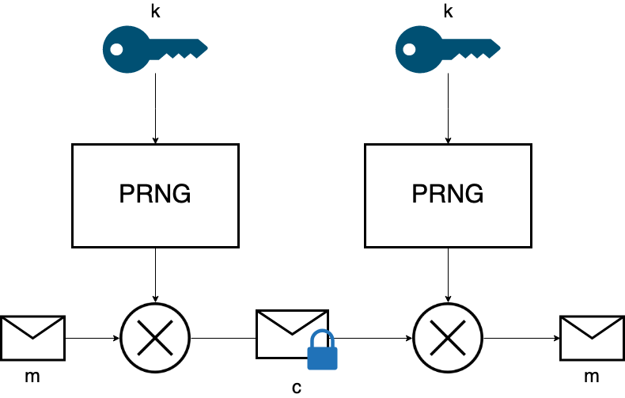
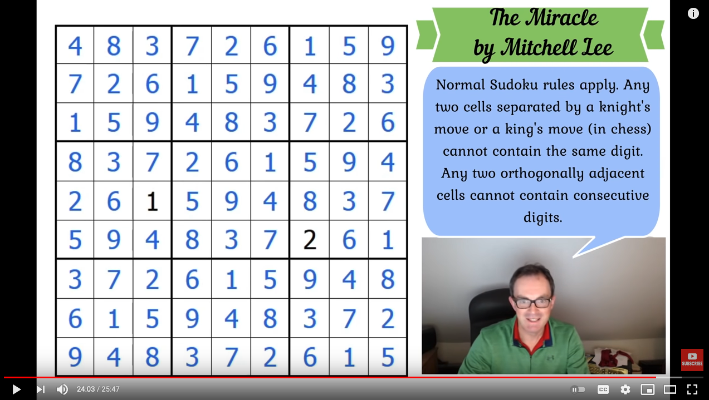

<style>
    /* You can add custom style here. VSCode supports this.
    Other editor might need these custom code in
    the YAML header: section: | */
	/* section header { display: none; } */
	/* section footer { display: none; } */
</style>

# Criptografía
<!-- _class: first-slide -->

**Tema 4: Teoría complejidad y acuerdo D-H**

Juan Vera del Campo

juan.vera@campusviu.es

# Como decíamos ayer...
<!-- _class: with-info -->



El cifrados de flujo y de bloque permiten enviar mensajes computacionalmente seguros

Solo necesitamos que las dos partes tenga una clave secreta en común

¿Cómo conseguimos que las dos personas que no se han visto nunca tengan una clave secreta común?

<!--
Parecería que con lo que conocemos ya hemos resuelto el problema de comunicar dos personas de forma secreta

Pero en realidad tenemos un "elefante en la habitación": ¿cómo se intercambian una clave de forma segura dos personas que no han hablado nunca antes, ni tienen otra forma de comunicació que Internet?

Este es el problema de intercambio de clave. No fue resuelto hasta 1976 con una serie de conceptos completamente nuevos: cada persona tiene dos claves, una pública conocida por todo el mundo y otra privada y secreta. El algoritmo inventado en 1976 se llama Diffie-Hellman, y aún lo estamos utilizando.

Antes de empezar necesitaremos un poco de teoría de complejidad. Vamos allá.
-->

# Hoy hablamos de...
<!-- _class: cool-list -->

1. [Teoría de la complejidad](#4)
1. [Logaritmo discreto](#22)
1. [Acuerdo de clave Diffie-Hellman](#26)
1. [Resumen y referencias](#43)

# Teoría de la complejidad
<!-- _class: lead -->

<!--
Hablaremos de la teoría de la complejidad desde un punto de vistra abstracto y sin entrar en detalles

Todo lo que vamos a decir tiene una enorme literatura detrás y basada en la lógica y el álgebra

Por si fuera poco, es un campo del que aún no conocemos casi nada: hay aún muchas preguntas abiertas

El nombre "teoría de la complejidad" está muybien escogido para describir el campo. Vamos a intentar saber de qué va
-->

## ¿Cuánto tiempo tardarías en resolver este sodoku?
<!-- _class: two-columns -->


- Normas usuales de Sodoku
- Las casillas ortogonales no tienen números consecutivos: no hay un 5 al lado de un 6
- Las casillas separadas por movimientos de caballo o rey no tienen el mismo número
- Pruébalo: [The Miracle, de Mitchell Lee](https://cracking-the-cryptic.web.app/sudoku/tjN9LtrrTL)
- ¿Cuánto tiempo le llevará a un algoritmo que sea el más rápido posible?

<!--
Una manera de resolver el sudok es simplemente probar números uno a uno hasta que se verifique el resultado. Esto es fuerza bruta.

Hay algoritmos más inteligentes para resolverlo, y de hecho nuetros cerebro los usa cuando intenta resolverlos "si esto es un 2, entonces esto no puede ser un 3". Eso es mucho más eficiente que la fuerza bruta.

¿Cuánto tiempo mínimo le lleva al algoritmo más eficiente posible? De esto va la teoría de la complejidad.

Nota: no necesitamos conocer cuál es el algoritmo más eficiente. Solo cuánto tiempo le llevaría, aunque no separamos cuál es ese algoritmo. Si incluso el mejor algoritmo matemáticamente posible para resolver un cifrado es muy lento... entonces el cifrado es seguro incluso aunque no conozcamos ese algoritmo.
-->

## Mucho tiempo para resolver
<!-- _class: with-info -->

Resolver un Sudoku es "sencillo": vamos comprobando números y, si funcionan, los dejamos

...eso se parece mucho a resolver un cifrado clásico

Pero estamos interesados en conocer el tiempo que le llevará **al algoritmo más rápido posible**, incluso aunque no sepamos qué algoritmo es ése

10 veces más casillas... ¿necesita 10 veces más tiempo? ¿ó 100 veces más tiempo? ¿ó 1000 veces más tiempo? ¿podremos acaso solucionarlo?

Si al aumentar el tamaño de un problema el tiempo necesario para resolverlo sigue siendo "razonable", decimos que es un  "problema P"

<!--
Definiremos qué significa creciente exactamente: ¿lineal? ¿polinomial? ¿exponencial?

Adelanto: poco significa polinomial: el tiempo necesario para resolverlo crece de forma polinomial con respecto a su tamaño
 -->


## ¿Cuánto tiempo tardarías en comprobar si ésta es la solución?

[](https://www.youtube.com/watch?v=yKf9aUIxdb4)

<!--
No es una pregunta trampa: tardamos pocos segundos. Mucho menos tiempo que en resolver el Sudoku

En el vídeo, Simon resuelve el Sudoku de antes en 20 gloriosos y emocionantes minutos
-->

## Mucho tiempo para resolver, poco para comprobar
<!-- _class: with-info -->

Existen algunos problemas que si aumenta el tamaño ya no podremos solucionarlos en un tiempo razonable...

pero si nos dan una solución, es muy rápido **decidir** si la solución correcta

Si lleva poco tiempo decidir si una solución es válida para un problema, decimos que es "un problema NP"

<!--
La teoría de la complejidad se centra en "problemas de decisión", aquellos cuya respuesta es Sí/NO

- Es esta solución válida para un problema?
- Es esta solición óptima?

Casi todos los problemas se pueden plantear como una pregunta SI/NO.
-->

## ¿Cuánto tiempo tardas en colorear este mapa con 9 colores diferentes?


<!--
El problema tradicional es "con 4 colores", que resulta ser el mínimo posible con cualquier mapa. Pero vamos a exigir 9 colores para poder hacer una observación interesante a continuación.

Obviamente, si 4 colores es el mínimo posible, tiene que ser posible hacerlo con 9 que son más y por tanto además será más fácil.
-->

## Transformación de problemas

<!-- _class: two-columns with-info -->

[](https://www.youtube.com/watch?v=Tnu_Ws7Llo4)

- Si los dos problemas de antes parecen similares, es que lo son
- Se puede expresar un Sudoku como un problema de colorear mapas y viceversa
- Si podemos pasar rápidamente de un problema a otro y tenemos un algoritmo rápido para resolver uno, [podemos resolver también el otro rápidamente](https://medium.com/code-science/sudoku-solver-graph-coloring-8f1b4df47072)

Si un problema NP se puede transformar en otro problema NP, entonces es un "problema NP-Completo"

<!--
Los problemas NP-completos son muy interesantes: si podemos resolver uno de ellos rápidamente, de rebote podremos resolver una clase enorme de problemas a la vez.

En el enlace, un ejemplo de solución de Sudoku transformándolo primero a un problema de coloreado de mapas, y resolviendo el problema de coloreado de mapas
-->

## Seguridad basada en problemas NP

A partir de ahora vamos a basar la seguridad en problemas:

- Que el ciptoanálisis sea NP y por tanto *no razonable*
- Que sea corto decidir si algo es solución: el cifrado y descifrado está en P y *es razonable*

Si además podemos convertir unos problemas en otros y sabemos que un problema es "computacionalmente seguro", el otro también lo será. Por tanto:

- El problema concreto en el que basemos la seguridad no importa siempre que sea equivalente a otro considerado seguro
- Escogeremos el problema que sea más sencillo de programar

> Requisitos de [New Directions in Cryptography](https://www.cs.utexas.edu/~shmat/courses/cs395t_fall06/dh.pdf), Diffie y Hellman, 1976. Hablaremos más de este paper en unos minutos

## P = NP
<!-- _class: smaller-font two-columns -->

- Un problema P es también un problema NP, pero...
- ¿Todos los problemas NP son también P? ¿Y qué pasa con los NP-Completos?
- **Este es una de las grandes incógnitas actuales de la matemática**
- No sabemos si P es igual a NP, o si todos los problemas NP son NP-completos
- **La seguridad actual se basa en la fuerte sospecha de que hay problemas NP que no son P ni NP-Completos**


> Definición formal: https://en.wikipedia.org/wiki/P_versus_NP_problem
> ¿Afecta a la criptografía?: https://security.stackexchange.com/questions/12802/how-will-security-need-to-be-changed-if-p-np


<!--
Esta es una discusión muy interesante para las matemáticas y que podría tener alguna implicación en criptografía, pero a niveles prácticos nos afecta poco
-->

## Ejemplos de problemas NP

- Sodoku, Colorear mapas, El problema del viajante...


- Logaritmos discretos, Factorizar números...

> https://www.explainxkcd.com/wiki/index.php/399:_Travelling_Salesman_Problem

## "Mucho tiempo": una definición

Hemos hablado de "tiempos razonables", "rápidamente" y "mucho tiempo"

... ¿podemos formalizarlo?

## Cota superior asintótica: notación "big-O"

Escribimos que un algoritmo es de complejidad $O(g(n))$ si el tiempo que lleva ejecutarlo cuando $n \rightarrow \infty$ es como máximo $g(n)$

Fíjate que $g(n)$ también puede tender a infinito...

Lo importante es comparar las velocidades: ¿cómo crece el tiempo de ejecución cuando crece $n$?

¿Linealmente? ¿Exponencialmente?

> Fuente: https://en.wikipedia.org/wiki/Big_O_notation

---


> Fuente: https://laptrinhx.com/time-complexity-and-big-o-529699432/

## big-O en criptografía

En criptografía, $n$ es el tamaño de la clave en bits

Queremos algoritmos que el atacante necesite realizar $O(2^n)$ operaciones, siendo $n$ el tamaño de la clave

Pero también queremos que, conociendo la clave, el descifrado sea $O(n)$

Un algoritmo está roto si el atancante necesita muchas menos de $O(2^{n-1})$ operaciones

---

Ejemplo: si queremos aumentar la seguridad de un algoritmo, pasamos de una clave de 128 a 256 bits

- Cifrado $O(n)$: ahora costará $n=2$ veces más descifrar con la nueva clave
- Mejor ataque posible $O(2^n)$: al atacante le costará $2^{256} / 2^{128} = 3 \cdot 10^{34}$ veces más encontrar la nueva clave

Nota que no necesitamos conocer el ataque: si se demuestra que el mejor ataque es de orden $O(2^n)$, entonces el sistema es seguro aunque no conozcamos cómo es el ataque

---
<!-- _class: extra-slide -->

Nota: las clases de problemas P, NP, NP-completo... en realidad se definen con notación big-O:

- P: problemas resolubles en tiempo exponencial $O(2^n)$
- NP: problemas comprobables en tiempo polinomial $O(n^k)$ para algún valor de $k$.

Recuerda: un sistema es **seguro computacionalmente** si cualquier algoritmo probabilístico en tiempo polinomial solo puede romper el algoritmo con probabilidad negligible en $\|n\|$

Es decir: un cifrado es seguro computacionalmente si el mejor ataque posible tiene complejidad $O(n^k)$, para cualquier $k$

(falta definir eso de "probabilidad negligible", pero no lo haremos en este curso)

## Problemas útiles en criptografía

- Factorización en números primos
- Logaritmo discreto
- Curvas elípticas

## Ejemplo: factorización en números primos

$$
15 = 5 \cdot 3 \\
38 = 19 \cdot 2 \\
3248 = 29 \cdot 7 \cdot 2^4 \\
8012012832918391238193192198219981928192889382938998982 = ?
$$

Es un problema NP y probablemente ni P ni NP-Completo

El algoritno conocido más rápido es [GNFS](https://en.wikipedia.org/wiki/General_number_field_sieve):

$$
O(2^{2,774·(b_n^{1/3})(ln(b_n)^{2/3})})
$$


# Logaritmo discreto
<!--
_class: lead
header: Logaritmo discreto
 -->

<!--
Vamos a ver con más detalles el problema del logaritmo discreto, porque es el que se usa en casi todos los sistemas que veremos a partir de ahora
-->

## Logaritmo discreto

Problema NP y probablemente no es NP-completo

$$
c = g ^ m \mod p
$$

Si conoces $c$, $g$ y $p$...

Problema: encuentra $m$

# p=17 g=5 c=4 m=?
<!-- _class: two-columns center smaller-font with-header center -->

$m$|$c = 5 ^ m \mod 17$
--|--
1|5
2|8
3|6
4|13
5|14
6|2
7|10
8|16

$m$|$c = 5 ^ m \mod 17$
--|--
9|12
10|9
11|11
**12**|**4**
13|3
14|15
15|7
16|1


<!--
Fijaos: se están mapeando todos los números de 1 a 17 en otros números de 1 a 17 de forma "aleatoria". Esto es un "grupo cíclico"

Eso se parece mucho a una permutación pseudoaleatoria, de las que usábamos en el cifrado de bloque
-->

## Gupo cíclico
<!-- _class: with-success smaller-font -->

La transparencia anterior muestra un ejemplo de grupo cíclico:

$$
\Z_{p}^{*} = \{g^m \mod p\}
$$

- $p$ y $g$ tienen que ser primos relativos: no tienen factores comunes
- Llamamos generador al número $g$, y $p$ es el orden
- $\Z_{p}^{*}$ contiene todos los números entre 1 y $p$ una sola vez

El "aspecto" es el de una permutación pseudoaleatoria del cifrado de bloque, con $m$ el mensaje en claro y $c=g^m \mod p$ el cifrado

Dado un mensaje cifrado $c \in \Z_{p}^{*}$ y conocido $g$ y $p$, decidir si el mensaje en claro $m'$ es el mensaje original es tan complejo como resolver el problema del logaritmo discreto.

> https://en.wikipedia.org/wiki/Cyclic_group

# Acuerdo de clave Diffie-Hellman
<!--
_class: lead
header: D-H
-->

<!--
Ya tenemos los conocimientos suficientes para presentar el problema de la primera transparencia:
-->

---
<!-- _class: extra-slide with-info -->


El cifrados de flujo y de bloque permiten enviar mensajes computacionalmente seguros

Solo necesitamos que las dos partes tenga una clave secreta en común

¿Cómo conseguimos que las dos personas que no se han visto nunca tengan una clave secreta común?

<!--
Simplemente recordemos cuál es el problema que queremos resolver hoy: ¿cómo conseguimos que las dos personas que no se han visto nunca tengan una clave secreta común?

-->

## Diffie-Hellman

Método de acuerdo de clave simétrica [(RFC2631, 1999)](https://tools.ietf.org/html/rfc2631)

[New Directions in Cryptography](https://www.cs.utexas.edu/~shmat/courses/cs395t_fall06/dh.pdf), Whitfield Diffie y Martin Hellman en 1976

Primer algoritmo de criptografía asimétrica conocido y base de muchos de ellos

Lo estamos utilizando constantemente


<!--
Su paper de 1976 es, junto con el de Shannon (capítulo 1), uno de los más importantes en cruptografía
-->


## Hipótesis DDH (*Decisional D-H*)
<!-- _class: with-info -->

$\Z_{p}^{*}$  es grupo cíclico con el elemento generador $g$ y $p$ primo

**Problema:** dado $g^a, g^b \in \Z_{p}^{*}$, ¿cuál es el valor de $g^{ab} \in \Z_{p}^{*}$?

Calcular $g^{ab}$ a partir de $g^a, g^b$ es computacionalmente difícil: primero tendríamos que calcular $b$ a partir de $g^b$, **y eso es el problema del logaritmo discreto**

(Recuerda que $g^a \cdot g^b = g^{a+b}$, así no vale)

Pero si nos diesen $a$ ó $b$: $g^{ab} = (g^a)^b = (g^b)^a$ y es muy fácil de calcular

Que nos den $a$ ó $b$ se conoce como "trampa" o "*trapdoor*". Sin conocer la trampa, el problema se considera muy difícil computacionalmente

---
<!-- _class: with-warning -->

Vamos a diseñar un protocolo entre Alice y Bob el que se tenga que calcular $g^{ab}$:

- El atacante solo conoce $g^a$ y $g^b$: problema difícil
- Pero Alice y Bob conocen también $a$ ó $b$: problema fácil

Se asume que $g^{ab}$ es computacionalmente difícil de calcular para el atacante al ser equivalente al problema del logaritmo discreto. En 50 años no hemos encontrado una forma rápida (es decir, polinomial $O(n^k)$) de hacer este cálculo sin conocer previamente $a$ ó $b$

## (inciso: Alice y Bob)
<!-- _class: extra-slide -->


Por tradición, cuando se describen protocolos criptográficos:

- Alice y Bob son dos personas que quieren intercambiar información
- Charlie será otro participante legítimo, cuando lo necesitemos
- Eve (solo escucha) y Malloy (puede enviar mensajes) son atacantes

> Alice y Bob: https://www.explainxkcd.com/wiki/index.php/177:_Alice_and_Bob

## Protocolo
<!-- _class: smaller-font -->

Dos usuarios $Alice$ y $Bob$ que no se han visto nunca:

1. Acuerdan $g$ y $p$ primos entre sí
1. Escogen números en secreto $a$ y $b$
1. Se envían entre ellos:
    - $Alice \rightarrow Bob: A=g^{a} \mod p$
    - $Bob \rightarrow Alice: B=g^{b} \mod p$
1. Calculan en secreto:
    - $Alice$: $s = B^{a} \mod p = g^{ab} \mod p$
    - $Bob$: $s = A^{b} \mod p = g^{ab} \mod p$
1. Y usan $s$ como clave de cifrado un algoritmo simétrico  


---


> https://stackoverflow.com/questions/10471009/how-does-the-man-in-the-middle-attack-work-in-diffie-hellman

## Claves secretas y claves públicas

- Alice y Bob acuerdan $g$ y $p$ primos entre sí por canales que no son seguros. **El atacante conoce $g$ y $p$**
- Cuando Alice y Bob se intercambian $g^{a}$ y $g^{b}$, el canal aún no es seguro. **El atacante conoce $g^a$ y $g^b$**
- $a$ y $b$ nunca salen de los ordenadores de Alice ni Bob, nunca se intercambian. **El atacante no los conoce, Bob no conoce $a$ y Alice no conoce $b$**

Dado que el atacante (o cualquiera) conoce $g$, $p$, $g^a$ y $g^b$, esta información es pública

$a$ y $b$ es información privada y solo conocida por Alice y Bob, respectivamente

---
<!-- _class: with-success -->

Paso 1 |Qué sabe Alice|Qué sabe Bob|Qué es público
--|--|--|--
1|$g$, $p$|$g$, $p$|$g$, $p$
2|$a$, $g^a$|$b$, $g^b$|
3|$g^b$|$g^a$|$g^a$, $g^b$
4|$g^{ab}$|$g^{ab}$|

Recuerda hipótesis DDH: $g^{ab}$ solo se puede calcular fácilmente si conoces o bien $a$ o bien $b$, pero no se puede calcular fácilmente si conoces solo $g^a$ y $g^b$

Alice y Bob, que no se habían visto nunca antes, puede utilizar $s=g^{ab}$ como clave de un cifrado simétrico de flujo o bloque como ChaCha20 ó AES

---

Llamamos:

- Claves de Alice:
    - Clave pública: $\{g, p, g^a\}$
    - Clave privada: $a$
- Claves de Bob:
    - Clave pública: $\{g, p, g^b\}$
    - Clave privada: $b$

Después del D-H ya no necesitan más estas claves y puede borrarlas...

... pero quedaos con el concepto, que lo usaremos dentro de poco


## Selección de parámetros

D-H tiene cuatro parámetros: los secretos $a$, $b$ y los públicos $g$, $p$

"Paso 1: Alice y Bob acuerdan $g$ y $p$ primos entre sí"

**La seguridad del algoritmo depende de que estos números estén bien escogidos**

- Si no son primos entre sí o si $p$ no es primo, es más fácil calcular $g^{ab}$
- Si $p-1$ no cumple algunas propiedades, existen algoritmos que pueden calcular $g^{ab}$
- Si $p$ no es lo suficientemente grande, se puede romper por fuerza bruta
- $g$ tiene que ser generador de $\Z^*_p$

---
<!-- _class: smaller-font -->

Afortunadamente:

- $g$ puede y suele ser un número bajo como 2
- $p$ se puede reutilizar cuantas veces sean necesarias, así que se puede y suele sacar de [tablas públicas (RFC7919, 2016)](https://tools.ietf.org/html/rfc7919)

Ejemplo:

```
p = 0xFFFFFFFFFFFFFFFFC90FDAA22168C234C4C6628B80DC1CD129024E088A6
7CC74020BBEA63B139B22514A08798E3404DDEF9519B3CD3A431B302B0A6DF25F
14374FE1356D6D51C245E485B576625E7EC6F44C42E9A637ED6B0BFF5CB6F406B
7EDEE386BFB5A899FA5AE9F24117C4B1FE649286651ECE45B3DC2007CB8A163BF
0598DA48361C55D39A69163FA8FD24CF5F83655D23DCA3AD961C62F356208552B
B9ED529077096966D670C354E4ABC9804F1746C08CA18217C32905E462E36CE3B
E39E772C180E86039B2783A2EC07A28FB5C55DF06F4C52C9DE2BCBF6955817183
995497CEA956AE515D2261898FA051015728E5A8AAAC42DAD33170D04507A33A8
5521ABDF1CBA64ECFB850458DBEF0A8AEA71575D060C7DB3970F85A6E1E4C7ABF
5AE8CDB0933D71E8C94E04A25619DCEE3D2261AD2EE6BF12FFA06D98A0864D876
02733EC86A64521F2B18177B200CBBE117577A615D6C770988C0BAD946E208E24
FA074E5AB3143DB5BFCE0FD108E4B82D120A93AD2CAFFFFFFFFFFFFFFFF
g = 2
```

> Fuente: https://github.com/amiralis/pyDH/blob/master/pyDH/pyDH.py

## D-H efímero / DH Ephemeral

- $a$ y $b$ se tienen que calcular en secreto
- no tienen ninguna restricción especial: el cálculo de las claves públicas y privadas para D-H es muy rápido
- Se pueden escoger cada vez que las necesitemos y olvidarlas después

- **Ventaja**: cada vez tendremos una clave diferente (D-H efímero)
- **Desventaja**: no podemos autenticar a la otra persona

## Debilidades
<!-- _class: with-warning -->

¿Qué sucede si Malloy se pone en medio de un D-H?


Alice y Bob están hablando en secreto... con el atacante

---
<!-- _class: smaller-font -->


D-H necesita claves mucho más largas que AES: $p$ tiene que ser primo, [y los primos están separados entre sí](https://en.wikipedia.org/wiki/Ulam_spiral)

Para acordar claves AES (que podemos aprovechar todos los números, primos o no) necesitamos una clave D-H (la $p$, que solo puede ser primo) de...

AES (bits)|D-H (bits)
--|--
128|3072
256|15360

¡No se suelen usar $p$ tan enormes!

NIST recomienda $\|p\| > 2048$ hasta 2030

Compara, para AES: $\|p\| = 128$

> https://blog.cloudflare.com/why-are-some-keys-small/
> https://www.keylength.com/en/3/

## Composición de elementos criptográficos

Acamos de ver una composición de elementos criptográficos: D-H y AES

- Alice y Bob acuerdan una clave AES-256 utilizando DH-4096
- Alice y Bob utilizan esa clave para comunicaciones seguras con AES.

Esto es una introducción a TLS. En la última parte de la asignatura veremos este protocolo con mucho más detalle.

# Conclusiones
<!--
_class: lead
header: Hash
-->

## Resumen

- Hay una serie de problemas difíciles de resolver pero fáciles de comprobar: son los NP, en los que basaremos los demás sistemas que veremos
- La existencia de que estos problemas realmente son difíciles de resolver es una asunción de la criptografía actual. Amenaza: computación cuántica
- El problema del logaritmo discreto es uno de estos problemas y la base de muchos algoritmos
- D-H se utiliza para acordar una clave simétrica al inicio de una comunicación entre dos personas que no se conocen previamente
- Ahora tenemos claves con dos partes: una parte es pública, la otra es privada

## Referencias

- [New Directions in Cryptography](https://citeseerx.ist.psu.edu/viewdoc/summary?doi=10.1.1.37.9720), Whitfield Diffie y Martin E. Hellman, 1976. El paper describe parte de la teoría de la complejidad que hemos estudiado aquí y describe el intercambio de claves Diffie-Hellman

---
<!-- _class: center -->

Continúa en: [Criptografía asimétrica](05-asimetrica.html)
