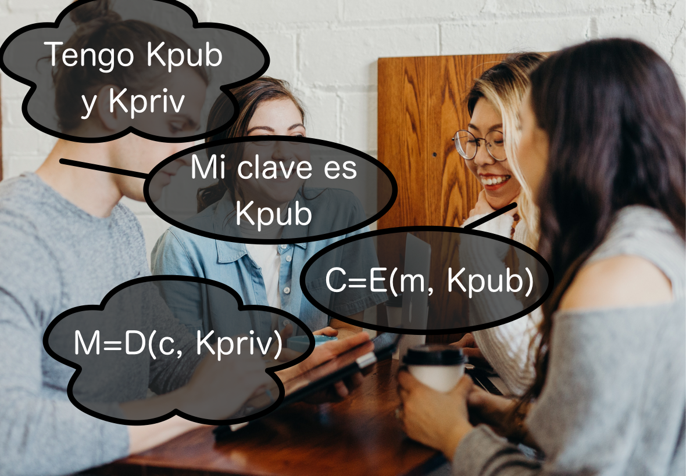
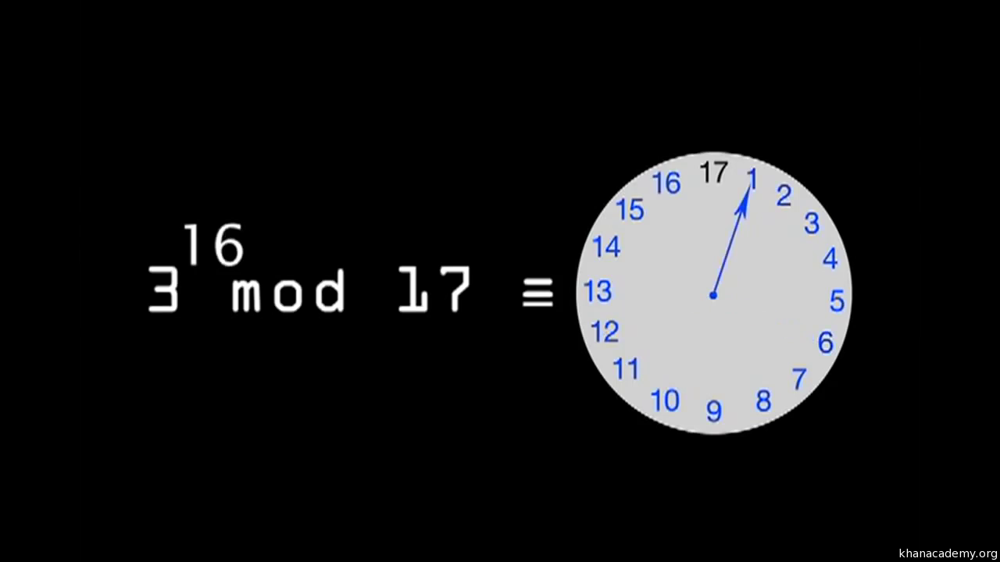
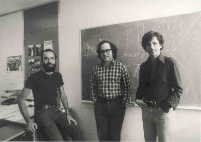
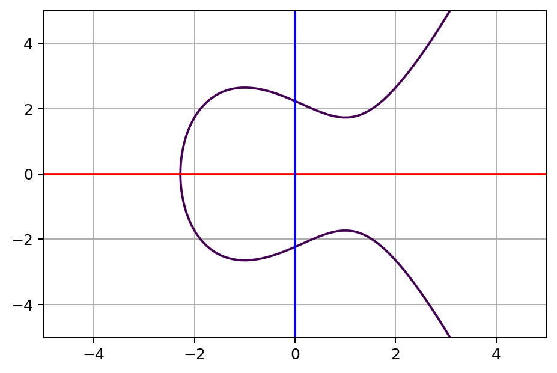
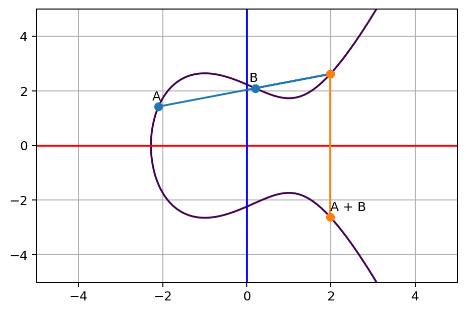
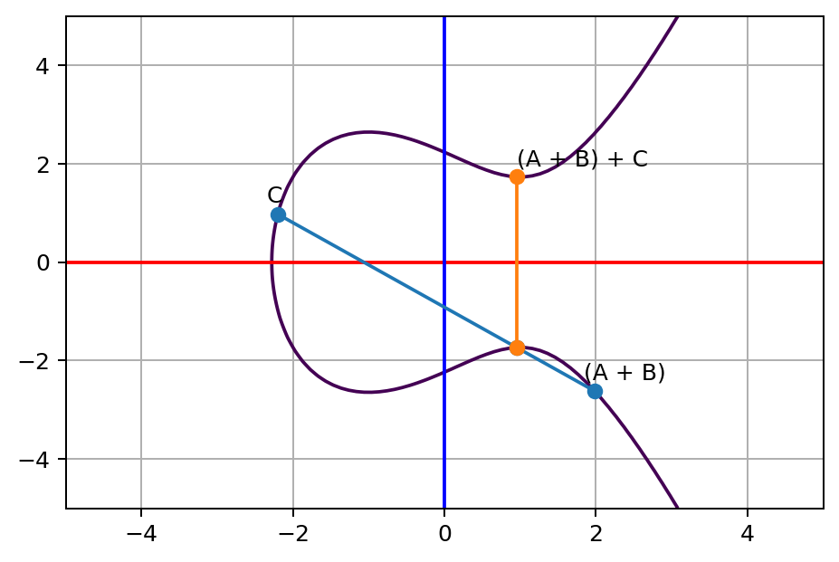
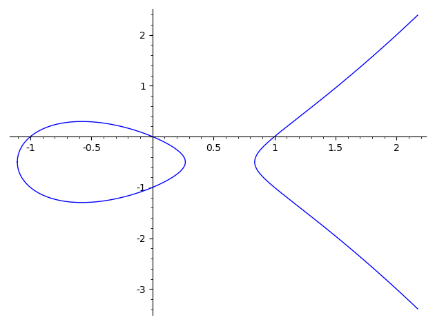
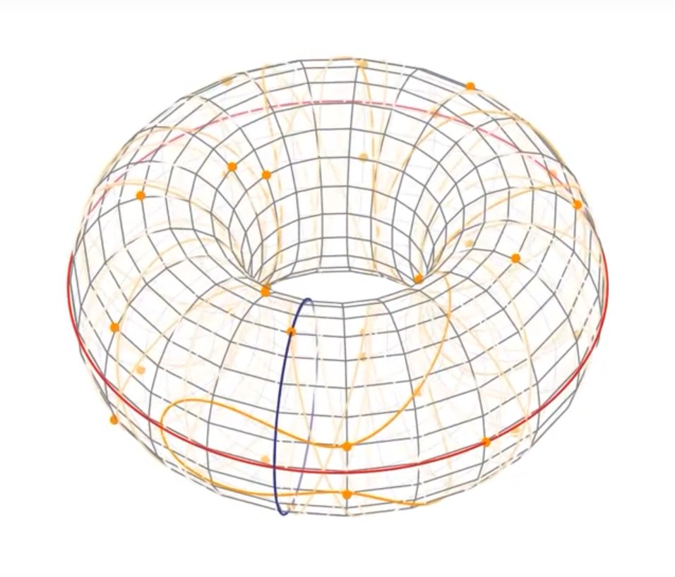
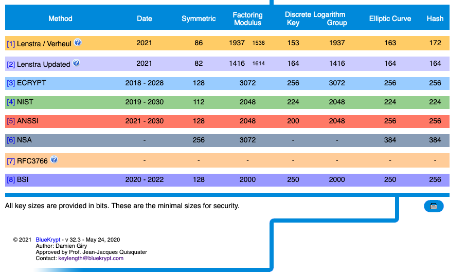

# Cifrado asimétrico o de clave pública
<!-- _class: first-slide -->

**RSA y curvas elípticas**

Juan Vera del Campo - <juan.vera@professor.universidadviu.com>

# Como decíamos ayer...

El cifrados de flujo (ej. ChaCha) y de bloque  (ej. AES) permiten enviar mensajes computacionalmente seguros. Con Diffie-Hellman, dos personas que no se han conocido nunca pueden tener una clave común.

¿Qué hay de los demás servicios de seguridad?

<!--
Parecería que con lo que conocemos ya hemos resuelto el problema de comunicar dos personas de forma secreta

Pero en realidad tenemos un "elefante en la habitación": ¿cómo se intercambian una clave de forma segura dos personas que no han hablado nunca antes, ni tienen otra forma de comunicació que Internet?

Este es el problema de intercambio de clave. No fue resuelto hasta 1976 con una serie de conceptos completamente nuevos: cada persona tiene dos claves, una pública conocida por todo el mundo y otra privada y secreta. El algoritmo inventado en 1976 se llama Diffie-Hellman, y aún lo estamos utilizando.

Antes de empezar necesitaremos un poco de teoría de complejidad. Vamos allá.
-->

---

El protocolo de intercambio de claves Diffie-Hellman permitió por primera vez en la historia que dos personas cualquiera que no se conocían mantuviesen una conversación confidencial por medios dgitales...

...pero su artículo no se llamó "Solución al problema de intercambio de claves". Tenía un título mucho más ambicioso: [Nuevas direcciones en la criptografía](https://citeseerx.ist.psu.edu/viewdoc/summary?doi=10.1.1.37.9720)

¿Qué direcciones eran esas?

> Foto: https://www.publicdomainpictures.net/en/view-image.php?image=363738&picture=signpost-giving-directions (CC0)

<!--
Atención: este tema es matemáticamente denso, pero no es necesario seguir todos los detalles. Si tienes interés en los detalles, por favor, consulta los papers y libros especilizados.

Los objetivos del tema es conocer la base de la criptografía asimétrica, cómo funciona y cómo se usa.
-->

# Hoy hablamos de...
<!-- _class: cool-list toc -->

1. [Criptografía asimétrica](#5)
1. [RSA](#27)
1. [Curvas elípticas](#41)
1. [Los límites de la criptografía asimétrica](#58)
1. [Conclusiones](#62)

# Criptografía asimétrica
<!-- _class: lead -->

## Firmado digital de contratos

[New Directions in Cryptography](https://citeseerx.ist.psu.edu/viewdoc/summary?doi=10.1.1.37.9720) (Whitfield Diffie y Martin Hellman, 1976) exploraba qué se necesitaba para que dos empresas pudiesen firmar un contrato mercantil:

1. **Confidencialidad**, sin tener una clave secreta común
1. **Autenticación** de la identidad (llamada "autencidad de usuario" en el paper original)
1. **Integridad** del contrato (llamada "autenticidad del mensaje")
1. **No repudio** del contrato por ninguna de las partes

Es la lista que conocemos como "los servicios básicos de seguridad" (tema 1)

---

El primer punto, "confidencialidad", se resolvía con los cifrados que estaban apareciendo ese mismo año (DES)...

...pero se necesitaba intercambiar primero una clave simétrica

Propuesta: protocolo de intercambio de claves

Y se dieron cuenta: se puede extender la misma idea para solucionar todo lo demás

## Criptografía asimétrica o de clave pública

También conocida como **criptografía de clave pública**

Cada persona tiene dos claves:

- $pk$: clave pública, todos la conocen
- $sk$: clave secreta, **nadie más la conoce**

Hay una relación matemática entre ambas: no las puedes escogerlas al azar. Pero si conoces la pública, no puedes sacar la privada más que por fuerza bruta

<!--

Fíjate que no estoy diciendo que la pública se use para cifrar y la privada para descifrar o viceversa

Normalmente, si cifras con una puedes descifrar con la otra. Y según la que uses puedes cifrar o firmar documentos, como veremos a continuación

-->

## Usos de la criptografía asimétrica

Según si usamos la clave pública o la privada para cifrar, podemos hacer dos cosas:

- cifrar mensajes --> servicio de confidencialidad
- firmar digitalmente mensajes --> servicio de autenticación

La criptografía simétrica también nos permitía cifrar, pero no firmar

## Esquema de cifrado

- Todos conocen la clave $K_{pub}$ de Bob, solo Bob conoce la clave $K_{priv}$
- **Cualquier puede cifrar un mensaje para Bob, solo Bob puede descifrarlo**: confidencialidad

## Esquema de firma electrónica

- Solo Bob puede cifrar con su clave $K_{priv}$ y cualquier puede descifrar con $K_{pub}$
- Pero si pueden descifrar el mensaje, **todos saben que el mensaje solo puede haberlo enviado Bob: autenticación**

## *Trap door functions*, funciones trampa
<!-- _class: with-success -->

Las matemáticas de la criptografía asimétrica utilizan funciones trampa:

- Si conoces $a$, entonces calcular $A=f(a)$ es fácil (problema P, tiempo polinomial)
- Si conoces $A$, entonces calcular $a=f^{-1}(A)$ es muy difícil (problema NP, tiempo exponencial)

No encontramos una función trampa hasta 1976

---

Vimos en teoría de la complejidad que los problemas NP (pero probablemente no P, no NP-Completos) son buenos candidatos para funciones trampa

La mayor parte de problemas NP **solo son difíciles en el caso general**. Es decir: tenemos **algoritmos eficientes que funcionan casi siempre**. Ejemplo: sudoku

Pero necesitamos que calcular $a=f^{-1}(A)$ sea muy difícil **siempre**

La dificultad ha sido encontrar esos problemas matemáticos que fuesen difíciles **siempre**

## Problema del Logaritmo Discreto, revisitado
<!-- _class: a-story -->

Resuelve la $x$:

- $$2^x = 1024$$
* $$x = \log_2(1024) = 10$$
* Eso es fácil y se puede extender a cualquier problema similar:
* Si te dan $n$ y $N$ y te preguntan $n^x=N$...
* $x = \log_n N$

> Para más detalles de este problema, consulta [tema 4](04-complejidad.html)

---
<!-- _class: a-story -->

Resuelve la $x$:

- $2^x \mod 19 = 13$
* Ten en cuenta: $0 \le x \lt 19$. Puedes probar los números uno a uno
* Solución: $x = 5$
* Si no has podido resolverlo, no es porque no tengas suficientes conocimientos... es que no sabemos hacerlo rápidamente: [Problema del Logaritmo Discreto](https://es.wikipedia.org/wiki/Logaritmo_discreto) (DLP)
* ...pero calcular  $2^5 \mod 19 = 13$ es rápido
* El DLP es una *trap door function*
* ...probablemente. Recuerda [tema 4](04-complejidad.html): no sabemos si P=NP

<!--
Recuerda que en realidad no sabemos si el DLP es difícil: solo lo sospechamos muy fuertemente
-->

---
<!-- _class: a-story -->

La dificultad está en la aritmética modular: partiendo del resultado, no es fácil saber cuántas vueltas ha dado a la rueda

Ejemplo: ¿cuánto vale x? Recuerda que $x\lt17$

$$3^{x} \mod 17 = 1$$

> https://miro.medium.com/max/2400/1*YZieEVE_LsNK4i94KNnZqg.png

---
<!-- _class: smaller-font -->

Problema: resuelve $m$ dado $g$, $p$ y $c$ en la ecuación $g^m \mod p = c$

Si probamos con $p=12$, que no es primo, el problema:

$$2^m \mod 12 = 8$$

Tiene todas estas soluciones (compruébalo):

$$
\begin{aligned}
m &= 3 \text{, ya que: } 2^3 \mod 12 = 8 \mod 12 = 8\\
m &= 5 \text{, ya que: }  2^5 \mod 12 = 32 \mod 12 = 8\\
m &= 7\\
m &= 9
\end{aligned}
$$

Pero: 

$$2^m \mod 12 = 5$$

no tiene solución para ningún número $x$ entero

---

Problema: resuelve $m$ dado $g$, $p$ y $c$ en la ecuación $g^m \mod p = c$

**Si el módulo $p$ es primo, la solución de $g^m \mod p = c$ siempre existe y es única**, que es lo que interesa para poder cifrar y descifrar:

$g$ también tiene restricciones, aunque normalmente $g=2$ ó $g=3$

## Protocolo Diffie-Hellman, revisitado
<!-- _class: smaller-font -->

Dos usuarios $Alice$ y $Bob$ que no se han visto nunca:

1. Acuerdan $g$ y $p$ primos entre sí
1. Escogen números en secreto $a$ y $b$
1. Se envían entre ellos:
    - $Alice \rightarrow Bob: A=g^{a} \mod p$
    - $Bob \rightarrow Alice: B=g^{b} \mod p$
1. Calculan en secreto:
    - $Alice$: $s = B^{a} \mod p = g^{ab} \mod p$
    - $Bob$: $s = A^{b} \mod p = g^{ab} \mod p$
1. Y usan $s$ como clave de cifrado un algoritmo simétrico  

**Observa**: para que un atacante que solo conoce $g$, $p$, $A$ y $B$ (claves públicas) pueda calcular $s=A^b$, tiene que resolver $B=g^b \mod p$, que se supone difícil

## Claves secretas y claves públicas

- Alice y Bob acuerdan $g$ y $p$ primos entre sí por canales que no son seguros. **El atacante conoce $g$ y $p$**
- Cuando Alice y Bob se intercambian $g^{a}$ y $g^{b}$, el canal aún no es seguro. **El atacante conoce $g^a$ y $g^b$**
- $a$ y $b$ nunca salen de los ordenadores de Alice ni Bob, nunca se intercambian. **El atacante no los conoce, Bob no conoce $a$ y Alice no conoce $b$**

Dado que el atacante (o cualquiera) conoce $g$, $p$, $g^a$ y $g^b$, esta información es pública

$a$ y $b$ es información privada y solo conocida por Alice y Bob, respectivamente

---
<!-- _class: with-success -->

Paso 1 |Qué sabe Alice|Qué sabe Bob|Qué es público
--|--|--|--
1|$g$, $p$|$g$, $p$|$g$, $p$
2|$a$, $g^a$|$b$, $g^b$|
3|$g^b$|$g^a$|$g^a$, $g^b$
4|$g^{ab}$|$g^{ab}$|

Recuerda hipótesis DDH: $g^{ab}$ solo se puede calcular fácilmente si conoces o bien $a$ o bien $b$, pero no se puede calcular fácilmente si conoces solo $g^a$ y $g^b$

Alice y Bob, que no se habían visto nunca antes, puede utilizar $s=g^{ab}$ como clave de un cifrado simétrico de flujo o bloque como ChaCha20 ó AES

## Problemas de Diffie Hellman: Man in the middle
<!-- _class: with-warning -->

Diffie-Hellman no protege contra MitM porque no permite autenticar mensajes.Necesitamos otras tecnologías.

## Usos de Diffie-Hellman

- Acuerdo inicial de una clave que luego puede usarse para cifrar las comunicaciones usando criptografía simétrica: es la etapa inicial de HTTPS
- Pero no permite autenticar a la otra parte
- Tampoco permite cifrar mensajes

## Nuevas direcciones

El DLP, en la versión D-H de 1976, no una solución completa: permite hacer acuerdo de claves, pero no cifrado, ni firma, ni autenticado

En pocos años aparecieron nuevas funciones basadas en las mismas ideas que D-H, pero que permitían hacerlo todo: **RSA**, ElGammal, DSA, Pailier...

Luego, las soluciones se refinaron con curvas elípticas: ECDH (*Elliptic Curves Diffie-Hellman*), ECDSA (*Elliptic Curves DSA*)...

---
<!-- _class: extra-slide -->

Lo que no era público en 1976 es que en realidad la "*non-secret encryption*" ya se había descubierto antes, en 1969, por James H. Ellis, y en 1973 Clifford Cocks ya había desarrollado una *trap door function* completa que permitía el cifrado ...

... pero se protegió como secreto militar británico, y no se desprotegió hasta 1996

> Fuente: https://en.wikipedia.org/wiki/Clifford_Cocks

## Cifrado y firmado

Algoritmo|Firma|Cifrado|Acuerdo de claves
--|--|--|--
RSA|Sí|Sí|Una parte cifra la clave que va a usarse
ElGammal|Sí|Sí|Una parte cifra la clave que va a usarse
DSA|Sí|No|Una parte cifra la clave que va a usarse
D-H|No|No|Sí, es su único uso

Técnicamente, los sistemas propuestos sirven o bien para firmar, o bien para cifrar o distribuir claves. Los algoritmos son ligeramente diferentes si se usan para firmar o para cifrar, pero no estudiaremos las diferencias

# RSA
<!-- _class: lead -->

## RSA

[A method for obtaining digital signatures and public-key cryptosystems](https://citeseerx.ist.psu.edu/viewdoc/summary?doi=10.1.1.607.2677), Ron **R**ivest, Adi **S**hamir, Leonard **A**dleman, 1978

*trap door function*: dificultad del cálculo de la raíz $e$-ésima($\mod n$) para valores de $n$ con ciertas propiedades

> Background: https://hsto.org/getpro/habr/post_images/453/10e/602/45310e602d784a489301bf1996edef68.jpg

<!--
Fundaron la empresa RSA Security LLC, que sigue siendo uno de los mayores proveedores de seguridad del mundo

- Hablamos de Ron Rivest en el tema 3, creador de RC4
- Adi Shamir hizo más aportaciones fundamentales a la criptografía
- Leonard Adleman ha seguido investigando en teoría de la complejidad
-->

## El problema RSA (RSAP)

Calcula $m$:

$$125 = m ^{323} \mod 391$$

Pista: $391$ es producto de dos primos que no conoces

Es decir, dado $c$, $e$ y $n$, calcula $m$:

$$c=m^e \mod n$$

para recuperar (descifrar) el mensaje original a partir de $c$ hace falta invertir:

$$m=\sqrt[e]{c}^ \mod n$$

---

Si $n$ no es primo el cálculo de

$$m=\sqrt[e]{c}^ \mod n$$

Es computacionalmente difícil para valores de $n$ **con factores desconocidos**

Hemos cifrado un mensaje $m$ pero no hay manera de descifrar el resultado $c$... sin conocer "la trampa" (*trap function*)

---
<!-- _class: smaller-font with-success -->

La "trampa" usa el teorema de Euler: si los factores de $n$ son conocidos, entonces:

$$
\begin{aligned}
(m^{\phi(n)})^t &\equiv 1 \pmod n\\
m^{t \phi(n)} &\equiv 1 \pmod n\\
m^{t \phi(n)}m &\equiv m \pmod n\\
m^{t \phi(n)+1} &\equiv m \pmod n
\end{aligned}
$$

$\phi(n)$ es la [función indicatriz de Euler](https://es.wikipedia.org/wiki/Funci%C3%B3n_%CF%86_de_Euler), "*totient function*", [la *trap door function* de RSA](https://en.wikipedia.org/wiki/Trapdoor_function#Examples)

El mensaje se puede descifrar fácil si conoces $\phi(n)$

$\phi(n)$ se puede calcular fácil si conoces los factores primos de $n$. Es decir, si puedes factorizar $n$

No conocemos ningún algoritmo eficiente para factorizar un número. Este es el problema computacionalmente difícil de RSA

---

Teniendo en cuenta eso, para calcular $m$ a partir de $c$, tomando un atajo dando la vuelta "por el otro lado", exponenciando suficientemente para llegar otra vez hasta $m$:

$$
\begin{aligned}
c & \equiv m^{e} \pmod n \\
m & \equiv c^{\color{red}d} \pmod n \qquad \rightarrow m \equiv m^{e\color{red}d} \pmod n
\end{aligned}
$$

Hace falta encontrar una $d$ tal que:

$$ed = t \phi(n) + 1$$
$$ed \equiv 1 \bmod{\phi(n)}$$
$$d \equiv e^{-1} \bmod{\phi(n)}$$

Es decir, $d$ tiene que ser el inverso de $e$ en el anillo cíclico $\Z_{\phi(n)}$

$d$ solo existe si $e$ y $\phi(n)$ no tienen factores en común (son coprimos)

---
<!-- _class: extra-slide smaller-font -->

¿Cuál es el inverso de un número en un anillo? El que multiplicado por el número da $1$. Ejemplo: $0.333...$ es el inverso de $3$ en los números reales: $0.333... \cdot 3 = 1$

¿Qué pasa con los enteros? Que no tienen inverso dentro de los propios enteros: no hay ningún entero que multiplicado por $3$ dé $1$.

Cuando añadimos aritmética modular a los enteros, sí que pueden haber inversos:

$$3 \cdot 7 \mod 10 = 1$$
$$9 \cdot 9 \mod 10 = 1$$

3 es el inverso de 7 en el anillo cíclico $\Z_{10}$, 9 es inverso de sí mismo en el anillo cíclico $\Z_{10}$

6 no tiene inverso en el anillo cíclico $\Z_{10}$. Esto es porque 6 y 10 tienen factores comunes (no son coprimos)

[Existen algoritmos eficientes](https://en.wikipedia.org/wiki/Extended_Euclidean_algorithm#Modular_integers) para calcular el inverso de un número en un anillo cíclico $\Z_\phi$. Es decir, el cálculo de $d = e^{-1} \mod \phi$ dado $e$ y $\phi$ es posible y eficiente

## El protocolo RSA: generación de par de claves
<!-- _class: smaller-font -->

1. Escoge dos números $p$, $q$ primos
1. Calcula: $n = pq$. Su número de bits es el **tamaño de clave**
1. Calcula:
    - Protocolo original: $\phi = (p-1)(q-1)$
    - Versión moderna: $\phi = mcm(p-1, q-1)$
1. Escoge al azar $e \lt \phi$ que sea coprimo de $\phi$ (sin factores en común)
1. Calcula: $d = e^{-1} \mod \phi$
1. Claves:
    - $sk=\{d, n\}$
    - $pk=\{e, n\}$
1. Se descartan $p$, $q$, $\phi$

## El protocolo: cifrado y descifrado

Cifrado: Para enviar un mensaje a Alice, obtengo su clave pública $pk_A=\{e, n\}$ y calculo:

$$c=m^e \mod n$$

Descifrado: Alice utiliza su clave privada $sk_A=\{d, n\}$

$$m'=c^d \mod n$$

<!--

Fíjate: necesitamos alguna manera de convertir mensajes a números. Lo verás en los ejercicios

-->

## Ejemplo (lo veremos con ejercicios)
<!-- _class: smaller-font -->

Claves:
- $p=17, q=23$
    - $n=pq=391$ (tamaño de clave: 9 bits)
    - $\phi=(p-1)(q-1)=352$
- $e=323$ (escogido al azar, pero $\lt \phi$ y coprimo con él)
- $d=e^{-1} \mod \phi=267$ (calculado con algoritmo de Euler)

Cifrado:

- $m=97 \rightarrow c=m^e \mod n=125$

Descifrado:

- $c=125 \rightarrow m'=c^d \mod n=97$

## Velocidad de proceso

Para crear el par de claves hay que buscar:

- números muy grandes que sean primos (y otras condiciones): $p$ y $q$
- número muy grande $e$ que sea coprimo de $pq$
- inversos de un número entero: $d=e^{-1} \mod \phi$

Es decir: la elección de un par de claves **es un proceso muy lento**. Segundos, minutos, horas si las claves son grandes

A cambio: el cifrado y descifrado **son relativamente rápidos** comparados con otros sistemas de cifrado asimétrico

En cualquier caso, es **muy lento comparado con cualquier proceso de cifrado simétrico**

## Tamaño de claves

Hemos visto que tanto Diffie-Hellman como RSA necesitan números primos

Los números primos están muy separados entre sí: el número de primos menores que $N$ es $\approx \ln(N)$

Ejemplo: hay $\approx\ln(2^{4096})=2839$ números primos menores de $2^{4096}$

"Son pocos primos"

Por eso: la criptografía basada en estas funciones necesita claves mucho más largas que la criptografía simétrica

> Fuente: https://en.wikipedia.org/wiki/Prime_number_theorem
> Gráfico: https://en.wikipedia.org/wiki/Ulam_spiral

---

Simétrica (bits)|RSA (bits)|D-H ($p$, $q$)
--|--|--
80|1024|1024, 160
128|3072|3072, 224
192|7680|7680, 384
256|15360|15360, 512

Es decir: para intercambiar una clave AES-256 aprovechando todos sus bits, necesitamos claves RSA de 15360 bits

Si usamos tamaños de clave RSA de 4096 bits (tamaño típico), podremos intercambiar una clave simétrica equivalente a AES-128

<!--
Nota: podemos intercambiar claves AES-256 con un D-H de 1024 bits. Solo que, de forma efectiva, solo estaremos escogiendo 80 bits de la clave AES-256. Es decir, sería equivalente a un (no existente) AES-80
-->

---

¿Podemos encontrar *trap door functions* que no estén basadas en primos, y por tanto necesiten claves más cortas?

# Curvas elípticas
<!-- _class: lead -->

---

Propuestas como *trap door function* en 1987 por Neal Koblitz y Victor S. Miller de forma independiente

Necesitan claves **más cortas** que la criptografía asimétrica basadas en DLP o RSAP para ofrecer una **seguridad equivalente**

- **Ventaja**: necesitan menos proceso y memoria, se pueden implementar en máquinas pequeñas: móviles, tarjetas inteligentes...
- **Problema**: teoría matemática compleja

## Curva elíptica

Curva plana en un **cuerpo finito** que consiste en los puntos que satisfacen la ecuación:

$$y^2 = x^3 + ax + b$$

Los [cuerpos finitos](https://es.wikipedia.org/wiki/Cuerpo_finito) son estructuras mátemáticas creadas con **polinomios** y **aritmética modular**

---

Ejemplo:

$$y^2 = x^3 - 3x + 5$$

(por ahora simplificamos la explicación representando la curva los reales, sin módulos)

## Trap door function

Dado un punto $A$, definimos una operación "proyección" $A+B = C$ como:

$C$ es "la proyección de recta que une $A$ y $B$, reflejada al otro lado de la curva"

Usamos el símbolo "suma" por tradición, pero no es una "suma geométrica"

---

Y lo volvemos a aplicar, varias veces, desde el mismo origen

---

En vez de empezar con dos puntos, podemos empezar con uno solo, y la recta inicial es la tangente a la cura. El resto sigue igual

$$P=nA$$

> Fuente: https://medium.com/@icostan/animated-elliptic-curves-cryptography-122fff8fcae

---
<!-- _class: with-success -->

Esta es la *trap door function*:

$$ P = nA$$

Es la aplicación de $n$ veces la proyección sobre el punto $A$

Dado $P$ y $A$... ¿cuánto vale $n$?

**Eso es el problema difícil de las curvas elípticas:**

No sabemos calcular $n$ a partir de $P$ y $A$

## Mapeando la curva en un campo finito 

En realidad en criptografía no trabajamos sobre los reales, sino que mapeamos en un grupo finito de los enteros.

Es decir, **con aritmética modular de un numero primo muy grande**. El número de bits de este entero es "el tamaño de la clave"

Ejemplo número primo grande de 256 bits: $p=2^{255}-19$

> Ejemplos de mapeado en campos finitos: https://graui.de/code/elliptic2/

---

Ejemplo $\Z_{61}$ (es solo un ejemplo, el primo tiene que ser mucho más grande):

 

> Fuente: https://www.youtube.com/watch?v=mFVKuFZ29Fc&list=PLN9KZDpNfsHMd7d7PX87JGesGY_Qzyb3V

<!--
Observa: la curva sobre los reales se mapea en un toroide, con la marca de "números enteros", limitados por aritmética modular. Las intersecciones son los puntos de la gráfica 2D de al lado
-->

---

Ejemplo de proyección sobre los enteros

## Tamaño de clave

La gran ventaja de las curvas elípticas en criptografía (EEC) es que nos permiten utilizar criptografía asimétrica con una clave **mucho más pequeña**

Simétrica|RSA|D-H ($p$, $q$)|EEC
--|--|--|--
80|1024|1024, 160|160
128|3072|3072, 224|256
192|7680|7680, 384|384
256|15360|15360, 512|512

Es decir, pone la criptografía asimétrica al alcance de pequeños dispositivos

<!--

A cambio, son más complejas de entender y programar pero eso como usuarios no es algo que importe

-->

---

NOTA: RSA está basado en "factorización", DSA y D-H en "logaritmo discreto"

> https://www.keylength.com/en/compare/

## Elección de la curva

No se suele escoger "cualquier curva elíptica", sino alguna de las ya existentes. Cada una tiene propiedades ligeramente diferentes, [algunas están patentadas](https://en.wikipedia.org/wiki/ECC_patents) y otras provocan dudas ([parte de las revelaciones de Snowden, 2013](https://en.wikipedia.org/wiki/Dual_EC_DRBG))

La [Curve25519](https://en.wikipedia.org/wiki/Curve25519), [propuesta por  Daniel J. Bernstein en 2005](https://cr.yp.to/ecdh.html), se considera segura:

$$y^2 = x^3 + 486662x^2 + x$$

sobre el cuerpo de los enteros creado por el primo $p=2^{255} - 19$

Tiene un tamaño de clave de 256 bits, equivalente a 128 bits en clave simétrica

Aceptada por varios estándares

- [FIPS 186-5, 2019 (aún borrador)](https://csrc.nist.gov/publications/detail/fips/186/5/draft)
- [TLS Protocol Version 1.3 (RFC8446, 2018)](https://tools.ietf.org/html/rfc8446)

<!--
Bernstein es el creador de Chacha20 del [tema 3](03-simetrica.html)
-->

## Elliptic Curve Diffie-Hellman: ECDH

Protocolo:

1. Alice y Bob escogen una curva elíptica y un punto inicial $P$
1. Alice escoge en secreto $a$ y Bob escoge en secreto $b$
1. Se envían:
    - Alice a Bob: $A=aP$
    - Bob a Alice: $B=bP$
4. Escogen como secreto $s=aB=bA=abP$

Nota que un atacante no podría calcular $s$ a partir de $A$ ó $B$: $A+B=(a+b)P$ Tiene que calcular o bien $a$ o bien $b$, y eso es difícil

## Elliptic Curve DSA: ECDSA

[DSA](https://en.wikipedia.org/wiki/Digital_Signature_Algorithm) es un algoritmo de firmado digital clásico, basado en [ElGammal (1985)](https://en.wikipedia.org/wiki/ElGamal_signature_scheme). Es similar a RSA pero basado en el problema del logaritmo discreto

Ha sido estándar FIPS hasta hace poco, pero probablemente será retirado en el futuro próximo

Existe una adaptación de DSA a curvas elípticas: ECDSA, que es la implementación que probablemente se estandarizará: [FIPS 186-5 (2019, aún borrador)](https://nvlpubs.nist.gov/nistpubs/FIPS/NIST.FIPS.186-5-draft.pdf)

## ¿Y RSA?

El protocolo RSA no se ha adaptado a criptografía de curva elíptica

Pero RSA ha sido y aún es el sistema más utilizado para certificados digitales, y  hay millones de estos certificados activos

(es decir, aún hay millones de claves RSA públicas en uso)

La situación quizá cambie en el futuro

- [RSA vs ECC – Which is Better Algorithm for Security?](https://www.ssl2buy.com/wiki/rsa-vs-ecc-which-is-better-algorithm-for-security), SSL2Buy 2021
- [Comparing ECC vs RSA](https://www.linkedin.com/pulse/comparing-ecc-vs-rsa-ott-sarv), Ott S. 2018
- [RSA and ECC: A Comparative Analysis](https://www.ripublication.com/ijaer17/ijaerv12n19_140.pdf) D. Mahto y D. K. Yadav, 2017

# Los límites de la criptografía asimétrica
<!-- _class: lead -->

## Limitaciones

- Los esquemas descritos no cifran bytes, sino números: tenemos que ser capaces de codificar nuestro mensaje en un número entero. **No ciframos "*hola*", sino el número "*0x686f6c61*"**

- En RSA, el número "5" siempre se cifrará igual (¡compruébalo!). Eso es mala idea: quizá el enemigo no sepa qué estamos cifrando, pero sabe que es lo mismo que antes. Otros cifrados asimétricos como DSA son naturalmente probabilísticos, no hace falta añadirlo como un extra

- Todos ellos son **muchísimo más lentos** que la criptografía simétrica para cifrar. Tanto, que no se usan par cifrar, solo para distribuir claves o hformar digitalmente

- En realidad suele usarse un **cifrado mixto**: con asimétrica se cifra la clave simétrica que es la que realmente se usa para cifrar

## PKCS#1

[PKCS#1 (RFC8017)](https://tools.ietf.org/html/rfc8017): recomendaciones para **utilizar correctamente** RSA, y es obligatorio que las librerías que uses las implementen. Por ejemplo:

- Añade random padding al inicio de un mensaje, de forma que dos mensajes iguales se cifren de forma diferente cada vez... pero se descifren igual
- Diferencias de implementación de  RSA en esquemas de cifrado y firmado
- Cómo hacer correctamente la conversión entre mensajes (cadenas de bytes) y enteros (que es lo que cifra RSA)

## Computación cuántica
<!-- _class: smaller-font -->

- 1994: [algoritmo de Shor](https://es.wikipedia.org/wiki/Algoritmo_de_Shor): una máquina cuántica resuelve con eficacia la factorización de números enteros grandes.
   - Recuerda: en el Tema 4, solo nos referíamos a los PCs "tradicionales", llamados "de Turing"
- La computación cuántica **impedirá utilizar todos los algoritmos asimétricos actuales**: RSA, DSA, D-H... y también sus versiones con curvas elípticas
   - Recuerda: la computación cuántica no rompe la criptografía simétrica AES, ChaCha... aunque sí que exige que se usen claves el doble de largas: mínimo 256 bits para AES
- Se están buscando algoritmos nuevos que sean resistentes a la computación cuántica: **criptografía post-cuántica**

> https://cso.computerworld.es/cibercrimen/la-amenaza-cuantica-la-computacion-cuantica-y-la-criptografia
> https://www.ccn.cni.es/index.php/es/docman/documentos-publicos/boletines-pytec/495-ccn-tec-009-recomendaciones-transicion-postcuantica-segura/file

# Conclusiones
<!-- _class: lead -->

## Resumen
<!-- _class: smaller-font -->

- Criptografía asimétrica: cada persona tiene dos claves, una para cifrar y otra para descifrar. Una de esas claves es pública (es decir, cualquiera puede conocer la clave pública de otra persona) y la otra es secreta
- Muchísimo **más lenta** que el cifrado simétrico
- Se utiliza para:
    - intercambiar claves simétricas
    - firmado digital
    - identidad digital
- Ejemplos clásicos: RSA, DSA, D-H. Basados en el problema de la factorización de números primos y logaritmo discreto. Los ejemplos clásicos necesitan tamaños de clave grandes y eso dificulta su implementación
- Basar la seguridad en curvas elípticas (EC) permite claves mucho más pequeñas
- Ejemplos modernos: ECDH, ECDSA, que son adaptaciones de D-H y DSA sobre curvas elípticas

## Referencias

- [Nuevas direcciones en la criptografía](https://citeseerx.ist.psu.edu/viewdoc/summary?doi=10.1.1.37.9720) Whitfield Diffie y Martin Hellman, 1976
- [Asymmetric Encryption - Simply explained](https://www.youtube.com/watch?v=AQDCe585Lnc)
- [Diffie-Hellman Key Exchange explained (Python)](https://medium.com/@sadatnazrul/diffie-hellman-key-exchange-explained-python-8d67c378701c)
- [Recomendaciones para una
transición postcuántica segura](https://www.ccn.cni.es/index.php/es/docman/documentos-publicos/boletines-pytec/495-ccn-tec-009-recomendaciones-transicion-postcuantica-segura/file) Centro Criptográfico Nacional, CCnN-TEC 009, Diciembre 2022 

Las curvas elípticas son un concepto complejo. Esto son algunas propuestas explicativas:

- [¿Por qué pueden utilizarse las curvas elípticas para cifrar?](https://www.youtube.com/watch?v=vi2wvAQsy-A), píldoras CriptoRED
- [Elliptic Curve Cryptography Overview](https://www.youtube.com/watch?v=dCvB-mhkT0w), de John Wagnon. No asume conocimientos de álgebra.
- [Elliptic Curve Diffie Hellman](https://www.youtube.com/watch?v=F3zzNa42-tQ): Vídeo sobre ECDH y curvas elípticas en general de Robert Pierce. Asume conocimientos de álgebra.

---
Ejercicios:

- https://colab.research.google.com/github/Juanvvc/crypto/blob/master/ejercicios/05/RSA.ipynb

Continúa en: [Funciones de Hash y Blockchains](06-hashes.html)

# ¡Gracias!
<!-- _class: last-slide -->
