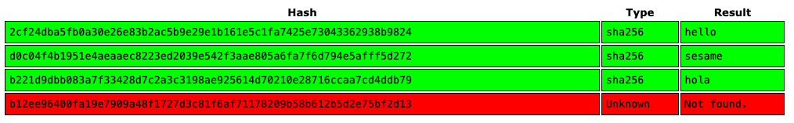
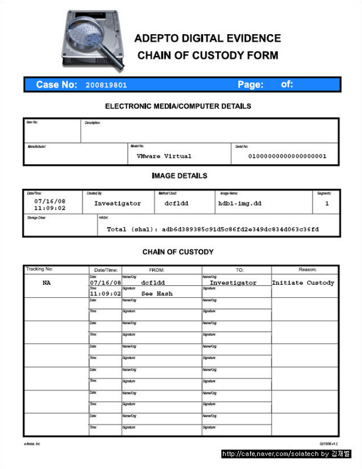

<style>
    /* You can add custom style here. VSCode supports this.
    Other editor might need these custom code in
    the YAML header: section: | */
	/* section header { display: none; } */
	/* section footer { display: none; } */
</style>

# Funciones de Hash y Firma digital
<!-- _class: first-slide -->

Juan Vera del Campo - <juan.vera@professor.universidadviu.com>


# Como decíamos ayer...

- **Confidencialidad**: AES/ChaCha20 + D-H
- **Autenticidad**: RSA + firma digital
- **No repudio**: RSA + firma digital
- **Integridad**: firma digital

Los hashes nos permiten calcular **una firma digital**

# Hoy hablamos de...
<!-- _class: cool-list toc -->

1. [Funciones de hash](#4)
1. [Ejemplos de aplicaciones](#23)
1. [Aplicación: cadena de custodia](#35)
1. [Resumen y referencias](#41)

# Funciones de hash
<!-- _class: lead -->

## Función de hash, digest o resumen
<!-- _class: with-success -->

Resume un mensaje $m$ de longitud arbitraria en un valor $r$ **de tamaño fijo $l$**, sea cual sea la longitud del mensaje

$$
\begin{aligned}
r &= h(m)\\
\end{aligned}
$$

Ejemplos:

- "Resumir" un mensaje de 12 Bytes en 256 bits (32 Bytes)
- Resumir una imagen de 532KB en 256 bits (32 Bytes)
- Resumir una película de 4GB en 256 bits (32 Bytes)

Da igual como sea la entrada, la salida siempre tiene el mismo número de bits

## Ejemplos no criptográficos

- Bit de paridad un mensaje: número de "1" en el mensaje
- CRC
- Checksum

Todos estos son resúmenes, pero no son de utilidad en criptografía


> https://es.wikipedia.org/wiki/Verificaci%C3%B3n_de_redundancia_c%C3%ADclica

<!--
Los bits de paridad o los CRC se utilizan mucho con protocolos que esperan errores: RS232, lectura de CDs, la parte de paridad de un RAID... Un código de detección/corrección de errores se puede entender también como un "resumen" del mensaje: si el resumen no coincide con lo recibido, entonces sabemos ue ha habido un error.

Pero estas funciones, en general, no sirven en criptografía: imagina que un atacante puede cambiar un mensaje y también su resumen. Entonces, ¡no nos sirve de nada validar que el resumen sea correcto!
-->

## Funciones de hash criptográficas

Funciones hash criptográficas son aquellas que:

- Son funciones resumen: comprimen la entrada a una salida de menor longitud
- Son fáciles y rapidas de calcular
- **Propiedades adicionales**:
    - Dado un resumen, no es posible calcular el mensaje original
    - No es factible encontrar dos mensajes con el mismo resumen

Dado un mensaje $m$ con un resumen $r=h(m)$, para encontrar otro mensaje $m'$ con el mismo resumen, $r=h(m)=h(m')$, la manera más eficiente tiene que ser probar mensajes uno a uno: fuerza bruta

> https://en.wikipedia.org/wiki/Cryptographic_hash_function


## Ejemplos de valores de hash


<!--
Ejemplos de valores de hash:

- el primero "resume" un texto "Fox" en otro más largo: la función de hash siempre tiene la misma longitud, incluso si el texto es corto: SHA-256 siempre dará un resumen de 256 bits sea como sea el texto de entrada.
- Los demás son variaciones del mismo texto de entrada. Fíjate: pequeñas variaciones dan un hash diferente a simple vista

¿Qué tenemos que cambiar en "The red fox jumps over the blue dog" para que tenga el mismo hash? Es decir, para que el hash no detecte el cambio. Ya que el texto es mayor de 256 bits, sabemos seguro que habrá otro texto que tendrá el mismo resumen. Pero lo único que podemos hacer es probar cambios uno y otro hasta tener suerte!
-->

## Requisitos de una función de hash criptográfica

- Que sea **rápida** de calcular
- **Resistencia a la preimagen**: dado un hash, no se puede saber el mensaje exacto que tiene ese hash
- **Resistencia a la colisión**: dificultad para encontrar dos mensajes diferentes con el mismo hash
- **Sensibilidad** / efecto avalancha: un cambio mínimo en el mensaje produce un valor hash completamente diferente

> https://en.wikipedia.org/wiki/Cryptographic_hash_function#Properties

## ¿Cuántos hashes podemos calcular por segundo?

Los hashes se usan mucho en minería bitcoin, así que podemos utilizar sus tablas para conocer velocidades:

- ARM1176JZ(F)-S (Raspberry): 0.2 MH/s
- NVidia GTX1080: 222MH/s
- Bitmain AntMiner D3: 19,3 GH/s
- Avalon 6: 3.5 TH/s


> Más ejemplos: https://miningchamp.com/
> En la imagen, un Avalon 6, bloque especializado en calcular hashes

## ¿Mensajes con el mismo resumen?
<!-- _class: with-success -->

Obvio: no puede existir una aplicación inyectiva entre un conjunto de $m$ elementos y otro de $n$ elementos si $m>n$

Existen infinitos mensajes diferentes con el mismo resumen: esto se llama "colisión"


> [Principio del palomar](https://es.wikipedia.org/wiki/Principio_del_palomar)

<!--
El principio del palomar dice que si tienes 9 agujeros y 10 palomas, es necesario que dos palomas compartan agujero. Puede parecer una obviedad, pero a veces se nos pasan las obviedades:

Si los mensajes de 1.000.000 de caracteres se resumen en 256 caracteres... ¡por fuerza varios mensajes tendrán el mismo resumen!
-->

---
<!-- _class: with-success -->

Por ejemplo:

Si queremos resumir fotografías de 1MB en hashes de 256 bits (tamaño típico)

$$
\left.
\begin{aligned}
    \|r\| & = 256\text{b} \Rightarrow |r| = 2^{256}\text{resúmenes} \\
    \|m\| & \approx 10^6\text{B} \Rightarrow |m| = 2^{2^{23}}\text{fotografías}
\end{aligned}
\right\} \frac{|m|}{|r|} = \frac{2^{2^{23}}}{2^{256}} = 2^{2^{23}-256} \approx 2^{8·10^6} \approx 10^{26·10^6}
$$

Es decir, hay un número $10^{26·10^6}$, que en la práctica es "casi infinito", de fotografías de 1MB que se resumen en el mismo hash de 256 bits

Queremos que no sea nada fácil (computacionalmente hablando) encontrar cualquiera de esas "casi infinitas" fotografías: la única forma debe de ser probar las fotografías una a una

## Paradoja del cumpleaños

En realidad hay un ataque a la resistencia a la colisión que deriva de la paradoja del cumpleaños:

*si tenemos un grupo de 23 personas, la probabilidad de tener un par con la misma fecha de cumpleaños es del 50%*

Sólo hace falta que el grupo llegue a 70 personas para que la probabilidad sea del 99%


> Foto: [nappy](https://www.pexels.com/photo/group-of-people-standing-on-metal-stairs-3063910/), free to use

---
<!-- _class: with-success -->

Si tenemos un hash de tamaño $\|r\|$ la probabilidad de colisión será muy alta a medida que nos acercamos a las $\sqrt{\|r\|}$ operaciones

Para $\|r\|=256$ bits esto son unas $\sqrt{2^{256}} = 2^\frac{256}{2} = 2^{128}$ operaciones

Esto implica que para un hash hacen falta resúmenes el doble de largos de lo que hacía falta para las claves simétricas para obtener el mismo nivel de seguridad

- SHA-256 tiene una seguridad equivalente a AES-128, pero se usan para cosas diferentes, SHA para hashes y AES para cifrado.
- SHA-512 tiene una seguridad equivalente a AES-256

La *fortaleza* de una función de hash de longitud $b$ bits es $b/2$

## Ejemplos de funciones de hash


- MD5: utilizado mucho tiempo. [No es resistente a colisión desde 2008](https://www.win.tue.nl/hashclash/rogue-ca/). Es decir, está roto y **no hay que usarlo**
- SHA-1: 160 bits. [En la actualidad se considera roto](https://empresas.blogthinkbig.com/nuevo-ataque-sha-1-explicacion/)
- SHA-2: longitudes de 256 y 512 bits. Son conocidos como **SHA-256 y SHA-512**.
- SHA-3: longitudes entre 224 y 512 bits.

Los hashes recomendados en la actualidad son el SHA-2 (cualquier de las dos variantes) y el SHA-3

---
<!-- _class: with-warning -->

Ejemplos de valores de hash MD5, SHA256 y SHA512 de esta presentación:

```
> ms5sum 03-hashes.md
c99fe5e1ec0f637d77dddb32b1679c21  03-hashes.md

> sha256sum 03-hashes.md
06efc998ac8ad6867b4f1a9ee94d903503c0c52e6f1184a9561000eb303844ec  03-hashes.md

> sha512sum 03-hashes.md 
64b378a66da3714e723ac8469525ac7b460d7ad7ff348b9453d177907a14fd4a
445a11c07206b7df599bcf3ec70475a6e89b4bbfe605c928c36494ff1a31311d  03-hashes.md
```

Si calculas los valores de hash del archivo, verás que no coinciden. Eso es porque no se puede calcular el hash de un archivo, meter el hash en el propio archivo, volver a calcular el hash ¡y que dé lo mismo! Recuerda: cualquier cambio (como por ejemplo meter el hash) cambia totalmente el hash

## Visual SHA-256

[](https://sha256algorithm.com/)

> https://sha256algorithm.com/

<!-- Visita la referencia para ver el funcionamiento de SHA256 en cada paso. Observa que aunque sean muchas operaciones, todas ellas son XOR y shifts que son muy rápidas -->

## ¿SHA-2 ó SHA-3?

La familia SHA-2 está **diseñada** por la NSA, la familia SHA-3 fue **escogida** por el NIST después de organizar una competición para definir el siguiente hash a utilizar

El SHA-3 se ha desarrollado teniendo en cuenta la eficiencia y como backup en caso de encontrar vulnerabilidades en el SHA-2 (diseños totalmente diferentes)

El SHA-2 hasta ahora ha sido sometido a un trabajo de análisis muy superior al SHA-3 y  no se han encontrado ninguna vulnerabilidad

## Construcción

Formas de construir una función de hash:

- A partir de un cifrado de bloque en un modo realimentado: el hash es el último bloque. Posible, pero lento.
- [Merkle–Damgård](https://en.wikipedia.org/wiki/Merkle%E2%80%93Damg%C3%A5rd_construction): es el ejemplo mostrado en la figura. MD5, SHA-1, SHA-2... usan este método
- [SHA-3](https://en.wikipedia.org/wiki/SHA-3): utiliza función Keccak


## Ataque: rainbow table

[Tablas de consulta](https://es.wikipedia.org/wiki/Tabla_arco%C3%ADris) que ofrecen un compromiso para obtener claves en texto simple a partir del resultado de una función de hash.

Son bases de datos:

$$hash \rightarrow mensaje$$


> https://project-rainbowcrack.com/table.htm

---

Ejemplo:

```sh
$ echo -n sesame | sha256sum
d0c04f4b1951e4aeaaec8223ed2039e542f3aae805a6fa7f6d794e5afff5d272  -
$ echo -n hello | sha256sum
2cf24dba5fb0a30e26e83b2ac5b9e29e1b161e5c1fa7425e73043362938b9824  -
$ echo -n hola | sha256sum
b221d9dbb083a7f33428d7c2a3c3198ae925614d70210e28716ccaa7cd4ddb79  -
$ echo -n jñkjhafdiu232332 | sha256sum
b12ee96400fa19e7909a48f1727d3c81f6af71178209b58b612b5d2e75bf2d13  -
```

https://crackstation.net/



---
<!-- _class: extra-slide -->

En este curso no hacemos criptoanálisis, es decir, no rompemos cosas. Si estáis interesados, se puede intentar romper hashes:

- Simplemente buscándolos en google
- Usando alguna *rainbow table*
- Usando diccionarios de "contraseñas probables"
- Herramientas como [John the Ripper](https://www.openwall.com/john/) o [CrackHash](https://pypi.org/project/crackhash/) aprovechan estas técnicas

# Ejemplos de aplicaciones
<!-- _class: lead -->

Árboles de Merkle, Integridad, Cadena de custodia...

## Firma digital
<!-- _class: with-success -->

Cifrando **el hash de un mensaje** con nuestra clave privada, aseguramos que ese mensaje lo hemos enviado nosotros y cualquier puede verificarlo


Firma digital de un mensaje = cifrado del hash de un mensaje con mi clave privada

Tenemos todo un [tema para hablar de firma digital](03-firma.html)

## Almacenamiento de contraseñas

El sistema operativo no debe guardar las contraseñas de los usuarios: si alguien consigue entrar, ¡obtiene la contraseña del usuario!

Podemos guardar simplemente su hash: $hash(contraseña)$

Pero esto tiene un problema: muchos usuarios usan palabras, nombres, etc. limitados. Las palabras, nombres conocidos són del orden de ≈100.000

Un atacante realizar un "diccionario" con el hash de todas las palabras, nombres, etc. (ataque de diccionario y rainbow table)

> https://nordpass.com/es/most-common-passwords-list/

<!-- Visita la referencia para tener un listado de las contraseñas más usadas y tiempo que se tarda en romperlas -->

## Almacenamiento de contraseñas: *salt* y bcrypt

1. Añadir un valor aleatorio o $salt$ y tamibén lo guardamos: $hash(salt\|contraseña)$
1. Hashear varias veces o implementar un hash "costoso":

$$hash(hash(hash(...hash(salt\|contraseña))))$$


<!--
En la imagen se puede ver un ejemplo de cómo guarda una base de datos una contraseña protegida con bcrypt

Nota: bcrypt no es exactamente un hash con salt sino un cifrado con contraseña conocida, aunque tiene la misma función que un hash. Se usa bcrypt porque es más lento que un hash, y eso añade seguridad adicional

La cadena es lo que guardará la base de datos. Incluye los campos, separados con $:

- Identificador del algoritmo: 2y
- Número de operaciones de hash repetidas. En realidad es base 2: 2^10
- Salt
- hash(password||salt)

-->

## Integridad de mensajes

Se pueden usar hashes para detectar cuándo un atacante ha cambiado un mensaje: integridad

Se puede usar un hash para asegurar la integridad de un mensaje: [HMAC](https://en.wikipedia.org/wiki/HMAC)

$$
HMAC(k, m) = hash(E_k(m))
$$

<!--

Integridad: Capacidad de **detectar** si un mensaje ha sido modificado desde su transmisión hasta su recepción.

La modificación se refiere tanto a una modificación **explícita por un atacante** como a una modificación debido a un error (por ejemplo de transmisión). 

> https://es.wikipedia.org/wiki/Integridad_del_mensaje

-->

---

- **Encrypt-then-MAC** (EtM): primero cifra, luego calcula hash 
- **Encrypt-and-MAC** (E&M): cifra y calcula hash a la vez
- **MAC-then-Encrypt** (MtE): primero calcula hash, luego cifra

Hay modos de AES que utilizan estos esquemas: [AES-GCM](https://en.wikipedia.org/wiki/Galois/Counter_Mode)

> MAC: Message Authenticated Code
> https://en.wikipedia.org/wiki/Authenticated_encryption

## Encrypt-then-MAC (EtM)
<!-- _class: two-columns -->


- Usado en IPSec
- Necesita dos claves: una para cifrar y otra para el MAC

## Encrypt-and-MAC (E&M)
<!-- _class: two-columns -->


- Usado en SSH
- Puede reutilizar clave para cifrar y calcular MAC

## MAC-then-Encrypt (MtE)
<!-- _class: two-columns -->


- Usado en TLS
- Vulnerable algún ataques de padding: [Padding Oracle, pentesterlab](https://book.hacktricks.xyz/crypto/padding-oracle-priv)

## AES en modo GCM


> Fuente: wikipedia

## Merkle Hash tree
<!-- _class: smaller-font -->

Si un archivo gran cambia a menudo y hay que calcular su hash cada vez, llevará mucho tiempo

Solución: calcular hash solo de los bloques que cambien, y agruparlos en un árbol

Permite firmar bases de datos, discos... de forma eficiente


## Blockchain


Tenemos todo un [tema para hablar de blockchain](03-blockchain.html)

## Aplicación: cadena de custodia
<!-- _class: lead -->

---

Cuando se investiga un crimen... ¿cómo se protegen las evidencias digitales contra modificaciones?


---


## Inicio de una cadena de custodia

- Valor de hash en un acta notarial
- Valor de hash en un informe que se presenta en juzgado
- Valor de hash en una tercera parte de confianza. Ejemplo: eGarante

Cuando llegue el jucio (o una investigación paralela) las evidencias digitales tienen que tener el mismo valor de hash que el inicial, lo que demuestra que la prueba no ha sido modificada



## Cadena de custodia en blockchain


> https://www.researchgate.net/publication/338443914_A_Survey_on_the_Internet_of_Things_IoT_Forensics_Challenges_Approaches_and_Open_Issues


## Preguntas...

- ¿Es válida la cadena de custodia si no se publica el hash?
- Si el valor de hash no es el mismo... ¿se ha invalidado la prueba?
- MD5... ¿es válido como valor de hash para el inicio de una cadena de custodia?

# Resumen y referencias
<!-- _class: lead -->

## Resumen

- Las funciones de hash reducen un mensaje de cualquier tamaño (pocos bits o gigas de información) en un conjunto de pocos bytes
- SHA-2 (SHA-256 ó SHA-512) es el más usado. Debe evitarse MD5 o SHA-1
- Usos:
    - Firma digital: cifrado con clave asimétrica del hash de un mensaje, para probar autoría e integridad
    - Bitcoin
    - Cadena de custodia
    - HMAC (integridad)
- Firma digital = cifrado con clave privada del hash de un documento

## Referencias

- [Hashing Algorithms and Security - Computerphile](https://www.youtube.com/watch?v=b4b8ktEV4Bg)
- [The State of Hashing Algorithms — The Why, The How, and The Future](https://medium.com/@rauljordan/the-state-of-hashing-algorithms-the-why-the-how-and-the-future-b21d5c0440de)

---

Ejercicios: <https://colab.research.google.com/github/Juanvvc/crypto2/blob/main/ejercicios/03/Hashes.ipynb>


Sigue el tema en:

- [Firma digital](03-firma.html)
- [Blockchain](03-blockchain.html)

Siguiente tema:

- [TLS y Public Key Infrastructure](04-pki.html)

# ¡Gracias!
<!-- _class: last-slide -->
