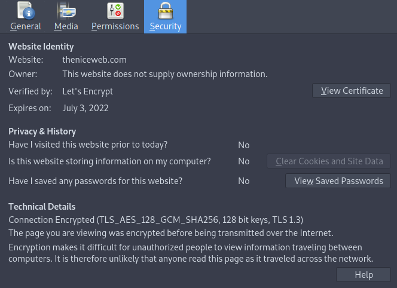
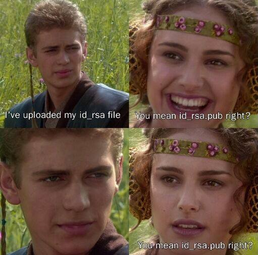

<style>
    /* You can add custom style here. VSCode supports this.
    Other editor might need these custom code in
    the YAML header: section: | */
	/* section header { display: none; } */
	/* section footer { display: none; } */
</style>

# Criptografía
<!-- _class: first-slide -->

**Tema 8: TLS y Public Key Infrastructure**

Juan Vera del Campo - <juan.vera@campusviu.es>


## Hoy hablamos de...
<!-- _class: cool-list -->

1. [Cifrado híbrido, protocolo TLS](#3)
1. [Gestión de claves públicas, PKI](#16)
1. [Resumen y referencias](#35)

## Recordatorio: cifrado asimétrico
<!-- _class: two-columns -->


- Todo el mundo tiene dos claves: pública y privada
- Lo que cifras con una lo puedes descifrar con la otra
- Confidencialidad: Alice cifra con la clave pública de Bob, Bob descifra con su clave privada
- Autenticación (firma): Alice cifra con su clave privada, cualquiera descifra con la clave pública de Alice

<!-- Recordatorio de cómo funciona el cifrado asimétrico:

- Todo el mundo tiene dos claves:
    - una privada, que solo conoce la persona
    - una pública, que se asume que cualquier persona puede conocer
- A partir de la pública no se puede sacar la privada. Cuidado: quizá necesites un algoritmo ligeramente diferente.
- Lo que cifras con una lo puedes descifrar con la otra
- Envío con confidencialidad: cifra la información con la clave pública de la otra persona
    - Solo la otra persona puede descifrarla, porque solo ella tiene la clave privada
- Pero también funciona al revés: una persona  puede cifrar un mensaje con su clave privada y lanzarlo al mundo
    - Cualquier persona pueda descifrar el mensaje, ya que solo se necesita la clave pública de quien cifró. Es decir, este esquema NO OFRECE CONFIDENCIALIDAD
    - PERO: dado que el mensaje podemos descifrarlo con una clave pública específica, sabemos que solo la persona que tenga la clave privada podría haber enviado ese mensaje: estamos acercándonos a la **autenticidad**: probar quién ha enviado un mensaje
-->

## Problemas cifrado asimétrico


- Solo cifran números enteros con una longitud igual a la clave. Ej: 4096 bits
- Muy lento comparado con el cifrado simétrico
- ¿Cómo distribuimos las claves públicas?

Hoy veremos las soluciones para estos problemas: cifrado híbrido y certificados

# Criptografía híbrida
<!-- _class: lead -->

O cómo combinar los ladrillos que hemos visto para construir protocolos

## Definición

* La criptografía simétrica permite cifrar **muy rápidamente**
* Los hashes permiten calcular resúmenes **muy rápidamente**
* La criptografía asimétrica permite cifrar cosas sin tener que intercambiar una clave privada... **pero es lenta**
* [Criptografía híbrida](https://es.wikipedia.org/wiki/Criptograf%C3%ADa_h%C3%ADbrida)
    - **Cifrado híbrido**: enviamos clave simétrica cifrado con clave pública
    - **Firma digital**: ciframos hash con clave privada

## Firma digital: proceso


* Los algoritmos como RSA solo cifran **números enteros** de una longitud igual a la clave. Por ejemplo, 4096 bits.
* Alice podría dividir el documento en bloques de 4096b, pero eso no es eficiente
* Solución: **hash cifrado con la clave privada**
    - Alice calcula el hash de su documento de 10MB. El hash tiene 512 bytes
    - Alice cifra el hash con su clave privada
    - Cualquiera persona (eso incluye a Bob) puede conocer la clave pública de Alice y descifrar el hash
    - Si se encuentra un documento con un hash firmado por una clave pública, cualquier persona puede verificar que el autor del documento es el poseedor de la clave privada.

> https://cryptobook.nakov.com/digital-signatures/rsa-signatures

---
<!-- _class: with-success -->

Cifrando **el hash de un mensaje** con nuestra clave privada, aseguramos que ese mensaje lo hemos enviado nosotros y cualquier puede verificarlo


Firma digital de un mensaje = cifrado del hash de un mensaje con mi clave privada

## Protocolo Diffie-Hellman, autenticado
<!-- _class: smaller-font -->

Dos usuarios $Alice$ y $Bob$, cada uno tiene las claves públicas del otro

1. Acuerdan $g$ y $p$ primos entre sí
1. Escogen números en secreto $a$ y $b$
1. Se envían entre ellos:
    - $Alice \rightarrow Bob: A=g^{a} \mod p, sign(A, SK_A)$
    - $Bob \rightarrow Alice: B=g^{b} \mod p, sign(A, SK_B)$
1. Verifican la firma de cada lado
1. Calculan en secreto:
    - $Alice$: $s = B^{a} \mod p = g^{ab} \mod p$
    - $Bob$: $s = A^{b} \mod p = g^{ab} \mod p$
1. Y usan $s$ como clave de cifrado un algoritmo simétrico


<!--
Es decir: Alice y Bob firma los parámtros A y B y, si la firma verifica, Bob sabe que está hablando con Alice y al revés.
-->

## Cifrado híbrido: proceso

1. Alice y Bob negocian los parámetros de seguridad
1. Alice y Bob acuerdan una clave (**clave de sesión**) utilizando D-H autenticado con sus claves públicas
1. Luego usan esa clave para cifrar las comunicaciones AES
1. Periódicamente, renuevan la clave de sesión ejecutando de nuevo un D-H (**modo D-H efímero**)

Esto es el protocolo TLS (https)


---
<!-- _class: center -->


Protocolo negociado: TLS_ECDHE_RSA_WITH_AES_128_GCM_SHA256

<!--
- ECDEHE: Elliptic Curve Diffie-Hellman, ephimeral
- RSA: authentication
- AES_128_GCM: AES con claves de 128 bits en modo GCM. Este no lo hemos visto, añade un hash al cifrado.
- SHA256: algoritmo de hash usado por el modo GCM
-->

---
<!-- _class: center -->



Protocolo negociado: TLS_AES_128_GCM_SHA256

<!--
- TLS: la clave la decide el cliente, no hay D-H
- AES_128_GCM: AES con claves de 128 bits en modo GCM. Este no lo hemos visto, añade un hash al cifrado.
- SHA256: algoritmo de hash usado por el modo GCM
-->

## Qué sabemos hacer

- Sabemos enviar mensajes con confidencialidad: criptografía simétrica
    - [Tema 3](03-simetrica.html): AES, ChaCha20
- Sabemos acordar una clave con alguien a quien no conocíamos:
    - [Tema 4](05-asimetrica.html): Diffie-Hellman
- Sabemos firmar mensajes: hash y después cifrado con criptografía asimétrica
    - [Tema 5](05-asimetrica.html): RSA
    - [Tema 6](06-hashes.html): resumen de mensajes, hashes, firmas

    
---

Una conexión HTTPS / TLS no quiere decir "confía en mí". Quiere decir "es privada". Podrías estar recibiendo la llamada de Cthulhu, y que fuese privada.

- Scott Hanselman


> https://www.deviantart.com/karosu-maker/art/The-Call-of-Cthulhu-288397181
---
<!-- _class: center -->

<style scoped>
    p { font-size: 150%}
</style>

Hemos cambiado el problema de

**cómo compartir claves simétricas**

por el de

**cómo compartir claves públicas (asimétricas)**

# Gestión de claves públicas
<!-- _class: lead -->

Certificados electrónicos

## Ataque *man in the middle*


<!--
Durante un ataque man in the middle, un atacante se pone en medio de las comunicaciones. Cada una de las partes establece una conexión segura con el atacante: nadie de fuera sabe qué es está diciendo, pero no estamos hablando con quien queremos hablar.

El atacante dejará pasar la mayoría de las comunicaciones, solo está interesado en participar una vez, cambiando la cuenta bancaria en la que se realiza un pago.

Fíjate: no hemos decrito ningún protocolo que nos proteja ante este tipo de ataque!

- No hemos dado autenticación: no sabemos con quién estamos hablando
- No hemos dado integridad: un atacante podría cambiar el mensaje sin que nos enteremos

(aún así, en los protocolos descritos, es muy poco probable que el atacante pueda cambiar el contenido de un mensaje por otro CON SENTIDO. Pero algunos protocolos son muy sensibles al cambio: hashes, repeticiones...)
-->

## El problema de la confianza
<!-- _class: smaller-font -->

¿Cómo conseguimos la clave pública de los demás?

- **Sistema central de distribución**: base de datos de claves públicas compartida. Idea original de Diffie y Hellman el 1976
- **Gestión manual**: guardamos una lista de claves públicas. Ejemplo: SSH
- **Certificados**
    - PGP: gestión descentralizada (Web of trust)
    - PKI/X.509: gestión centralizada



## Gestión manual: SSH
<!-- _class: smaller-font -->

- El cliente guarda cifrada la clave privada y la lista de claves públicas de los servidores en que confía


- El servidor guarda en claro la clave privada (del servicio sshd) y las claves públicas de los usuarios
```
servidor$ /etc/ssh/ssh_host_rsa_key (...) 
servidor$ ~/.ssh/authorized_keys (...) 
```

Este esquema es muy utilizado por los administradores de sistemas

> https://jumpcloud.com/blog/how-to-manage-ssh-keys-linux

## Gestión con certificados
<!-- _class: with-success -->

Alice crea un archivo con su identidad y su clave pública

$$   
\{identidad_{Alice}, PK_{Alice}\}
$$


y para poder verificar la autenticidad **una tercera parte de confianza (TTP)** firma esta tupla:

$$
Certificado_{Alice} = \{identidad_{Alice}, PK_{Alice}, Sign(\{identidad_{Alice}, PK_{Alice}\}, SK_{TTP})
$$

Alice puede ahora distribuir su certificado, que incluye su identidad y clave pública $PK_{Alice}$ a todos los que confíen en esa TTP

<!--
La identidad de Alice pueden ser muchas cosas:

- Su nombre, DNI, dirección de correo electrónico...
- La URL de una página web, en el caso de servidores
-->

## Tercera parte de confianza

Ya no tenemos que conseguir la clave pública de toda Internet, solo la de la TTP

La TTP puede ser:

- una autoridad central: en una Infraestructura de Clave Pública (PKI)
- un "igual": en el modelo "web of trust" (como en PGP)


> PGP: Pretty Good Privacy
> PKI: Public Key Infrastructure


## PGP: Pretty Good Privacy

En PGP podemos firmar las claves de conocidos nosotros mismos si nos las han pasado de forma segura

...y ellos también pueden hacer lo mismo, permitiendo alzcanzar un paso más

Nota: PGP tiene una versión de libre distribución llamada GPG derivada de la rfc4880 (OpenPGP)

---


> Esto es un ejemplo de la interfaz de Mailvelope (GMail, comercial)

---


> Esto es un ejemplo de la interfaz de KGPG (Linux)

## PGP: grados de seguridad
<!-- _class: with-warning -->

Los amigos puedes avalar otros certificados

"*Confío totalmente en mis amigos, pero solo un poco en los amigos de mis amigos y aún menos en los amigos de los amigos de mis amigos*"

Cada eslabón (certificado) tiene una garantía de autenticidad <1

A partir de unos cuantos certificados el nivel de seguridad deja de ser aceptable

## Dónde conseguir claves públicas

- https://pgp.mit.edu/
- https://keys.openpgp.org/
- https://keyserver.pgp.com/vkd/GetWelcomeScreen.event


## Problema de PGP
<!-- _class: with-warning -->

- Muy útil para grupos pequeños: amigos, empresa, universidad...
- No escala bien a Internet

PGP / GPG aún se usa, pero no es universal


## Public Key Infrastructure

Idea: confiar en unas pocas TTPs (Trusted Third Party) que gestionen todos los certificados de Internet

Se llaman **Autoridades de Certificación / Certification Authorities (CAs)**

Las claves pública de estas CAs vienen con:

- En el sistema operativo Windows, Linux, OSX...
- En los navegadores de internet

## Cadena de confianza, intermediarios y raíces

Normalmente hay una "cadena de confianza" con varios eslabones


> https://es.wikipedia.org/wiki/Cadena_de_confianza

<!--
La clave privada de un TTP es muy delicada: se protege en grandes edificios con una enorme seguridad física, en PCs desconoctados de Internet y dentro de cajas fuertes.

Por eso los certificados de usuarios no suelen estar firmados por una TTP final (llamada "Root CA") sino por otras terceras partes intermedias con capacidad para firmas certificados de usuarios. El certificados de estos intermediarios sí que está firmado por la Autoridad raíz
-->

---


<!--
Esto es el ejemplo de una cadena de certificados de campus.viu.es, que aparece al pinchar "en el candado" de la barra de direcciones.

La transparencia está solo para ocupar el espacio, veremos los detalles durante la clase

Fíjate:

- Identidades del certificado de la web
- Certificados intermedios
- Certificado raíz
- Lista de revocación

Prueba también con otras páginas web
-->

## Jerarquía de Autoridades de Certificación

- CA raíz: sólo emite certificados para CA subordinadas y "revocaciones"
    - está activa en momentos puntuales (off-line)
    - en caso de compromiso no hay protocolo definido
- CA subordinada: emite certificados finalistas (usuarios, servidores)
    - está en línea constantemente, ya sea por red pública o privada
    - en caso de compromiso se sigue el procedimiento de revocación de CA

## Autoridades de certificación raíz

Instaladas con el sistema operativo o el navegador

En la imagen, Root CAs instaladas en mi Firefox


## Revocación

Los certificados tienen una validez limitada en el tiempo, pero es posible que su contenido deje de ser válido antes

Si esto pasa, hace falta comunicarlo a la RA (Autoridad de Registro) siguiendo los procedimientos que dictamine la Política de Certificación (o la Declaración de Prácticas de Certificación derivada)

## ¿Cómo sabemos si un certificado ha sido revocado?

- se publica una CRL: Certificate Revocation List
- se publica en un servidor OCSP

# Conclusiones
<!-- _class: lead -->

## Referencias

- Ejemplos de bases de datos de certificados:
    - [OpenPGPkeyserver](http://keys.gnupg.net/)
    - [debian.org Developers LDAP Search](https://db.debian.org/)
- [IZENPE sustituirá los certificados electrónicos afectados por "ROCA", la amenaza mundial a los chips de algunas tarjetas de identificación](https://www.euskadi.eus/gobierno-vasco/-/noticia/2017/izenpe-sustituira-los-certificados-electronicos-afectados-por-roca-la-amenaza-mundial-a-los-chips-de-algunas-tarjetas-de-identificacion/)
- [Diferencias entre firma digital, electronica, digitalizada y certificado digital. Autónomos y Pymes](https://www.youtube.com/watch?v=-_SARWc3ots)
- [Create your own Certificate Authority (CA) using OpenSSL](https://arminreiter.com/2022/01/create-your-own-certificate-authority-ca-using-openssl/)

---
<!-- _class: center -->

Anexo recomendable: [Criptografía ofensiva](A3-ofensiva.html)

Continúa en: [Protocolos](09-protocolos.html)
