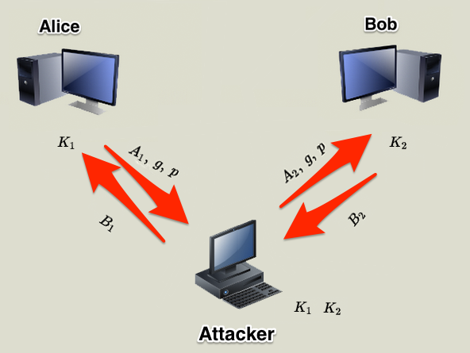

<style>
    /* You can add custom style here. VSCode supports this.
    Other editor might need these custom code in
    the YAML header: section: | */
	/* section header { display: none; } */
	/* section footer { display: none; } */
</style>

# TLS y Public Key Infrastructure
<!-- _class: first-slide -->

Juan Vera del Campo - <juan.vera@professor.universidadviu.com>


## Hoy hablamos de...
<!-- _class: cool-list toc -->

1. [Criptografía híbrida](#5)
1. [Gestión de claves públicas](#16)
1. [Resumen y referencias](#41)

## Recordatorio: cifrado asimétrico
<!-- _class: two-columns -->


- Todo el mundo tiene dos claves: pública y privada
- Lo que cifras con una lo puedes descifrar con la otra
- Confidencialidad: Alice cifra con la clave pública de Bob, Bob descifra con su clave privada
- Autenticación (firma): Alice cifra con su clave privada, cualquiera descifra con la clave pública de Alice

<!-- Recordatorio de cómo funciona el cifrado asimétrico:

- Todo el mundo tiene dos claves:
    - una privada, que solo conoce la persona
    - una pública, que se asume que cualquier persona puede conocer
- A partir de la pública no se puede sacar la privada. Cuidado: quizá necesites un algoritmo ligeramente diferente.
- Lo que cifras con una lo puedes descifrar con la otra
- Envío con confidencialidad: cifra la información con la clave pública de la otra persona
    - Solo la otra persona puede descifrarla, porque solo ella tiene la clave privada
- Pero también funciona al revés: una persona  puede cifrar un mensaje con su clave privada y lanzarlo al mundo
    - Cualquier persona pueda descifrar el mensaje, ya que solo se necesita la clave pública de quien cifró. Es decir, este esquema NO OFRECE CONFIDENCIALIDAD
    - PERO: dado que el mensaje podemos descifrarlo con una clave pública específica, sabemos que solo la persona que tenga la clave privada podría haber enviado ese mensaje: estamos acercándonos a la **autenticidad**: probar quién ha enviado un mensaje
-->

## Problemas cifrado asimétrico


- Solo cifran números enteros con una longitud igual a la clave. Ej: 4096 bits
- Muy lento comparado con el cifrado simétrico
- ¿Cómo distribuimos las claves públicas?

Hoy veremos las soluciones para estos problemas: cifrado híbrido y certificados

# Criptografía híbrida
<!-- _class: lead -->

O cómo combinar los ladrillos que ya hemos visto para construir protocolos

## Definición

- La criptografía simétrica permite cifrar **muy rápidamente**
- Los hashes permiten calcular resúmenes **muy rápidamente**
- La criptografía asimétrica permite cifrar cosas sin tener que intercambiar una clave privada... **pero es lenta**
- [Criptografía híbrida](https://es.wikipedia.org/wiki/Criptograf%C3%ADa_h%C3%ADbrida)
    - **Cifrado híbrido**: enviamos clave simétrica cifrado con la clave pública
        - Ejemplo 1: D-H y después ciframos con AES
        - Ejemplo 2: ciframos la clave AES con RSA con la clave pública del receptor.
    - **Firma digital**: calculamos el hash de un mensaje y lo ciframos con nuestra clave privada RSA

## Firma digital: proceso


- Los algoritmos como RSA solo cifran **números enteros** de una longitud igual a la clave. Por ejemplo, 4096 bits.
- Alice podría dividir el documento en bloques de 4096b, pero eso no es eficiente
- Solución: **hash cifrado con la clave privada**
    1. Alice calcula el hash de su documento de 10MB. El hash tiene 512 bytes
    1. Alice cifra el hash con su clave privada
    1. Cualquiera persona (eso incluye a Bob) puede conocer la clave pública de Alice y descifrar el hash
    1. Si se encuentra un documento con un hash firmado por una clave pública, cualquier persona puede verificar que el autor del documento es el poseedor de la clave privada.

> https://cryptobook.nakov.com/digital-signatures/rsa-signatures

---
<!-- _class: with-success -->

Cifrando **el hash de un mensaje** con nuestra clave privada, aseguramos que ese mensaje lo hemos enviado nosotros y cualquier puede verificarlo


Firma digital de un mensaje = cifrado del hash de un mensaje con mi clave privada

## Protocolo Diffie-Hellman, autenticado
<!-- _class: smaller-font -->

Igual que el D-H que ya conocemos pero firmando los mensajes:

1. Alice y Bob tienen un par de claves RSA $(PK_A, SK_A)$ y $(PK_B, SK_B)$,  y se intercambian $PK_A$ y $PK_B$
1. *Alice* y *Bob* acuerdan $g$ y $p$ primos entre sí
1. Alice escoge $a$ y Bob escoge $b$ (en secreto)
1. Se envían entre ellos mensajes firmados digitalmente:
    - $Alice \rightarrow Bob: A=g^{a} \mod p, sign_A=E(A, SK_A)$
    - $Bob \rightarrow Alice: B=g^{b} \mod p, sign_B=E(B, SK_B)$
1. Verifican la firma de cada lado:
    - Alice verifica que $B \equiv D(sign_B, PK_B)$
    - Bob verifica que $A \equiv D(sign_A, PK_A)$
    
1. Calculan en secreto:
    - $Alice$: $s = B^{a} \mod p = g^{ab} \mod p$
    - $Bob$: $s = A^{b} \mod p = g^{ab} \mod p$
1. Y usan $s$ como clave de cifrado un algoritmo simétrico

> [Authentication and Authenticated Key Exchanges](https://citeseerx.ist.psu.edu/viewdoc/summary?doi=10.1.1.59.6682), Whitfield Diffie and Paul C. Van Oorschot and Michael J. Wiener, 1992.


<!--
En el paso 2, recuerda que, en la realidad, Alice y Bob no usarán g y p cualquiera sino números conocidos que están en los estándares actuales y que sabemos que funcionan correctamente

Es decir: Alice y Bob firma los parámtros A y B y, si la firma verifica, Bob sabe que está hablando con Alice y al revés.

Por supuesto, esto mismo se puede hacer con Diffie-Hellman sobre curvas elípticas

-->

## Cifrado híbrido: HTTPS

1. Alice y Bob negocian los parámetros de seguridad
1. Alice y Bob acuerdan una clave (**clave de sesión**) utilizando D-H autenticado con sus claves públicas
1. Luego usan esa clave para cifrar las comunicaciones AES
1. Periódicamente, renuevan la clave de sesión ejecutando de nuevo un D-H (**modo D-H efímero**)

Esto es el [protocolo TLS](A2-protocolos.html)


## Ejemplo configuración TLS (1)
<!-- _class: center two-columns -->


- ECDHE: Elliptic Curve Diffie-Hellman, ephimeral
- RSA: authentication usando RSA
- AES_128_GCM: AES con claves de 128 bits en modo GCM
- SHA256: algoritmo de hash usado

## Ejemplo configuración TLS (2)
<!-- _class: two-columns -->


- TLS: la clave la decide el servidor y la envía cifrada con RSA, no hay D-H
- AES_128_GCM: AES con claves de 128 bits en modo GCM
- SHA256: algoritmo de hash usado

## Qué sabemos hacer

- Sabemos enviar mensajes con confidencialidad: criptografía simétrica
    - AES, ChaCha20
- Para ello, necesitamos una clave simétrica compartida, y sabemos acordarla con alguien a quien no conocíamos previamente:
    - Elliptic Curves Diffie-Hellman (ECDH)
-  Para ello, necesitamos autenticar a la otra persona: obtenemos su clave pública y le pedimos que cifre algo con su clave privada
    - Authenticated ECDH
- HTTPS / TLS se encarga de gestionar hacer todo esto
    
---

Una conexión HTTPS / TLS no quiere decir "confía en mí". Quiere decir "nadie más puede acceder". Podrías estar recibiendo la llamada de un atacante, y que fuese privada.

- Scott Hanselman


---
<!-- _class: center -->

<style scoped>
    p { font-size: 150%}
</style>

Hemos cambiado el problema de

**cómo compartir claves simétricas**

por el de

**cómo compartir claves públicas (asimétricas)**

# Gestión de claves públicas
<!-- _class: lead -->

Certificados electrónicos

## Ataque *man in the middle*



<!--
Durante un ataque man in the middle, un atacante se pone en medio de las comunicaciones. Cada una de las partes establece una conexión segura con el atacante: nadie de fuera sabe qué es está diciendo, pero no estamos hablando con quien queremos hablar.

El atacante dejará pasar la mayoría de las comunicaciones, solo está interesado en participar una vez, cambiando la cuenta bancaria en la que se realiza un pago.

Fíjate: no hemos decrito ningún protocolo que nos proteja ante este tipo de ataque!

- No hemos dado autenticación: no sabemos con quién estamos hablando
- No hemos dado integridad: un atacante podría cambiar el mensaje sin que nos enteremos

(aún así, en los protocolos descritos, es muy poco probable que el atacante pueda cambiar el contenido de un mensaje por otro CON SENTIDO. Pero algunos protocolos son muy sensibles al cambio: hashes, repeticiones...)
-->

## El problema de la confianza
<!-- _class: smaller-font -->

¿Cómo conseguimos la clave pública de los demás?

- **Sistema central de distribución**: base de datos de **todas** las claves públicas necesarias.
    - Idea original de Diffie y Hellman el 1976
    - No es práctica en la actualidad
- **Gestión manual**: guardamos una lista de claves públicas. Ejemplo: SSH
- **Certificados**
    - PGP: gestión descentralizada ([*web of trust*](https://en.wikipedia.org/wiki/Web_of_trust))
    - PKI/X.509: gestión centralizada


## Gestión manual: SSH
<!-- _class: smallest-font -->

- El cliente genera un par de claves pública/privda. Puede generar tantas como quiera
- El cliente guarda cifrada la clave privada y la lista de claves públicas de los servidores en que confía


- El servidor guarda en claro la clave privada (del servicio sshd) y las claves públicas de los usuarios
```
servidor$ /etc/ssh/ssh_host_rsa_key (...) 
servidor$ ~/.ssh/authorized_keys (...) 
```

Este esquema es muy utilizado por los administradores de sistemas

> https://jumpcloud.com/blog/how-to-manage-ssh-keys-linux

---

```bash
juanvi@debian:~/.ssh$ ls
juanvi@debian:~/.ssh$ ssh-keygen -f clave1 -t rsa
Generating public/private rsa key pair.
Enter passphrase (empty for no passphrase): 
Enter same passphrase again: 
Your identification has been saved in clave1
Your public key has been saved in clave1.pub
The key fingerprint is:
SHA256:0tj5sJj1Iv6hqbgESj3DcoxONkWVxIg+3Wnyb5ucoRg juanvi@debian
The key's randomart image is:
+---[RSA 3072]----+
|  ..=o.          |
| ... o           |
|. ... .          |
| o*o + + .       |
|.B.B+ o S        |
|*.+ o. = =       |
|...E  =.+ o      |
| . .o.o*+o       |
|  oo.o=*o        |
+----[SHA256]-----+
juanvi@debian:~/.ssh$ ls -l
total 8
-rw------- 1 juanvi juanvi 2602 Apr 18 17:00 clave1
-rw-r--r-- 1 juanvi juanvi  567 Apr 18 17:00 clave1.pub
juanvi@debian:~/.ssh$ ssh-copy-id -i clave1 user@server.com
juanvi@debian:~/.ssh$ ssh -i clave1 user@server.com
```

<!--
El penúltimo paso pedirá la contraseña del usuario en server.com

También se podría añadir manualmente la clave1.pub al final del archivo ~/.ssh/authorized_keys en server.com

Se puede configurar ssh (archivo: ~/.ssh/config) para que siempre que se acceda a server.com, se utilice un usuario y una clave determinada
-->

---


## Gestión con certificados
<!-- _class: with-success -->

Alice crea un archivo con su identidad y su clave pública

$$   
\{identidad_{Alice}, PK_{Alice}\}
$$

Identidad de Alice: nombre, dirección de correo, URL del servidor HTTP...

**Una tercera parte de confianza (TTP)** firma esta tupla:

$$
Certificado_{Alice} = \{identidad_{Alice}, PK_{Alice}, Sign(\{identidad_{Alice}, PK_{Alice}\}, SK_{TTP})
$$

Alice puede ahora distribuir su certificado, que incluye su identidad y clave pública $PK_{Alice}$ a todos los que confíen en esa TTP


<!--
La identidad de Alice pueden ser muchas cosas:

- Su nombre, DNI, dirección de correo electrónico...
- La URL de una página web, en el caso de servidores
-->

## TTP: Tercera parte de confianza

Ya no tenemos que conseguir la clave pública de cualquier persona, solo la de la TTP (*Trusted Third Party*) y verificar que las claves públicas de los certificados que nos presenten estén firmadas por la TTP

La TTP puede ser:

- un "igual": en el modelo "*web of trust*" (PGP)
- una autoridad central: en una Infraestructura de Clave Pública (PKI)


<!--

- PGP: Pretty Good Privacy
- PKI: Public Key Infrastructure

-->

## PGP: Pretty Good Privacy

En PGP podemos firmar las claves de conocidos nosotros mismos si nos las han pasado de forma segura

...y ellos también pueden hacer lo mismo, permitiendo alzcanzar un paso más

Nota: PGP tiene una versión de libre distribución llamada GPG derivada de la rfc4880 (OpenPGP)

---


Esto es un ejemplo de la interfaz de Mailvelope (GMail, comercial)

---


Esto es un ejemplo de la interfaz de KGPG (Linux)

## PGP: grados de seguridad
<!-- _class: with-warning -->

Los amigos puedes avalar otros certificados

"*Confío totalmente en mis amigos, pero solo un poco en los amigos de mis amigos y aún menos en los amigos de los amigos de mis amigos*"

Cada eslabón (certificado) tiene una garantía de autenticidad <1

A partir de unos cuantos certificados el nivel de seguridad deja de ser aceptable

## Dónde conseguir claves públicas

- https://pgp.mit.edu/
- https://keys.openpgp.org/
- https://keyserver.pgp.com/vkd/GetWelcomeScreen.event


## Problema de PGP
<!-- _class: with-warning -->

- PGP / GPG aún se usa en entornos corporativos que pueden gestinar todas las claves públicas de sus empleados
- No escala bien a Internet


## PKI: Public Key Infrastructure
<!-- _class: with-warning -->

Idea: confiar en unas pocas TTPs que gestionen todos los certificados de Internet

En PKI, las TTPs se llaman **Autoridades de Certificación / *Certification Authorities* (CAs)**

Las claves pública de estas CAs vienen integradas (compruébalo):

- En el sistema operativo Windows, Linux, OSX...
- En los navegadores de internet

Instalar una nueva CA en un PC es un proceso excepcional

<!--
Las empresas sí que instalan CAs personalizadas en los PCs de los usuarios

Por ejemplo, la CA del proxy/firewall de la empresa, para poder descifrar las comunicaciones de los empleados
-->

## Certificados X.509

[Estándar internacional](https://www.itu.int/rec/T-REC-X.509) que siguen los certificados de la PKI. Elementos:

- Certificado:
    - Versión, número de serio, ID de algoritmos...
    - Nombre de la persona que lo emite (*issuer*): autoridad de confianza
    - Periodo de validez: desde una fecha hasta una fecha
    - Nombre del identidad (*subject*)
    - Clave pública de la identidad
    - Extensiones opcionales. Ejemplos: usos válidos de la clave, nombres alternativos de la identidad (usado para dominios de internet)
- Firma digital del certificado por la autoridad de confianza

---

```
Certificate:
   Data:
       Version: 3 (0x2)
       Serial Number:
           10:e6:fc:62:b7:41:8a:d5:00:5e:45:b6
       Signature Algorithm: sha256WithRSAEncryption
       Issuer: C=BE, O=GlobalSign nv-sa, CN=GlobalSign Organization Validation CA - SHA256 - G2
       Validity
           Not Before: Nov 21 08:00:00 2016 GMT
           Not After : Nov 22 07:59:59 2017 GMT
       Subject: C=US, ST=California, L=San Francisco, O=Wikimedia Foundation, Inc., CN=*.wikipedia.org
       Subject Public Key Info:
           Public Key Algorithm: id-ecPublicKey
               Public-Key: (256 bit)
           pub: 
                   00:c9:22:69:31:8a:d6:6c:ea:da:c3:7f:2c:ac:a5:
                   af:c0:02:ea:81:cb:65:b9:fd:0c:6d:46:5b:c9:1e:
                   9d:3b:ef
               ASN1 OID: prime256v1
               NIST CURVE: P-256
(sigue en la página siguiente)
```

---

```
Certificate: (continúa de la página anterior)
       X509v3 extensions:
           X509v3 Key Usage: critical
               Digital Signature, Key Agreement
           Authority Information Access: 
               CA Issuers - URI:http://secure.globalsign.com/cacert/gsorganizationvalsha2g2r1.crt
               OCSP - URI:http://ocsp2.globalsign.com/gsorganizationvalsha2g2
           X509v3 Certificate Policies: 
               Policy: 1.3.6.1.4.1.4146.1.20
                 CPS: https://www.globalsign.com/repository/
               Policy: 2.23.140.1.2.2
           X509v3 Basic Constraints: 
               CA:FALSE
           X509v3 CRL Distribution Points: 
               Full Name:
                 URI:http://crl.globalsign.com/gs/gsorganizationvalsha2g2.crl
           X509v3 Subject Alternative Name: 
               DNS:*.wikipedia.org, DNS:*.m.mediawiki.org ...
           X509v3 Extended Key Usage: 
               TLS Web Server Authentication, TLS Web Client Authentication
           X509v3 Subject Key Identifier: 
               28:2A:26:2A:57:8B:3B:CE:B4:D6:AB:54:EF:D7:38:21:2C:49:5C:36
           X509v3 Authority Key Identifier: 
               keyid:96:DE:61:F1:BD:1C:16:29:53:1C:C0:CC:7D:3B:83:00:40:E6:1A:7C

   Signature Algorithm: sha256WithRSAEncryption
        8b:c3:ed:d1:9d:39:6f:af:40:72:bd:1e:18:5e:30:54:23:35:
        ...

```

## Cadena de confianza, intermediarios y raíces

Normalmente hay una "cadena de confianza" con varios eslabones


> https://es.wikipedia.org/wiki/Cadena_de_confianza

<!--
La clave privada de una TTP es muy delicada: se protege en grandes edificios con una enorme seguridad física, en PCs desconectados de Internet y dentro de cajas fuertes.

Por eso los certificados de usuarios no suelen estar firmados por una TTP final (llamada "Root CA") sino por otras terceras partes intermedias con capacidad para firmas certificados de usuarios. El certificados de estos intermediarios sí que está firmado por la Autoridad raíz
-->

---

```
openssl s_client -showcerts -connect localhost:5000 < /dev/null    2> /dev/null | openssl x509 -noout -text
```


<!--
Esto es el ejemplo de una cadena de certificados de campus.viu.es, que aparece al pinchar "en el candado" de la barra de direcciones.

La transparencia está solo para ocupar el espacio, veremos los detalles durante la clase

Fíjate:

- Identidades del certificado de la web
- Certificados intermedios
- Certificado raíz
- Lista de revocación

Prueba también con otras páginas web
-->

## Jerarquía de Autoridades de Certificación

- CA raíz: sólo emite certificados para CA subordinadas y "revocaciones"
    - está activa en momentos puntuales (*off-line)*
    - en caso de compromiso no hay protocolo definido
- CA subordinada: emite certificados finalistas (usuarios, servidores)
    - está en línea constantemente, ya sea por red pública o privada
    - en caso de compromiso se sigue el procedimiento de revocación de CA

## Autoridades de certificación raíz

Instaladas con el sistema operativo o el navegador

En la imagen, Root CAs instaladas en mi Firefox


## Revocación

Los certificados tienen una validez limitada en el tiempo, pero es posible que su contenido deje de ser válido antes:

- Compromiso, o incluso sospecha de compromiso de la clave privada
- Baja de la persona

Si esto pasa, hace falta comunicarlo a la CA siguiendo sus procedimientos específicos

## ¿Cómo sabemos si un certificado ha sido revocado?

La CA se encarga de:

- Publicar en su web una CRL: *Certificate Revocation List*
- Habilitar un servicio especial llamado OCSP al que se le puede preguntar si un certificado aún es válido

Es tu responsabilidad comprobar si los certificados son válidos

## Revocación de autoridades de certificación
<!-- _class: with-info -->

Ocasionalmente, incluso las autoridades de certificación tienen que recovarse

Upcoming change in Chrome 127 and higher: TLS server authentication
certificates validating to the following Entrust roots whose earliest Signed
Certificate Timestamp (SCT) is dated after October 31, 2024, will no longer be
trusted by default.


> https://security.googleblog.com/2024/06/sustaining-digital-certificate-security.html

<!--
En ocasiones es necesario dejar de confiar en las terceras parte de confianza. Por ejemplo, Julio de 2024:
Google anuncia que dejará de considerar a Entrust como tercera parte de confianza, y no aceptará certificados firmados por Entrust

Los motivos:

Over the past several years, publicly disclosed incident reports highlighted a pattern of concerning behaviors by Entrust that fall short of the above expectations, and has eroded confidence in their competence, reliability, and integrity as a publicly-trusted CA Owner.

> incidentes relacionados con entrust: https://bugzilla.mozilla.org/buglist.cgi?o2=greaterthaneq&short_desc_type=casesubstring&o1=notequals&v1=Graveyard&classification=Client%20Software&classification=Developer%20Infrastructure&classification=Components&classification=Server%20Software&classification=Other&classification=Graveyard&v2=2015-11-01&f1=classification&bug_status=UNCONFIRMED&bug_status=NEW&bug_status=ASSIGNED&bug_status=REOPENED&bug_status=RESOLVED&bug_status=VERIFIED&bug_status=CLOSED&short_desc=Entrust&f2=creation_ts&component=CA%20Certificate%20Compliance&query_format=advanced&list_id=17064895

-->

# Resumen y referencias
<!-- _class: lead -->

## Resumen

- Hemos reducido el problema de la seguridad en un problema de gestión de claves públicas
- Tres soluciones:
  - SSH: claves públicas gestinadas manualmente
  - PGP: claves públicas proporcionadas por amigos
  - PKI (certificados): claves públicas proporcionadas por terceras partes de confianza y firmadas digitalmente
- TLS / HTTPS:
  - Primera parte: negocia la seguridad de un servidor con una clave pública y PKI
  - Opcional: clave simétrica calculada con D-H
  - Tras la negociación, cifrado simétrico

## Referencias

- Ejemplos de bases de datos de certificados:
    - [OpenPGPkeyserver](http://keys.gnupg.net/)
    - [debian.org Developers LDAP Search](https://db.debian.org/)
- [Diferencias entre firma digital, electronica, digitalizada y certificado digital. Autónomos y Pymes](https://www.youtube.com/watch?v=-_SARWc3ots)
- [Create your own Certificate Authority (CA) using OpenSSL](https://arminreiter.com/2022/01/create-your-own-certificate-authority-ca-using-openssl/)

---
<!-- _class: center -->

Anexo recomendado: [Protocolo TLS](A2-protocolos.html)

Continúa en: [Autenticación](05-autenticacion.html)

# ¡Gracias!
<!-- _class: last-slide -->
