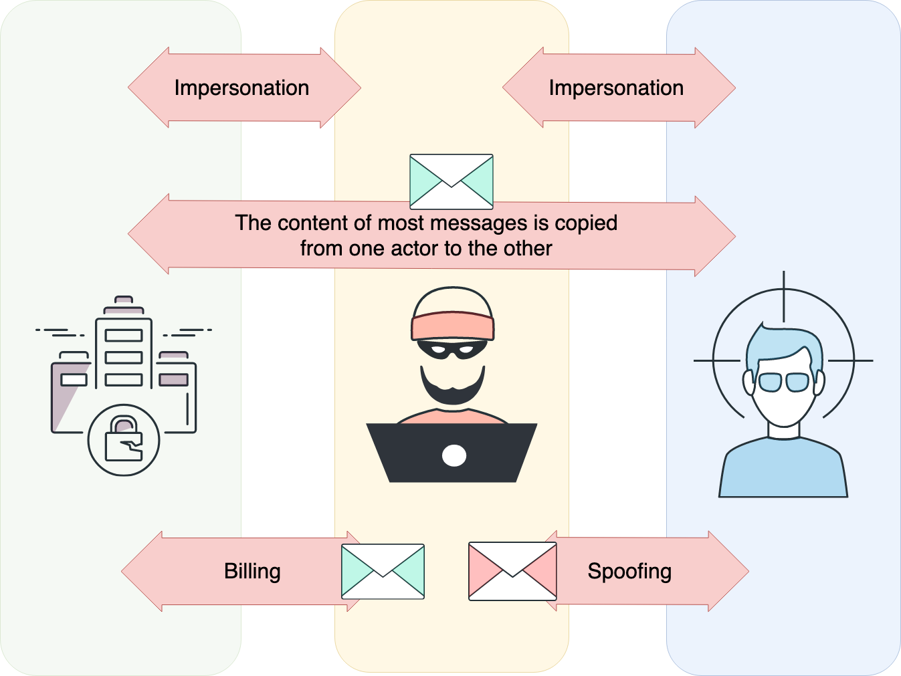
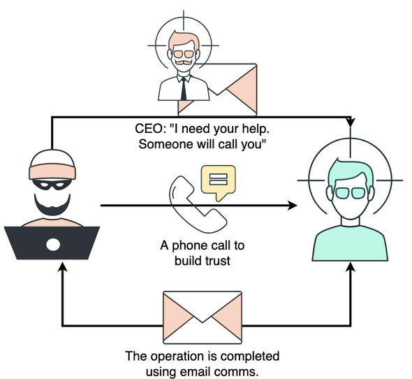
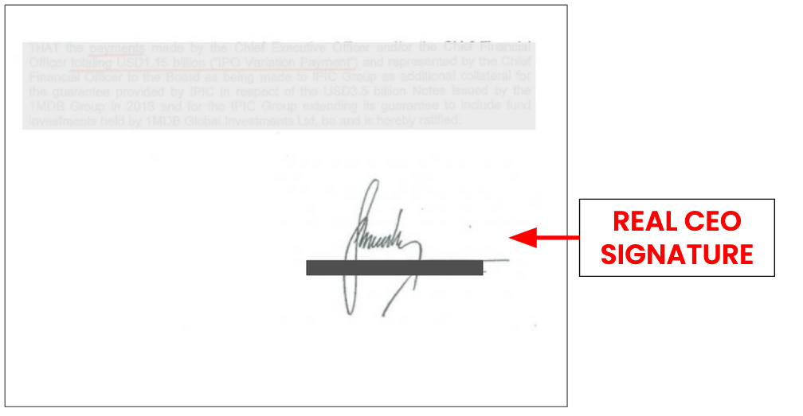
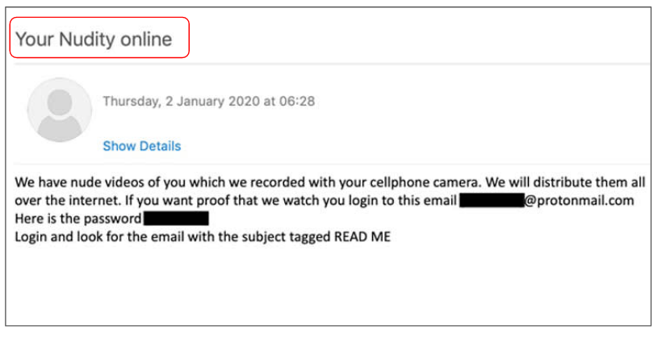
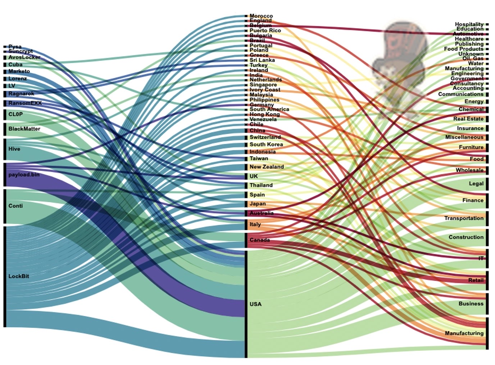
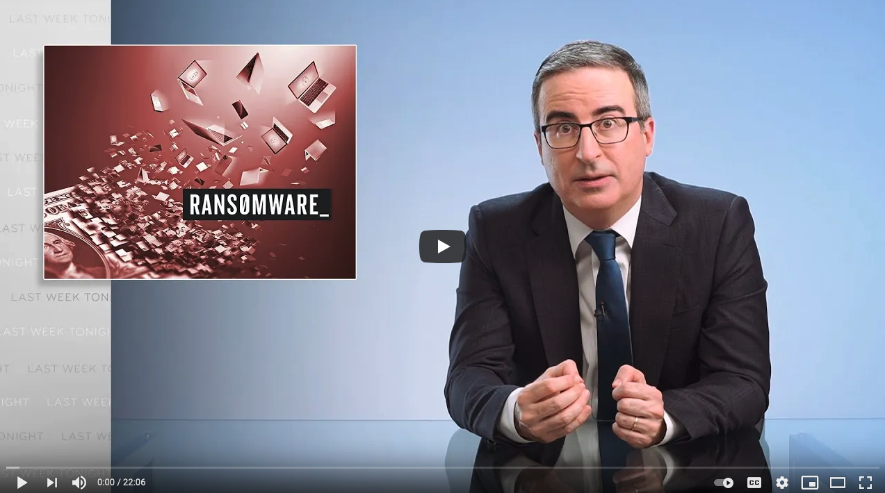

<style>
    /* You can add custom style here. VSCode supports this.
    Other editor might need these custom code in
    the YAML header: section: | */
	/* section header { display: none; } */
	/* section footer { display: none; } */
</style>

# Criptografía como amenaza
<!-- _class: first-slide -->

Juan Vera del Campo

<juan.vera@campusviu.es>


# Como decíamos ayer...

- Podemos ofrecer confidencialidad con cifrado simétrico: [tema 3](03-simetrica.html)
- Podemos ofrecer autenticidad y no repudio con cifrado asimétrico [tema 5](05-asimetrica.html) y distribución de claves públicas [tema 8](08-pki.html)
- Podemos ofrecer integridad con la firma electrónica: [tema 6](06-hashes.html)  y distribución de claves públicas: [tema 8](08-pki.html)
    - Recuerda: firma = cifrado asimétrico del hash de un mensaje

# Hoy hablamos de...
<!-- _class: cool-list with-warning -->

Cómo se usa la criptografía para atacar, y seguiremos explorando conceptos de firma electrónica y usos de cada tipo de criptografía simétrica y asimétrica

1. [Business Email Compromise (BEC)](#4)
1. [Ransomware](#45)

OBSERVA: estos dos ataques son los principales ataques contra los sistemas de una empresa en la actualidad

Las transparencias de esta sesión están en inglés

# Business Email Compromise (BEC)
<!-- _class: lead -->

---
<!-- _class: a-story -->


- You work for the finance department of a big company (100MM EUR)
- Your work involves transferring large amounts of money
- One day, you receive a phone call from a lawyer

> Note: background stock images from pexels: https://www.pexels.com/

---
<!-- _class: a-story -->


- You can google her name, she is involved in HUGE international operations
- She knows what she is talking about
- "Your company is in the middle of an important and confidential operation. We need your help. The CEO will contact you, please check the email"

---
<!-- _class: a-story -->


Dear employeer,

We are in the middle of a very important finantial operation to acquire one of our competitors. It is of the upmost importance that this operation remains confidential until it can be safely announced.

I will be busy with the details. Please, get in touch with the important lawyer (in copy of this email). Keep me in the email chain.

I hope you undestand the confidentiality and urgency of this operation.

Your boss

---
<!-- _class: a-story -->


- The important lawyer sends you a document, which includes a transfer order for 4M€
* The order is signed by your boss
* You transfer the money
* ...
* A couple of days later, your boss calls you about a unplanned money transfer you made to some unregistered location 

---

Do you believe you would never fall for this?

* ['CEO Spoofing' costs drug company $50 million](https://www.fox9.com/news/ceo-spoofing-costs-drug-company-50-million), 2015
* [Hackers siphon $47 million out of tech company's accounts](https://www.fox9.com/news/ceo-spoofing-costs-drug-company-50-million), 2015
* [Unusual CEO Fraud via Deepfake Audio Steals US$243,000 From UK Company](https://www.trendmicro.com/vinfo/us/security/news/cyber-attacks/unusual-ceo-fraud-via-deepfake-audio-steals-us-243-000-from-u-k-company), 2019
* [Un mail, una llamada y 4 millones robados a la EMT de València que volaron a Hong Kong: así fue el 'fraude del CEO' más salvaje de España ](https://www.eldiario.es/comunitat-valenciana/llamada-fabulosa-millones-emt-valencia_1_1243386.html), 2019
* [Social engineering. CEO fraud of 9 million euros in the phishing scam to the biopharmaceutical company Zendal](https://kymatio.com/en/social-engineering-ceo-fraud-of-9-million-euros-in-the-phishing-scam-to-the-biopharmaceutical-company-zendal/), 2020.
* Most of them are covered up by the companies and never hit the news

---


> https://fr.wikipedia.org/wiki/Gilbert_Chikli
> https://www.dw.com/en/france-fraudsters-sentenced-over-bizarre-impersonation-scam/a-52729296
> https://mashable.com/article/gilbert-chikli-scam

<!--
Gilbert Chickli is an international cyberattacker specialized in this kind of scam. He has a huge team and he was able to steal millions of euros. His method is still in use today.

There is movie about his life: Je Compte sur Vous
-->

# Types of Business Email Compromise (BEC)
<!-- _class: lead -->

---

- Scam targeting companies who conduct wire transfers and have suppliers abroad
- Corporate or publicly available email accounts of employees related to finance are either spoofed or compromised
- BEC attackers rely heavily on social engineering tactics: attackers carefully research and closely monitor their potential target victims and their organizations
- Often, they impersonate CEO or any executive authorized to do wire transfers.  In addition, fraudsters also 
- Some of the sample email messages have subjects containing words such as request, payment, transfer, and urgent, among others

> https://www.trendmicro.com/vinfo/us/security/definition/business-email-compromise-(bec)

---

- **The Bogus Invoice Scheme**: attackers pretend to be the suppliers requesting fund transfers for payments to an account owned by fraudsters
- **CEO Fraud**: Attackers pose as the company CEO or any executive and send an email to employees in finance, requesting them to transfer money to the account they control
- **Account Compromise**: An executive or employee’s email account is hacked and used to request invoice payments to vendors listed in their email contacts
- **Attorney Impersonation**: Attackers pretend to be a lawyer or someone from the law firm supposedly in charge of crucial and confidential matters
- **Data Theft**: Employees under HR and book-keeping are targeted to obtain personally identifiable information (PII) or tax statements of employees and executives. Such data can be used for future attacks

## Mail in the middle


<!--
Impersonation example: man-in-the-middle

The attacker sends an email to both ends with similar addresses but not quite the same. The text is "send further communications to..." or the "reply-to address is changed. i.e


Objective: get an "email thread" where the other party is not involved

Beware: The attacker may impersonate several people: several accounts in CC, from several people...
-->

## BEC process

- The attacker impersonates a party sending a series of spoofed emails
    - Usually implies previous compromise to gain intelligence
- The first email may be from a legitimate **address**
    - ... but not necessarily a legitimate **server** (check your email client warnings!)
- `Reply-to` is changed
- Addresses similar to real ones to distinguish themselves:
    - `worker@bigconnpany.com` instead of `worker@bigcompany.com`
    - `worker@bigcompany.us` instead of `worker@bigcompany.com`
    - `goodworker@bigcompany.com` instead of `good.worker@bigcompany.com`

<!--

Question: this only work in a very precise moment: near the end of the service, when billing is about to be exchanged and trust is already built between the two parties. How does the attacker now about the perfect moment?

- Infiltration
- Luck
- An insider
- Patient

The three possibilities are real

If the attacker infiltrates the infrastructure, ost probably, all real emails between the two parties are going to "disappear". Check for automatic mail rules!. Beware: the infiltrated infrastructure maybe the victim's infrastructure or the other end of the communication!
-->

---



<!--
Most communications are transparently passed fro on channel to the other: you won't find anything strange in the communication apart from the fake address

The attacker intervenes when billing information is exchanged: in this moment, he/she presents her/his bank account
-->

## CEO Fraud



<!--
This is another type of this fraud. In this case, all mails are fake. There is no need to compromise the infrastructure. Acting skills are required.
-->

---



## Some RED flags

The CEO needs something from me!

- "*I need help, fast and in confidence*"
- "*You’ll be contacted by an attorney/an important partner*"
- "*I can’t be contacted ATM*"

Some acting is usually involved. Someone might call you!

---


## Sextorsion



Beware: these fake extortions **MAY** include personal information collected from public sources!

# Investigating a BEC
<!-- _class: lead -->

## Something happened!

- The investigation usually starts with little knowledge: "I suspect we have been victim of fraud! The money just disappeared!" 
- You identify a probable BEC by running questions. Then, you review logs

---


## Objectives of the investigation

- When did the intrusion begin?
- How long did the threat actor maintain access? Is the actor still inside?
- Is there someone internal involved? 
- How to prevent future attacks?
- Insurance: did someone do something wrong?

> These are only an introduction for this presentation. Check: https://raw.githubusercontent.com/PwC-IR/Business-Email-Compromise-Guide/main/PwC-Business_Email_Compromise-Guide.pdf

---

[](https://www.youtube.com/watch?v=k0eECA2vwjQ)

## Opportunistic attacks

The attackers know exactly when to attack:

- The person they have to contact
- When the CEO is away the office and cannot be reached
- The precise moment they have to change bank accounts
- The involves parties

How did the attacker send the first email?

How did the attacker know it was the right moment?

## Control of the inbox

Email Collection : https://attack.mitre.org/techniques/T1114/

1. Identify accounts that could have been under the control of the attackers
1. Identify **dates**
1. **Any automatic rules: forward, move...**
1. **Authentication from strange places**
1. Is 2FA activated? Even with 2FA: is legacy authentication activated?


<!--
When an attacker access an account, he forwards emails to his own account. He is not interested only in past emails, also in future emails: when a deal is going to be closed, is there any additional email thread I must be aware...

Most of the times, they even hide this emails. His objective is that the victim won't receive any email from the other side, he is going to control all emails.
-->

## Where are the logs?

- On-premises: Exchange, dovecot...
- "In the cloud": Google Workspace, Microsoft 365... they usually have [audit logs](https://support.google.com/a/answer/4579579?hl=en) and [litigation modes](https://docs.microsoft.com/en-us/microsoft-365/compliance/create-a-litigation-hold?view=o365-worldwide). Warning: [they cost extra](https://workspace.google.com/pricing.html) and they must be activated BEFORE the incident


# Prevention
<!-- _class: lead -->

## Identifying inbox compromise

-  Forwarding rules are one of the most common tactics observed in BEC investigations.
-  Identifying suspicious login activity is useful for assessing initial access and lateral movement. 
-  Permission changes on existing or newly created accounts often indicate the threat  actor established persistence, and could indicate the scope of an investigation is wider than initially assessed. 
- Abusing OAuth applications or other vulnerabilities. 
- Assessing which emails or data has been accessed and/or exfiltrated is critical for  determining the impact on an organisation, including but not limited to financial losses, privacy implications and reputational damages. 
- Threat intelligence is an important part of the investigative process-
- BEC intrusions are typically opportunistic and attribution is difficult.

## External confirmation


- https://emailrep.io
- https://email-checker.net
- https://tools.emailhippo.com
- https://hunter.io/email-verifier
- https://trumail.io

## Threat intelligence

https://en.wikipedia.org/wiki/Cyber_threat_intelligence

- Learn about attacks before they happen
- Identify the registration of domains similar to your name: McDonals, ChinaExpor...
- Identify leaked passwords


<!--
BlueLiv is a company from Barcelona specialized in Threat Intelligence. If I'm not mistaken, they have open positions for students
-->


## Email forgery: PGP

Your contacts send their public keys to you manually. All communications from a contact must be signed using one of the accepted keys.

The perfect solution: sender signs the email, the receiver only accept emails from trusted parties


Bad news: PGP is rarely used in real life!

## Email forgery: SPF

Check in the DNS the sender IP is authorized to send emails from that server

i.e.: you authenticate the email <someone@gmail.com> was sent from a server authorized by GMail


> https://medium.com/@pendraggon87/short-primer-on-spf-dkim-and-dmarc-9827eb2f359d

## Email forgery: DomainKeys Identified Mail

The receiving **server** checks the digital signature of the sending **server**

Your server (not you!) authenticates the content received from the sending **server**, not the sending **user**!

i.e.: your email provider authenticates than an email sent from <someone@gmail.com> was not modified since it left `gmail.com`


> Fuente: https://dmarcian.es/what-is-dkim/
> RFC 6376: [DomainKeys Identified Mail (DKIM) Signatures](https://www.rfc-editor.org/info/rfc6376) September 2011

---

Received mails have an additional header:

```
DKIM-Signature: v=1; a=rsa-sha256; c=relaxed/relaxed;
        d=estudiantat-upc-edu.20210112.gappssmtp.com; s=20210112;
        h=mime-version:references:in-reply-to:from:date:message-id:subject:to;
        bh=26fwnGl79NZUquxVrOtlExhF4Sac4SXUDxQTOAjLuYw=;
        b=yRktraNE10cCr+kd55jE+x7RirvFdgPzkeuxDz257hQ1IjKnXOg2bFQmCZBkiqAeNr
         4HeHlNObsVbeQw9H9rDHUYw3FdhtRagIgsSz6alsxHRf8m7Uc/cprZ29dJTwP5GxHCud
         yZyPKSaSrA6nidFYorJEOa1UccbwIeSDAsVBi9E4C+OWzVIR+thcVK7QfLWJEEgbDRFa
         ZFlIsiZjvPFEuFTpxHFPSCZv3OhIbipPikI44q8BbHE++3YZZ/UpTHXe5r6DP90ROce9
         qB7M2f9CjFcAhvuM91A92v0Q2MHXpF5BDMcsYpWo7bOEOxOwXdGPWgw94HaTXZ96DJ0B
         /l2Q==
```

- `d`: domain: `estudiantat-upc-edu.20210112.gappssmtp.com`
- `s`: selector `20210112`
- `h`: headers fields: `mime-version`, `references`, `in-reply-to`, `from`, `date`, `message-id`, `subject`, `to`.
- `bh`: body **hash**
- `b`: **signature** of headers and body

## Verification process
<!-- _class: with-info -->

- Get the body content, run canocalization algorithm `c`, calculate the hash value (`bh`). Check.
- Concatenate the headers in `h` and the `dkim` header (removing `b` but not `bh`)
- Download the server's public key from DNS using `d` and `s`
- Check the signature

Of course, there are libraries for this

---

Digital signature:

```
> dig 20210112.estudiantat-upc-edu.20210112.gappssmtp.com TXT
...
;; ANSWER SECTION:
20210112.estudiantat-upc-edu.20210112.gappssmtp.com. 3600 IN TXT
"v=DKIM1; k=rsa;
p=MIIBIjANBgkqhkiG9w0BAQEFAAOCAQ8AMIIBCgKCAQEA8XlwdG7GKz3
E2ynrLRPzb3iP/vNCfrMdcN1Akhrj1Snu5pQi3gSnI6U5KWM56An4eC+c
+BHq5ujk9HEdk04HYRIT0CjW9fIqeFQmahOivtPBAN6oOg/VQ2Y2L5IE4
gHHjLOQzPXC4H5soG8PNWPK00NEQ5Y6lUGWubuMJnQtrVyHMCcDeXh0So
1n5DAgtO1U"
"vhyvZ82hrx7hhiMuTZ8yQ+f8AzxcjYL9x/+M7hmrUDnA8Np7j1/OU/wi
KWvsllKSFElGQpFd8VFYYvqt4sUAzqfkYqvWKLGXhWbpm1uY1ce1qSQiE
FMd7ycz754lMhc15lZfU3TdiGhQjgps+gQIwIDAQAB"
```

> https://www.dmarcanalyzer.com/dkim/dkim-checker/
> https://www.metaspike.com/leveraging-dkim-email-forensics/

## X-Google-DKIM: DomainKeys Identified Mail
<!-- _class: extra-slide -->

```
X-Google-DKIM-Signature: v=1; a=rsa-sha256; c=relaxed/relaxed;
        d=1e100.net; s=20161025;
        h=x-gm-message-state:mime-version:from:date:message-id:subject:to;
        bh=s7gErmNKwESPKSP6VW9kvRoEY/oQ8b6V1OFgRMqAjtU=;
        b=lB+wgPGej/d1HNLxj7oP1L9Mi56hwji5GA3hLrVYCRKohiAs3L7uI6fEq7sp7wBXKm
         9mOGnbIrSXMeOfOa/YnAnJg/4x6U5gvVtoisigFMR/bGxoPQRO6LUqvunBhR3il6f+OX
         ZRJIsZsvigsesD1vZcarlVr5D0QL2Cw2l1o1T6zVNH3Z8cmZNTCpfzmD3YmVCm+Cgdz9
         RQgX/iL12TxzzOmx+8yInGYnL9ZyaNY6Wsbi7LOBp7kRNLWrMKVtUlwuS2WSzQ5Jvwkm
         0SZ90S524hBquiF8WAzJI95AD/L5fr69sjaN/wM6pk8l6fTapm8+K6TsMPYrEhHtRFZ2
         vLYQ==
```

Google uses another DKIM signature that uses other headers. This is probably a signature to be used only inside Google. Still, it is a valid DKIM signature.

> https://mailarchive.ietf.org/arch/msg/apps-discuss/_blROpC5GpEPk96nBqKoNUaO5rg/

## Domain-based Message Authentication, Reporting & Conformance


- An email authentication, policy, and reporting protocol
- It **builds on the widely deployed SPF and DKIM protocols**
- With DMARC you can tell the world how to handle the unauthorized use of your email domains by instituting a policy in your DNS
    - `p=none`: monitors your email traffic. No further actions are taken.
    - `p=quarantine`: sends unauthorized emails to the spam folder.
    - `p=reject`: unauthorized email doesn’t get delivered at all.

> https://dmarc.org/

---


## The bad news...

- PGP is rarely used in real life... unfortunately
- Not all companies implement SPF or DKIM
- These mechanisms do not protect against an email sent from `macdonalds.com`: the attackers can configure SPF and DKIM too!
- These mechanisms only authenticate from the sending server to the receiving server!


<!--
- Los malos pueden configurar también sus servidores
- estos mecanismos no te protegerán contra direcciones "parecidas"
- SPF y DKIM solo autentican desde el servidor. ¿Quién estaba realmente escribiendo el mensaje?
    - Si el atacante ha conseguido crear cuentas: b0ss@company.com también pasará el DKIM de company.com
    - Si el atacante ha conseguido las credenciales de boss@company.com pasará el DKIM de company.com
-->

## Recommendations
<!-- _class: two-columns-list -->

<style scoped>
    ol { list-style-type: none;}
</style>

1. Admins:
    - Activate 2FA, disable legacy login
    - Activate mailbox auditing
    - Regularly, check rules
    - Train your users
1. Users:
    - Check the address of the other participant in the communication
    - Be careful if the address changes
    - Be careful if the language of the other participants change
    - Many email clients do alert when an address changes
    - Many email clients do alert if an Internet header is spoofed

## References

- [What is Business Email Compromise (BEC)? How Does it Work? ](https://www.tessian.com/blog/bec-business-email-compromise/), Tessian 2021
- [Business Email Compromise](https://www.fbi.gov/scams-and-safety/common-scams-and-crimes/business-email-compromise) FBI 
- [Business Email Compromise Guide for O365](https://github.com/PwC-IR/Business-Email-Compromise-Guide) - PwC 2021
- [Awesome-BEC: repository of information](https://github.com/randomaccess3/Awesome-BEC/blob/main/README.md)

# Ransomware
<!-- _class: lead -->

---

[](https://www.youtube.com/watch?v=6h9yh_A80fs)

> [Ransomware - Anatomy of an Attack](https://www.youtube.com/watch?v=6h9yh_A80fs) ESI & CISCO, 2018

---

- Malware that encrypts the victim's files, making them inaccessible, and demands a ransom payment to decrypt them
- recovering the files without the decryption key is an intractable problem
- difficult to trace digital currencies such as paysafecard or Bitcoin and other cryptocurrencies are used for the ransoms
- Typically carried out using a Trojan disguised as a legitimate file that the user is tricked into downloading or opening when it arrives as an email attachment 
- Also, attackers are known to compromise a company infrastructure and once they are inside, run ransomware

> https://en.wikipedia.org/wiki/Ransomware

---


> https://www.coveware.com/blog/2021/7/23/q2-ransom-payment-amounts-decline-as-ransomware-becomes-a-national-security-priority

<!--
El ransomware es uno de los mayores peligros para una compañía, y también uno de los ataques más lucrativos...

...hasta 2020. Enseguida veremos qué pasó en 2020 y cómo respondieron los atacantes
-->

## Ransomware groups


<!--
The attackers are well known, wealthy and they do not hide themselves.

They say the plate on that automobile says, in Russian, "THIEF"
-->

---


- APT41 is a threat group that researchers have assessed as Chinese state-sponsored espionage group that also conducts financially-motivated operations.
- APT41 has been active since as early as 2012.
- The group has been observed targeting healthcare, telecom, technology, and video game industries in 14 countries.

> https://www.fbi.gov/wanted/cyber/apt-41-group
> https://attack.mitre.org/groups/G0096/
> https://www.fireeye.com/current-threats/apt-groups.html
> https://en.wikipedia.org/wiki/Double_Dragon_(hacking_group)

<!--
Notice:

- The group is perfectly identified
- The group has been active for 10 years
- They are suspected to be supported by the Chinese goverments
- This is APT 41... and that implies that there are at least other 40 identified groups! Check the link to MITRE, they have the list of other groups and their methods and techniques
-->

---



> [Christiaan Beek in Twitter, 2021](https://twitter.com/ChristiaanBeek/status/1427569852357693440)

<!--
Do you notice something funny?

No China, no Russia. These countries are suspected to offer "free haven" to cybercriminals, if they do not attack to companies in their countries

Some ransomware quits without doing any harm if they detect the OS language/keyboard is Russian!

-->

---

<!-- _class: smallest-font center -->

Most Common Ransomware Variants in Q2 2021

Rank|Ransomware Type|Market Share %|Change from Q1 2021
--|--|--|--|
1|Sodinokibi|16.5%|-
2|Conti V2|14.4%|-
3|Avaddon|5.4%|+3
4|Mespinoza|4.9%|New in Top Variants
5|Hello Kitty|4.5%|New in Top Variants
6|Ryuk|3.7%|+1
7|Clop|3.3%|-3
8|THT v2|2.9%|New in Top Variants
9|LV|2.5%|New in Top Variants
10|Zeppelin|2.5%|New in Top Variants

<!--
Fijaos que no hay tantas variantes de ransomware: solo unas pocas familias. Fijas también en que cambian muy rápidamente: de las 10 variantes más usadas, 5 han aparecido en los últimos 3 meses y otras 5 han desaparecido. Es un mundo que cambia MUY RAPIDAMENTE

¿Cómo es que hay tan pocas variantes de ransomware?
-->

## Ransomware-as-a-service


- Ransomware as a service (RaaS) is a subscription-based model that enables affiliates to use already-developed ransomware tools to execute ransomware attacks
- Affiliates earn a percentage of each successful ransom payment

> https://www.upguard.com/blog/what-is-ransomware-as-a-service

<!--
- Hay mafias perfectamente organizadas detrás del ransomware y está totalmente profesionalizado
- OJO: está tan profesionalizado que si pagas, es MUY PROBABLE que recuperes tus archivos
- OJO2: si un atacante no recupera sus archivos, enseguida se correrá la voz y "el mayorista" tomaría el control

Por ejemplo: nosotros hemos detectado el "modus operandi" asociado a APT41 varias veces. ¡Pero eso no significa que haya sido APT41! Varios grupos pueden estar usando el mismo software, o el mismo manual, o APT41 puede estar colaborando con otros grupos (es habitual: APT41 espía, luego vende el acceso a otros grupos que plantan ransomware)
-->

---


On August, 2021, a disgruntled member of the Conti ransomware program leaked the manuals and technical guides used by the Conti gang to train affiliate members on how to access, move laterally, and escalate access inside a hacked company and then exfiltrate its data before encrypting files.

> https://cryptographybuzz.com/ransomware-affiliate-leaks-conti/

<!--
En la imagen hay una parte de los manuales, traducidos al inglés. El material original tiene los manuales solo en ruso.

No hace falta un gran conocimiento técnico para llevar a cabo un ataque de ransomware: puedes comprar el malware y los manuales detallados, y ofrecen un "servicio técnico de cibercriminales" para ayudarte a usarlo. Luego, desarrolladores y atacantes van a medias.

Fíjate: de esta manera, un desarrollador de ransomware no se expone y es poco probable que se le pueda detener algún día. 
-->

## Defense against ransomware
<!-- _class: smaller-font -->

- Backup your assests!
- **Not in the same machine**
- Train your employees not to open suspicious links
- Good enpoint protection


> https://insights.sei.cmu.edu/blog/3-ransomware-defense-strategies/
> https://www.cybereason.com/blog/three-keys-to-a-reliable-ransomware-defense-strategy
> https://cloudian.com/blog/new-ransomware-protection-from-veeam-and-cloudian/

## Ransomware as an unplanned backup

Backups do not stop attackers! Asking for a ransom for NOT PUBLISHING your data is a trend in 2021 


<!--
Dado que los atacantes han visto que se reducen sus ganancias porque las empresas están usando sus backups...

Han decidido que harán extorsión con los datos. Algunos grupos, como Babyk, han anunciado (abril 2021) que no cifrarán más, que se limitarán a robar información y amenazar con publicarla
-->

---


> Check: <https://www.ransomwatch.org/>
> Alternative: <https://darkfeed.io>

<!--
Ejemplo de una página web de un grupo de atacantes que ha tenido mucho éxito durante 2021: Babyk/Babuk. Aquí se pueden ver sus últimos ataques con éxito y la amenaza de publicar los datos robrados.

Estos grupos tienen páginas en la dark web que son visitable con Tor o similares

- Los investigadors conocen estas páginas
- Los grupos de atacantes conocen estas páginas
- Si tu información está ahí, es necesario darla como comprometida
- En enlace propuesto https://www.ransomwatch.org/ (gestionado por investigadores de seguridad) hace capturas periódicas de las páginas de muchos grupos conocidos que tienen sus páginas en .onion
- Podéis encontrar "List of ransomware groups" en varios sitios. Los enlaces dejan de funcionar a menudo
-->


## Entry point


---


---


## Example: Babuk

Modern Ransomware and exfiltration

- First, it kills security services: antivirus, backup services...
- Next, it **removes** existing backups and shadow copies
- It uses its own implementation of SHA256 hashing, ChaCha8 encryption, and Elliptic-curve Diffie–Hellman (ECDH) key generation and exchange algorithm to protect its keys and encrypt files

---

1. Babuk uses RtlGenRandom to generate 4 random buffers. Two of which are used as ChaCha8 keys, and the other two are used as ChaCha8 nonces.
1. It will encrypt the second ChaCha8 key using the first key and nonce. After that, the first key is then encrypted using the encrypted second key and nonce.
1. This encrypted first key is treated as the Elliptic-curve Diffie–Hellman (ECDH) private key for the local machine.
1. It generates a shared secret using the local private key and the author’s hard-coded public key.
1. This shared secret goes thorugh a SHA256 hashing algorithm to generate 2 ChaCha8 keys, which are used to encrypt files later.
1. In order to be able to decrypt files, Babuk stores the local public key in the file `ecdh_pub_k.bin` in the APPDATA folder.

---

1. Using FindFirstFileW and FindNextFileW calls, it goes through each directory to look for files and sub-directories.
1. Babuk only goes down 16 directory layers deep, so it potentially does not encrypt every single folders in the drive to save time.
1. For small files that are les than 41943040 bytes or roughly 41 MB in size, the file is mapped entirely and encrypted with ChaCha8 two times.
1. With large files, encryption is a bit different. To save time, the entire file is divided into three equally-large regions. For each of these regions, only the first 10485760 bytes or 10 MB will be encrypted.
1. Babuk uses the two ChaCha8 keys generated from the ECDH shared secret’s SHA256 hash as the encrypting keys and the first 12 bytes of the shared secret as nonce.

---


## Recommendations

- Ransomware uses state-of-the-art encryption mechanisms: files cannot be decrypted without contacting paying the attacker
- Backup your files
- Do not store the backup in the same machine or it will be encrypted as well!
- After a ransomware event, check carefully the attacker is not still inside!

## References

- [Credit Card Scammers in the Dark Web](https://www.youtube.com/watch?v=jT-jmq8KBw0)
- [Be aware - how hackers can steal your money](https://www.youtube.com/watch?v=h8-27iLvyS4)
- [Spying on the scammers](https://www.youtube.com/watch?v=le71yVPh4uk)
- [Don’t Wake Up to a Ransomware Attack - CISA](https://www.youtube.com/watch?v=GdXLp1bEnZE)
- [Babuk Ransomware, by McAfee](https://www.mcafee.com/blogs/other-blogs/mcafee-labs/babuk-ransomware/)
- [Babuk Ransomware, by ChuongDong](http://chuongdong.com/reverse%20engineering/2021/01/03/BabukRansomware/)
- [Ransomware: lecciones desde las trincheras](https://ens.ccn.cni.es/es/docman/documentos-publicos/iii-encuentro-ens/553-11-ransomware-lecciones-desde-las-trincheras/file)

<!--
Pero vamos a destacar dos recursos que me parecen especialmente interesantes: la introducción al ransomware de John Oliver, que incluye muchos de los conceptos menos ténicos que hemos visto aquí, y el informe 2021 de CrowdStrike, con descripción detallada de ataques actuales.
-->

---

[](https://www.youtube.com/watch?v=WqD-ATqw3js)

> [Ransomware: Last Week Tonight with John Oliver (HBO)](https://www.youtube.com/watch?v=WqD-ATqw3js)

---

[2021 CrowdStrike Global Threat Report](https://www.crowdstrike.com/resources/reports/global-threat-report/). This year’s highlights include:

- The COVID-19 pandemic and its effect on cybersecurity
- “Big game hunters” targeting the healthcare sector
- Significant nation-state-based targeted attacks and operations observed from China, Iran, DPRK, Russia and others
- The pivotal role that access brokers play in the eCrime ecosystem
- How ransomware adversaries are rapidly adopting data extortion methods
- Recommendations you can take to proactively address emerging threats

---
<!-- _class: center -->

Continúa en: [Esteganografía](09-esteganografia.html)
