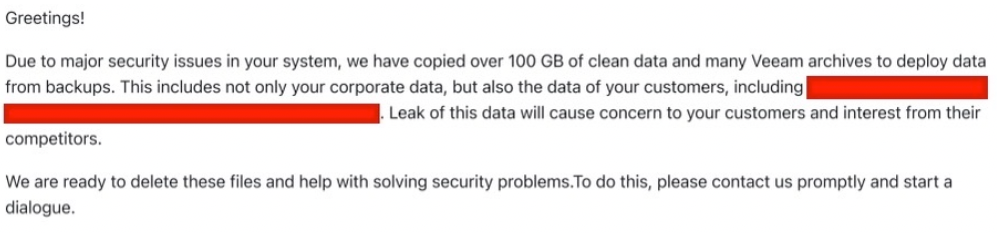

# Cybersec and Ransomware
<!-- _class: first-slide -->

Juan Vera del Campo - <juan.vera@professor.universidadviu.com>

# Hoy hablamos de...
<!-- _class: cool-list with-warning -->

Cómo se usa la criptografía para atacar, y seguiremos explorando conceptos de criptografía simétrica y asimétrica

1. [Cybersecurity domains](#3)
1. [Ransomware](#11)
1. [Examples](#3)

Las transparencias de esta sesión están en inglés

# Cybersecurity domains and roles
<!-- _class: lead -->

---
<!-- _class: vertical-bottom no-logo -->

> https://www.linkedin.com/pulse/cybersecurity-domain-map-ver-30-henry-jiang/

<!--
These are the different roles in the cybersecurity field. Each one of the colors is a general domain, and each of the bubbles a specialist. You will probably develop your career moving from bubble to bubble, and occasionaly from domain to domain.
-->

---
<!-- _class: no-logo -->

<!--
These are the main domains in cybersecurity:

- Defense, avoiding the bad guys to enter the premises
- Firefighters, fixing things when things go down
- Reactive, or forensic analysists. They act after a security incident
- Hacking, to find vulnerabilities, test the security of the system or learn about new things
- Engineers, to develop the security systems
- Management roles
-->

## Cybersecurity roles
<!-- _class: cool-list -->

1. *Security engineers*
1. *Blue Team*
1. *Incident Responders*
1. *Forensics Analysts*
1. *Red team*
1. *White team*
   
This is not an exhaustive list!

---
<!-- _class: center -->

In this session, we will focus on the Incident Management team, part of the Blue Team

<!--
This is a typical organigram for the cybersecurity departments of a big company

The CISO (Chief Information Security Officer) is the main responsible of the cybersec in an organization. It can report directly to the CEO (general manager of the company) or to the CIO (Chief Information Officer, he/she manages all other aspects of the information technologies) Check: https://blogs.cisco.com/security/should-the-ciso-report-to-the-cio

Many companies cannot afford to have dedicated departments, and some of these are oursourced. For example, it is common outsourcing the Security Operations Center, the Incident Management and the Red Teams, specialy if cyber is not your core business.
-->

## Blue Team
<!-- _class: with-info -->

- Security **operation/analyst**
- Filter logs, set alarms...
- Identify bad behavior: monitoring
- Define security policies and good practices: policy makers
- Other specialists: threat intelligence / analysts
- Also: help desk

**Goal**: defensive security

> https://csrc.nist.gov/glossary/term/Blue_Team

<!-- 

There are several "sub-roles" inside the blue team:

- Security Office Center tier 1: monitor systems and respond to common security events
- SOC tier 2: respond to exceptional security events
- SOC tier 3: configure alarms, filter data...
- Threat intelligence: learn about current attacks and check if your company has the defenses against them
- Define alarms and playbooks

They are usually the security department of a company, in the IT department, and they work on-premises.

Large companies are starting to outsource the monitoring of the security systems,
and the SOC (i.e., "the monitoring") is run by an external entity.

Skills: reading, detailed-oriented, kwowledge about a security product. No coding required!
-->

## Incident Responders

- Something happened!
- Identify affected systems
- How did the attackers enter the system?
- Remediate
- Eradicate
- Negotiate with the attackers
- Time is important!

**Goal**: mitigate and remediate security breaches

<!--
Incident responders act when an intrusion is confirmed.

You have seen this many times in movies: https://www.youtube.com/watch?v=msX4oAXpvUE

They must identify:

-  which systems were affected. It is not an easy task. For example, during a ransomware, the entry point used by the attackers is probably NOT encrypted.
- the attackers usually leave "persistence mechanisms" to be able to enter the company again after the incident
- is there information leak apart from the ransomware?

Notice: when an incident responder acts, the security systems already failed. Firewalls, antiviruses... they are of little use. The tools and skills they use are different.

The Incident Response team is nearly always externalized, outsourced to a specialized company

Skills: very good communication skills and cold blood

-->

## Forensic Analysts

- Investigate special security events
- What happened, in depth?
- Can we prosecute the attackers?
- Time is not important
- They are usually independant consultants, or they work in law enforcement

**Goal**: identify causes and criminals

<!--

You have seem this many times in movies: https://www.youtube.com/watch?v=Vxq9yj2pVWk

A forensic analysts:

- investigates some special security events that the SOC cannot decide if there was an intrusion or not. For example, there is some logon attempts from the machine used by the company CEO and monitoring is not enough. The antivirus does not say something. Is is compromised?
- Identify the identity of the bad guys. Can we prosecute them? Did they receive assistance from someone inside?
- Act as Expert Witness in a trial

Forensics analysts check very carefully a security event. Time is usually not important to them.

Forensic analysts, specially if they must act as Expert Witness, are external to a company

-->

# Ransomware
<!-- _class: lead -->

---

> [Ransomware - Anatomy of an Attack](https://www.youtube.com/watch?v=6h9yh_A80fs) ESI & CISCO, 2018

## Ransomware: a definition

- Malware that encrypts the victim's files, making them inaccessible, and demands a ransom payment to decrypt them
- recovering the files without the decryption key is "not possible"
- You pay for the decryption key using Bitcoin or similar crytos
- Typically carried out using a Trojan disguised as a legitimate file that the user is tricked into downloading or opening when it arrives as an email attachment 
- Also, attackers are known to compromise a company infrastructure and once they are inside, run ransomware

> https://en.wikipedia.org/wiki/Ransomware

---

> https://www.coveware.com/blog/2023/10/27/scattered-ransomware-attribution-blurs-focus-on-ir-fundamentals

<!--
El ransomware es uno de los mayores peligros para una compañía, y también uno de los ataques más lucrativos...

...hasta 2020. Enseguida veremos qué pasó en 2020 y cómo respondieron los atacantes
-->

## Ransomware groups

<!--
The attackers are well known, wealthy and they do not hide themselves.

They say the plate on that automobile says, in Russian, "THIEF"
-->

---

- APT41 is a threat group that researchers have assessed as Chinese state-sponsored espionage group that also conducts financially-motivated operations.
- APT41 has been active since as early as 2012.
- The group has been observed targeting healthcare, telecom, technology, and video game industries in 14 countries.

> https://www.fbi.gov/wanted/cyber/apt-41-group
> https://attack.mitre.org/groups/G0096/
> https://www.fireeye.com/current-threats/apt-groups.html
> https://en.wikipedia.org/wiki/Double_Dragon_(hacking_group)

<!--
Notice:

- The group is perfectly identified
- The group has been active for 10 years
- They are suspected to be supported by the Chinese goverments
- This is APT 41... and that implies that there are at least other 40 identified groups! Check the link to MITRE, they have the list of other groups and their methods and techniques
-->

## The infection chain

> https://www.trendmicro.com/en_us/research/21/i/examining-the-cring-ransomware-techniques.html
> Steps standarized in the Mitre Attack Matrix: https://attack.mitre.org/

## Ransomware-as-a-service
<!-- _class: smaller-font -->

- Ransomware as a service (RaaS) is a subscription-based model that enables affiliates to use already-developed ransomware tools to execute ransomware attacks
- Affiliates earn a percentage of each successful ransom payment

<!--
- Hay mafias perfectamente organizadas detrás del ransomware y está totalmente profesionalizado
- OJO: está tan profesionalizado que si pagas, es MUY PROBABLE que recuperes tus archivos
- OJO2: si un atacante no recupera sus archivos, enseguida se correrá la voz y "el mayorista" tomaría el control

Por ejemplo: nosotros hemos detectado el "modus operandi" asociado a APT41 varias veces. ¡Pero eso no significa que haya sido APT41! Varios grupos pueden estar usando el mismo software, o el mismo manual, o APT41 puede estar colaborando con otros grupos (es habitual: APT41 espía, luego vende el acceso a otros grupos que plantan ransomware)
-->

---
<!-- _class: two-columns smaller-font-->

- Ransomware is created by a central group of **developers**. They provide:
    - the "brand name"
    - "the infrastruture"
    - documentation
    - support ot the affiliates
    - Examples: Conti, Lockbit...
- They sell a service to the **affiliates**, for a percentage of the gains
- Access is usually carried out by other group that sells the credentials: **access brokers**
    - Examples: Redline

> https://www.trendmicro.com/vinfo/us/security/definition/ransomware-as-a-service-raas

# Examples: Venus, Conti, Babuk, LockBit
<!-- _class: lead -->

---

> https://www.coveware.com/blog/2023/4/28/big-game-hunting-is-back-despite-decreasing-ransom-payment-amounts
> [Main groups in 2023](https://www.blackfog.com/the-top-10-ransomware-groups-of-2023/)

<!--
Fijaos que no hay tantas variantes de ransomware: solo unas pocas familias. Fijas también en que cambian muy rápidamente: de las 10 variantes más usadas, 5 han aparecido en los últimos 3 meses y otras 5 han desaparecido. Es un mundo que cambia MUY RAPIDAMENTE

¿Cómo es que hay tan pocas variantes de ransomware?
-->

## Venus

Old ransomware, code can be examined:

- Sample run: <https://app.any.run/tasks/5f7f7b45-bdf8-441e-bbe2-3ef2553214d0/>
- source code: <https://colab.research.google.com/github/Juanvvc/crypto/blob/master/ejercicios/08/Ransomware%20Venus.ipynb>

## Conti

The most active RaaS group during 2022

On August, 2021, a disgruntled member of the Conti ransomware program [leaked the manuals and technical guides used by the Conti gang to train affiliate members](https://threatpost.com/affiliate-leaks-conti-ransomware-playbook/168442/)

On February 2022, the war in Ukraine divided the group between supporters of each side and a new leak ocurred. [Check all four parts of this article](https://krebsonsecurity.com/2022/03/conti-ransomware-group-diaries-part-i-evasion/)

Shortly after that, the group disappeared

<!--
En la imagen hay una parte de los manuales, traducidos al inglés. El material original tiene los manuales solo en ruso.

No hace falta un gran conocimiento técnico para llevar a cabo un ataque de ransomware: puedes comprar el malware y los manuales detallados, y ofrecen un "servicio técnico de cibercriminales" para ayudarte a usarlo. Luego, desarrolladores y atacantes van a medias.

Fíjate: de esta manera, un desarrollador de ransomware no se expone y es poco probable que se le pueda detener algún día. 
-->
---

> Check: <https://ransomwatch.telemetry.ltd/#/profiles?id=conti>
> Alternative: <https://darkfeed.io/ransomgroups/>

<!--
Ejemplo de una página web de un grupo de atacantes que ha tenido mucho éxito durante 2021: Babyk/Babuk. Aquí se pueden ver sus últimos ataques con éxito y la amenaza de publicar los datos robrados.

Estos grupos tienen páginas en la dark web que son visitable con Tor o similares

- Los investigadors conocen estas páginas
- Los grupos de atacantes conocen estas páginas
- Si tu información está ahí, es necesario darla como comprometida
- En enlace propuesto https://www.ransomwatch.org/ (gestionado por investigadores de seguridad) hace capturas periódicas de las páginas de muchos grupos conocidos que tienen sus páginas en .onion
- Podéis encontrar "List of ransomware groups" en varios sitios. Los enlaces dejan de funcionar a menudo
-->

## Babuk

Modern Ransomware and exfiltration

- First, it kills security services: antivirus, backup services...
- Next, it **removes** existing backups and shadow copies
- It uses its own implementation of SHA256 hashing, ChaCha8 encryption, and Elliptic-curve Diffie–Hellman (ECDH) key generation and exchange algorithm to protect its keys and encrypt files

> https://socradar.io/what-is-babuk-the-ransomware-gang-you-should-know-about/

---

1. Babuk uses RtlGenRandom to generate 4 random buffers. Two of which are used as ChaCha8 keys, and the other two are used as ChaCha8 nonces.
1. It will encrypt the second ChaCha8 key using the first key and nonce. After that, the first key is then encrypted using the encrypted second key and nonce.
1. This encrypted first key is treated as the Elliptic-curve Diffie–Hellman (ECDH) private key for the local machine.
1. It generates a shared secret using the local private key and the author’s hard-coded public key.
1. This shared secret goes thorugh a SHA256 hashing algorithm to generate 2 ChaCha8 keys, which are used to encrypt files later.
1. In order to be able to decrypt files, Babuk stores the local public key in the file `ecdh_pub_k.bin` in the APPDATA folder.

---

1. Using FindFirstFileW and FindNextFileW calls, it goes through each directory to look for files and sub-directories.
1. Babuk only goes down 16 directory layers deep, so it potentially does not encrypt every single folders in the drive to save time.
1. For small files that are les than 41943040 bytes or roughly 41 MB in size, the file is mapped entirely and encrypted with ChaCha8 two times.
1. With large files, encryption is a bit different. To save time, the entire file is divided into three equally-large regions. For each of these regions, only the first 10485760 bytes or 10 MB will be encrypted.
1. Babuk uses the two ChaCha8 keys generated from the ECDH shared secret’s SHA256 hash as the encrypting keys and the first 12 bytes of the shared secret as nonce.

---

## LockBit

- LockBit first surfaced in 2019
- The group operates on a ransomware-as-a-service (RaaS) model
- The group regularly updates its tactics and techniques
- It was the major ransomware group in 2023

> https://darkfeed.io/2023/04/27/lockbit-overview/
> https://www.trendmicro.com/en_us/research/24/b/lockbit-attempts-to-stay-afloat-with-a-new-version.html
> https://socradar.io/dark-web-profile-lockbit-3-0-ransomware/

---

Steps:

1. If affiliate didn't update the license: stop
1. If the system is already infected: stop
1. Stop security tools
1. Delete *shadow copies* and backups
1. Create an AES key for each file and protect it using the **public** RSA key
1. Encrypt files:
    - Small files: full encryption
    - Large files: only the first 1KB, or intermediate sections

> https://www.trendmicro.com/content/dam/trendmicro/global/en/research/24/b/lockbit-attempts-to-stay-afloat-with-a-new-version/technical-appendix-lockbit-ng-dev-analysis.pdf

---

The blog is in the Dark Web (onion) and the address changes frequently

> https://ransomwatch.telemetry.ltd/#/profiles?id=lockbit3_fs

---

May 2024: lockbit defaced, again

The mastermind behind LockBit, one of the most prolific and damaging ransomware groups in history, is a 31-year-old Russian named Dmitry Yuryevich Khoroshev, aka “LockbitSupp.”: https://www.wired.com/story/lockbitsupp-lockbit-ransomware/

# Managing an incident
<!-- _class: lead -->

---

1. **Identification**: gain an idea of what the attacker did
1. **Containment**: perform short-term containment, for example by isolating the network segment that is under attack. Then focus on long-term containment, which involves temporary fixes to allow systems to be used in production, while rebuilding clean systems.
1. **Eradication**: remove malware from all affected systems, identify the root cause of the attack, and take action to prevent similar attacks in the future.
1. **Recovery**: bring affected production systems back online carefully, to prevent additional attacks. Test, verify and monitor affected systems to ensure they are back to normal activity

## Gain a better idea of what the attacker did

**Initial detection rarely tells a complete story**

- What was the entry vector? Is it fixed?
- Is there any persistence? Are the attackers still in the system?
- Can we recover normal operations? Are backups working?
- Was there any data exfiltration?
- Do we need a public communication?

Remediating too early is as dangerous as too late!

<!--
Image: https://s3-us-west-2.amazonaws.com/courses-images-archive-read-only/wp-content/uploads/sites/1110/2016/02/19004252/Critical_Thinking_Infographic-e1345139343418.jpg
-->

## Entry point

> https://www.coveware.com/blog/2023/10/27/scattered-ransomware-attribution-blurs-focus-on-ir-fundamentals

---

## Defense against ransomware
<!-- _class: smaller-font -->

- Backup your assests!
- **Not in the same machine**
- Train your employees not to open suspicious links
- Good enpoint protection

> https://insights.sei.cmu.edu/blog/3-ransomware-defense-strategies/
> https://www.cybereason.com/blog/three-keys-to-a-reliable-ransomware-defense-strategy
> https://cloudian.com/blog/new-ransomware-protection-from-veeam-and-cloudian/

## Triple Extortion

1. Encrypt data -> Pay to recover your data
1. Data exfiltration -> Pay to keep your data private
1. Reputation damage -> Pay to not make the compromise public

> https://www.sentinelone.com/cybersecurity-101/what-is-triple-extortion/

<!--
Dado que los atacantes han visto que se reducen sus ganancias porque las empresas están usando sus backups...

Han decidido que harán extorsión con los datos. Algunos grupos, como Babyk, han anunciado (abril 2021) que no cifrarán más, que se limitarán a robar información y amenazar con publicarla
-->

## Negotiations
<!-- _class: center -->

Call a professional negotiator: they will

Learn from the attackers

What did they got?

Ask for proof of exfiltration

Gain time

Reduce the money request

> https://edition.cnn.com/2021/07/13/tech/ransomware-negotiations/index.html
> https://searchsecurity.techtarget.com/feature/Ransomware-negotiations-An-inside-look-at-the-process
> https://www.newyorker.com/magazine/2021/06/07/how-to-negotiate-with-ransomware-hackers
> https://www.lmgsecurity.com/ransomware-negotiation-dos-and-donts/
> https://analyst1.com/blog-negotiating-with-lockbit-uncovering-the-evolution-of-operations-and-newly-established-rules/

## Recommendations

- Ransomware is only the last step of the attack:
    - Aim to detect the first steps
    - Train your employees at least for phishing
    - Keep your response team trained
    - Consider using external help
- Ransomware uses state-of-the-art encryption mechanisms: **files cannot be decrypted without paying the attacker**
- Backup your files: https://www.coveware.com/blog/2023/1/19/improved-security-and-backups-result-in-record-low-number-of-ransomware-payments
    - Do not store the backup in the same machine or it will be encrypted as well!
- After a ransomware event, **check carefully if the attacker is still inside!**

## References

- [Reverse engineering of PLAY ransomware](https://chuongdong.com/reverse%20engineering/2022/09/03/PLAYRansomware/)
- [The Most Prolific Ransomware Families: 2023 Edition](https://www.domaintools.com/resources/blog/the-most-prolific-ransomware-families-2023-edition/)
- [2023 CrowdStrike Global Threat Report](https://www.crowdstrike.com/resources/reports/global-threat-report/). This year’s highlights include:
    - Nation-state adversaries engaged in relentless computer network operations throughout 2022, emphasizing the integral role these operations play in supporting state goals
    - After some of the biggest and most notorious ransomware enterprise shutdowns, ransomware affiliates moved to new ransomware-as-a-service (RaaS) operations
    - Increase in social engineering using human interaction, such as vishing, to successfully download malware or circumvent multifactor authentication (MFA)

# ¡Gracias!
<!-- _class: last-slide -->
