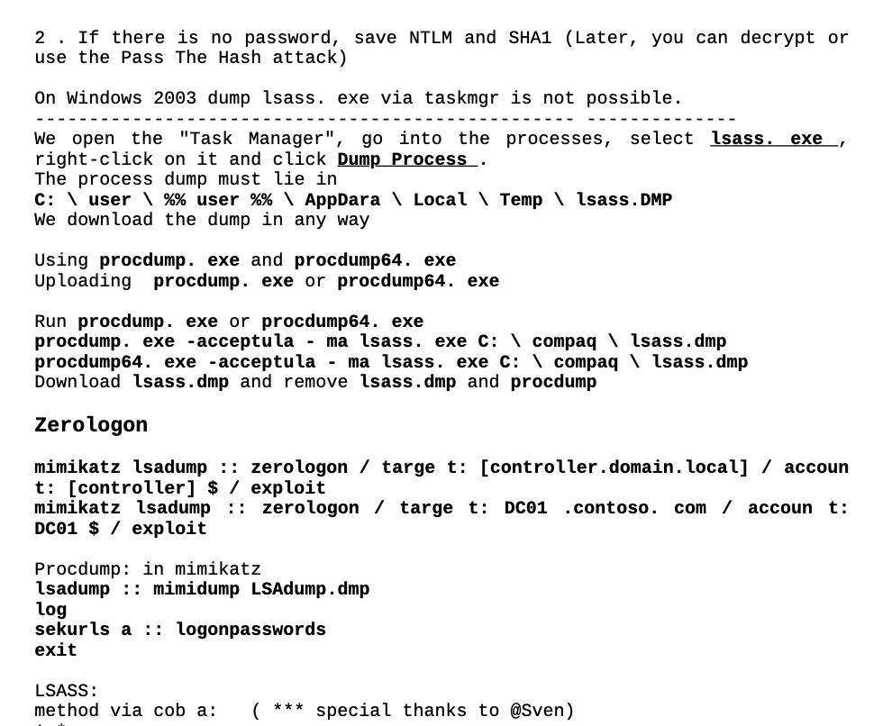
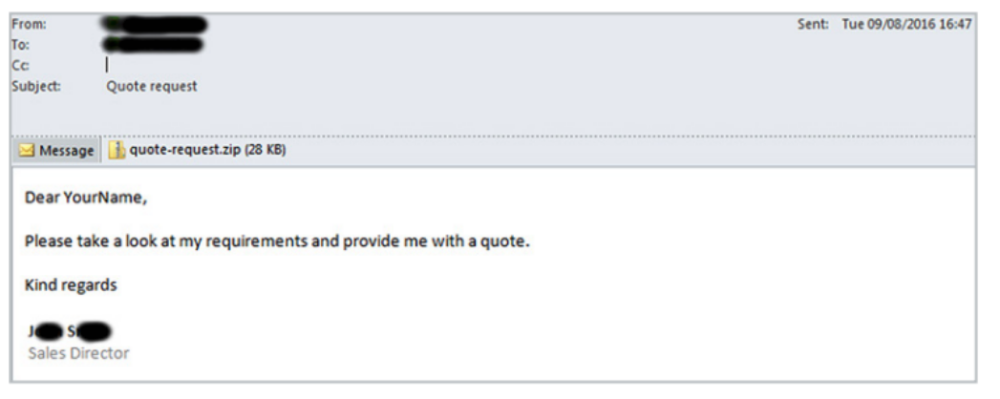

# Criptografía y teoría de códigos
<!-- _class: first-slide -->

**Ransomware**

Juan Vera del Campo - <juan.vera@campusviu.es>

# Hoy hablamos de...
<!-- _class: cool-list with-warning -->

Cómo se usa la criptografía para atacar, y seguiremos explorando conceptos de criptografía simétrica y asimétrica

1. [Ransomware](#3)

Las transparencias de esta sesión están en inglés

# Ransomware
<!-- _class: lead -->

---

> [Ransomware - Anatomy of an Attack](https://www.youtube.com/watch?v=6h9yh_A80fs) ESI & CISCO, 2018

---

- Malware that encrypts the victim's files, making them inaccessible, and demands a ransom payment to decrypt them
- recovering the files without the decryption key is an intractable problem
- difficult to trace digital currencies such as paysafecard or Bitcoin and other cryptocurrencies are used for the ransoms
- Typically carried out using a Trojan disguised as a legitimate file that the user is tricked into downloading or opening when it arrives as an email attachment 
- Also, attackers are known to compromise a company infrastructure and once they are inside, run ransomware

> https://en.wikipedia.org/wiki/Ransomware

---

> https://www.coveware.com/blog/2021/7/23/q2-ransom-payment-amounts-decline-as-ransomware-becomes-a-national-security-priority

<!--
El ransomware es uno de los mayores peligros para una compañía, y también uno de los ataques más lucrativos...

...hasta 2020. Enseguida veremos qué pasó en 2020 y cómo respondieron los atacantes
-->

## Ransomware groups

<!--
The attackers are well known, wealthy and they do not hide themselves.

They say the plate on that automobile says, in Russian, "THIEF"
-->

---

- APT41 is a threat group that researchers have assessed as Chinese state-sponsored espionage group that also conducts financially-motivated operations.
- APT41 has been active since as early as 2012.
- The group has been observed targeting healthcare, telecom, technology, and video game industries in 14 countries.

> https://www.fbi.gov/wanted/cyber/apt-41-group
> https://attack.mitre.org/groups/G0096/
> https://www.fireeye.com/current-threats/apt-groups.html
> https://en.wikipedia.org/wiki/Double_Dragon_(hacking_group)

<!--
Notice:

- The group is perfectly identified
- The group has been active for 10 years
- They are suspected to be supported by the Chinese goverments
- This is APT 41... and that implies that there are at least other 40 identified groups! Check the link to MITRE, they have the list of other groups and their methods and techniques
-->

---

> [Christiaan Beek in Twitter, 2021](https://twitter.com/ChristiaanBeek/status/1427569852357693440)

<!--
Do you notice something funny?

No China, no Russia. These countries are suspected to offer "free haven" to cybercriminals, if they do not attack to companies in their countries

Some ransomware quits without doing any harm if they detect the OS language/keyboard is Russian!

-->

---

<!-- _class: smallest-font center -->

Most Common Ransomware Variants in Q2 2021

Rank|Ransomware Type|Market Share %|Change from Q1 2021
--|--|--|--|
1|Sodinokibi|16.5%|-
2|Conti V2|14.4%|-
3|Avaddon|5.4%|+3
4|Mespinoza|4.9%|New in Top Variants
5|Hello Kitty|4.5%|New in Top Variants
6|Ryuk|3.7%|+1
7|Clop|3.3%|-3
8|THT v2|2.9%|New in Top Variants
9|LV|2.5%|New in Top Variants
10|Zeppelin|2.5%|New in Top Variants

<!--
Fijaos que no hay tantas variantes de ransomware: solo unas pocas familias. Fijas también en que cambian muy rápidamente: de las 10 variantes más usadas, 5 han aparecido en los últimos 3 meses y otras 5 han desaparecido. Es un mundo que cambia MUY RAPIDAMENTE

¿Cómo es que hay tan pocas variantes de ransomware?
-->

## Ransomware-as-a-service

- Ransomware as a service (RaaS) is a subscription-based model that enables affiliates to use already-developed ransomware tools to execute ransomware attacks
- Affiliates earn a percentage of each successful ransom payment

> https://www.upguard.com/blog/what-is-ransomware-as-a-service

<!--
- Hay mafias perfectamente organizadas detrás del ransomware y está totalmente profesionalizado
- OJO: está tan profesionalizado que si pagas, es MUY PROBABLE que recuperes tus archivos
- OJO2: si un atacante no recupera sus archivos, enseguida se correrá la voz y "el mayorista" tomaría el control

Por ejemplo: nosotros hemos detectado el "modus operandi" asociado a APT41 varias veces. ¡Pero eso no significa que haya sido APT41! Varios grupos pueden estar usando el mismo software, o el mismo manual, o APT41 puede estar colaborando con otros grupos (es habitual: APT41 espía, luego vende el acceso a otros grupos que plantan ransomware)
-->

---

On August, 2021, a disgruntled member of the Conti ransomware program leaked the manuals and technical guides used by the Conti gang to train affiliate members on how to access, move laterally, and escalate access inside a hacked company and then exfiltrate its data before encrypting files.

> https://cryptographybuzz.com/ransomware-affiliate-leaks-conti/

<!--
En la imagen hay una parte de los manuales, traducidos al inglés. El material original tiene los manuales solo en ruso.

No hace falta un gran conocimiento técnico para llevar a cabo un ataque de ransomware: puedes comprar el malware y los manuales detallados, y ofrecen un "servicio técnico de cibercriminales" para ayudarte a usarlo. Luego, desarrolladores y atacantes van a medias.

Fíjate: de esta manera, un desarrollador de ransomware no se expone y es poco probable que se le pueda detener algún día. 
-->

## Defense against ransomware
<!-- _class: smaller-font -->

- Backup your assests!
- **Not in the same machine**
- Train your employees not to open suspicious links
- Good enpoint protection

> https://insights.sei.cmu.edu/blog/3-ransomware-defense-strategies/
> https://www.cybereason.com/blog/three-keys-to-a-reliable-ransomware-defense-strategy
> https://cloudian.com/blog/new-ransomware-protection-from-veeam-and-cloudian/

## Ransomware as an unplanned backup

Backups do not stop attackers! Asking for a ransom for NOT PUBLISHING your data is a trend in 2021 

<!--
Dado que los atacantes han visto que se reducen sus ganancias porque las empresas están usando sus backups...

Han decidido que harán extorsión con los datos. Algunos grupos, como Babyk, han anunciado (abril 2021) que no cifrarán más, que se limitarán a robar información y amenazar con publicarla
-->

---

> Check: <https://www.ransomwatch.org/>
> Alternative: <https://darkfeed.io>

<!--
Ejemplo de una página web de un grupo de atacantes que ha tenido mucho éxito durante 2021: Babyk/Babuk. Aquí se pueden ver sus últimos ataques con éxito y la amenaza de publicar los datos robrados.

Estos grupos tienen páginas en la dark web que son visitable con Tor o similares

- Los investigadors conocen estas páginas
- Los grupos de atacantes conocen estas páginas
- Si tu información está ahí, es necesario darla como comprometida
- En enlace propuesto https://www.ransomwatch.org/ (gestionado por investigadores de seguridad) hace capturas periódicas de las páginas de muchos grupos conocidos que tienen sus páginas en .onion
- Podéis encontrar "List of ransomware groups" en varios sitios. Los enlaces dejan de funcionar a menudo
-->

## Entry point

---

---

## Example: Babuk

Modern Ransomware and exfiltration

- First, it kills security services: antivirus, backup services...
- Next, it **removes** existing backups and shadow copies
- It uses its own implementation of SHA256 hashing, ChaCha8 encryption, and Elliptic-curve Diffie–Hellman (ECDH) key generation and exchange algorithm to protect its keys and encrypt files

---

1. Babuk uses RtlGenRandom to generate 4 random buffers. Two of which are used as ChaCha8 keys, and the other two are used as ChaCha8 nonces.
1. It will encrypt the second ChaCha8 key using the first key and nonce. After that, the first key is then encrypted using the encrypted second key and nonce.
1. This encrypted first key is treated as the Elliptic-curve Diffie–Hellman (ECDH) private key for the local machine.
1. It generates a shared secret using the local private key and the author’s hard-coded public key.
1. This shared secret goes thorugh a SHA256 hashing algorithm to generate 2 ChaCha8 keys, which are used to encrypt files later.
1. In order to be able to decrypt files, Babuk stores the local public key in the file `ecdh_pub_k.bin` in the APPDATA folder.

---

1. Using FindFirstFileW and FindNextFileW calls, it goes through each directory to look for files and sub-directories.
1. Babuk only goes down 16 directory layers deep, so it potentially does not encrypt every single folders in the drive to save time.
1. For small files that are les than 41943040 bytes or roughly 41 MB in size, the file is mapped entirely and encrypted with ChaCha8 two times.
1. With large files, encryption is a bit different. To save time, the entire file is divided into three equally-large regions. For each of these regions, only the first 10485760 bytes or 10 MB will be encrypted.
1. Babuk uses the two ChaCha8 keys generated from the ECDH shared secret’s SHA256 hash as the encrypting keys and the first 12 bytes of the shared secret as nonce.

---

## Recommendations

- Ransomware uses state-of-the-art encryption mechanisms: files cannot be decrypted without contacting paying the attacker
- Backup your files
- Do not store the backup in the same machine or it will be encrypted as well!
- After a ransomware event, check carefully the attacker is not still inside!

## References

- [Credit Card Scammers in the Dark Web](https://www.youtube.com/watch?v=jT-jmq8KBw0)
- [Be aware - how hackers can steal your money](https://www.youtube.com/watch?v=h8-27iLvyS4)
- [Spying on the scammers](https://www.youtube.com/watch?v=le71yVPh4uk)

---

[2021 CrowdStrike Global Threat Report](https://www.crowdstrike.com/resources/reports/global-threat-report/). This year’s highlights include:

- The COVID-19 pandemic and its effect on cybersecurity
- “Big game hunters” targeting the healthcare sector
- Significant nation-state-based targeted attacks and operations observed from China, Iran, DPRK, Russia and others
- The pivotal role that access brokers play in the eCrime ecosystem
- How ransomware adversaries are rapidly adopting data extortion methods
- Recommendations you can take to proactively address emerging threats

---
<!-- _class: center -->

Continúa en: [Esteganografía](09-esteganografia.html)

# ¡Gracias!
<!-- _class: last-slide -->
