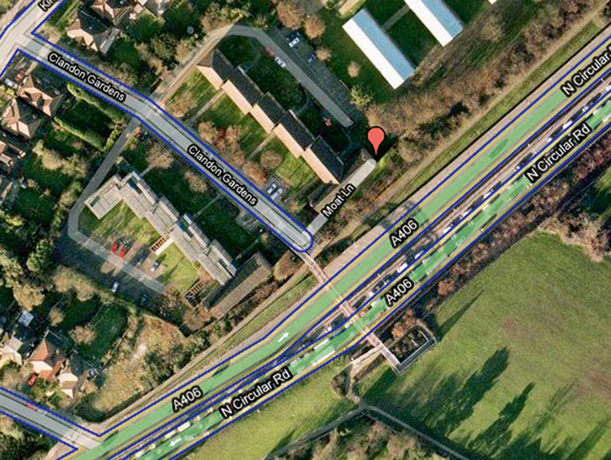
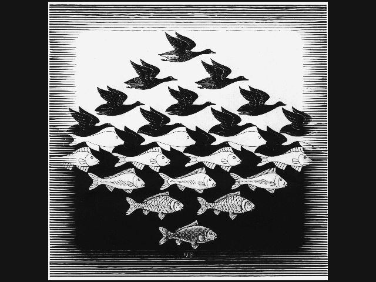
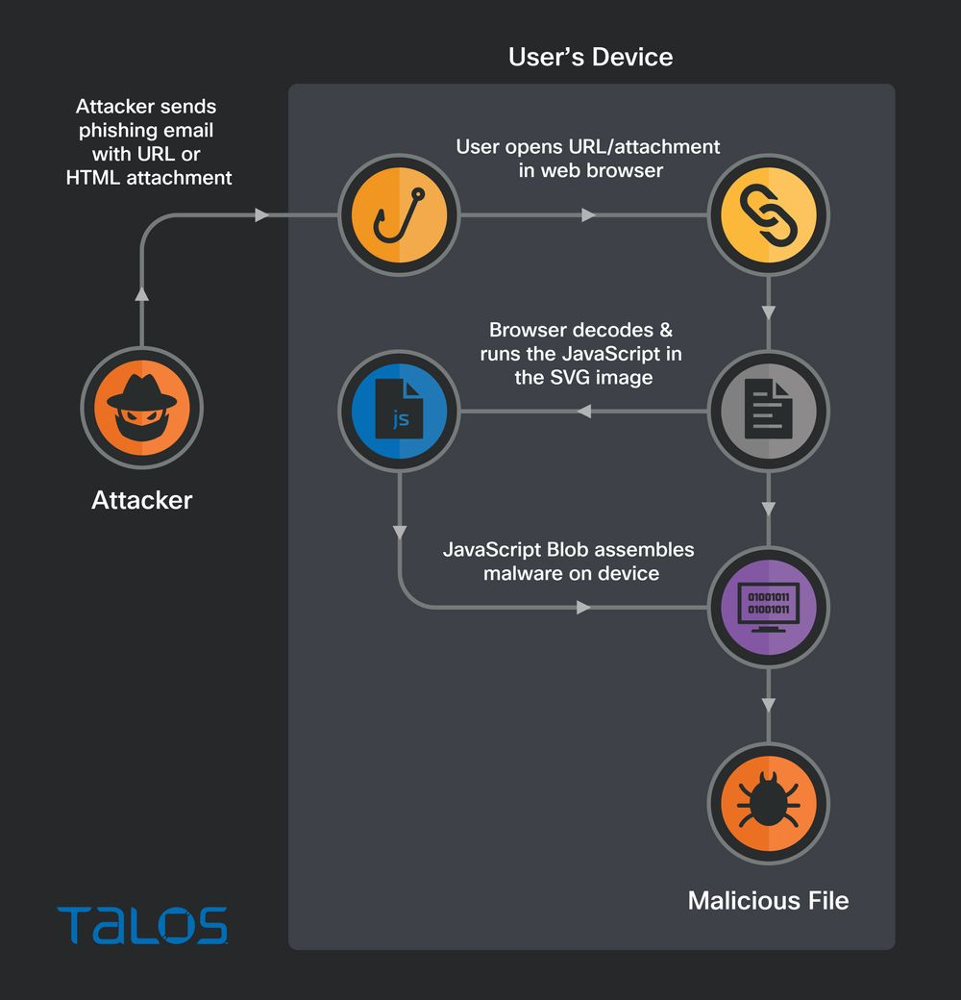

<style>
    /* You can add custom style here. VSCode supports this.
    Other editor might need these custom code in
    the YAML header: section: | */
	/* section header { display: none; } */
	/* section footer { display: none; } */
</style>

# Esteganografía
<!-- _class: first-slide -->

Juan Vera del Campo - <juan.vera@professor.universidadviu.com>

## Hoy hablamos de...
<!-- _class: cool-list toc -->

1. [Esteganografía](#3)
1. [Ejemplos](#9)
1. [Esteganografía para atacantes](#19)
1. [Ataques y detección](#27)
1. [Referencias](#33)

# Esteganografía
<!-- _class: lead -->

## Esteganografía


*Ocultación de información dentro de otra información más común, un documento que no sea secreto, o un documento que no levante sospechas*

## Usos

- Confidencialidad: enviar información en un canal oculto
- Plausible deniability: ¡no estoy haciendo nada malo!
- Copyright: marcar un texto como de mi propiedad
- DLP / DRM: detectar quién ha distribuido un documento
- Atacantes: ¡llevar el malware sin que sea detectado!

<!--
DLP: Data Leak Protection
DRM: Digital Right Management
-->

## Técnicas de ocultación de información


> ["A Comparative Analysis of Information Hiding Techniques for Copyright Protection of Text Documents"](https://www.hindawi.com/journals/scn/2018/5325040/),Milad Taleby Ahvanooey,1 Qianmu Li, Hiuk Jae Shim, and Yanyan Huang. Security and Communication Networks / 2018

## Proceso


<!--
¿Es posible detectarlo?

Después de cambios en la imagen, ¿podemos seguir pasando el mensaje?

Si la imagen se imprime, ¿el mensaje oculto se mantiene?
-->

## Propiedades

(Deseables o no)

- Que no pueda ser detectado
- Que no pueda quitarse con facilidad
- Que pueda ser verificable: criptografía
- Coste computacional para poner / quitar

# Ejemplos
<!-- _class: lead -->

Watermarking y fingerprinting

## Imágenes


- Pixeles "muertos"
- Bit menos significativo: en pixeles o en sus transformadas
- Paleta de color
- Campos EXIF
- ...

<https://www.mobilefish.com/services/steganography/steganography.php>

<!--
Image: https://static.bhphotovideo.com/explora/sites/default/files/proof.jpg
-->

---


<!--
¿Se mantiene la marca después de convertir la imagen?

Images: https://blog.fastforwardlabs.com/images/2017/06/stego_images.jpg
-->

---


> [Look Scanned](https://lookscanned.io/)

---


> https://www.bbc.com/future/article/20170607-why-printers-add-secret-tracking-dots

---


## Mapas: trap streets

Calles falsas para marcar la propiedad intelectual e identificar copias



> https://www.cabinetmagazine.org/issues/47/bridle.php

## Textos


- A la vista
- Resiste impresiones y algunas manipulaciones
- Linguístico: cambiar palabras, frases...
- Estructural: espacios, marcas, tipos de letra...

## Shaadow.io

[](https://www.shaadow.io/)

> https://www.elladodelmal.com/2022/04/como-poner-una-marca-oculta-shaadow-los.html

<!--
Los de shadow.io dicen que pueden mantener la marca incluso después de imprimir el texto a papel
-->

## Text steganography: kerning spaces


## Text steganography: rejillas


# Esteganografía para atacantes
<!-- _class: lead -->

## Usos

- Evasión de antivirus: Ocultar el malware dentro de archivos/protocolos aparentemente legitimos
- Evasión de cortafuegos: comunicaciones prohibidas a través de protocolos permitidos
- Ocultar la exfiltración de información a los sistemas de seguridad

## Network steganography

- **Protocolo IPv4**: StegTunnel (campo identificación datagramas IP)
- **Protocolo TCP**: Covert_tcp21, StegTunnel (campo número de secuencia)
- **Protocolo ICMP**: troyano Loki (ICMP echo Reply/ICMP echo request),
IcmpShell, Pingtunnel...
- **Protocolo IPv6**: VoodooNet, IPV6teal...
- **Protocolo DNS**: dnssteganography, Netcross, denise, dns2tcp, dnscapy,
dnscat, heyoka, iodine, psudp, squeeza, TUNS33, dnscat2, dnsExfiltrator...
- **Protocolo HTTP**: HttpTunnel, Firepass (transferencia de datos
TCP/UDP en mensajes HTTP POST), HCovert, Cctt, http cookies,
Mística...
- **Capa de aplicación**: MailTunnel, MsnShell, StegTorrent, g00gle Crewbots.
- **SCAPY** (https://scapy.net/): manipulación de paquetes

> [Evasión de antivirus y seguridad perimetral usando esteganografía. Alfonoso Muñoz, 2021](https://github.com/mindcrypt/libros/blob/master/Libro%20Estegomalware%20-%20Evasi%C3%B3n%20de%20antivirus%20y%20seguridad%20perimetral%20usando%20esteganograf%C3%ADa%20-%20Dr.%20Alfonso%20Munoz%20-%20mindcrypt%2028-10-2023.pdf)
> [Exfiltration Over Other Network Medium ](https://attack.mitre.org/techniques/T1011/)

## DNS tunneling


> https://help.zscaler.com/zia/about-dns-tunnel-detection
> https://www.youtube.com/watch?v=YgZJ5z7Hmhw
> https://github.com/IncideDigital/Mistica

## Malware en archivos


> https://blog.reversinglabs.com/blog/malware-in-images


## Polyglots

Con esta técnica, un archivo puede ser una cosa u otra según un contexto



> [What are polyglots and how to use them as a pentester ](https://dev.to/gpiechnik/what-are-polyglots-and-how-to-use-them-as-a-pentester-109o)
> https://github.com/mindcrypt/polyglot
> [Polyglots PoC apasamar INCIDE](https://www.youtube.com/watch?v=0S61uzx-Efk)

---



Qbot durante 2022:

```html
<embed src="data:image/svg+xml;
base64,SDKSJdisdskskjskdsk432432...."
...
```

Viejo bug en Explorer: algunas imágenes podían visualizarse o ejecutarse:

```html


<script src="cat.png"></script>
```


> [STEGOSPLOIT](https://www.blackhat.com/docs/eu-15/materials/eu-15-Shah-Stegosploit-Exploit-Delivery-With-Steganography-And-Polyglots.pdf)
> [Attackers use SVG files to smuggle QBot malware onto Windows systems](https://www.bleepingcomputer.com/news/security/attackers-use-svg-files-to-smuggle-qbot-malware-onto-windows-systems/)
> [Smuggling HTML using SVG](https://blog.talosintelligence.com/html-smugglers-turn-to-svg-images/)

---


> https://ia802801.us.archive.org/6/items/ftireportintojeffbezosphonehack/FTI-Report-into-Jeff-Bezos-Phone-Hack_text.pdf

# Ataques y detección
<!-- _class: lead -->

## Ataques

- Activos: el atacante quiere quitar la marca
- Pasivos: el atacante quiere detectar la marca
- Colisiones: el atacante usa dos documentos marcados para obtener uno sin marca
- Simulación: el atacante genera un documento con una marca falsa


## Estimación de la marca


> https://ai.googleblog.com/2017/08/making-visible-watermarks-more-effective.html

## Entropía


- Medida de la aleatoriedad de un archivo
- Texto normal: 0.6 bits por bit
- Texto cifrado: 1 bit por bit
- Si encuentras más entropía de la esperada ¡cifrado!
- Aplicable a muchos canales de comunicación: DNS, chat, imágenes, email...
- No aplicable a canales que ya tengan entropía máxima por estar comprimidos: vídeo, imágenes...

---


Ejemplo del archivo cifrado del primer ejercicio. Fíjate: al principio y al final no tiene entropía, y esas son las partes "que estaban a cero"

## Administradores web

- [Re-codifica las imágenes subidas por los usuarios](https://github.com/mindcrypt/stegowiper)
- Monitoriza librerías JavaScript usadas en la página web
- Comprueba que los archivos son del tipo y tamaño esperado
- Herramientas especializadas de detección: IDS/firewall/WAF...

# Referencias
<!-- _class: lead -->

## Referencias

- [Evasión de antivirus y seguridad perimetral usando esteganografía. Alfonoso Muñoz, 2023](https://github.com/mindcrypt/libros/blob/master/Libro%20Estegomalware%20-%20Evasi%C3%B3n%20de%20antivirus%20y%20seguridad%20perimetral%20usando%20esteganograf%C3%ADa%20-%20Dr.%20Alfonso%20Munoz%20-%20mindcrypt%2028-10-2023.pdf)
- [The Ancient Practice of Steganography: What Is It, How Is It Used and Why Do Cybersecurity Pros Need to Understand It](https://www.comptia.org/blog/what-is-steganography)
- [IMAGE WATERMARKING USING DISCRETE COSINE TRANSFORM [DCT] AND GENETIC ALGORITHM](https://www.researchgate.net/publication/317605329_IMAGE_WATERMARKING_USING_DISCRETE_COSINE_TRANSFORM_DCT_AND_GENETIC_ALGORITHM_GA_MAHIMA_SINGH), MAHIMA SINGH June 2017. INTERNATIONAL JOURNAL OF INNOVATION IN ENGINEERING RESEARCH & MANAGEMENT ISSN :2348-4918
- ["A Comparative Analysis of Information Hiding Techniques for Copyright Protection of Text Documents"](https://www.hindawi.com/journals/scn/2018/5325040/),Milad Taleby Ahvanooey,1 Qianmu Li, Hiuk Jae Shim, and Yanyan Huang. Security and Communication Networks / 2018

# ¡Gracias!
<!-- _class: last-slide -->
