<style>
    /* You can add custom style here. VSCode supports this.
    Other editor might need these custom code in
    the YAML header: section: | */
</style>

# Criptografía Post-cuántica
<!-- _class: first-slide -->

Juan Vera del Campo - <juan.vera@professor.universidadviu.com>

# Como decíamos ayer...

La seguridad de la criptografía asimétrica se basa en que no conocemos algoritmos rápidos para resolver problemas matemáticos como la factorización de números primos:

$15 = 5 \cdot 3$

$3248 = 29 \cdot 7 \cdot 2^4$

$8012012832918391238193192198219981928192889382938998982 = ?$

El algoritmo conocido para los computadores actuales es [GNFS](https://en.wikipedia.org/wiki/General_number_field_sieve):

$$
O(2^{2,774·(b_n^{1/3})(ln(b_n)^{2/3})})
$$

---

Factorizar este número con un computador actual lleva miles de años...

```
149802948092842184098210482184208402814092814092814902882314802
840182098201895139476316917369371469130591039583109734876139819
538591385031850135124214213434125103691373140750917604137601347
603176031760317603176136913701364316013860319760193760931707097
017436013760317460316703176031786136498314691376931763176931876
981376938176931876931769137693187613768713867136873187513769316
013463160316039187683714681397689713489671390486791837609138769
013876089317693187690137691374603918768931769137631769137691301
346871306871384761937693814708173468713689317693176814758134761
376134786139671396731467318967348769831476837639176913476931763
196731769317691384768931476831746083174687138671397613476317613
769347476138976831769831746983176731976913876091376891376981376
913476983174691347683476193769134769314769137693147691347691347
691387683147693147683148761364706946013746013681141213083928139
```

Pero... ¿y si existiesen otro tipo de computadoras que lo factorizase en horas?

## Hoy hablamos de...
<!-- _class: cool-list toc -->

1. [Computación Cuántica](#5)
1. [Criptografía Post-cuántica](#19)
1. [Ejemplo: ML-KEM](#25)
1. [Implementación de la criptografía post-cuántica](#31)
1. [Resumen y referencias](#42)

# Computación Cuántica
<!-- _class: lead -->

Una introducción a vista de pájaro

<!-- Nota: no pretenderé explicar cómo funciona la computación cuántica, sinó cómo afectará a la criptografía del futuro próximo -->

## Computación cuántica

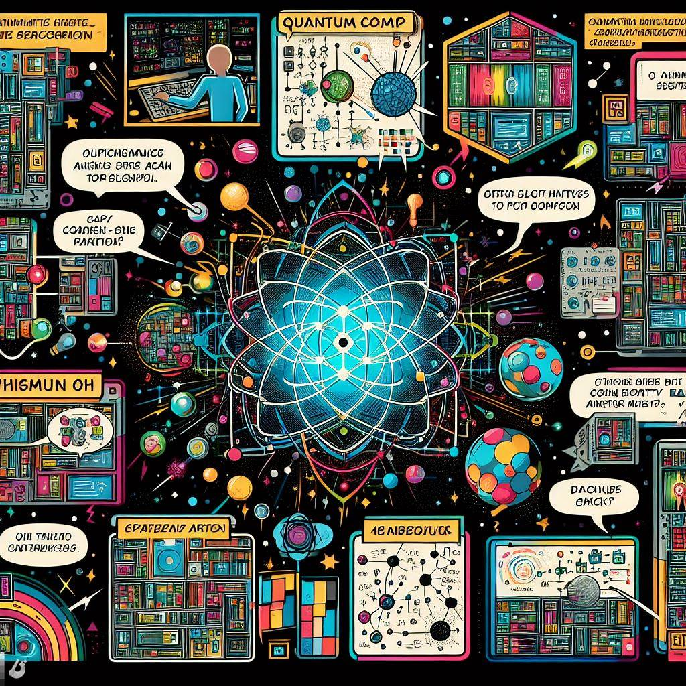

- La computación cuántica utiliza principios de la mecánica cuántica para realizar cálculos
- [Richard Feynman](https://es.wikipedia.org/wiki/Richard_Feynman) sugirió (~1980) que se podrían aprovechar comportamientos cuánticos para realizar cálculos de manera más eficiente que las computadoras clásicas
- Ha sido un estudio solo teórico durante 50 años, pero ahora empezamos a poder construirlas

> [¿Qué es y cómo funciona la COMPUTACIÓN CUÁNTICA?](https://www.youtube.com/watch?v=YpYuBEzfRlM)

## Q-bit


La unidad de la computación cuántica es el Q-bit, que puede existi en múltiples estados simultáneamente. 0 y 1 a la vez: *superposición*

Pueden empaquetar más información: $10^{48} bits \equiv 160 qbits$

Intuitivamente: podemos aprovechar la superposición para probar muchas soluciones a la vez con un solo q-bit: trabajo en paralelo

> [Computación Cuántica: la Guía completa WIRED](https://es.wired.com/articulos/computacion-cuantica-la-guia-completa-wired-computadoras-qubits)


## Comparación con la computación tradicional

- La computación cuántica permite resolver [problemas complejos](04-complejidad.html) con una rapidez que no sabemos alcanzar con computación tradicional: **supremacía cuántica**
- Cuidado: ¡no todos los problemas son complejos!
- La computación cuántica da un **resultado probabilístico**. Es decir, "esto es una solución, probablemente"


<!--
Recordatorio: "problema complejo" no significa necesariamente problema difícil. Hay una rama de las matemáticas que estudia los problemas complejos, y tienen que ver con cuánto aumementan los recursos necesarios para resolver un problema (tiempo, memoria = dinero) cuando aumenta el tamaño del problema.

Por ejemplo, factorizar números primos es un problema complejo. No porque sea difícil (no lo es), sino porque el tiempo necesario para factorizar un número aumenta exponencialmente con su tamaño

Si un problema no es complejo, utilizar computación cuántica para solucionarlo en "matar moscas a cañonazos"

Por eso es poco probable que veamos computadoras cuánticas en nuestros hogares: en nuestra vida diaria no necesitamos resolver problemas matemáticamente complejos
-->

## ¿Qué es lo que NO MEJORAN las computadoras cuánticas?
<!-- _class: with-success -->

- No traerán juegos con mejores gráficas
- No nos traerán mejores aplicaciones informáticas
- No traerán una Internet más rápida
- Tardarán lo mismo en realizar la mayor parte de las tareas, pero son astronómicamente más caras


Es poco probable que tengamos una computadora cuántica en nuestros escritorios

## La computación cuántica NO ES criptografía cuántica
<!-- _class: smaller-font, with-warning -->

- La **criptografía cuántica** usa la física cuántica para crear un canal seguro
- ¡No es necesario tener un computador cuántico para usar criptografía cuántica!
- Ejemplo: [distribución de claves cuántica](https://www.cse.wustl.edu/~jain/cse571-07/ftp/quantum/) (QKD)

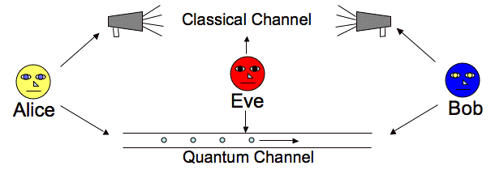

En esta clase no hablaremos de criptografía cuántica sinó de la post-cuántica, que definiremos más adelante

> https://en.wikipedia.org/wiki/Quantum_cryptography

<!--
La criptografía cuántica utiliza los principios cuánticos para crear un canal de comunicaciones seguro. ¡No se necesita una computadora cuántica para usar la criptografía cuántica

En el ejemplo, se usa un canal cuántico para distribuir una clave criptográfica tradicional que se puede usar, por ejemplo, para AES. En un canal cuántico, "el acto de medir cambia lo que se mide" (principio de incertidumbre), así que Alice y Bob se darán cuanta si hay alguien escuchando el canal, y no usarán esa clave para cifrar

En esta clase no hablaremos de criptografía cuántica
-->

## Entonces... ¿qué hacen las computadores cuánticas?

La computación cuántica permite ejecutar algoritmos de búsquedas más rápidamente que la computación tradicional

- Entrenamientos de inteligencia artificial
- Sistemas de optimización industrial
- Sistemas de recomendación de compras y finanzas
- **Resolve los problemas matemáticos en los que se basa la criptografía actual mucho más rápido de lo esperado**


> [Top 20 Quantum Computing Use Cases & Applications in 2024](https://research.aimultiple.com/quantum-computing-applications/)


<!-- En la imagen, IBM-Q quantum computer en la conferencia Supercomputing 18 de Dallas, Texas

Para pensar: ¿realmente necesitamos resolver algoritmos de optimización tan rápido? ¿No nos valen los algoritmos tradicionales?
-->

## Algoritmos ejecutados por computadoras cuánticas
<!-- _class: with-info -->

Algoritmos de interés para criptogafía:

- [Algoritmo de Grover](https://es.wikipedia.org/wiki/Algoritmo_de_Grover) (1996)
- [Algoritmo de Shor](https://es.wikipedia.org/wiki/Algoritmo_de_Shor) (1999)

Estos algoritmos tienen el potencial de romper la criptografía que estamos utilizando actualmente

Cuando tengamos un computador cuántico... ¡los malos ya sabrán usarlo!

<!-- Observa: ya teníamos algoritmos antes de tener el primer computador cuántico! -->

## Algoritmo de Grover
<!-- _class: with-info -->

 Búsqueda exahustiva en una secuencia no ordenada con mejora cuadrática. 
 
 Efecto: "raíz cuadrada de tiempo" de los algoritmos clásicos. AES-128 en $O(2^{64})$

 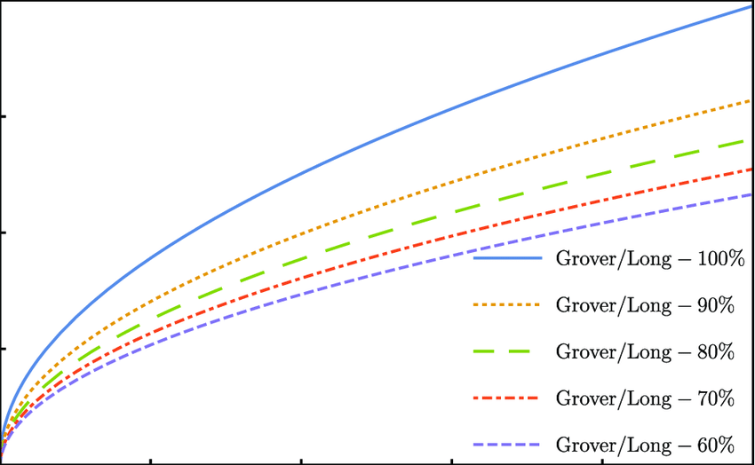

 El algoritmo de Grover debilita la criptografía de clave privada y hashes (AES, SHA256...) diviendo su fortaleza entre 2

> https://www.researchgate.net/figure/A-comparison-of-Grover-Long-algorithm-with-different-success-rates-1-d-2-The-query_fig3_356928043

## Algoritmo de Shor
<!-- _class: with-warning -->

Permite encontrar factores de un número de una manera eficiente. RSA, ECC y D-H en $O(polinomimal)$


El algoritmo de Shor **rompe** la criptografía de clave pública (D-H, RSA...)

> https://www.researchgate.net/figure/Shors-algorithm-has-exponential-acceleration-effect-compared-with-classical-algorithm_fig1_359643607


<!--
Fíjate: da igual que aumentemos el tamaño de la clave, llega un momento en que resolver RSA se vuelve casi constante, independientemente de cuántos bits tenga la clave
-->

---

[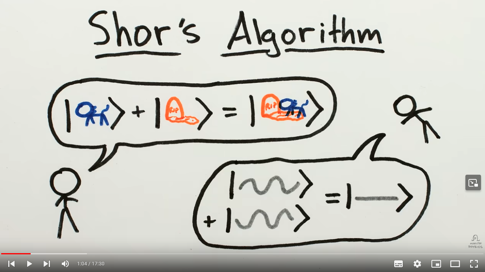](https://www.youtube.com/watch?v=lvTqbM5Dq4Q)

> [How Quantum Computers Break Encryption | Shor's Algorithm Explained ](https://www.youtube.com/watch?v=lvTqbM5Dq4Q)

<!--

El vídeo contiene detalles físicos y matemáticos de cómo funciona en algoritmo de Shor en sistemas cuánticos y es razonablemente sencillo

-->

## Inconvenientes de las computación cuántica

- Solo mejora algunos problemas, otros los calculará tan rápido como la tradicional
- Es muy cara
- Decoherencia: un qbit es muy sensible al entorno y puede perder sus propiedades cuánticas
- Muchos qbits hacen el sistema inestable
- Necesitan temperaturas cercanas al cero absoluto
- La respuesta es probabilística: [probabilidad de error](https://es.wikipedia.org/wiki/Correcci%C3%B3n_de_errores_cu%C3%A1ntica)
- No se ha demostrado que haya supremacía / ventaja cuántica

> [How to Detect Quantum Bullshit ](https://www.youtube.com/watch?v=uKVJEuVkPvw) Sabine Hossenfelder, Junio 2024
> [What Are The Remaining Challenges of Quantum Computing?](https://thequantuminsider.com/2023/03/24/quantum-computing-challenges/) Matt Swayne.  March 24, 2023	


## Supremacía/ventaja cuántica
<!-- _class: smaller-font -->

Demostrar de forma práctica que un computador cuántico puede resolver un problema más rápidamente que un computador tradicional

Cada poco tiempo alguien anuncia que ha demostrado la [**supremacía cuántica**](https://es.wikipedia.org/wiki/Supremac%C3%ADa_cu%C3%A1ntica)... con condiciones [1](https://www.nature.com/articles/s41586-019-1666-5), [2](https://arxiv.org/abs/2109.03494), [3](https://www.nature.com/articles/d41586-022-01402-x)

Pero aún no para los algoritmos de Shor o Grover

El consenso general es que aún no se ha demostrado la supremacía cuántica, pero ese día acabará llegando

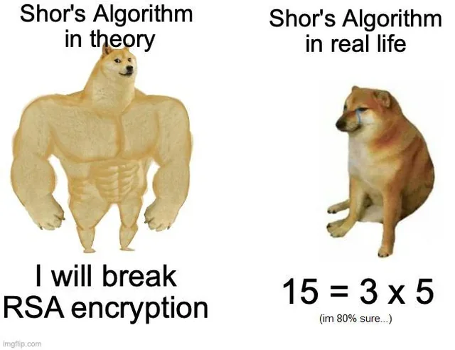

> [It’s been 20 years since “15” was factored on quantum hardware](https://www.ibm.com/quantum/blog/factor-15-shors-algorithm), Robert Davis. Enero 2022

<!--
En 2024, 15 sigue siendo el número más grande que podemos factorizar con computación cuántica, y nos lleva 10 minutos

 “You yourself could go and factor 15 on the IBM Quantum computer system over the cloud in 10 minutes,” he said. “That is incredible. To have reached that level of sophistication and control is testimony towards the type of system engineering ability that IBM Quantum has brought to us. We did not have that in 2001.”

However, it’s also important to note that the ability to factor 15 on current quantum hardware assumes some amount of simplification of Shor’s algorithm. “There are different ways to write the factor 15 algorithm, and if you simplify it sufficiently, well, then you can run it, but it's not terribly meaningful,” Chuang said. “If you write it in a way that can scale such that not only could it factor 15, but also 21 and larger numbers, that is hard, and that's an extremely good test of the sophistication of a system.” 

Sabemos que la computación cuántica es posible. Ahora, ¿es realmente más rápida que la tradicional?

El consenso en la comunidad científica es que sí, que acabará teniendo ventaja/supremacía frente a la computación tradicional antes o después. Y tenemos que estar preparados para ello.
-->

## Estado actual

- El computador [Google Sycamore](https://www.sciencealert.com/google-quantum-computer-is-47-years-faster-than-1-supercomputer) tiene 70 qubits. Agosto de 2023.
- El procesador cuántico [IBM Osprey](https://en.wikipedia.org/wiki/IBM_Osprey) tiene 433 qbits y la empresa tiene previsto alcanzar los 4.000 qubits con su [procesador Kookaburra en 2025](https://www.popsci.com/technology/ibm-quantum-computing-roadmap/)
- No neesitamos tenerlos en casa: empresas como [Google](https://cloud.google.com/blog/products/compute/ionq-quantum-computer-available-through-google-cloud), [IBM](https://quantum.ibm.com/), [Microsoft](https://azure.microsoft.com/es-es/products/quantum/) y [Amazon](https://aws.amazon.com/braket/) han anunciado computación cuántica como servicio disponible en la nube

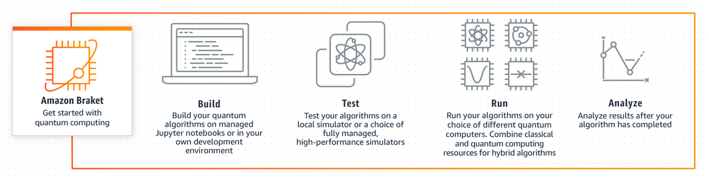

<!--
Fíjate:

- son anuncios, no demostraciones
- segutamente estos números estarán obsoletos cuando leas esto
-->

# Criptografía Post-cuántica
<!-- _class: lead -->

## Efectos de la computación cuántica en criptografía clásica
<!-- _class: with-warning -->

Algoritmo|Tipo|Algoritmo|Defensa
--|--|--|--
AES|Simétrico|Grover|⚠ Tamaño de claves x2
SHA2|Función de hash|Grover|⚠ Tamaño de salida x1.5
RSA|Asimétrico, firmas|Shor|☠ Rota, reemplazar
D-H|Asimétrico, intercambio de claves|Shor|☠ Rota, reemplazar
Elípticas|ECDH, ECDSA...|Shor|☠ Rota, reemplazar

Aunque no sepamos cuándo llegará el computador cuántico, ya tenemos que estar preparados y cambiar los algoritmos actuales

<!--
Recuerda:

- el cifrado simétrico (AES, ChaCha hash) se puede romper simplemente buscando qué texto original daría un cifrado. Eso es una búsqueda exhaustiva, y la computación cuántica puede hacer más rápidamente que la tradicional
- La seguridad de RSA se basa en que no sabemos hacer factorización de números primos rápidamente con computadoras clásicas, pero sí que sabremos resolverlo muy rápidamente con computadoras cuánticas
- D-H se basa en el problema del logaritmo discreto y tiene el mismo problema
- Los sistemas de curvas elípticas también tendrán el mismo problema

Aunque la criptografía simétrica resistirá, necesitamos sustituir la criptografía asimétrica
-->

## Criptografía post-cuántica

<style scoped>
p:first-of-type {
    border-radius: 0.15em;
    border: 2px solid #73AD21aa;
    background-color: #73AD2133;
    padding: 0.5em 1em;
    width: 90%;
    margin: auto;
    text-align: center;
}
</style>

Algoritmos criptográficos que tendrán que usar **las computadoras clásicas** cuando existan las computadoras cuánticas

Observa:

- Estos algoritmos criptográficos ya existen y **sustituirán** a RSA, ECDH o ECDSA
- Los ejecutarán los computadores tradicionales, no las cuánticas
- Los puedes usar ya en tus protocolos
- Los tienes que empezar a usar antes de que llegue la computación cuántica

<!--
Fíjate bien: llamamos criptografía post-cuántica a la criptografía que ejecutarán las computadoras clásicas, no las cuánticas
-->

## ¿Cuándo tiempo nos queda?

[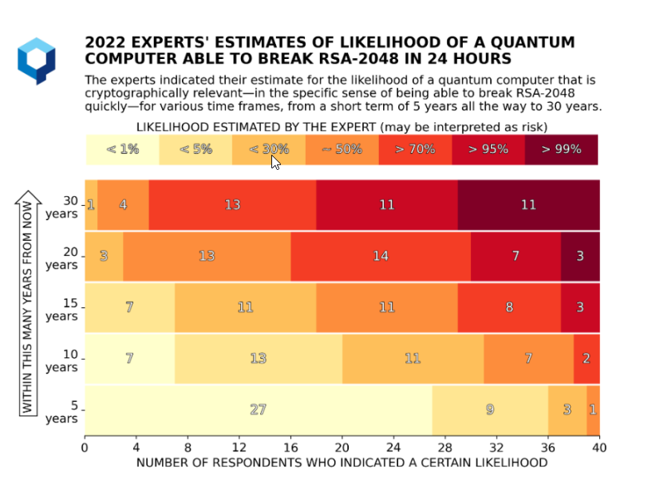](https://globalriskinstitute.org/publication/2023-quantum-threat-timeline-report/)

En realidad, no nos queda tiempo: "Store now, decrypt later" [1](https://www2.deloitte.com/us/en/pages/about-deloitte/articles/press-releases/harvest-now-decrypt-later-attacks-pose-security-concern-quantum-computing.html), [2](https://www.siliconrepublic.com/enterprise/quantum-apocalypse-store-now-decrypt-later-encryption)

> [2023 Quantum Threat Timeline Report](https://globalriskinstitute.org/publication/2023-quantum-threat-timeline-report/), Global Risk Institute, diciembre 2023

## Concurso del NIST

En 2016, el NIST (instituo de estandarización de EEUU), [convocó un concurso](https://csrc.nist.gov/projects/post-quantum-cryptography) para evaluar los mejores algoritmos post-cuánticos que le presentasen:

- Cifrado asimétrico
- Mecanismos de encapsulación de claves o KEM (*Key Encapsulation
Mechanism*)
- Firmas digitales

<!--
EL intercambio de claves clásico podría hacerse acordando una clave (Diffie-Hellman) o simplemente enviando una clave simétrica cifrada con RSA. Esto último es lo que se llama "encapsulamiento de clave"
-->

---

El NIST ya ha publicado (agosto de 2024) los estándares post-cuánticos: 

- **ML-KEM**: *Module-Lattice-Based Key-Encapsulation Mechanism*. [FIPS 203](https://nvlpubs.nist.gov/nistpubs/FIPS/NIST.FIPS.203.pdf). Estándar de intercambio de clave basado en CRYSTALS-Kyber. Reemplaza ECDH.
- **ML-DSA**: *Module-Lattice-Based Digital Signature Algorithm*. [FIPS 204](https://nvlpubs.nist.gov/nistpubs/FIPS/NIST.FIPS.204.pdf). Estándar principal para firmas digitales post-cuánticas. Usa el algoritmo CRYSTALS-Dilithium. Reemplaza RSA, ECDSA
- **SLH-DSA**: *Stateless Hash-Based Digital Signature Algorithm*. [FIPS 205](https://nvlpubs.nist.gov/nistpubs/FIPS/NIST.FIPS.205.pdf). Basado en Sphincs+. Es un "backup" para ML-DSA

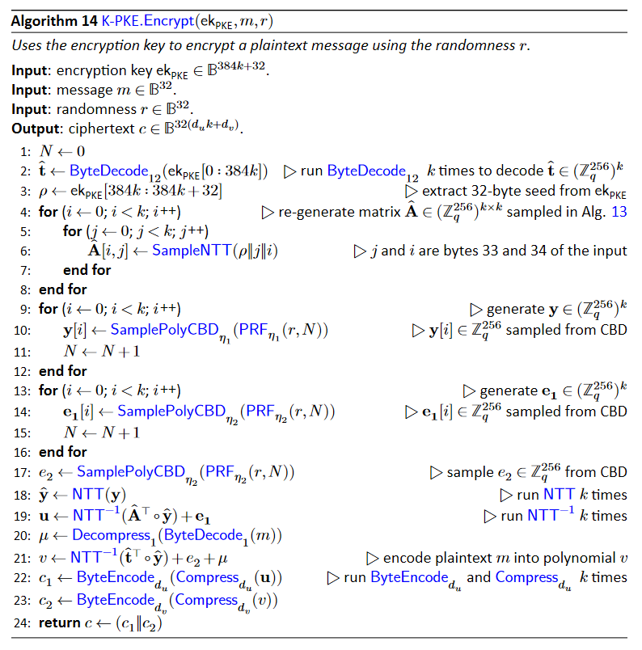

> https://www.linkedin.com/pulse/nist-releases-first-3-finalized-post-quantum-cryptography-fhpbe/

# Ejemplo: ML-KEM
<!-- _class: lead -->

*Module-Lattice-Based Key-Encapsulation Mechanism*. [FIPS 203](https://nvlpubs.nist.gov/nistpubs/FIPS/NIST.FIPS.203.pdf)

## ML-KEM (CRISTALS Kyber) - FIPS 203

- Nombre oficial: *Module-Lattice-Based Key-Encapsulation Mechanism*
- Nombre común: CRISTALS Kyber
- Mecanismo de encapsulación de clave: dos personas que no se han visto nunca pueda tener una clave común que luego usarán en AES (o similar)
- "Sustituto" postcuántico de Diffie-Hellman / ECDH
- Basado en el problema ["Aprendizaje con errores"](https://en.wikipedia.org/wiki/Learning_with_errors)

> [CRYSTALS-Kyber](https://pq-crystals.org/kyber/data/kyber-specification-round3-20210804.pdf). Roberto Avanzi, Joppe Bos, Léo Ducas, Eike Kiltz, Tancrède Lepoint, Vadim Lyubashevsky, John M. Schanck, Peter Schwabe, Gregor Seiler, Damien Stehlé. Agosto 4, 2021
> [Learning with errors: Encrypting with unsolvable equations](https://www.youtube.com/watch?v=K026C5YaB3A) Chalk Talk, 2023. Explicación sencilla
> [CRYSTALS Kyber : The Key to Post-Quantum Encryption](https://medium.com/@hwupathum/crystals-kyber-the-key-to-post-quantum-encryption-3154b305e7bd), Udara Pathum, 2024. Explicación completa

<!--
A continuación vamos a explicar muy por encima en qué consiste el problema del aprendizaje con errores, dejándo detalles fuera.

El primer enlace es la propuesta que se envió al NIST, el segundo enlace es una explicación sencilla en la que hemos basado esta sección, el tercer enlace incluye una versión más completa

La intención de esta sección es introducir y entender aproximadamente en qué se basa este sistema, no entender todos los detalles
-->

## Aprendizaje SIN errores
<!-- _class: two-columns -->

$$
\begin{align}
K_{priv} & = \lbrace x=10, y=82, z=50, w=5\rbrace \\
K_{pub} & =
\begin{cases}
    77x+7y+28z+23w = 2859 \mod 89 = 11\\
    21x+19y+30z+48w = 3508 \mod 89 = 37\\
    4x+24y+33z+38w = 3848 \mod 89 = 21\\
    8x+20y+84z+61w = 6225 \mod 89 = 84\\
    6x+53y+1z+86w = 4886\mod 89 = 80\\
    42x+86y+31z+8w = 9062 \mod 89 = 73\\
    ...
\end{cases}
\end{align}
$$

- Observa que se usa también la aritmética del módulo
- Es un sistema lineal y dada la clave pública cualquiera podría sacar la privada

## Aprendizaje CON errores
<!-- _class: two-columns -->

$$
\begin{align}
K_{priv} & = \lbrace x=10, y=82, z=50, w=5\rbrace \\
K_{pub} & =
\begin{cases}
    77x+7y+28z+23w = 2856 \mod 89 = 8\\
    21x+19y+30z+48w = 3510 \mod 89 = 39\\
    4x+24y+33z+38w = 3847 \mod 89 = 20\\
    8x+20y+84z+61w = 6225 \mod 89 = 84\\
    6x+53y+1z+86w = 4890\mod 89 = 84\\
    42x+86y+31z+8w = 9061 \mod 89 = 72\\
    ...
\end{cases}
\end{align}
$$

- Observa que ahora hemos introducido ligeros errores en la igualdad. Por ejemplo, la primera ecuación resulta en 8 en vez de 11
- Ya no es un sistema lineal y obtener la clave privada a partir de la pública no es fácil, ni siquiera para un computador cuántico

## Cifrado y descifrado
<!-- _class: two-columns-list -->

<style scoped>
    ol { list-style-type: none; margin-left: -2em; font-size: 90%;}
    ol > li { border: 1px solid black; padding: 0.5em;}
    li ul { margin-top: 1em;}
    li li { margin-left: -1em; ; width: 100%; font-size: 90%;}
</style>

1. Cifrar un 0: el emisor escoge varias ecuaciones de la clave pública al azar y las suma (recuerda: mod 89)
    - $E(0) = \{ 30x + 67y + 53z + 24w = 19 \}$
1. Cifrar un 1: el emisor escoge varias ecuaciones de la clave pública al azar, las suma y añade 44 (recuerda: mod 89, 44 es la mitad de 89)
    - $E(1) = \{ 30x + 67y + 53z + 24w + 44 = 63 \}$

1. Descifrar un 0: el receptor sustituye los valores de su clave privada y comprueba si el error está "cerca" de 0
    - $D(E(0), K_{priv}) =  81, real=79, error=2$
1. Descifrar un 1: el receptor sustituye los valores de su clave privada y comprueba que si el error está "cerca" de 44
    - $D(E(1), K_{priv}) =  34, real=79, error=45$

El receptor descifra "0" si el error está cerca de 0 y "1" si el error está cerca de la mitad del módulo. Hay una pequeña probabilidad de que el error sera mayor que la mitad del módulo y el descifrado sea incorrecto

## Uso y comparación de D-H
<!-- _class: smaller-font -->

- De esta manera, bit a bit, un emisor puede enviar qué clave AES se utiliza el resto de la comunicación: encapsulación de clave
- Valores reales: 256 variables, módulo 3329
- Comparado con ECDH...
    - Hay una pequeña probabilidad de descifrar incorrectamente
    - Le lleva el doble de tiempo
    - El triple de procesado / energía
    - 70 veces más datos intercambiados
    - Clave de tamaño x4
    - Resistente a la computación cuántica

> https://en.wikipedia.org/wiki/Kyber

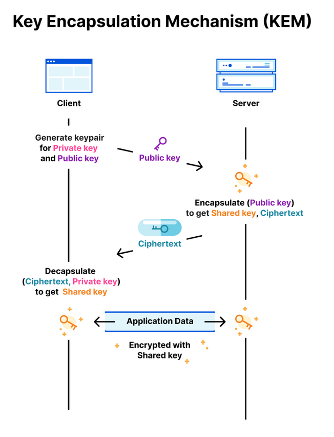

<!--
Imagen: https://blog.cloudflare.com/content/images/2022/10/image3.png
-->

# Implementación de la criptografía post-cuántica
<!-- _class: lead -->

## Problemas matemáticos en los que se basa la criptografía post-cuántica

- Códigos correctores de errores
- Retículos
- Funciones de hash con y sin estado
- Polinomios multivariantes cuadráticos
- Isogenias definidas sobre curvas elípticas


---


Familia|Ventajas|Inconvenientes
--|--|--
Retículos|Rápido y claves pequeñas|Son muy nuevas
Isogenias|Claves pequeñas, texto cifrado pequeño|Muy lentas
Códigos|Rápidas y texto cifrado pequeño, muy estudiadas|Claves muy grandes
Basadas en hash|Clve pequeña, muy estudiadas|Firmas muy grandes, lentas
Multivariante|Rápidas y claves privadas pequeñas|Clave pública muy grande


## Algoritmos
<!-- _class: smallest-font -->

Tipo|Nombre|Problema matemático|Notas
--|--|--|--
KEM|CRYSTALS-Kyber|Retículo estructurado|**Seleccionado por el NIST: FIPS 203**
KEM|FrodoKEM|Retículo no estructurado|⚠ Descartado por el NIST por lento, pero otras entidades aún lo recomiendan|Sigue en concurso del NIST
KEM|BIKE|Códigos cuasi-ciclicos|No presentado en tercera ronda, pero será evaluado
KEM|HQC|Códigos cuasi-ciclicos|No presentado en tercera ronda, pero será evaluado
KEM|Classic McEliece|Códigos de Goppa|⚠ Clave demasiado grande
KEM|SIKE|Isogenias|☠ [Roto con computación tradicional](https://eprint.iacr.org/2022/975) en 2022
Firma|CRYSTALS-Dilithium|Retículo estructurado|**Seleccionado por el NIST: FIPS 204**
Firma|Falcon|Retículo estructurado|⚠ Descartado por el NIST
Firma|SPHINCS+|Funciones de hash|**Seleccionado por el NIST: FIPS 205**
Firma|XMSS|Funciones de hash|⚠ Descartado por el NIST por no ser general, pero recomendado para aplicaciones específicas

<!-- Todos estos algoritmos están bajo un estudio constante y se están descubriendo ataques existosos a algunos de ellos. Cada uno tiene ventajas y desventajas: manejo de estados, tiempos muy largos, claves largas...  -->

## Comparativas
<!-- _class: smaller-font -->

Comparativa con RSA-2048: intercambio de claves

Algoritmo|Tamaño clave|Tamaño cifrado|Tiempo cifrado|Tiempo KeyGen
--|--|--|--|--
Kyber512|x4|x4|x1|x4000

Comparativa con [Ed25519 (ECDA)](https://en.wikipedia.org/wiki/EdDSA): firmas

Algoritmo|Tamaño clave|Tamaño cifrado|Tiempo firmado|Tiempo verificar
--|--|--|--|--
Dilithium2|x40|x40|x5|x0.5
Falcon512|x30|x10|x8|x0.5
SPHINCS+128|x1|x100|x500|x7

Observa: buscamos las curvas elípticas para conseguir una criptografía asimétrica eficiente, y los nuevos protocolos son aún más ineficientes

> Fuente: charla "Criptografía postcuántica: presente y futuro" de Adrián Ranea en Jornadas CCN-CERT 2023

## Tiempo de transición
<!-- _class: with-success -->

- Aún no existe una computadora cuántica con la potencia suficiente como para romper RSA, ni se sabe cuándo la tendremos: [Quantum threat timeline report](https://globalriskinstitute.org/publication/2023-quantum-threat-timeline-report/)
- Existe una ["carrera cuántica"](https://www.wired.com/story/quantum-supremacy-google-china-us/) que están llevando China, USA, Europa por ser los primeros en tener una tecnología útil
- Problema: *store now, decrypt later*
- Históricamente, las transiciones son lentas: 3DES, MD5 aún están entre nosotros más de una década después de que no se recomiende su uso
- **Ya sabemos qué algoritmos post-cuánticos vamos a utilizar**

La recomendación es empezar ya con la transición

> [Recomendaciones para una transición postcuántica segura](https://www.ccn.cni.es/index.php/es/docman/documentos-publicos/boletines-pytec/495-ccn-tec-009-recomendaciones-transicion-postcuantica-segura/file). CCN-TEC 009. Diciembre 2022

## Retos de implementación

- Los nuevos algoritmos no están soportados por sistemas antiguos: servidores, clientes, hardware...
- No son tan eficientes como los algoritmos clásicos
- Los nuevos algoritmos son más complejos, y eso también significa que son más difícil de implementar  y proteger
    - Retículos: Fallos en el desencriptado
    - Retículos: Necesitan generadores aleatorios gaussianos
    - FALCON: aritmética en coma flotante
    - BIKE: descifra en tiempo variable
    - XMSS: necesita guardar estado entre firmas

## Esquemas híbridos

Mientras implementamos la criptografía post-cuántica completa podemos usar esquemas híbridos

- Hash: incluir dos valores, hash tradicional y post-cuántico
- Firmas: incluir dos firmas, firma tradicional y post-cuántica
- KEM: cascada de funciones de derivación de clave clásicas, post-cuánticas

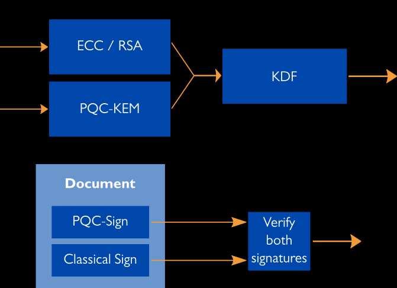

> https://xiphera.com/hybrid-models-connect-the-post-quantum-with-the-classical-security/

## Plan de migración

1. Determinar la información que debo proteger y hasta cuándo.
    - Cifrado: largos periodos
    - Firma: hasta caducidad de certificado (unos 2 años)
1. Realizar un inventario exhaustivo de productos y cifradores que empleo para proteger mi información y mis activos.
1. Analizar si tales productos y cifradores son o no resistentes a la computación cuántica.
1. Establecer un plan de migración a las soluciones híbridas
1. Decidir qué nuevos productos necesito y cuánto tiempo requiero para su adquisición y despliegue.
1. Determinar cuánto tiempo tengo disponible

> [Recomendaciones para una transición postcuántica segura](https://www.ccn.cni.es/index.php/es/docman/documentos-publicos/boletines-pytec/495-ccn-tec-009-recomendaciones-transicion-postcuantica-segura/file). CCN-TEC 009. Diciembre 2022

--- 

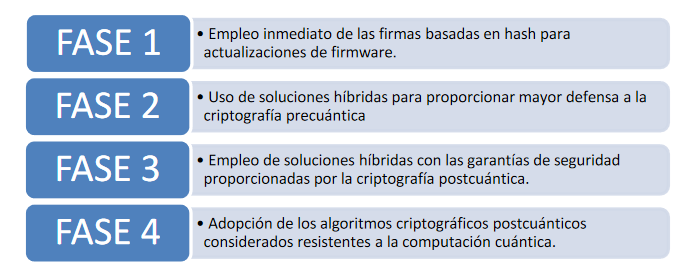

> [Recomendaciones para una transición postcuántica segura](https://www.ccn.cni.es/index.php/es/docman/documentos-publicos/boletines-pytec/495-ccn-tec-009-recomendaciones-transicion-postcuantica-segura/file). CCN-TEC 009. Diciembre 2022

<!--

Para firmar las actualizaciones de firmaware se recomienda utilizar ya firmados post-cuánticos. El hardware puede estar funcionando durante décadas, muy posiblemente hasta después de que existan las computadoras cuánticas

Los sitemas híbridos utilizan tanto criptografía cuánticas como post-cuántica, adaptando primero los algoritmos que puedan ser más sencillos (como D-H)

-->

## Ejemplos de migración
<!-- _class: with-success -->

AWS, Signal y otros ya permiten conectarse a sus servidores usando criptografía post-cuántica

- Signal: https://signal.org/blog/pqxdh/
- Amazon AWS: https://aws.amazon.com/security/post-quantum-cryptography/
- Google: https://security.googleblog.com/2024/08/post-quantum-cryptography-standards.html
- Microsoft: https://www.microsoft.com/en-us/research/project/post-quantum-tls/
- [Chrome soporta ML-KEM desde la versión 131](https://security.googleblog.com/2024/09/a-new-path-for-kyber-on-web.html) (noviembre 2024)

No sabemos cuándo llegará la computación cuántica, pero **ya podemos usar** criptografía post-cuántica

# Resumen y referencias
<!-- _class: lead -->

## Resumen
<!-- _class: smaller-font -->

- La computación cuántica permite resolver ciertos problemas más rápidamente de lo que sabemos hacerlo con computación tradicional
- Cuando llegue la computación cuántica:
    - AES, ChaCha, criptografía simétrica: deberá **doblar el tamaño de las claves usadas**
    - SHA, funciones de hash: deberán **casi doblar los bits de salida**
    - RSA, D-H, curvas elípticas, criptografía asimétrica, intercambio de claves y firmado: **obsoleta**, hay que buscar alternativas
- **Criptografía post-cuántica**: sistemas criptográficos que usarán **las computadoras clásicas** para protegerse de las hipotéticas computadoras cuánticas
- Agosto de 2024: el NIST ya ha estandarizado los algoritmos post-cuánticos que recomienda, y se espera que el resto de agencias tengan opiniones similares
- No sabemos cuándo llegará la computación cuántica, pero **ya podemos usar** criptografía post-cuántica
- El periodo de transición puede ser muy largo y se recomienda empezar ya la migración a criptografía post-cuántica

## Referencias
<!-- _class: smaller-font -->

Criptografía post-cuántica:

- "Computación Cuántica: Cómo afectará a la Criptografía actual y cómo podemos adaptarnos", TFM de Alicia Marybel Díaz Zea en la VIU, 2022-2023
- [Recomendaciones para una transición postcuántica segura](https://www.ccn.cni.es/index.php/es/docman/documentos-publicos/boletines-pytec/495-ccn-tec-009-recomendaciones-transicion-postcuantica-segura/file). CCN-TEC 009. Diciembre 2022
- [How Quantum Computers Break Encryption | Shor's Algorithm Explained ](https://www.youtube.com/watch?v=lvTqbM5Dq4Q)
 - [Deep dive into a post-quantum key encapsulation algorithm](https://blog.cloudflare.com/post-quantum-key-encapsulation/), Goutam Tamvada, Sofía Celi, 2022

Generales sobre computación cuántica:

- [What is a Qubit? - A Beginner's Guide to Quantum Computing](https://www.youtube.com/watch?v=90za6mazNps)
- [Quantum computing for the determined](https://www.youtube.com/playlist?list=PL1826E60FD05B44E4)
- [How to Detect Quantum Bullshit ](https://www.youtube.com/watch?v=uKVJEuVkPvw), Sabine Hossenfelder 2024 


# ¡Gracias!
<!-- _class: last-slide -->
