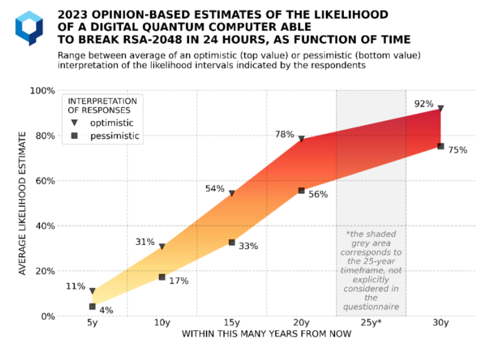

# Criptografía Post-cuántica
<!-- _class: first-slide -->

Juan Vera del Campo - <juan.vera@professor.universidadviu.com>

## Hoy hablamos de...
<!-- _class: cool-list toc -->

1. [Computación cuántica](#3)
1. [Criptografía post-cuántica](#12)
1. [Resumen y referencias](#24)

# Computación Cuántica
<!-- _class: lead -->

Una introducción a vista de pájaro

<!-- Nota: no pretenderé explicar cómo funciona la computación cuántica, sinó cómo afectará a la criptografía del futuro próximo -->

## Computación cuántica

- La computación cuántica utiliza principios de la mecánica cuántica para realizar cálculos
- Propuesta por Richard Feynman en la década de 1980, sugirió que las computadoras cuánticas podrían usarse para simular el comportamiento de sistemas cuánticos complejos, como moléculas o materiales, de manera más eficiente que las computadoras clásicas
- Una misma tarea puede tener diferente complejidad en computación clásica comparada con la que tiene en computación cuántica

## Q-bit

La unidad de la computación cuántica es el Q-bit. A diferencia de los bits clásicos, que solo pueden tomar los valores de 0 o 1, los Q-bit pueden existir en múltiples estados simultáneamente

Cuando se miden los Q-bits, el resultado es probabilístico. **Las computadoras cuánticas son no-deterministas**

## Comparación con la computación tradicional

- La computación tradicional y la cuántica resuelven los mismos problemas, pero la cuántica permite resolver [problemas complejos](04-complejidad.html) con una rapidez que no sabemos alcanzar con computación tradicional
- [¡No todos los problemas son complejos!](https://en.wikipedia.org/wiki/Quantum_supremacy)
- La computación cuántica da un **resultado probabilístico**. Es decir, "esto es una solución, probablemente". Repetir el algoritmo varias veces permite reducir la probabilidad de error

## ¿Qué es lo que NO HACEN las computadoras cuánticas?
<!-- _class: with-success -->

- No traerán mejores gráficas a los juegos
- No nos traerán mejores aplicaciones informáticas
- No traerán una red Internet más rápida

Es poco probable que tengamos una computadora cuántica en nuestros escritorios alguna vez

## Las computadoras cuánticas NO HACEN criptografía cuántica
<!-- _class: with-warning -->

- La criptografía cuántica usa la física cuántica para crear un canal seguro
- Cuidado: ¡no es necesario un computador cuántico para usar criptografía cuántica!
- Ejemplo: [distribución de claves cuántica](https://www.drishtiias.com/daily-updates/daily-news-analysis/quantum-key-distribution) (QKD)

En esta clase no hablaremos de criptografía cuántica sinó post-cuántica, que definiremos más adelante

> https://en.wikipedia.org/wiki/Quantum_cryptography

<!--
La criptografía cuántica utiliza los principios cuánticos para crear un canal de comunicaciones seguro. ¡No se necesita una computadora cuántica para usar la criptografía cuántica

En el ejemplo, se usa un canal cuántico para distribuir una clave criptográfica tradicional que se puede usar, por ejemplo, para AES. En un canal cuántico, "el acto de medir cambia lo que se mide", así que Alice y Bob se darán cuanta si hay alguien escuchando el canal, y no usarán esa clave para cifrar

En esta clase no hablaremos de criptografía cuántica
-->

## Entonces, ¿qué hacen las computadores cuánticas?

- Mejoras en los entrenamientos de inteligencia artificial
- Mejoras en los sistemas de optimización
- Sistemas de recomendación de compras y finanzas
- **Resolver los problemas matemáticos en los que se basa la criptografía actual mucho más rápido de lo esperado**

> https://research.aimultiple.com/quantum-computing-applications/

<!-- En la imagen, IBM-Q quantum computer en la conferencia Supercomputing 18 de Dallas, Texas  -->

## Algoritmos ejecutados por computadoras cuánticas
<!-- _class: with-success -->

- [Algoritmo de Grover](https://es.wikipedia.org/wiki/Algoritmo_de_Grover) (1996): búsqueda exahustiva en una secuencia no ordenada con mejora cuadrática. "Inversión de funciones". AES-128 en $O(2^{64})$
- [Algoritmo de Shor](https://es.wikipedia.org/wiki/Algoritmo_de_Shor) (1999): permite encontrar factores de un número de una manera eficiente. RSA, ECC y D-H en $O(polinomimal)$

Son algoritmos probabilísticos: dan la respuesta correcta con una cierta probabilidad, y la probabilidad de fallo puede ser disminuida repitiendo el algoritmo

Cuando se implementen estos algoritmos en una computadora cuántica, cambiarán totalmente la criptografía actual

<!-- Observa: ya teníamos algoritmos antes de tener el primer computador cuántico! -->

## ¿Cuánto tiempo llevará tener una computadora cuántica?

> [Quantum Threat Timeline Report](https://globalriskinstitute.org/publication/2022-quantum-threat-timeline-report/) Global Risk Institute, Noviembre 2022

# Criptografía Post-cuántica
<!-- _class: lead -->

## Efectos de la computación cuántica en criptografía clásica

Algoritmo|Tipo|Algoritmo|Impacto
--|--|--|--
AES|Simétrico|Grover|⚠ Tamaño de claves x2
SHA|Función de hash|Grover|⚠ Tamaño de salida x1.5
RSA|Asimétrico, firmas|Shor|☠ Rota, reemplazar
D-H|Asimétrico, intercambio de claves|Shor|☠ Rota, reemplazar
Elípticas|ECDH, ECDSA...|Shor|☠ Rota, reemplazar

<!--
Recuerda:

- el cifrado simétrico (AES, ChaCha hash) se puede romper simplemente buscando qué texto original daría un cifrado. Eso es una búsqueda exhaustiva, y la computación cuántica puede hacer más rápidamente que la tradicional
- La seguridad de RSA se basa en que no sabemos hacer factorización de números primos rápidamente con computadoras clásicas, pero sí que sabremos resolverlo muy rápidamente con computadoras cuánticas
- D-H se basa en el problema del logaritmo discreto y tiene el mismo problema
- Los sistemas de curvas elípticas también tendrán el mismo problema

Aunque la criptografía simétrica resistirá, necesitamos sustituir la criptografía asimétrica
-->

## Criptografía post-cuántica
<!-- _class: with-success bigger-font -->

- Intercambio de claves post-cuántico, para sustituir a D-H y RSA
- Esquemas de firma digital post-cuánticos, para sustituir a RSA, ECDSA
- Doblar las longitudes de la clave para simétrica y hash

Criptografía post-cuántica: sistemas criptográficos que usarán **las computadoras clásicas** cuando existan las computadoras cuánticas

<!--
Fíjate bien: llamamos criptografía post-cuántica a la criptografía que ejecutarán las computadoras clásicas, no las cuánticas
-->

## Tiempo de transición
<!-- _class: with-success -->

- Aún no existe una computadora cuántica con la potencia suficiente como para romper RSA, ni se sabe cuándo la tendremos
- Existe una "carrera cuántica" que están llevando China, USA, Europa por ser los primeros en tener una tecnología útil
- Problema: *store now, decrypt later*
- Históricamente, las transiciones son lentas: 3DES, MD5 aún están entre nosotros más de una década después de que no se recomiende su uso

La recomendación es empezar ya con la transición

> [Recomendaciones para una transición postcuántica segura](https://www.ccn.cni.es/index.php/es/docman/documentos-publicos/boletines-pytec/495-ccn-tec-009-recomendaciones-transicion-postcuantica-segura/file). CCN-TEC 009. Diciembre 2022

## Concurso del NIST

En 2016, el NIST (instituo de estandarización de EEUU), [convocó un concurso](https://csrc.nist.gov/projects/post-quantum-cryptography) para evaluar los mejores algoritmos post-cuánticos que le presentasen:

- Cifrado asimétrico
- Mecanismos de encapsulación de claves o KEM (*Key Encapsulation
Mechanism*)
- Firmas digitales

Estamos en la cuarta ronda de selección y se espera que sean estándares FIPS 204-205 en 2024

<!--
EL intercambio de claves clásico podría hacerse acordando una clave (Diffie-Hellman) o simplemente enviando una clave simétrica cifrada con RSA. Esto último es lo que se llama "encapsulamiento de clave"
-->

## Problemas matemáticos en los que se basa la criptografía post-cuántica

- Códigos correctores de errores
- Retículos
- Funciones de hash con y sin estado
- Polinomios multivariantes cuadráticos
- Isogenias definidas sobre curvas elípticas

## Algoritmos
<!-- _class: smallest-font -->

Tipo|Nombre|Problema matemático|Notas
--|--|--|--
KEM|CRYSTALS-Kyber|Retículo estructurado|Sigue en concurso del NIST
KEM|FrodoKEM|Retículo no estructurado|⚠ Descartado por el NIST por lento, pero otras entidades aún lo recomiendan|Sigue en concurso del NIST
KEM|BIKE|Códigos cuasi-ciclicos|No presentado en tercera ronda, pero será evaluado
KEM|HQC|Códigos cuasi-ciclicos|No presentado en tercera ronda, pero será evaluado
KEM|Classic McEliece|Códigos de Goppa|⚠ Clave demasiado grande
KEM|SIKE|Isogenias|☠ [Roto con computación tradicional](https://eprint.iacr.org/2022/975) en 2022
Firma|CRYSTALS-Dilithium|Retículo estructurado|Sigue en concurso del NIST
Firma|Falcon|Retículo estructurado|Sigue en concurso del NIST
Firma|SPHINCS|Funciones de hash|Sigue en concurso del NIST
Firma|XMSS|Funciones de hash|⚠ Descartado por el NIST por no ser general, pero recomendado para aplicaciones específicas

Tras la tercera ronda, el NIST parece preferir algoritmos no basados en retículos estructurados y ha abierto una nueva consulta para algoritmos de firma

<!-- Todos estos algoritmos están bajo un estudio constante y se están descubriendo ataques existosos a algunos de ellos. Cada uno tiene ventajas y desventajas: manejo de estados, tiempos muy largos, claves largas...  -->

## Comparativas
<!-- _class: smaller-font -->

Comparativa con RSA-2048: intercambio de claves

Algoritmo|Tamaño clave|Tamaño cifrado|Tiempo cifrado|Tiempo KeyGen
--|--|--|--|--
Kyber512|x4|x4|x1|x4000

Comparativa con [Ed25519 (ECDA)](https://en.wikipedia.org/wiki/EdDSA): firmas

Algoritmo|Tamaño clave|Tamaño cifrado|Tiempo firmado|Tiempo verificar
--|--|--|--|--
Dilithium2|x40|x40|x5|x0.5
Falcon512|x30|x10|x8|x0.5
SPHINCS+128|x1|x100|x500|x7

> Fuente: charla "Criptografía postcuántica: presente y futuro" de Adrián Ranea en Jornadas CCN-CERT 2023

## Nuevos requisitos de implementación

Los nuevos algoritmos son más complejos, y eso también significa que son más difícil de implementar  y proteger

- Retículos: Fallos en el desencriptado
- Retículos: Necesitan generadores aleatorios gaussianos
- FALCON: aritmética en coma flotante
- BIKE: descifra en tiempo variable
- XMSS: necesita guardar estado entre firmas

## Esquemas híbridos

- Hash: incluir hash tradicional y post-cuántico
- Firmas: incluir firma tradicional y post-cuántica
- KEM: cascada de funciones de derivación de clave clásicas, post-cuánticas

## Plan de migración

1. Determinar la información que debo proteger y hasta cuándo.
    - Cifrado: largos periodos
    - Firma: hasta caducidad de certificado (unos 2 años)
1. Realizar un inventario exhaustivo de productos y cifradores que empleo para proteger mi información y mis activos.
1. Analizar con rigor si tales productos y cifradores son o no resistentes a la computación cuántica.
1. Establecer un plan de migración a los soluciones híbridos
1. Decidir qué nuevos productos necesito y cuánto tiempo requiero para su adquisición y despliegue.
1. Determinar cuánto tiempo tengo disponible

> [Recomendaciones para una transición postcuántica segura](https://www.ccn.cni.es/index.php/es/docman/documentos-publicos/boletines-pytec/495-ccn-tec-009-recomendaciones-transicion-postcuantica-segura/file). CCN-TEC 009. Diciembre 2022

--- 

> [Recomendaciones para una transición postcuántica segura](https://www.ccn.cni.es/index.php/es/docman/documentos-publicos/boletines-pytec/495-ccn-tec-009-recomendaciones-transicion-postcuantica-segura/file). CCN-TEC 009. Diciembre 2022

<!--

Para firmar las actualizaciones de firmaware se recomienda utilizar ya firmados post-cuánticos. El hardware puede estar funcionando durante décadas, muy posiblemente hasta después de que existan las computadoras cuánticas

Los sitemas híbridos utilizan tanto criptografía cuánticas como post-cuántica, adaptando primero los algoritmos que puedan ser más sencillos (como D-H)

-->

# Resumen y referencias
<!-- _class: lead -->

## Resumen

- La criptografía cuántica permite resolver ciertos problemas más rápidamente de lo que sabemos hacerlo con computación tradicional
- Cuando llegue:
    - La criptografía simétrica actual deberá doblar el tamaño de las claves usadas
    - Las funciones de hash deberán casi doblar los bits de salida
    - La criptografía asimétrica (intercambio de claves y firmado) estará obsoleta
- **Criptografía post-cuántica**: sistemas criptográficos que usarán **las computadoras clásicas** cuando existan las computadoras cuánticas
- Aún no se han estandarizado los algoritmos post-cuánticos que usaremos. El NIST está aún evaluando las propuestas
- El periodo de transición puede ser muy largo, y se recomienda migrar inmediatamente a criptografía post-cuántica, empezando por aquellos algoritmos más sencillos de cambiar

## Referencias

- "Computación Cuántica: Cómo afectará a la Criptografía actual y cómo podemos adaptarnos", TFM de Alicia Marybel Díaz Zea en la VIU, 2022-2023
- [Quantum Computing 2023 Update](https://www.youtube.com/watch?v=dOBe5pES30k)
- [What is a Qubit? - A Beginner's Guide to Quantum Computing](https://www.youtube.com/watch?v=90za6mazNps)
- [Quantum computing for the determined](https://www.youtube.com/playlist?list=PL1826E60FD05B44E4)
- [Recomendaciones para una transición postcuántica segura](https://www.ccn.cni.es/index.php/es/docman/documentos-publicos/boletines-pytec/495-ccn-tec-009-recomendaciones-transicion-postcuantica-segura/file). CCN-TEC 009. Diciembre 2022

# ¡Gracias!
<!-- _class: last-slide -->