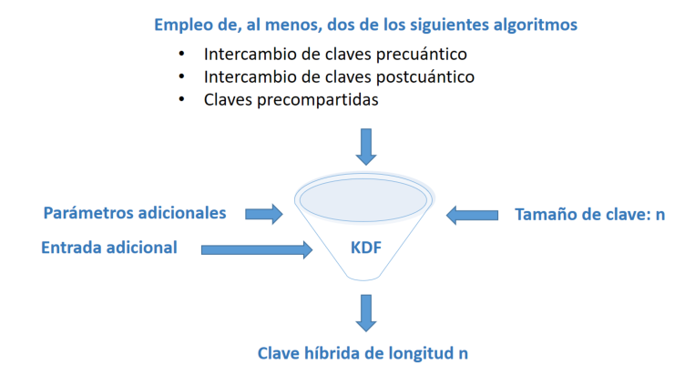

<style>
    /* You can add custom style here. VSCode supports this.
    Other editor might need these custom code in
    the YAML header: section: | */
	/* section header { display: none; } */
	/* section footer { display: none; } */
    section.bigger-font {
        font-size: 300%
    }
</style>

# Criptografía Post-cuántica
<!-- _class: first-slide -->

Juan Vera del Campo - <juan.vera@professor.universidadviu.com>

# Como decíamos ayer...

La seguridad de la criptografía asimétrica se basa en que no conocemos algoritmos rápidos para resolver problemas matemáticos como la factorización de números primos:

$15 = 5 \cdot 3$

$3248 = 29 \cdot 7 \cdot 2^4$

$8012012832918391238193192198219981928192889382938998982 = ?$

El algoritmo conocido para los computadores actuales es [GNFS](https://en.wikipedia.org/wiki/General_number_field_sieve):

$$
O(2^{2,774·(b_n^{1/3})(ln(b_n)^{2/3})})
$$

---

Factorizar este número con un computador actual lleva millones de años...

```
149802948092842184098210482184208402814092814092814902882314802
840182098201895139476316917369371469130591039583109734876139819
538591385031850135124214213434125103691373140750917604137601347
603176031760317603176136913701364316013860319760193760931707097
017436013760317460316703176031786136498314691376931763176931876
981376938176931876931769137693187613768713867136873187513769316
013463160316039187683714681397689713489671390486791837609138769
013876089317693187690137691374603918768931769137631769137691301
346871306871384761937693814708173468713689317693176814758134761
376134786139671396731467318967348769831476837639176913476931763
196731769317691384768931476831746083174687138671397613476317613
769347476138976831769831746983176731976913876091376891376981376
913476983174691347683476193769134769314769137693147691347691347
691387683147693147683148761364706946013746013681141213083928139
```

Pero... ¿y si existiesen otro tipo de computadoras que lo factorizasen en horas?

## Hoy hablamos de...
<!-- _class: cool-list toc -->

1. [Computación Cuántica](#5)
1. [Criptografía Post-cuántica](#20)
1. [Resumen y referencias](#34)

# Computación Cuántica
<!-- _class: lead -->

Una introducción a vista de pájaro

<!-- Nota: no pretenderé explicar cómo funciona la computación cuántica, sinó cómo afectará a la criptografía del futuro próximo -->

## Computación cuántica


- La computación cuántica utiliza principios de la mecánica cuántica para realizar cálculos
- [Richard Feynman](https://es.wikipedia.org/wiki/Richard_Feynman) sugirió (~1980) que se podrían aprovechar comportamientos cuánticos para realizar cálculos de manera más eficiente que las computadoras clásicas
- Ha sido un estudio solo teórico durante 50 años, pero ahora empezamos a poder construirlas

> [¿Qué es y cómo funciona la COMPUTACIÓN CUÁNTICA?](https://www.youtube.com/watch?v=YpYuBEzfRlM)

## Q-bit


La unidad de la computación cuántica es el Q-bit, que puede existi en múltiples estados simultáneamente. 0 y 1 a la vez: *superposición*

Pueden empaquetar más información: $10^{48} bits \equiv 160 qbits$

Intuitivamente: podemos aprovechar la superposición para probar varias soluciones a la vez con un solo q-bit

> [Computación Cuántica: la Guía completa WIRED](https://es.wired.com/articulos/computacion-cuantica-la-guia-completa-wired-computadoras-qubits)


## Comparación con la computación tradicional

- La computación cuántica permite resolver [problemas complejos](04-complejidad.html) con una rapidez que no sabemos alcanzar con computación tradicional: **supremacía cuántica**
- Cuidado: [¡no todos los problemas son complejos!](https://en.wikipedia.org/wiki/Quantum_supremacy)
- La computación cuántica da un **resultado probabilístico**. Es decir, "esto es una solución, probablemente". Repetir el algoritmo varias veces permite reducir la [probabilidad de error](https://es.wikipedia.org/wiki/Correcci%C3%B3n_de_errores_cu%C3%A1ntica)


<!--
Si un problema no es complejo, utilizar computación cuántica para solucionarlo en "matar moscas a cañonazos"

Por eso es poco probable que veamos computadoras cuánticas en nuestros hogares: en nuestra vida diaria no necesitamos resolver problemas matemáticamente complejos
-->

## ¿Qué es lo que NO MEJORAN las computadoras cuánticas?
<!-- _class: with-success -->

- No traerán juegos con mejores gráficas
- No nos traerán mejores aplicaciones informáticas
- No traerán una Internet más rápida
- Tardarán lo mismo en realizar la mayor parte de las tareas, pero son astronómicamente más caras


Es poco probable que tengamos una computadora cuántica en nuestros escritorios

## La computación cuántica NO ES criptografía cuántica
<!-- _class: with-warning -->

- La **criptografía cuántica** usa la física cuántica para crear un canal seguro
- ¡No es necesario tener un computador cuántico para usar criptografía cuántica!
- Ejemplo: [distribución de claves cuántica](https://www.cse.wustl.edu/~jain/cse571-07/ftp/quantum/) (QKD)


En esta clase no hablaremos de criptografía cuántica sinó de la post-cuántica, que definiremos más adelante

> https://en.wikipedia.org/wiki/Quantum_cryptography

<!--
La criptografía cuántica utiliza los principios cuánticos para crear un canal de comunicaciones seguro. ¡No se necesita una computadora cuántica para usar la criptografía cuántica

En el ejemplo, se usa un canal cuántico para distribuir una clave criptográfica tradicional que se puede usar, por ejemplo, para AES. En un canal cuántico, "el acto de medir cambia lo que se mide" (principio de incertidumbre), así que Alice y Bob se darán cuanta si hay alguien escuchando el canal, y no usarán esa clave para cifrar

En esta clase no hablaremos de criptografía cuántica
-->

## Entonces... ¿qué hacen las computadores cuánticas?

La computación cuántica permite ejecutar algoritmos de búsquedas más rápidamente que la computación tradicional

- Entrenamientos de inteligencia artificial
- Sistemas de optimización industrial
- Sistemas de recomendación de compras y finanzas
- **Resolve los problemas matemáticos en los que se basa la criptografía actual mucho más rápido de lo esperado**


> [Top 20 Quantum Computing Use Cases & Applications in 2024](https://research.aimultiple.com/quantum-computing-applications/)
> [How to Detect Quantum Bullshit ](https://www.youtube.com/watch?v=uKVJEuVkPvw)


<!-- En la imagen, IBM-Q quantum computer en la conferencia Supercomputing 18 de Dallas, Texas

Para pensar: ¿realmente necesitamos resolver algoritmos de optimización tan rápido? ¿No nos valen los algoritmos tradicionales?
-->

## Algoritmos ejecutados por computadoras cuánticas
<!-- _class: with-success -->

- [Algoritmo de Grover](https://es.wikipedia.org/wiki/Algoritmo_de_Grover) (1996)
- [Algoritmo de Shor](https://es.wikipedia.org/wiki/Algoritmo_de_Shor) (1999)

Son algoritmos probabilísticos: dan la respuesta correcta con una cierta probabilidad, y la probabilidad de fallo puede ser disminuida repitiendo el algoritmo

Cuando se implementen estos algoritmos en una computadora cuántica, cambiarán totalmente la criptografía actual

<!-- Observa: ya teníamos algoritmos antes de tener el primer computador cuántico! -->

## Algoritmo de Grover
<!-- _class: with-warning -->

 Búsqueda exahustiva en una secuencia no ordenada con mejora cuadrática. 
 
 Efecto: "raíz cuadrada de tiempo" de los algoritmos clásicos. AES-128 en $O(2^{64})$

 

 El algoritmo de Grover debilita la criptografía de clave privada y hashes (AES, SHA256...) diviendo su fortaleza entre 2

> https://www.researchgate.net/figure/A-comparison-of-Grover-Long-algorithm-with-different-success-rates-1-d-2-The-query_fig3_356928043

## Algoritmo de Shor
<!-- _class: with-warning -->

Permite encontrar factores de un número de una manera eficiente. RSA, ECC y D-H en $O(polinomimal)$


El algoritmo de Shor **rompe** la criptografía de clave pública (D-H, RSA...)

> https://www.researchgate.net/figure/Shors-algorithm-has-exponential-acceleration-effect-compared-with-classical-algorithm_fig1_359643607


<!--
Fíjate: da igual que aumentemos el tamaño de la clave, llega un momento en que resolver RSA se vuelve casi constante, independientemente de cuántos bits tenga la clave
-->

---

[](https://www.youtube.com/watch?v=lvTqbM5Dq4Q)

> [How Quantum Computers Break Encryption | Shor's Algorithm Explained ](https://www.youtube.com/watch?v=lvTqbM5Dq4Q)

<!--

El vídeo contiene detalles físicos y matemáticos de cómo funciona en algoritmo de Shor en sistemas cuánticos y es razonablemente sencillo

-->

## Supremacía cuántica
<!-- _class: with-info -->

Objetivo: que todo esto deje de ser teórico

Supremacía cuántica: un computador cuántico que resuelva un problema real más rápidamente que un computador tradicional


Aún no hemos alcanzado la supremacía cuántica... y no está claro que algún día lo logremos

## Efectos de la computación cuántica en criptografía clásica

Algoritmo|Tipo|Algoritmo|Defensa
--|--|--|--
AES|Simétrico|Grover|⚠ Tamaño de claves x2
SHA|Función de hash|Grover|⚠ Tamaño de salida x1.5
RSA|Asimétrico, firmas|Shor|☠ Rota, reemplazar
D-H|Asimétrico, intercambio de claves|Shor|☠ Rota, reemplazar
Elípticas|ECDH, ECDSA...|Shor|☠ Rota, reemplazar

<!--
Recuerda:

- el cifrado simétrico (AES, ChaCha hash) se puede romper simplemente buscando qué texto original daría un cifrado. Eso es una búsqueda exhaustiva, y la computación cuántica puede hacer más rápidamente que la tradicional
- La seguridad de RSA se basa en que no sabemos hacer factorización de números primos rápidamente con computadoras clásicas, pero sí que sabremos resolverlo muy rápidamente con computadoras cuánticas
- D-H se basa en el problema del logaritmo discreto y tiene el mismo problema
- Los sistemas de curvas elípticas también tendrán el mismo problema

Aunque la criptografía simétrica resistirá, necesitamos sustituir la criptografía asimétrica
-->


## ¿Cuánto tiempo llevará tener una computadora cuántica?


> [Quantum Threat Timeline Report](https://globalriskinstitute.org/publication/2022-quantum-threat-timeline-report/) Global Risk Institute, Noviembre 2022

## Store Now, Decrypt Later

"Guarda ahora los datos, que los descifraremos cuando llegue la computación cuántica"

- https://www2.deloitte.com/us/en/pages/about-deloitte/articles/press-releases/harvest-now-decrypt-later-attacks-pose-security-concern-quantum-computing.html
- https://www.siliconrepublic.com/enterprise/quantum-apocalypse-store-now-decrypt-later-encryption

# Criptografía Post-cuántica
<!-- _class: lead -->


## Criptografía post-cuántica
<!-- _class: with-success -->

¿Qué haremos cuando llegue la criptogrfía cuántica?

- Doblar las longitudes de la clave para simétrica y hash
- Nuevo intercambio de claves post-cuántico, para sustituir a D-H y RSA
- Nuevo sistemas de firma digital post-cuánticos, para sustituir a RSA y ECDSA

Criptografía post-cuántica: sistemas criptográficos que tendrán que usar **las computadoras clásicas** cuando existan las computadoras cuánticas

<!--
Fíjate bien: llamamos criptografía post-cuántica a la criptografía que ejecutarán las computadoras clásicas, no las cuánticas
-->

## Tiempo de transición
<!-- _class: with-success -->

- Aún no existe una computadora cuántica con la potencia suficiente como para romper RSA, ni se sabe cuándo la tendremos
- Existe una "carrera cuántica" que están llevando China, USA, Europa por ser los primeros en tener una tecnología útil
- Problema: *store now, decrypt later*
- Históricamente, las transiciones son lentas: 3DES, MD5 aún están entre nosotros más de una década después de que no se recomiende su uso

La recomendación es empezar ya con la transición

> [Recomendaciones para una transición postcuántica segura](https://www.ccn.cni.es/index.php/es/docman/documentos-publicos/boletines-pytec/495-ccn-tec-009-recomendaciones-transicion-postcuantica-segura/file). CCN-TEC 009. Diciembre 2022

## Concurso del NIST

En 2016, el NIST (instituo de estandarización de EEUU), [convocó un concurso](https://csrc.nist.gov/projects/post-quantum-cryptography) para evaluar los mejores algoritmos post-cuánticos que le presentasen:

- Cifrado asimétrico
- Mecanismos de encapsulación de claves o KEM (*Key Encapsulation
Mechanism*)
- Firmas digitales

<!--
EL intercambio de claves clásico podría hacerse acordando una clave (Diffie-Hellman) o simplemente enviando una clave simétrica cifrada con RSA. Esto último es lo que se llama "encapsulamiento de clave"
-->

---

El NIST ya ha publicado (agosto de 2024) los estándares post-cuánticos: 

- **ML-KEM**: *Module-Lattice-Based Key-Encapsulation Mechanism*. [FIPS 203](https://nvlpubs.nist.gov/nistpubs/FIPS/NIST.FIPS.203.pdf). Estándar de cifrado general basado en CRYSTALS-Kyber
- **ML-DSA**: *Module-Lattice-Based Digital Signature Algorithm*. [FIPS 204](https://nvlpubs.nist.gov/nistpubs/FIPS/NIST.FIPS.204.pdf). Estándar principal para firmas digitales post-cuánticas. Usa el algoritmo CRYSTALS-Dilithium
- **SLH-DSA**: *Stateless Hash-Based Digital Signature Algorithm*. [FIPS 205](https://nvlpubs.nist.gov/nistpubs/FIPS/NIST.FIPS.205.pdf). Basado en Sphincs+. Es un "backup" para ML-DSA


> https://www.linkedin.com/pulse/nist-releases-first-3-finalized-post-quantum-cryptography-fhpbe/

## Problemas matemáticos en los que se basa la criptografía post-cuántica

- Códigos correctores de errores
- Retículos
- Funciones de hash con y sin estado
- Polinomios multivariantes cuadráticos
- Isogenias definidas sobre curvas elípticas


---


Familia|Ventajas|Inconvenientes
--|--|--
Retículos|Rápido y claves pequeñas|Son muy nuevas
Isogenias|Claves pequeñas, texto cifrado pequeño|Muy lentas
Códigos|Rápidas y texto cifrado pequeño, muy estudiadas|Claves muy grandes
Basadas en hash|Clve pequeña, muy estudiadas|Firmas muy grandes, lentas
Multivariante|Rápidas y claves privadas pequeñas|Clave pública muy grande


## Algoritmos
<!-- _class: smallest-font -->

Tipo|Nombre|Problema matemático|Notas
--|--|--|--
KEM|CRYSTALS-Kyber|Retículo estructurado|**Seleccionado por el NIST: FIPS 203**
KEM|FrodoKEM|Retículo no estructurado|⚠ Descartado por el NIST por lento, pero otras entidades aún lo recomiendan|Sigue en concurso del NIST
KEM|BIKE|Códigos cuasi-ciclicos|No presentado en tercera ronda, pero será evaluado
KEM|HQC|Códigos cuasi-ciclicos|No presentado en tercera ronda, pero será evaluado
KEM|Classic McEliece|Códigos de Goppa|⚠ Clave demasiado grande
KEM|SIKE|Isogenias|☠ [Roto con computación tradicional](https://eprint.iacr.org/2022/975) en 2022
Firma|CRYSTALS-Dilithium|Retículo estructurado|**Seleccionado por el NIST: FIPS 204**
Firma|Falcon|Retículo estructurado|⚠ Descartado por el NIST
Firma|SPHINCS+|Funciones de hash|**Seleccionado por el NIST: FIPS 205**
Firma|XMSS|Funciones de hash|⚠ Descartado por el NIST por no ser general, pero recomendado para aplicaciones específicas

<!-- Todos estos algoritmos están bajo un estudio constante y se están descubriendo ataques existosos a algunos de ellos. Cada uno tiene ventajas y desventajas: manejo de estados, tiempos muy largos, claves largas...  -->

## Comparativas
<!-- _class: smaller-font -->

Comparativa con RSA-2048: intercambio de claves

Algoritmo|Tamaño clave|Tamaño cifrado|Tiempo cifrado|Tiempo KeyGen
--|--|--|--|--
Kyber512|x4|x4|x1|x4000

Comparativa con [Ed25519 (ECDA)](https://en.wikipedia.org/wiki/EdDSA): firmas

Algoritmo|Tamaño clave|Tamaño cifrado|Tiempo firmado|Tiempo verificar
--|--|--|--|--
Dilithium2|x40|x40|x5|x0.5
Falcon512|x30|x10|x8|x0.5
SPHINCS+128|x1|x100|x500|x7

> Fuente: charla "Criptografía postcuántica: presente y futuro" de Adrián Ranea en Jornadas CCN-CERT 2023

## Nuevos requisitos de implementación

Los nuevos algoritmos son más complejos, y eso también significa que son más difícil de implementar  y proteger

- Retículos: Fallos en el desencriptado
- Retículos: Necesitan generadores aleatorios gaussianos
- FALCON: aritmética en coma flotante
- BIKE: descifra en tiempo variable
- XMSS: necesita guardar estado entre firmas

## Esquemas híbridos

Mientras llega la crptografía post-cuántica completa podemos usar esquemas híbridos

- Hash: incluir dos valores, hash tradicional y post-cuántico
- Firmas: incluir dos firmas, firma tradicional y post-cuántica
- KEM: cascada de funciones de derivación de clave clásicas, post-cuánticas



> https://xiphera.com/hybrid-models-connect-the-post-quantum-with-the-classical-security/

## Plan de migración

1. Determinar la información que debo proteger y hasta cuándo.
    - Cifrado: largos periodos
    - Firma: hasta caducidad de certificado (unos 2 años)
1. Realizar un inventario exhaustivo de productos y cifradores que empleo para proteger mi información y mis activos.
1. Analizar si tales productos y cifradores son o no resistentes a la computación cuántica.
1. Establecer un plan de migración a las soluciones híbridas
1. Decidir qué nuevos productos necesito y cuánto tiempo requiero para su adquisición y despliegue.
1. Determinar cuánto tiempo tengo disponible

> [Recomendaciones para una transición postcuántica segura](https://www.ccn.cni.es/index.php/es/docman/documentos-publicos/boletines-pytec/495-ccn-tec-009-recomendaciones-transicion-postcuantica-segura/file). CCN-TEC 009. Diciembre 2022

--- 


> [Recomendaciones para una transición postcuántica segura](https://www.ccn.cni.es/index.php/es/docman/documentos-publicos/boletines-pytec/495-ccn-tec-009-recomendaciones-transicion-postcuantica-segura/file). CCN-TEC 009. Diciembre 2022

<!--

Para firmar las actualizaciones de firmaware se recomienda utilizar ya firmados post-cuánticos. El hardware puede estar funcionando durante décadas, muy posiblemente hasta después de que existan las computadoras cuánticas

Los sitemas híbridos utilizan tanto criptografía cuánticas como post-cuántica, adaptando primero los algoritmos que puedan ser más sencillos (como D-H)

-->

## Ejemplos de migración

AWS, Signal y otros ya permiten conectarse a sus servidores usando criptografía post-cuántica

- Signal: https://signal.org/blog/pqxdh/
- Amazon AWS: https://aws.amazon.com/security/post-quantum-cryptography/
- Google: https://security.googleblog.com/2024/08/post-quantum-cryptography-standards.html

# Resumen y referencias
<!-- _class: lead -->

## Resumen

- La computación cuántica permite resolver ciertos problemas más rápidamente de lo que sabemos hacerlo con computación tradicional
- Cuando llegue:
    - La criptografía simétrica actual deberá doblar el tamaño de las claves usadas
    - Las funciones de hash deberán casi doblar los bits de salida
    - La criptografía asimétrica (intercambio de claves y firmado) estará obsoleta
- **Criptografía post-cuántica**: sistemas criptográficos que usarán **las computadoras clásicas** cuando existan las computadoras cuánticas
- Agosto de 2024: el NIST ya ha estandarizado los algoritmos post-cuánticos que recomienda, y se espera que el resto de agencias tengan opiniones similares
- El periodo de transición puede ser muy largo, y se recomienda empezar ya la migración a criptografía post-cuántica

## Referencias

- "Computación Cuántica: Cómo afectará a la Criptografía actual y cómo podemos adaptarnos", TFM de Alicia Marybel Díaz Zea en la VIU, 2022-2023
- [The Lord of the Keys The Return of Post Quantum Cryptography](https://www.youtube.com/watch?v=LTktugd5pkg) Sandra Guasch, Crytored 2024
- [How Quantum Computers Break Encryption | Shor's Algorithm Explained ](https://www.youtube.com/watch?v=lvTqbM5Dq4Q)
- [What is a Qubit? - A Beginner's Guide to Quantum Computing](https://www.youtube.com/watch?v=90za6mazNps)
- [Quantum computing for the determined](https://www.youtube.com/playlist?list=PL1826E60FD05B44E4)
- [Recomendaciones para una transición postcuántica segura](https://www.ccn.cni.es/index.php/es/docman/documentos-publicos/boletines-pytec/495-ccn-tec-009-recomendaciones-transicion-postcuantica-segura/file). CCN-TEC 009. Diciembre 2022
- [How to Detect Quantum Bullshit ](https://www.youtube.com/watch?v=uKVJEuVkPvw)


# ¡Gracias!
<!-- _class: last-slide -->
