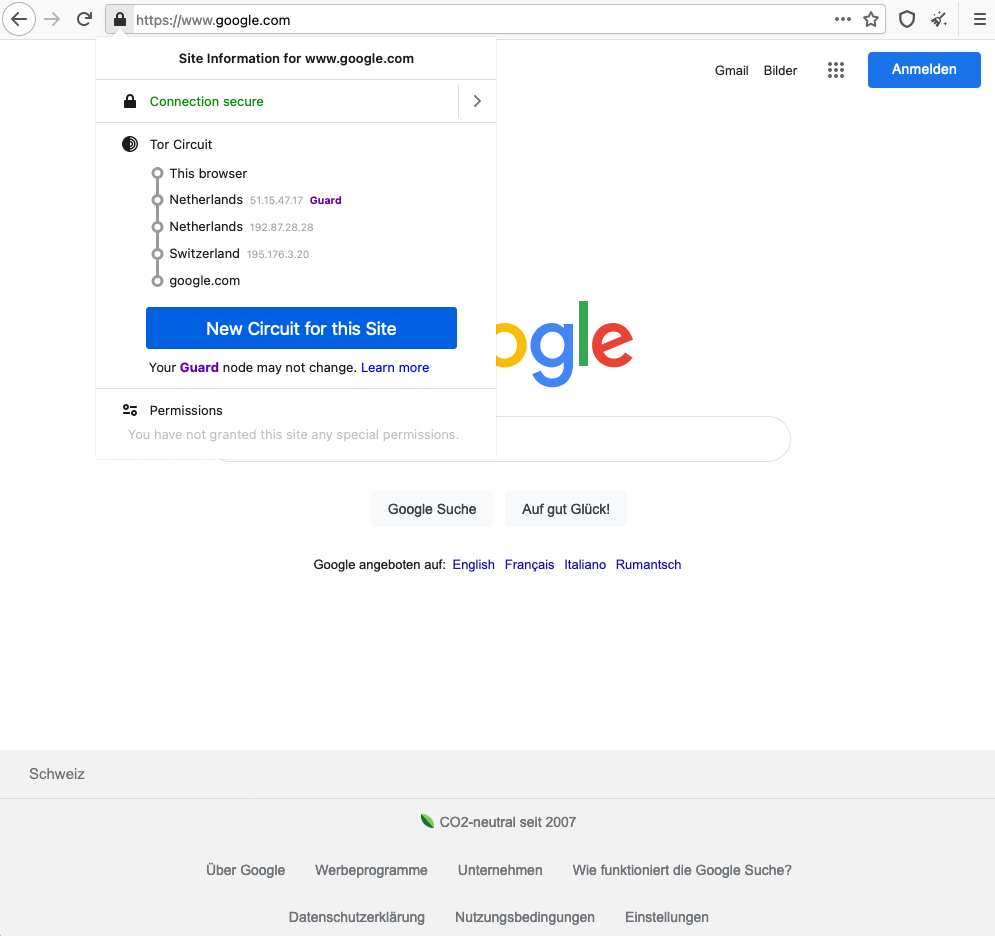

# Criptografía
<!-- _class: first-slide -->

**Tema 11: Servicio de anonimato**

Juan Vera del Campo

juan.vera@campusviu.es

# Como vimos ayer...

Servicios de seguridad:

- Los clásicos: confidencialidad, autenticidad, integridad, no repudio
- Auxiliares: acuerdos de clave, anonimato...

En este tema veremos como ejemplo cómo usa la criptografía el servicio de anonimato. Así aprendemos un nuevo servicio, afianzamos conceptos que ya sabemos y exploramos qué capacidades tienen los adversarios

# Comunicaciones anónimas
<!-- _class: lead -->

---

Los servicios clásicos de seguridad (*confidencialidad*) aseguran que nadie que escuche pasivamente una comunicación sabe qué estamos diciendo. También evitan ataques activos man-in-the-middle (*integridad*, *autenticación*). Todo esto lo ofrece TLS ([tema 9](09-protocolos.html))

**Pero no evitan que se sepa quién habla con quién**: el cifrado se aplica en la capa de aplicación, no estamos cifrando los paquetes de red que incluyen IP origen e IP destino

**Servicio de anonimato**: impide que un atacante sepa quién está hablando con quién

## Estructura de Internet

Los usuarios nos conectamos a un servidor ISP... ¿y después qué?

Los ISPs se conectan entre ellos en puntos neutros nacionales (IXP, *Internet Exchange Point*)

Los IXP se conectan entre ellos con cables submarinos (entre otros)

Los servidores normalmente están "en la nube"

> Puntos neutros: https://es.wikipedia.org/wiki/Punto_neutro
> Ejemplo: Espanix http://www.espanix.net/es/traffic.html

---

Muchos de estos cables submarinos son propiedad de Google

> https://www.submarinecablemap.com/#/

---

Gran parte de la cloud pertenece a Amazon

## ¿Quién sabe a dónde te conectas?
<!-- _class: with-warning -->

- Tu ISP lo sabe
- Tu gobierno, en el punto neutro, sabe todo lo que tenga que salir de tu ISP
- Google, en el cable submarino, sabe todo lo que salga del país
- El gobierno de destino, en su puntro neutro, sabe quién se está conectando
- El ISP del servidor de destino sabe quién se conecta
- El propietario de la cloud en el servidor destino sabe quién se conecta: Amazon, Cloudfare, OVH...
- El servidor destino sabe quién se conecta y qué se está diciendo

Todos estos actores tienen la posibilidad de saber con quién te conectas, pero... ¿lo están haciendo realmente? [Great Chinese Firewall](https://en.wikipedia.org/wiki/Great_Firewall), [ECHELON](https://en.wikipedia.org/wiki/ECHELON), [Data Retention Directive](https://en.wikipedia.org/wiki/Data_Retention_Directive)...

# "No tengo nada que ocultar"
<!-- _class: extra-slide -->

- ¿Tampoco tendrías problemas en instalar una webcam en tu baño? *Ulf Carsson*
- La privacidad debería ser un derecho a menos que se haga algo que levante sospechas legítimas. *Karine Davison*
- Querer mi intimidad NO equivale a tener algo que ocultar. *James Earl Walsh*
- Nada que ocultar... mientras estés 100% de acuerdo con la visión y las políticas de tu gobierno. *Emily Kate Goulding*
- Esta gente está buscando delincuentes. Podrías ser la persona más inocente del mundo, pero si alguien programado para ver patrones de delincuencia analiza tus datos, no va a encontrarte a ti: va a encontrar a un delincuente. *Edward Snowden*
- Si no tenemos nada que ocultar, ¿por qué estamos bajo vigilancia? *Jake Lawler*
- La intimidad no es para esconderse; la intimidad es para protegerse. *Sam Isatlacc*

> https://www.es.amnesty.org/en-que-estamos/blog/historia/articulo/siete-razones-por-las-que-no-tengo-nada-que-ocultar-es-la-respuesta-equivocada-a-la-vigilancia-mas/

# ¿Quién es el contrincante?
<!-- _class: extra-slide -->

- No quiero que mis compañeros de trabajo conozcan mi orientación sexual
- No quiero que el jefe sepa que estoy buscando trabajo
- No quiero que Google sepa que fumo
- No quiero que mis clientes encuentren fotos de la fiesta de anoche
- No quiero que la policía sepa qué he hecho
- No quiero que el gobierno conozca mis ideas políticas

## Solución 1: servidores anónimos y contrincantes
<!-- _class: with-success -->

[ProtonMail](https://protonmail.com/) es un servicio de correo anónimo: nunca le dirá a las autoridades quién envió un correo. **PERO** alguien controlando las comunicaciones sabe quién estaba conectado a Protonmail a la hora de envío de un correo.

ProtonMail puede ser perfectamente válido para tus seguridad: es necesario "identificar a tú contrincante" para decidir el mejor método de protección.

- ¿El contrincante es tu pareja? Es suficiente el modo seguro del navegador
- ¿Es tu empresa? VPN, la empresa tendrá acceso al firewall y sabe que te has conectado a Protonmail
- ¿Es el sistema judicial? ProtonMail no enviará registros a ningún juez
- ¿Es un gobierno? TOR, porque pueden controlar comunicaciones nacionales

<!--
Ojo: decidir la potencia que tiene tu contrincante sirve para todos los sistemas de seguridad que hemos visto.
-->

## Solución 2: CROWDS y k-anonimato

1. Organízate con amigos para crear una red de $k=6$ personas (tú y 5 más). $p=\frac{k-1}{k}=\frac{5}{6}$
1. Si quieres descargar algo, con probabilidad $p$ le pides el favor a un amigo, y con probabilidad $1-p$ lo haces tú.
1. El amigo hace lo mismo: con probabilidad $p$ le pasa el favor a otro (¡puedes ser tú!), y con probabilidad $1-p$ lo hace él.
1. Así hasta que alguien hace la petición.
1. El servidor no sabe quién de las $k$ personas ha hecho la petición: **k-anonimato**.

> Michael Reiter and Aviel Rubin (June 1998). "[Crowds: Anonymity for Web Transactions](https://web.archive.org/web/20051212103028/http://avirubin.com/crowds.pdf)" (PDF). ACM Transactions on Information and System Security.

<!--
OJO: esto funciona si confiamos en todos los amigos. Ellos colaborarán porque les conviene, pero hay que estar seguros de que ninguno de ellos es realmente "un topo". En esta caso, el k-anonimato se reduce en 1.

CROWDS fue un sistema teórico, nunca se ha implementado como tal. Pero esta idea de k-anonimato se aprovecha en muchos otros sistemas. Además, el sistema de CROWDS es óptimo: no se puede tener más anonimato que el ofrecido por CROWDS.

Problema principal de CROWDS: no es posible predecir cuánto tiempo tardará un mensaje en salir de la red. ¡Un mensaje puede estar rebotando dentro de CROWDS para siempre!
-->

## Solución 3: Mix Networks y VPN
<!-- _class: with-warning -->

1. Contrata los servicios de alguien que hace las peticiones por ti: [Mix Network](https://en.wikipedia.org/wiki/Mix_network). Por ejemplo: una VPN
1. La VPN hace las peticiones en nombre de sus $k$ clientes. Para evitar timing attacks, las mezcla entre ellas
1. Ningún observador externo puede correlar peticiones que entran en el Mix y las que salen (¡siempre que haya suficientes entradas!)

Problema: ¿seguro que la VPN no está logueando qué hacemos?

## Solución completa: TOR

Tor (sigla de *The Onion Router* - El Enrutador Cebolla) es un proyecto con el objetivo de crear una red de comunicaciones de baja latencia y superpuesta sobre internet, en la que el encaminamiento de los mensajes intercambiados entre los usuarios no revela su identidad (dirección IP) y que mantiene la integridad y el secreto de la información que viaja por ella.

- Navegador: TOR browser: https://www.torproject.org/download/
- *Daemon* de enrutamiento: para línea de comandos
- TOR Relays, ejecutados por voluntarios en Internet

## Usos
<!-- _class: with-warning -->

- Navegación anónima: "Web normal"
    - Para el usuario: anónimo
    - Para el servidor: nada especial, el servidor no tiene por qué saber que el usuario es anónimo (pero ojo: algunos servidores detectan y expulsan a los usuarios que viene con Tor)
- Navegación .onion: "Dark web"
    - Para el usuario: anónimo
    - Para el servidor: anónimo
- Si eres un investigador analizando malware, no querrás que los malos te identifiquen: ¡utiliza navegación anónima!

<!--
Aparte de las razones que hemos visto para utilizar navegación anónima, hay una más: si eres "de los buenos", a veces querrás visitar las webs "de los malos". Y casi nunca querrás avisar de que estás investigándoles.

- Descarga del malware que están usando, sin decir cómo los has encontrado
- Visita a sus páginas web, a ver si realmente tienen información de tus clientes
- ...

Las comunicaciones anónimas te protegen, a ti y a tus clientes.
-->

## Surface, deep and dark web
<!-- _class: extra-slide -->

- **Surface web**: la web visible por Google
- **Deep web**: no visible por Google o similares. Parte privada de foros, correos electrónicos, intranets de empresa, bases de datos...
- **Dark web**: solo accesible con navegadores especiales y conociendo el enlace .onion

<!--
Deep y dark web a veces se confunden. Esta es una propuesta de definiciones muy utilizada en la literatura para distinguie la web normal que no puedes encontrar en Google, porque es privada, de la web que no puede ser accedida con normalidad.
-->

## Navegación normal

- Si usamos HTTPS, nadie sabe qué transmitimos
- Pero hay muchos actores que saben que estoy hablando con un servidor
- Y el servidor lo sabe todo

> https://www.eff.org/pages/tor-and-https

<!--
Como hemos estado viendo en todas estas sesiones, HTTP ofrece confidecialidad, autenticidad e integridad: nadie sabe qué noticia estoy leyendo de elpais.com

- Excepto elpais.com, que sabe qué IP tengo y qué leo
- Mi ISP también sabe que estoy conectándome a elpais.com
- Y los IXP, servidores de cloud, ISP destino... tienen que saberlo para poder enrutar mis mensajes
-->

## Navegación anónima

- El servidor no sabe qué IP ha realizado la petición
- Nuestro ISP sabe que estamos usando Tor
- Los actores saben que alguien está usando Tor

> https://www.eff.org/pages/tor-and-https

## Navegación anónima

<!-- _class: two-columns smaller-font -->

1. Alice conoce una lista de enrutadores TOR
1. Alice crea una cadena (circuito) de enrutadores: 1, 2, 3
1. Alice envía a $1$ el mensaje: $E_{pk1}(2|E_{pk2}(3|E_{pk3}(Bob|MSG)))$
1. $1$ descifra el mensaje, y se encuentra que es un mensaje cifrado para $2$. Lo reenvía
1. $2$ descifra el mensaje, y se encuentra que es un mensaje cifrado para $3$. Lo reenvía
1. $3$ descifra el mensaje, y se encuentra que es un mensaje para $Bob$. Lo reenvía

> https://www.wordfence.com/learn/the-tor-network-faq/

<!--
Este esquema se parece un poco a CROWDS, pero Alice puede controlar la logitud del circuito. Normalmente es 3 ó 4 saltos. Alice cambia el circuido cada 10 minutos, aproximadamente.

Alice debería buscar relays en países bien diferenciados, y quizá aquellos entre los que no haya "buen intercambio de datos", es decir, entre diferentes "bloques mundiales"
-->

## Enrutamiento "cebolla"

> https://es.wikipedia.org/wiki/Encaminamiento_cebolla

<!--
Esta es la transparencia anterior, pero con explicación gráfica del enrutamiento "cebolla"
-->

---

<!--
El sistema funciona también como una mix network: hay mucha gente usándolo a la vez, así que no es fácil correlar las entradas y las salidas de la red ni siquiera para un contrincante muy poderoso (gobiernos)

¿Qué pasaría si el sistema solo tuviese un usuario? ¡Un contrincante que vea un mensaje en TOR sabría de quién es!
-->

## Navegación anónima

Navegando a google.com con Tor.

Observa:

- El circuito de relays es de cuatro eslabones
- Google se piensa que estamos en Austria

> https://www.torproject.org/

## Servicios .onion

 

A veces, los servidores **también** quieren permanecer anónimos: que nadie sepa dónde están ni qué IP tienen. De esta manera evitan que puedan cerrarse o atacarse

Cuando un servidor quiere ofrecer un servicio, crea una dirección .onion (ejemplo: https://www.bbcnewsv2vjtpsuy.onion/) que se publica en un servicio de directorio y deja una lista de servidores que recibirán mensajes dirigidos en su nombre

<!--
Las direcciones .onion tiene normalmente algunos caracteres al azar detrás de ellas. Eso es porque los servicios de directorio en realidad están ditribuidos (tablas de hash distribuidas) y las direcciones .onion se comportan como un hash. Normalmente, creas una dirección .onion que empiece con un nombre identificable pero no siempre es así.
-->

---

 

Cuando alguien quiere usar el servicio, tiene que conocer **de antemano** la dirección .onion

En el ejemplo, Alice escoge un lugar de encuentro (rendezvous) y envía un mensaje a Bob a través de alguno de los intermediarios

<!--
Piensa en la temporada 2 de Breaking Bad, cuanto Walter quiere hablar con Gus:

- Walter utiliza a Saul para contactar con él. En realidad Saul "conoce a alquien que conoce a alguien", pero no conoce directamente el tipo. Esto es un servicio de directorio, y "alquien que conoce a alquien" las personas que aceptan mensajes en nombre de Gus.
- Cuando le vuelve el mensaje a Walter, Gus y Walter quedan en un sitio "neutral": Los Pollos Hermanos. Este es el rendezvous
-->

---

 

Bob y Alice se encuentran en el punto de encuentro y establecen una conexión Tor entre ellos

> https://2019.www.torproject.org/docs/onion-services.html.en

## ¿Pero quién ejecuta los relays de TOR?

Los relays al final enrutaran mensajes que es muy posible que sean ilegales. ¿Quién querría hacer algo así?

- Gente que quiere apoyar el proyecto
- Gente que piensa que quiere apoyar el proyecto, pero venderá tu información ante cualquier problema
- Universidades haciendo investigación
- Gobiernos intentando obtener información
- Atacantes

No deberías fiarte de un nodo TOR. La red asume que los nodos TOR no son fiables. Si fuesen fiables, ¡serían suficientes circuitos de un solo relay!

En realidad se usan circuitos de entre 3 y 5 relays. Cuantos más uses, menos probable es que te identifiquen y a cambio más lento es el sistema.

---

> https://tormap.void.gr/

<!--
Ejemplos de relays TOR existentes cuando preparaba estas transparencias. La mayoría de relays TOR están en Europa, siempre ha sido así.
-->

## Recomendaciones de uso
<!-- _class: two-columns-33 -->

¡TOR no te protege de todo! El servidor destino aún sabe qué datos estás enviando... y eso puede ser suficiente para identificarte.

> https://www.eff.org/pages/tor-and-https

---

1. No envíes información personal
    1. No uses Tor para conectarte a Facebook: ¡te estás identificando!
    1. No uses Tor para búsquedas Google (o cosas similares): pueden crear perfiles
1. Mantén el sistema actualizado
1. Evita que te perfilen: [The Web Never Forgets](https://www.esat.kuleuven.be/cosic/publications/article-2457.pdf)
    1. No uses JavaScript (o sistemas similares)
    1. No cambies tamaño de ventana ni instales plugins nuevos
    1. Borra cookies y otros datos

> Photo: https://unsplash.com/photos/RLw-UC03Gwc

# Referencias

- TOR y el Onion Routing, de tejedoresdelweb: http://tejedoresdelweb.com/w/TOR
- How TOR works?, by Hussein Nasser: https://www.youtube.com/watch?v=gIkzx7-s2RU
- Is Tor Trustworthy and Safe? https://restoreprivacy.com/tor/

<!--
- Wasabi: Compra bitcoins anonimammente: http://wasabiukrxmkdgve5kynjztuovbg43uxcbcxn6y2okcrsg7gb6jdmbad.onion/
- BBC, web de noticias internacionales prohibida en algunos países: https://www.bbcnewsv2vjtpsuy.onion/
- ProPublica, web de noticias internacionales prohibida en algunos países: https://p53lf57qovyuvwsc6xnrppyply3vtqm7l6pcobkmyqsiofyeznfu5uqd.onion/
- ProtonMail, también en TOR: https://protonirockerxow.onion
- SecureDrop – A Secure Way to Share Sensitive Information With the Media
-->