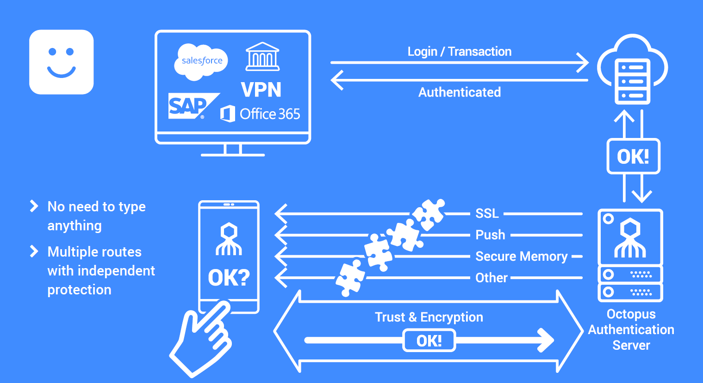
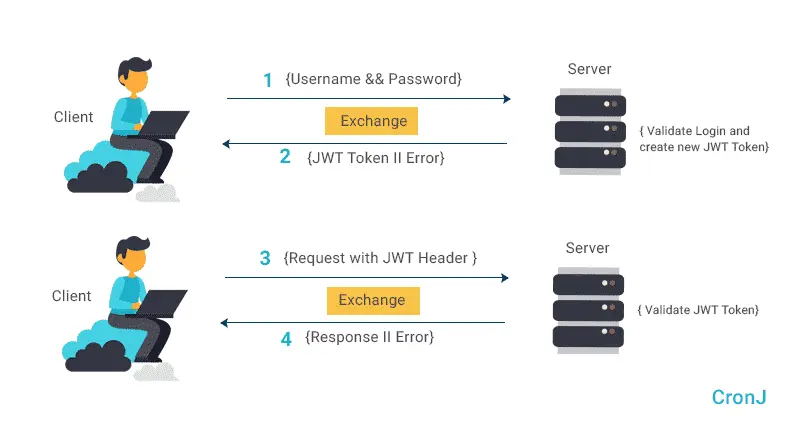
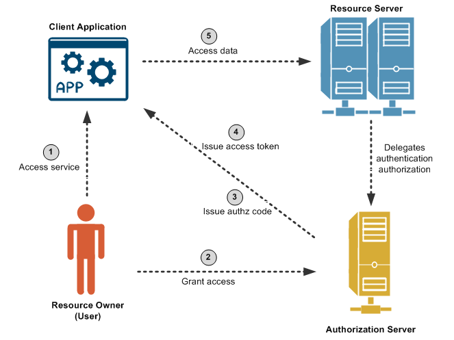
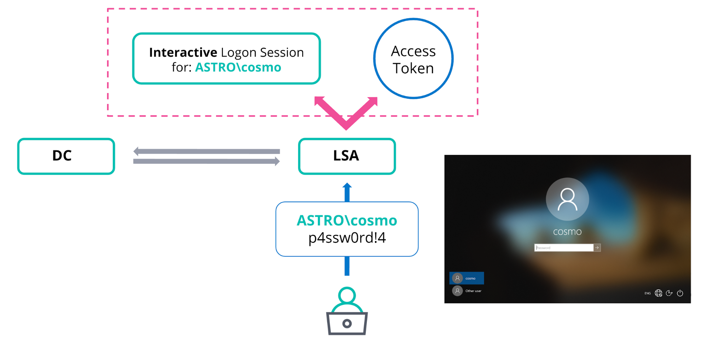
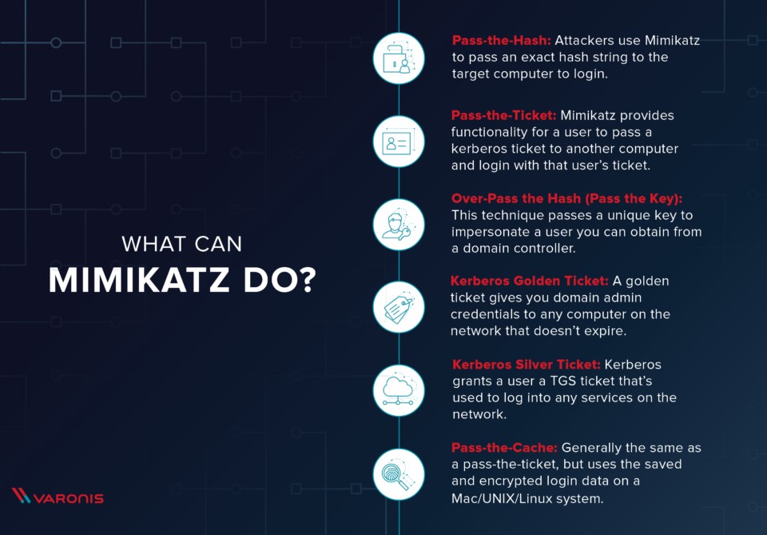
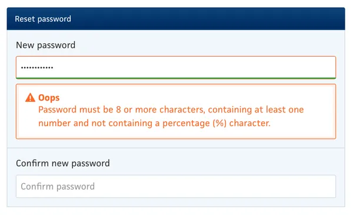

<style>
    /* You can add custom style here. VSCode supports this.
    Other editor might need these custom code in
    the YAML header: section: | */
	/* section header { display: none; } */
	/* section footer { display: none; } */
</style>

# Autenticación de usuarios
<!-- _class: first-slide -->

Juan Vera del Campo

<juan.vera@professor.universidadviu.com>

# Como decíamos ayer...

[New Directions in Cryptography](https://citeseerx.ist.psu.edu/viewdoc/summary?doi=10.1.1.37.9720) (Whitfield Diffie y Martin Hellman, 1976) exploraba qué se necesitaba para que dos empresas pudiesen firmar un contrato mercantil:

1. **Confidencialidad**, sin tener una clave secreta común
1. **Autenticación** de la identidad (llamada "autencidad de usuario" en el paper original)
1. **Integridad** del contrato (llamada "autenticidad del mensaje")
1. **No repudio** del contrato por ninguna de las partes

Es la lista que conocemos como "los servicios básicos de seguridad" del [Tema 1](01-conceptos-basicos.html)

<!--
Hoy nos centraremos en la autenticación.

Fíjate: el no repudio de un documento se puede asegurar si estamos seguros de con quién estamos hablando y tenemos un medio de probar qué es lo que dice.

Es decir, no repudio = autenticidad + integridad
-->

## Hoy hablamos de...
<!-- _class: cool-list toc -->

1. [Autenticación](#4)
1. [Desafío - Respuesta](#28)
1. [Autenticación por contraseña](#37)
1. [Sesiones por tokens](#48)
1. [Resumen y referencias](#70)

# Autenticación
<!-- _class: lead -->

## ¿Qué es la autenticación?

**En Internet, es fácil hacerse pasar por otra persona**

- Man in the middle
- Impersonation

Autenticación: proceso de confirmar que alguien es quien dice ser


<!--

Man in the middle y impersonation son muy similares, y la defensa contra ambos es la misma:

- man in the middle: Malloy se pone en medio de una comunicación entre Alice y Bob, que piensan que están hablando entre sí cuando en realidad los dos hablar con Malloy
- impersonation: Alice habla con Malloy pensando que está hablando con Bob. Puede que Bob ni sepa que hay una conversación en marcha.

La diferencia es que en el caso de man in the middle malloy tiene algo más de ventaja: si Alice pregunta algo que solo puede responder Bob, Malloy podría preguntárselo a Bob y entonces le responde a Alice.
-->

## ¿Quién tiene que autenticar?

- Personas autenticando a personas
- Personas autenticando a sistemas
- Sistemas autenticando a personas
- Sistemas autenticando a sistemas

Cada uno de estos tipos requiere soluciones diferentes. En criptografía nos centramos en los dos últimos escenarios


<!--
Aunque nos centraremos en "sistemas autenticando personas/sistemas", a veces también necesitaremos que una personas nos autentique en algunos procesos criptográficos

Por ejemplo, en Europa, para poder hacer una firma cualificada, es necesario tener un certificado digital que haya sido validado mediante un paso "persona autenticando persona": para un que un certificado sea válido tenemos que ir personalmente a algún sitio
-->

## Diffie-Hellman y el ataque Man in the Middle

El algoritmo Diffie-Hellman ([Tema 3](03-cifrado.html)) permite que dos personas que no se conocen acuerden una clave secreta común

Un atacante **no puede conocer la clave secreta**

Pero un atacante **puede convencer a cada parte que es otra persona**: así se pone en medio (*man in the middle*): D-H es vulnerable a ataques MitM.


> https://www.trendmicro.com/en_us/research/15/i/how-exploit-kit-operators-are-misusing-diffie-hellman-key-exchange.html

<!--
Diffie Hellman no ofrece autenticación: vamos a acabar hablando de forma segura, sí, pero con Malloy: Alice habla con Malloy y Bob también habla con Malloy, sin saber que Malloy existe. Malloy puede limitarse a descifrar los mensajes que le envía Alice con la clave que comparte con Alice, leerlos y cifrarlos con la clave que comparte con Bob para enviarlos modificados o sin modificar.
-->

## Identidades

Para poder tener autenticación es necesaria la existencia de **identidades**

- Personas: su identidad física, o su rol demtro de una organización
- Webs: que el servidor de una URL sea el que tiene que ser


<!--
Hay muchas formas de guardar nuestra identidad en internet:

- Más informal: mi nombre de usuario, mi dirección de correo electrónico...
- Más formal: certificados, DNI electrónico...

En el caso de webs o empresas, la identidad puede ser simplemente que cuando el usuario se conecta a bancosantander.com, que el servidor que le responda sea propiedad del Banco Santander

Image 
-->

## Certificados
<!-- _class: with-info -->

[Certificado](04-pki.md). Incluye: (1) Identidad, (2) Clave pública de la indentidad, (3) posibles roles, (4) firmado por una autoridad de certificación

Esto funciona bien en servidores: [HTTPS](A2-protocolos.html) siempre autentica servidores con certificados

El uso de certificados no se ha extendido a usuarios físicos: son demasiados complejos de gestionar


Necesitamos otras soluciones para usuarios

## Factores de la autenticación

- **Algo que sabemos** (*knowledge*): contraseña, PIN...
- **Algo que tenemos** (*ownership*): clave privada, smartcards, Google Authentication...
- **Algo que somos** (*biometrics*): huellas digitales, voz, cara...
- **Dónde estamos** (*location*): el servidor podría también comprobar que nos estamos conectando desde el lugar y a las horas habituales
- **Cómo nos comunicamos** (*Channel*): comunicación solo por canales habituales y no WhatsApp / llamadas
- **A quién conocemos** (*Refereers*): venir avalados por alguien conocido (PKI/PGP)

> https://searchsecurity.techtarget.com/feature/5-common-authentication-factors-to-know


<!--
Estos son los factores clásico de la autenticación


-->

## Autenticación tradicional: algo que sabemos

Tradicionalmente solo se ha utilizado el *algo que sabemos*: la contraseña

Este sistema está poco seguro pero muy fácil de usar


---

Vulnerabilidades de *algo que sabemos*:

- Ataques de diccionario "offline"
- Muchos usuarios utilizan contraseñas del "top 100": https://en.wikipedia.org/wiki/List_of_the_most_common_passwords
- Muchos usuarios **reutilizan** contraseñas en varios lugares
- A veces es posible "adivinar contraseñas", si tienen una estructura
- A veces, el administrador de sistemas no cambia la contraseña por defecto
- Los usuarios se confunden fácilmente: ataques de phishing

> https://expertinsights.com/insights/50-identity-and-access-security-stats-you-should-know/

## The password Game

[The password game](https://neal.fun/password-game/)

Imponer demasiadas reglas a las contraseñas puede ser perjudicial para la seguridad

Usa siempre gestores de contraseñas: KeePass, 1Password, LogMeOnce, Bitwarden...


## El juego de las preguntas
<!-- _class: with-warning -->

- ¿cuántos nombres de mascota son comunes?
- "Ultimos movimientos en tu cuenta bancaria" los conoces tú, el operador de la tarjeta, el banco, las tiendas, los analistas de marketing...
- "El nombre de tu escuela" lo conocen todos tus contactos de Facebook


Las preguntas personales no son un buen mecanismo de autenticación: baja fortaleza

<!-- Las preguntas no son un buen método de autenticación:

- Las mascotas suelen tener nombres parecidos en todo el mundo
- Hay demasiada gente que conoce datos personales tuyos, como el nombre de tu familia o dónde estudiaste la secundaria

-->

## Alto que *tenemos*
<!-- _class: center -->

 

- USB Keys
- Google Authenticator instalado en un teléfono
- SMS de validación

---

Vulnerabilidades de *algo que tenemos*:

- Que nos roben el dispositivo
- Que esté intervenido por un atacante
    - Troyanos bancarios
    - Malware en Android
    - Click hijacking
    - [Social engineering](https://bandaancha.eu/articulos/asi-han-robando-cuentas-whatsapp-10754)
    - Stealers: [Redline](https://www.genbeta.com/genbeta/redline-stealer-malware-que-te-dara-razon-para-dejar-utilizar-gestor-contrasenas-tu-navegador), [estadísticas](https://www.statista.com/statistics/1385123/info-stealers-used-for-credential-theft/)
- Ingeniería social
    - [Caso Activision](https://www.bleepingcomputer.com/news/security/activision-confirms-data-breach-exposing-employee-and-game-info/)
    - [Vishing](https://www.verificat.cat/es/te-llama-tu-banco-pero-no-es-tu-banco-el-vishing-o-la-estafa-de-la-suplantacion-de-la-identidad-telefonica/)


> 

<!--

El hackeo de 2022 a Activision se produjo así:

- Activision usaba un un sistema 2FA que enviaba número de confirmación por SMS
- Los atacantes inundaron a whatsapp a los trabajadores "somos el servicio técnico, necesitamos su número de confirmación para atender una incidencia"
- Un trabajador acabó harto de las inundaciones y envió su número de confirmación

-->

## Man in the middle, con 2FA


> https://askleo.com/beware-the-middleman-how-your-2fa-could-be-compromised/
> https://www.csoonline.com/article/570795/how-to-hack-2fa.html

## Algo que *somos*


---

Vulnerabilidades de *algo que somos*:

- Durante el proces de registro de datos biométricos, puede estar registrándose un atacante
- [La biometría no sea una ciencia exacta](https://www.ncsc.gov.uk/collection/biometrics/how-biometrics-are-attacked)


- Si algo va mal... **no podemos cambiar nuestros datos biométricos**
- Deepfakes y simulación de voces

> https://www.idrnd.ai/can-biometric-data-be-stolen/

## Localización y otras anomalías

- Detectar y registrar los patrones de los usuarios: localización, navegadores comunes, horarios...
- Alarmas cuando haya actividad que se salga del patrón


> https://sra.io/blog/impossible-travel/

---

Vulnerabilidades:

- Los atacantes pueden usar *proxies* para simular que se están conectando desde el país de la víctima
- No válido para nuevos usuarios aún sin perfilar
- La tecnología para falsear localización es bien conocida: "caza de pokemons", "compra de juegos desde Argentina", "acceso a películas no autorizadas en mi país"


## 2FA: Doble Factor de Autenticación

Usa al menos dos de los factores anteriores


Fíjate: si desbloqueamos el móvil con biometría, ya estamos usando los tres factores

<!--
Pregunta: ¿el orden en que se prueba cada factor importa? Es decir: ¿es lo mismo?:

- preguntar por una clave y depués por algo que tenemos
- preguntar por algo que tenemos y después por una clave

Depende del sistema, y especialmente de lo difícil que sea atacar cada paso. Interesa preguntar primero lo que sea más difícil atacar.

En el 2FA de Gmail preguntan primero por contraseña y después confirmación en el móvil. Eso es porque Gmail bloquea la cuenta si detecta muchos intentos de pruebas de contraseña: Gmail considera que "adivinar una contraseña" es más difícil que "robar un móvil".
-->

## *Passwordless / No password authentication*



> https://doubleoctopus.com/security-wiki/authentication/passwordless-authentication/
> https://www.youtube.com/watch?v=8Na793pxKpk

## Single Sign On

En muchas webs nos podemos autenticar con nuestro usuario de **Google**, **Facebook**, **Microsoft** u **Okta**

[Microsoft](https://www.microsoft.com/en-us/security/business/identity-access-management/passwordless-authentication) y [Google](https://androidcommunity.com/google-planning-on-a-more-secure-no-password-future-20210506/) proponen que nos autentiquemos en sus sistemas solo con nuestro móvil: en el futuro próximo, ¡puede que no usemos contraseñas!


## Vulnerabilidades generales

- Si hay un equipo secuestrado y le enviamos credenciales, la hemos perdido en ese equipo y en todos los que usen la misma contraseña: redes windows, pass the hash...
- Un atacante puede repetir exactamente lo que hemos hecho: replay attack
- Un atacante puede obligarnos a hacer algo (sin que nos demos cuenta) aprovechando nuestas credenciales

## Windows: Security Support Provider Interface (SSPI)


> https://learn.microsoft.com/en-us/windows-server/security/windows-authentication/security-support-provider-interface-architecture

<!--
¿Las aplicaciones tienen que soportar todos estos sistemas de autenticación?

El sistema operativo puede ayudarnos. Por ejemplo, en Windows, la autenticación se maneja a través de la SSPI, que escoge el servicio más adecuado

- NTLM: hashes y desafío respuesta, para usuarios locales
- Kerberos: tickets, cuando hay un AD
- Digest: antiguo sistema de autenticación de windos: contraseñas cifradas en RAM
- Schannel: SSL, certificados
- ...
-->

## Vamos a ver tres soluciones
<!-- _class: cool-list -->

1. [Desafío-respuesta / firma digital](#21)
1. [Contraseñas / biometría](#29)
1. [Tokens](#39)

# Desafío - Respuesta
<!-- _class: lead -->

Basado en firma digital

## Desafío-Respuesta (*Challenge-Response*)

Los sistemas de CAPTCHA son un sistemas básico de autenticación por desafío - respuesta: demuestra que eres una persona

Pueden ser un **primer filtro** de entrada a tus sistemas para evitar ataques automáticos

> https://en.wikipedia.org/wiki/CAPTCHA


## TLS: autenticación de servidores
<!-- _class: with-warning -->

TLS (https) permite autenticar servidores y (opcionalmente) usuarios:

- **Autenticación de servidor**: el servidor envía su clave pública al cliente al inicio de la conexión HTTPS, que lo acepta usando PKI, como se ve en el [Tema 4](04-pki.html). En este modo, el usuario se autentica con algún sistema de este tema.
- **Autenticación doble**: servidor y cliente intercambian claves públicas, que se aceptan por PKI.

Con tener la clave pública de la otra persona no es suficiente: tenemos que **probar** que la otra persona tiene también la privada.

## ¿Es suficiente con que nos presenten una clave pública?

Una CA puede enlazar una clave pública a una identidad: "*esta es sin duda la clave pública de Juan Vera*". Eso es el certificado ([Tema 4](04-pki.html))

Pero que alguien te enseñe el certificado de Juan Vera no es suficiente para que sepas que estas hablando conmigo: mi clave pública (es decir, mi certificado) es público, cualquiera puede obtenerlo y presentarlo.

Se necesita algo más: la persona con la que hablas tiene que tener la clave privada de Juan Vera. Solo así sabrás que sin duda estás hablando con Juan Vera:

1. Tiene la clave pública de Juan Vera, avalada por alguien en quien confiamos (una CA)
1. Además, demuestra que tiene la clave privada de Juan Vera

## Desafío-Respuesta (*Challenge-Response*) usando criptografía asimétrica

Aprovechamos criptografía asimétrica: si tenemos la clave pública de una persona, podemos desafiarle:

- **Alice**: Bob, ¿eres capaz de firmar *8u2348j48749082904* con tu clave privada?
- **Bob**: $RSA_{sk_{Bob}}(8u2348j48749082904) = yuh137321h1238$
- **Alice**: si $RSA_{pk_{Bob}}(yuh137321h1238) = 8u2348j48749082904$, sabe que está hablando con Bob

> https://es.wikipedia.org/wiki/Protocolos_desaf%C3%ADo-respuesta

<!--
Aunque los CAPTCHA son ejemplos sencillos de desafío-respuesta, vamos a centrarnos en protocolos criptográficos

Como parte de otros protocolos, se suele implementar un sistemas challenge-response para probar que alguien tiene la clave privada que se corresponde con una clave pública

Fíjate:

- Cuando hablamos con alguien, nos envía su certificado con su clave pública. Con los mecanismos del tema de PKI sabemos que esa es, sin ninguna duda, la clave pública de Bob
- ¿Pero realmente estamos hablando con Bob? En realidad solo estamos hablando con alguien que TIENE la clave pública de Bob, igual que nosotros la tenemos ahora.
- Aunque sepamos que esa es sin duda la clave pública de Bob, aún es necesario asegurarse de que estamos hablando realmente con Bob. Le desafiamos a que firme algo con la clave privada que dice tener.
-->

## Proceso del desafío
<!-- _class: two-columns -->


- Alice tiene que enviar una challenge diferente cada vez, que no sea predecible por un atacante
- Alice necesita algún mecanismo adicional para comprobar que esa clave pública está asociada a Bob ([tema 4](04-pki.html))

<!--

Diagrama editable: https://mermaid-js.github.io/mermaid-live-editor/edit/#pako:eNqNUctqwzAQ_JVFp5Y6l6bQYmjATQyBhgbqqy9raR0L9HBlKRBCvqq3XvNjlWOnNBBKddJqZ3ZmtHvGrSCWso4-AhlOC4kbh7o0EE-mJKfJbHb3YqsUlvlqtR4asY7Pk1M_hbnCLUF7_KpijX3zkn6GWd26QBVClAKFwC951MH69ZrwvEGlyGzouWRP0_vH5qGZ7kp2zcp7kd38QG7_YYMUCOq4rB0K-9vCm_UEdktu4CcnJwtZ15ImS1JKo4EWHQJy6wS6MU2WF3_wo3YwMSuXx08Dg2r8B2t6HkuYJqdRiriPfT-lZL4hTSVL41VQjUH5PvchQkMr0FMupLeOpTWqjhKGwdtiZzhLfYx4Bo07HVGHb7IApH4

-->

## Firma digital como challenge-response
<!-- _class: with-info -->

Fíjate: la firma electrónica sigue este esquema

*Challenge* para Bob: ¿puedes cifrar el hash de tus documentos?

$$
\begin{aligned}
challenge &= hash(documento)\\
firma &= E_{sk_{Bob}}(challenge)
\end{aligned}
$$

En firma electrónica normalmente no hará falta que Alice haga un dasafío, **Bob toma la iniciativa y envía su firma junto con el documento original antes de que le desafíen**

Documento: cualquier mensaje que Bob quiera intercambiar. No es solo un .docx, es cualquier mensaje, cadena de texto, parámetro de seguridad...

## Protocolo Diffie-Hellman, autenticado
<!-- _class: smaller-font -->

Igual que el D-H que ya conocemos pero firmando los mensajes:

1. Alice y Bob tienen un par de claves RSA $(PK_A, SK_A)$ y $(PK_B, SK_B)$,  y se intercambian $PK_A$ y $PK_B$
1. *Alice* y *Bob* acuerdan $g$ y $p$ primos entre sí
1. Alice escoge $a$ y Bob escoge $b$ (en secreto)
1. Se envían entre ellos mensajes firmados digitalmente:
    - $Alice \rightarrow Bob: A=g^{a} \mod p, sign_A=E(A, SK_A)$
    - $Bob \rightarrow Alice: B=g^{b} \mod p, sign_B=E(B, SK_B)$
1. Verifican la firma de cada lado:
    - Alice verifica que $B \equiv D(sign_B, PK_B)$
    - Bob verifica que $A \equiv D(sign_A, PK_A)$
    
1. Calculan en secreto:
    - $Alice$: $s = B^{a} \mod p = g^{ab} \mod p$
    - $Bob$: $s = A^{b} \mod p = g^{ab} \mod p$
1. Y usan $s$ como clave de cifrado un algoritmo simétrico

> [Authentication and Authenticated Key Exchanges](https://citeseerx.ist.psu.edu/viewdoc/summary?doi=10.1.1.59.6682), Whitfield Diffie and Paul C. Van Oorschot and Michael J. Wiener, 1992.


<!--
En el paso 2, recuerda que, en la realidad, Alice y Bob no usarán g y p cualquiera sino números conocidos que están en los estándares actuales y que sabemos que funcionan correctamente

Es decir: Alice y Bob firma los parámtros A y B y, si la firma verifica, Bob sabe que está hablando con Alice y al revés.

Por supuesto, esto mismo se puede hacer con Diffie-Hellman sobre curvas elípticas
-->

## NTLM

NTLMv1Protocolo utilizado para autenticar Windows hasta Windows 7. Ligeramente modificado con NTLMv2 y actualmente sustituido por Kerberos (lo veremos más adelante)

Es un protocolo *desafío-respuesta*:

1. Un usuario se conecta a un PC cliente con un dominio, usuario y contraseña
1. El PC cliente crea un hash de la contraseña
1. El PC cliente envía al servidor el nombre de usuario
1. EL servidor crear un número aleatorio de 8B y se lo envía al cliente: el *desafío*
1. EL cliente cifra el challenge con DES, usando como clave el hash de la contraseña: *respuesta*
1. El servidor envía al controlador de dominio la respuesta para que la valide


> https://www.calcomsoftware.com/ntlm-v1-and-v2-vs-kerberos/
> https://learn.microsoft.com/en-us/windows-server/security/kerberos/ntlm-overview
> https://blog.quest.com/ntlm-authentication-what-it-is-and-why-you-should-avoid-using-it/

<!--
Vemos NTLMv1 simplemente como ejemplo, Microsoft no recomienda seguir usándolo en la actualidad y debería ser sustituido por Kerberos

Los Windows actuales aún soportan NTLM para dar servicio a PCs antiguos
-->


# Autenticación por contraseña
<!-- _class: lead -->

En esta sección: "contraseña" es algo guardado una BBDD: una clave, una huella digital...

## Seguridad de las contraseñas de usuario

1. No uses datos personales o reconocibles en tus contraseñas
2. Usa contraseñas fuertes. Idealmente: totalmente aleatorias
3. No uses la misma contraseña en varios sitios
4. Implementa comprobación de constraseñas:
    - Detección de contraseñas comunes o sencillas
    - Detección de contraseñas que ya se han usado
    - Detección de contraseñas que ya se han hecho públicas: https://haveibeenpwned.com/
5. Acompañalas siempre de un doble factor de autenticación (2FA)
6. Usa un gestor de contraseñas. Ejemplos: KeePass, 1Password, LogMeOnce, Bitwarden...
7. Educa a tus usuarios contra ataques de phishing

## "Solución 1": contraseña en claro en la BBDD
<!-- _class: two-columns with-warning -->


- En la base de datos se guarda el usuario y contraseña
- Si roban la base de datos... ¡roban las contraseñas!
    - Los usuarios suelen reutilizar contraseñas
    - El administrator de la BBDD conoce nuestra contraseña

Nunca uses este método para almacenar contraseñas

<!--
La BBDD podría cifrar las contraseñas, pero eso es una solución parcial: si alguien es capaz de robar la base de datos, es muy posible que también sea capaz de robar la contraseña de cifrado.

Aún así, guardar las contraseñas cifradas es sin duda mejor que guardarla en claro. Simplemente, hay soluciones mejores que no requieren una contraseña de cifrado, como veremos a continuación

Que el adminitrador de la BBDD conozca la contraseña es un problema: ¿realmente podemos confiar en él? No sería la primera vez que el ladrón está dentro de casa, y que sea el administrador de sistemas

Diagrama editable: https://mermaid-js.github.io/mermaid-live-editor/edit/#pako:eNp9jzsLwjAUhf9KuKst7hkKljo5KIhblmtyq4EmqXkgUvrfTWtLN890Oee7rwGkUwQcAr0SWUmNxodHIyzLOnRaUllVu9rdObuFhF47tmcXDOHtvPpROZyZumn-QDnNVDlPOp-2zsmc92z2KijAkDeoVT5wmDIB8UmGBPBcKmoxdVGAsGNGU68w0lHp6DzwFrtABWCK7vqxEnj0iVZoeXKhxi_lzVGW
-->

## Solución 2: hash de la contraseña
<!-- _class: two-columns with-warning -->


- Ventaja: la BBDD no guarda las contraseñas sino sus hashes. Si alguien roba la BBDD, tiene que romper los hashes
- Existen hashes especializados en huellas biométricas

Intenta evitar este método para almacenar contraseñas

<!--
Nota: Alice podría enviar o bien su contraseña, o bien su hash. Es normal que Alice envíe a Bob (una página web) la contraseña, pero Bob calcula inmediatamente el hash: Alice se fía de Bob, pero Bob no se fía de la base de datos

Diagrama editable: https://mermaid-js.github.io/mermaid-live-editor/edit/#pako:eNp1kLsOwjAMRX8l8gSiFXuHSlRlYgCpYstiGpdGahPIQwhV_XfSl8oAHu89tq_dQakFQQKWnp5USbnEu8GWKxbq0MiS4jTdZfqWsKv1aKRme3ZBa1_aiIkK5shkeb5CsxW04MVjP4cCG8eBCWqYn7j_EyJWo603y6rtj4Hn03d7PKZd1aUggpZMi1KEM7vB4-BqaonDkElQhX6IxVUfUP8Q6OgopNMGkgobSxGgd7p4qxISZzwt0PyqSew_ELlmNQ
-->

## Análisis de seguridad

- En realidad, queremos un hash criptográfico pero **no un hash rápido**:
    - Bob solo hará la operación una vez, no pasa nada si es costosa
    - Un atacante tiene que hacer fuerza bruta: **interesa que cada intento lleve mucho tiempo**
- Se suele implementar como una serie de hashes. Ejemplo: "calculamos el hash de la contraseña 1024 veces". Así obligaríamos a un atacante a hacer un número descomunal de operaciones para cada prueba
- Problemas:
    - si varios usuarios tienen la misma contraseña... la BBDD lo sabe
    - si se usan contraseñas sencillas... se pueden romper con *rainbow tables* o tablas precalculadas de contraseñas

## Solución 3: hash de contraseña + salt
<!-- _class: two-columns with-success -->


- El "*salt*" es algo parecido al "*nonce*" ([Tema 2](02-cifrado.html)): se puede guardar en claro en la BBDD
- El *salt* tiene que ser un valor **totalmente aleatorio y diferente para cada usuario**
- Ya no es posible tener tablas precomputadas

Esta es la solución usada en la actualidad

<!--

Diagrama editable: https://mermaid-js.github.io/mermaid-live-editor/edit/#pako:eNptkE8LwjAMxb9KyUlxw3sPA8c8eVAY3nqJa-YK26r9g8jYd7edmyiYY94vLy8ZoNKSgIOlu6e-okLh1WAnehZq16qK0izb5PrC2dl6NEqzLTuhtQ9t5JsK4sTkRfGBZiW0gpRO4wJKbJ0AJqll_gf7Y5CwBm2ziiOcL_vWf2yPh2-TdIocu5BAR6ZDJcN1Q2QEuIY6EhCzSKrRxziiHwPqbxId7aVy2gCvsbWUAHqny2dfAXfG0wLNH5qp8QUjTmYe

-->

## Análisis de seguridad
<!-- _class: with-info -->

- La BBDD guarda `SALT:hash(SALT:PASSWORD)`
    - No es vulnerable a tablas precalculadas de contraseñas
    - Si dos usuarios tienen la misma contraseña, con gran probabilidad tendrán *salt* diferente así que la BBDD no sabe que las contraseñas son iguales
    - La BBDD no conoce la contraseña original, solo el hash
- La salt tiene que ser aleatoria
- Es el mecanismo usado en Linux, Windows... y en la mayor parte de las webs

## BCRYPT: Cifrado como "hash", nonce como "salt"
<!-- _class: with-warning -->


Esto es lo que guarda la BBDD para cada usuario

Nota: scrypt es similar a bcrypt, igualmente válido y más actual

<!--
- Entrada:
	- `password`
	- `cost`, 10 ó 12 es usual son valores usuales
	- `salt`, que se se escoge automáticamente. La *salt* es otro nombre para el *nonce*
- Derivación de clave, que es el proceso lento de Blowfish, se hace $2^{cost}$ veces.
- Cifra con la clave derivada la cadena estándar *OrpheanBeholderScryDoubt* 64 veces.

-->

## Ejemplos
<!-- _class: smaller-font -->

PWD|Bcrypt
--|--
abracadabra|`$2a$12$sWfsiB42yT.LvoyCqAHURujcDUTmEHVUjQHqTP4kL1Zs1p.j4G6Lu`
sesamo|`$2a$12$kWTGyiUbTha.bKpGXyz8ieRIYMAVNaO7gvrZMZ86DKZNgpiJzh49u`
sesamo|`$2a$12$LQbVUSGksM2vCoZiBhmKCerSTe/Uq7BWVgbxFAe8eY/9y3y1P8dzS`

```python
from Crypto.Protocol.KDF import bcrypt, bcrypt_check

password = 'sesamo'

hpwd = bcrypt(password, 12)
# $2a$12$kWTGyiUbTha.bKpGXyz8ieRIYMAVNaO7gvrZMZ86DKZNgpiJzh49u

bcrypt_check(password, hpwd)
# True
```

<!--
Fijaos que ejecutar bcrypt sobre la misma contraseña "sesamo", da resultados diferentes. De esta forma se puede guardar las contraseñas repetidas sin que ndie pueda saber que son repetidas
-->

## Windows: contraseñas en c:\Windows\System32\SAM

```
# cmd as Admin
.\PsExec.exe -i -s cmd.exe
# cmd as system
reg save hklm\sam dump_sam
reg save hklm\system dump_system
# Kali
samdump2 dump_sam dump_system

*disabled* Administrator:500:b3d39asfda90129099hksuu2js:b3d39asfda90129099hksuu2js:::
*disabled* Guest:501:b3d39asfda90129099hksuu2js:b3d39asfda90129099hksuu2js:::
*disabled* :503:b3d39asfda90129099hksuu2js:b3d39asfda90129099hksuu2js:::
*disabled* :504:b3d39asfda90129099hksuu2js:b3d39asfda90129099hksuu2js:::
Juan:1001:b3d39asfda90129099hksuu2js:b3d39asfda90129099hksuu2js:::
```

> https://www.windows-active-directory.com/windows-security-account-manager.html
> https://medium.com/@petergombos/lm-ntlm-net-ntlmv2-oh-my-a9b235c58ed4

## Linux: contraseñas en /etc/shadow

```
sudo cat /etc/shadow

systemd-timesync:*:18111:0:99999:7:::
systemd-network:*:18111:0:99999:7:::
systemd-resolve:*:18111:0:99999:7:::
juanvi:$6$NBwuq8iqV6NYjJz6$jUHQcX51818121212yKjklasfjksf871l120kskLkjsadslkfok11l210io0/.:18293:0:99999:7:::
messagebus:*:18293:0:99999:7:::
```

# Sesiones por tokens
<!-- _class: lead -->

En esta sección, *credenciales* es lo que el usuario tenga para autenticarse: 2FA, contraseñas, certificados...

## Problema

Imagina una petición con HTTP (ó HTTPS)

```http
GET / HTTP/1.1
Host: www.vuelasim.com
Authorization: Basic YWxpY2U6c2VzYW1l
...
```

La cabecera *Authentication* incluye el usuario y contraseña (o su hash) codificado en Base64.

```bash
$ echo 'YWxpY2U6c2VzYW1l' | base64 -d
alice:sesame% 
```

Para evitar enviar siempre la contraseña (o su hash): sesiones por tokens


## Sesiones por token

1. El usuario envía sus credenciales
2. Si es correcto (ver sección anterior), el usuario recibe un token: **token de sesión**
3. Para el resto de peticiones el usuario envía **solo** el token
4. En cada petición, el servidor verifica que el token es correcto
    - el token **podría** está firmado digitalmente, o cifrado con una clave que solo conoce el servidor
    - el token **podría** ser un número aleatorio guardado la base de datos
    - (opcional, pero muy recomendable) con cada nueva petición, el token se renueva

> https://sherryhsu.medium.com/session-vs-token-based-authentication-11a6c5ac45e4

## Proceso
<!-- _class: two-columns -->


- Hay una verificación inicial de usuario
- El token es $E_ {K_{Bob}}(Alice, caducidad)$. 
- Una vez obtenido el token, Alice lo incluye siempre en las siguientes peticiones: mientras no caduque el token, no tiene que volver a enviar credenciales
- Cuando Bob recibe una nueva petición, comprueba:
    - que puede descifrar el token
    - que el token no ha caducado

<!--
Observa: El token está cifrado con una clave **que solo conoce Bob**

En esta transparencia se muestra el caso de que el usuario utilice nombre/contraseña para autenticarse, pero funciona exactamente igual si usa un servicio no-password como el de Google:

1. El usuario entre en la web manolita.com, que utiliza Google como autenticación
2. Google confirma la identifidad de usuario en el móvil y avisa a manolita.com
3. manolita.com envía al usuario un token de autenticación

Diagrama editable: https://mermaid-js.github.io/mermaid-live-editor/edit/#pako:eNptkU1OwzAQha8ymlUrHCG2liiiDasuilSx82aIJ8QisYN_hFDVU3EELobzU1SkeDnzvffs5xNWTjNKDPyR2FZcGnrz1CkL-Ty2puJis7nZulcJLyGRNw5u4ZlC-HReT1Rejsy2LP-geZNHeVWMcoVHaqNC0NxC-octGAhoKDSrQSIvcesF18P-2qMYbywhune2cA87U3vSbjXHiTtonKf10ut6jqYyP99WTOpr2xGYPA_7h6VAz6FPHCIpiwI79h0ZnWs9DbDC2HDHCocSNNeUhh6UPWc09ZoiP2kTnUdZUxtYIKXojl-2Qhl94gs0f800PP8Cu0KNqw
-->

## Tipos de token

1. $E_ {K_{Bob}}(Alice, caducidad)$: cifrado de la identidad de Alice y una caducidad
1. Un número completamente aleatorio generado para cada usuario y guardado en la base de datos
    - En este caso, cada nueva petición puede exigir un nuevo token: en la respuesta se incluye el token a utilizar en la siguiente petición

## ¿Dónde se guarda el token?

En un entorno web, es común guardar el token dentro de una cookie asociada a una página web. Las cookies se envían en la cabecera de la petición HTTP

Otra forma común es guardar tokens como un elemento oculto de un formulario POST


> [How To Submit Your Security Tokens to an API Provider](https://medium.com/@robert.broeckelmann/how-to-submit-your-security-tokens-to-an-api-provider-pt-1-4a68df35843a). Robert Broeckelmann, 2017


## Análisis de seguridad

- Un atacante podría robar tokens: [Mimikatz](https://specterops.io/blog/2022/07/07/koh-the-token-stealer/), [RedLine](https://flare.io/learn/resources/blog/redline-stealer-malware/)...
- Si un atacante consigue el token de seguridad, solo será válido hasta que caduque
- Un atacante podría obligarnos a enviar un token válido a una página web:
    - [Cross site scripting](https://owasp.org/www-community/attacks/xss/)
    - [Cross-site request forgery](https://blog.cobalt.io/a-pentesters-guide-to-cross-site-request-forgery-csrf-57adedbad4be)

Para solucionarlo: usa tokens con caducidad tan corta como sea posible. Idealmente: tokens de un solo uso. Cada respuesta incluye el token que hay que usar en la petición siguiente

## Servidores de autenticación
<!-- _class: two-columns -->


- El uso de tokens nos permite tener servidores especializados en la autenticación, que son independientes del servicio
- El servicio final no necesita conocer usuario y contraseña, solo validar que el token viene desde el servidor de autenticación.
    - Verificación: el token está firmado con la clave privada del servidor de autenticación

<!-- Diagrama editable: https://mermaid-js.github.io/mermaid-live-editor/edit/#pako:eNpdkEFOAzEMRa9ieQViKsQ2EkUFuuoCJMQuG5N4mIiZZHAcEKp6Ko7AxQhNixBeWf7v-8veokue0WDm18LR8W2gZ6HJRqi1GoPjxXJ5tio6ZJY3FgOPuZCEBOdwTzm_J_EH-JepjsXeakDTC0e4hJvQC_l0Upq5u4AhCZ3-i7lOTwZm1uDC12fsmrsxVarEHmg77zZXf5VjoHCeC2clG7HDiWWi4Ot92x_Yog48sUVTW889lVEt2riraJk9Ka990CRoehozd0hF08NHdGhUCh-hw4_acPcNO9hsng-->

---


> https://es.wikipedia.org/wiki/Token_(inform%C3%A1tica)

<!--
En el ejemplo un sistema de pagos por tokens: queremos poder comprar desde una APP o una web, pero no nos interesa darle a la web nuestra tarjeta de crédito o nuestra contraseña de Paypal

Podemos usar tokens, que se validan y caducan en cada paso, y así no hace falta decirle nuestra tarjeta de crédito a nadie
-->

## Security Assertion Markup Language

Security Assertion Markup Language (SAML) es un estándar abierto de **autenticación** basado en XML

- **Proveedor de identidad**: realiza la autenticación del usuario y provee tokens al usuario
- **Proveedor de servicio**: confía en el proveedor de identidad y da acceso al servicio

> https://en.wikipedia.org/wiki/SAML-based_products_and_services
> https://www.okta.com/identity-101/saml-vs-oauth/

---


> https://learn.microsoft.com/en-us/entra/architecture/auth-saml?source=recommendations

## Beneficios de SAML

- Mejora en la experiencia de usuario: solo tienes que autenticarte en un sitio
- Las credenciales solo se envían a un solo proveedor de identidad
- Gestión centralizada de identidades, que es muy útil en empresas

## Autenticación por tokens

Una vez el usuario está autenticado por un proveedor de identidad, puede autenticarse en otros servicios usando tokens

Ejemplos:

- JSON Web Token
- OAuth
- Kerberos

## JSON Web Token (JWT)



> <https://www.cronj.com/blog/what-is-json-web-token-jwt>

---


> <https://research.securitum.com/jwt-json-web-token-security/>

## OAuth
<!-- _class: smaller-font -->

OAuth es un gestor de **autorizaciones**. Un usuario puede delegar el acceso a terceros a su cuenta de Google, Facebook, Twitter... sin necesidad de compartir contraseña

1. El usuario accede a un servicio de terceros (aplicación, página web...) que necesita acceder al Twitter, fotos de Google... del usuario
2. Twitter, Google funcionan como un proveedor de identidad para autenticar al usuario
2. Twitter, Google pregunta al usuario si realmente quiere delegar el acceso a un tercero
3. Twitter, Google envían a la aplicación de terceros un **token** que la aplicación puede usar para acceder al contenido protegido



> https://aaronparecki.com/oauth-2-simplified/
> https://docs.oracle.com/cd/E55956_01/doc.11123/oauth_guide/content/oauth_intro.html

---
<!-- _class: with-warning -->

[](https://twitter.com/LittleJoeTables/status/1366098640482230281)

Cuidado: ¡implementar OAuth es complicado!

## Kerberos

- Desarrollado en el MIT en los 80
- Separa:
    - el servidor del autenticación
    - servidor de tokens
    - servicios finales
- Redes Windows corporativas: el *Authserver* es el *Domain Controller*


> Fuente: https://es.wikipedia.org/wiki/Kerberos
> [The Kerberos Version 5 (RFC4121, 2005)](https://datatracker.ietf.org/doc/html/rfc4121)

<!--
Kerberos se utiliza, por ejemplo, en redes Windows corporaivas: un usuario de dominio se autentica en el DC y obtiene un token que luego puede utilizar en cualquier ordenador de la empresa

CUIDADO: en los ciberataques actuales, los atacantes buscan por todos los medios hacerse con estos tokens
-->

## Windows


- En redes corporativas, identidades gestionadas de forma centralizada: **Active Directory**
- El usuario se autentica con Smartcard, PIN, contraseña, biometría...
- Las contraseñas se mantienen cifradas: SAM
- Los tickets/hashes se mantienen en la RAM del PC: LSASS
    - Tickets Kerberos
    - Hashes NT ó LN
    - En memoria RAM

> https://www.elastic.co/blog/introduction-to-windows-tokens-for-security-practitioners

---



## Ataques

Se han descrito ataques contra TODOS estos sistemas

- [Reflection attack](https://en.wikipedia.org/wiki/Reflection_attack)
- [Pass the hash](https://en.wikipedia.org/wiki/Pass_the_hash)
- [Pass the token](https://o365blog.com/post/prt/)
- ...

El problema de la autenticación segura aún está a medio resolver en entornos complejos



## *Lateral movement*

Piensa en una red Windows: si un atacante controla un equipo y se pone a escuchar las contraseñas que los trabajadores usan en ese equipo en concreto... ¡podría aprovechar estas contraseñas en otros equipos!

Esto no es tan raro: es la etapa *lateral movement* en cualquier ataque cibernético


# Ataques contra el doble factor de autenticación
<!-- _class: lead -->

## Ataques

- Captura de tokens con página *Adversary-in-the-middle*
- Ataques de ingeniería social por SMS / mensajería / llamadas
    - "Tengo que verificar su identidad: dígame el número que le han enviado por SMS"
- Robo del dispositivo físico: *pass the coockie*
- Soporte a protocolos antiguos que no necesitan 2FA
- Códigos de recuperación en espacios no protegidos

## Adversary-in-the-middle


- El adversario presenta una falsa y tiene abierta una sesión con la legítima
- Cuando la legítima pregunta por el 2FA... el adversario se lo pregunta la víctima

> https://argonsys.com/microsoft-cloud/library/token-tactics-how-to-prevent-detect-and-respond-to-cloud-token-theft/
> https://vimeo.com/308709275

## Pass-the-cookie


- El adversario compromete el dispositivo de la víctima y le roba el token de autenticación

> https://argonsys.com/microsoft-cloud/library/token-tactics-how-to-prevent-detect-and-respond-to-cloud-token-theft/


# Resumen y referencias
<!-- _class: lead -->

## Resumen

- La autenticación es el servicio para probar que realmente estamos hablando con otra persona
- Si tenemos su clave pública, podemos desafiarle a que firme algo con su clave privada
- Si usamos usuario y contraseña, la base de datos no puede guardar esa información en claro
    - hash + salt
    - bcrypt / scrypt
- Lo ideal es que solo tengamos que "probar nuestra identidad" una vez, y el resto de peticiones funcionamos con tokens

## Recomendaciones generales

1. No uses datos personales o reconocibles en tus contraseñas
2. Usa contraseñas fuertes. Idealmente: totalmente aleatorias
3. No uses la misma contraseña en varios sitios
4. Implementa comprobación de constraseñas:
    - Detección de contraseñas comunes o sencillas
    - Detección de contraseñas que ya se han usado
    - Detección de contraseñas que ya se han hecho públicas: https://haveibeenpwned.com/
5. Acompañalas siempre de un doble factor de autenticación (2FA)
6. Usa un gestor de contraseñas. Ejemplos: KeePass, 1Password, LogMeOnce, Bitwarden...
7. Educa a tus usuarios contra ataques de phishing

---

Pero procura no forzar a usar las "reglas tontas"

[](https://dumbpasswordrules.com/sites/)

¿Sabrías explicar por qué?

<!--
Si fuerzas "reglas para las contraseñas"...

- Baja la entropía de las contraseñas: los atacantes ya no tienen que probar contraseñas que no contengan  números
- No evitas que los usuarios acaben usando contraseñas sencillas que cumplan las reglas: S3samo!
- No evitas "trucos" como "Sesamo2022" "Sesamo2023"
-->

## Referencias

- [WebAuthn 101 - Demystifying WebAuthn](https://i.blackhat.com/USA-19/Thursday/us-19-Brand-WebAuthn-101-Demystifying-WebAuthn.pdf). Christiaan Brand, Google. Blackhat 2019
- [Kerberos Authentication Explained | A deep dive](https://www.youtube.com/watch?v=5N242XcKAsM)
- [What is OAuth really all about - OAuth tutorial - Java Brains](https://www.youtube.com/watch?v=t4-416mg6iU)
- [Why We Hash Passwords](https://dzone.com/articles/why-we-hash-passwords)
- [How SAML Authentication Works](https://auth0.com/blog/how-saml-authentication-works/#What-is-SAML)
- [NTLM v1 and NTLM v2 vs Kerberos](https://www.calcomsoftware.com/ntlm-v1-and-v2-vs-kerberos/)

---
<!-- _class: last-slide -->

