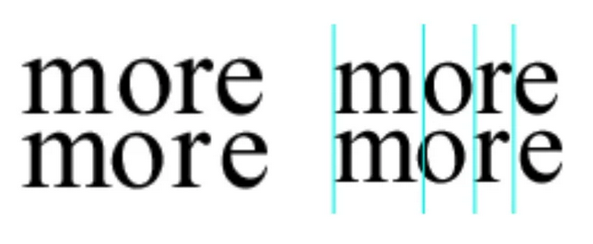

# Criptografía
<!-- _class: first-slide -->

**Tema 11: Esteganografía**

Juan Vera del Campo - <juan.vera@campusviu.es>

# Esteganografía
<!-- _class: lead -->

---

---

# DNS tunneling
<!-- _class: lead -->

# Watermarking
<!-- _class: lead -->

# Conclusiones
<!-- _class: lead -->

## Resumen

## Referencias

