

# Anonimato y DeepWeb
<!-- _class: first-slide -->

Juan Vera del Campo - <juan.vera@professor.universidadviu.com>

# Como decíamos ayer...

Servicios de seguridad:

- Los clásicos: confidencialidad, autenticidad, integridad, no repudio
- Auxiliares: acuerdos de clave, anonimato...

En este tema veremos cómo usar la criptografía para ofrecer el servicio de anonimato. Así aprendemos un nuevo servicio, afianzamos conceptos que ya sabemos, conoceremos nuevos protocolos y exploramos qué capacidades tienen los adversarios

# Hoy hablamos de...
<!-- _class: cool-list toc -->

1. [Comunicaciones anónimas](#4)
1. [Redes mix/onion: Tor](#22)
1. [Servicios onion](#33)
1. [Sistema de verificación de edad para el acceso a contenidos en línea](#46)
1. [Referencias](#51)

# Comunicaciones anónimas
<!-- _class: lead -->

---
<!-- _class: with-success -->

El protocolo [TLS](A2-protocolos.html) asegura que nadie que escuche pasivamente una comunicación (*confidencialidad*). También evita ataques activos man-in-the-middle (*integridad*, *autenticación*)

**TLS no evita que se sepa quién habla con quién**: el cifrado se aplica en la capa de aplicación, no estamos cifrando los paquetes de red que incluyen IP origen e IP destino

**Anonimato**: impide que un tercero sepa quién está hablando con quién

## Recordatorio: un paquete IP
<!-- _class: extra-slide -->

- Un paquete IP incluye obligatoriamente las direcciones IP reales de origen y destino
- Todos los routers en el camino tienen que conocer estas direcciones para poder enrutar un mensaje
- Todos los routers en el camino saben quién habla con quién

## Estructura de Internet

Los usuarios nos conectamos a un servidor ISP... ¿y después qué?

Los ISPs se conectan entre ellos en puntos neutros nacionales (IXP, *Internet Exchange Point*)

Los IXP se conectan entre ellos con cables submarinos (entre otros)

Los servidores normalmente están "en la nube"

> Puntos neutros: <https://es.wikipedia.org/wiki/Punto_neutro>
> Ejemplo: Espanix <https://www.espanix.net/es/trafico/>

---

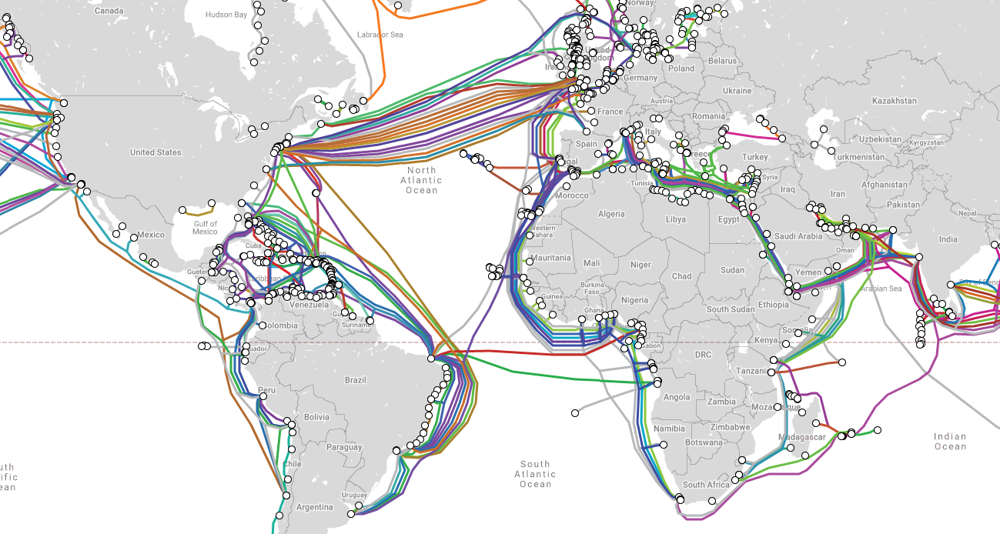

Los puntos neutros se conectan entre ellos a través de (entre otros) [cables submarinos](https://www.submarinecablemap.com/#/)

Muchos de estos cables submarinos [son propiedad de Google](https://cloud.google.com/blog/products/infrastructure/learn-about-googles-subsea-cables)

---

Gran parte de la *cloud* pertenece a Amazon (AWS), o a Microsoft (Azure), o a Google (GCP), o Alibaba

## ¿Quién sabe a dónde te conectas?
<!-- _class: with-warning -->

- Tu ISP lo sabe
- Tu servidor de DNS lo sabe
- Tu gobierno, en el punto neutro, sabe todo lo que tenga que salir de tu ISP
- Google, en el cable submarino, sabe todo lo que salga del país
- El gobierno de destino, en su puntro neutro, sabe quién se está conectando
- Amazon, propietaria de la cloud en el servidor destino sabe quién se conecta
- El servidor destino sabe quién se conecta y qué se está diciendo

Todos estos actores tienen la posibilidad de saber con quién te conectas, pero... ¿lo están haciendo realmente? [Great Chinese Firewall](https://en.wikipedia.org/wiki/Great_Firewall), [ECHELON](https://en.wikipedia.org/wiki/ECHELON), [Data Retention Directive](https://en.wikipedia.org/wiki/Data_Retention_Directive)...

> https://euobserver.com/opinion/146376
> https://www.eff.org/nsa-spying
> https://ssd.eff.org/en

## Anonimato en Internet, ¿sí o no?
<!-- _class: extra-slide smallest-font -->

A favor del anonimato:

- Querer intimidad NO equivale a tener algo que ocultar
- Nada que ocultar... mientras estés 100% de acuerdo con la visión y las políticas de tu gobierno
- Esta gente está buscando delincuentes. Podrías ser la persona más inocente del mundo, pero si alguien programado para ver patrones de delincuencia analiza tus datos, no va a encontrarte a ti: va a encontrar a un delincuente. *Edward Snowden*
- Si no tenemos nada que ocultar, ¿por qué estamos bajo vigilancia? La privacidad debería ser un derecho a menos que se haga algo que levante sospechas legítimas
- La intimidad no es para esconderse; la intimidad es para protegerse
- Si se prohíben las comunicaciones anónimas... los malos seguirán usándolas igualmente como usan armas prohibidas

En contra del anonimato:

- Controlar quién se conecta con quién permite a nuestros gobiernos detectar terroristas o pederastas
- Las tecnologías de comunicaciones anónimas **realmente ayudan** a los terroristas y pederastas
- La identificación de las personas puede rebajar el ciberacoso en Internet
- La identificación de las personas impide que los niños accedan a contenido inadecuado

> https://www.es.amnesty.org/en-que-estamos/blog/historia/articulo/siete-razones-por-las-que-no-tengo-nada-que-ocultar-es-la-respuesta-equivocada-a-la-vigilancia-mas/
> https://www.bbc.com/future/article/20170529-the-reasons-you-can-never-be-anonymous-again
> https://www.pewresearch.org/internet/2017/03/29/the-future-of-free-speech-trolls-anonymity-and-fake-news-online/

<!--
No es el objetivo de este curso no es evangelizar sobre la conveniencia del anonimato en Internet. Ahí tienes algunos argumentos a favor y en contra y enlaces con discusiones y propuestas

Vamos de describir unas tecnologías que pueden usarse para objetivos terriblemente perversos pero también para proteger la libertad de las personas y para saber cómo trabajan los ciberdelincuentes. El uso que les des es responsabilidad tuya
-->

## Pero yo uso el modo incógnito del navegador...

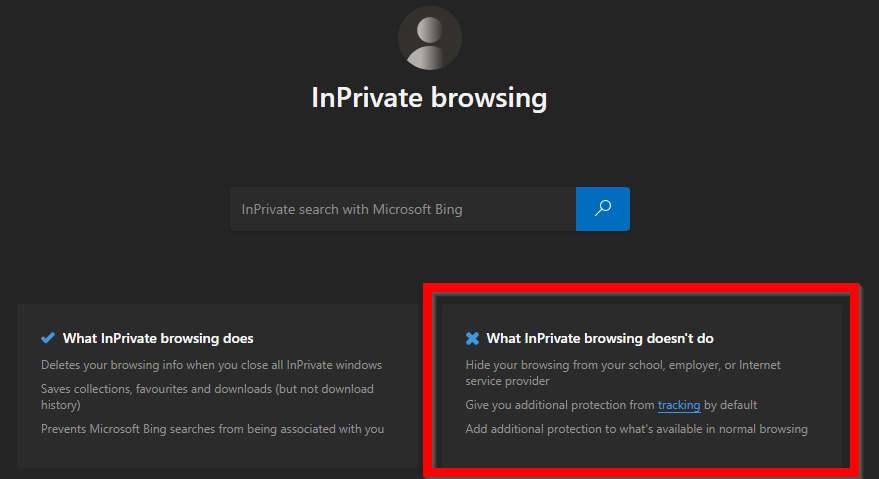

---

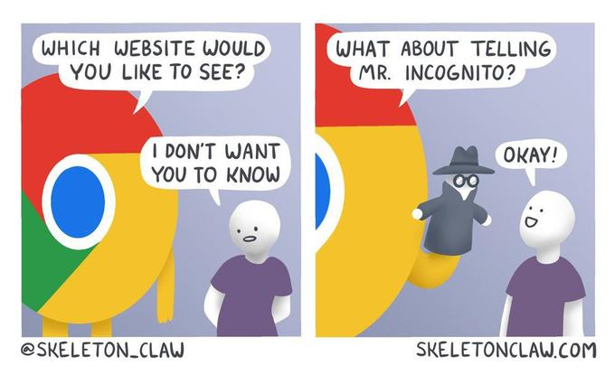

En agosto de 2024, Google acuerda en una corte de EEUU que:

- Informará a sus usuarios de que guarda datos de navegación también en el modo incógnito
- Borrará los datos de navegación obtenidos hasta ahora
- Bloqueará sus cookies incluso en el modo incógnito
- Nada de esto afecta fuera de EEUU, o a otros navegadores

> [Google Agrees to Delete Data Collected from Users Browsing in Incognito Mode Following Settlement](https://www.bitdefender.com/blog/hotforsecurity/google-agrees-to-delete-data-collected-from-users-browsing-in-incognito-mode-following-settlement/?srsltid=AfmBOopIFUlXXpxRpugi4LRgQBi9sb738R7n5tVMXjfIl5gj-rI993CQ%2F%2F)
> https://storage.courtlistener.com/recap/gov.uscourts.cand.360374/gov.uscourts.cand.360374.1096.0_1.pdf

## ¿Quién es el adversario?

- No quiero que los malos sepan que les estoy investigando
- No quiero que Google sepa que fumo
- No quiero que mis compañeros de trabajo conozcan mi orientación sexual
- No quiero que el jefe sepa que estoy buscando trabajo
- No quiero que mis clientes encuentren fotos de la fiesta de anoche
- No quiero que el gobierno conozca mis ideas políticas
- No legítimo: no quiero que la policía sepa qué he hecho
- No legítimo: no quiero que X sepa que soy yo quien le acosa

<!--
Hay mucha razones para querer anonimato en internet

Un investigador de ciberseguridad usará constantemente redes anónimas para que los atacantes no sepan quién los está investigando
-->

## Solución 1: servidores anónimos y adversarios
<!-- _class: with-success -->

[ProtonMail](https://protonmail.com/) es un servicio de correo anónimo: nunca le dirá a las autoridades quién envió un correo. **PERO** alguien controlando las comunicaciones sabe quién estaba conectado a ProtonMail a la hora de envío de un correo.

- ¿El adversario es tu pareja? Es suficiente el modo seguro del navegador
- ¿Es tu empresa? La empresa tendrá acceso al firewall y sabe que te has conectado a Protonmail
- ¿Es un gobierno? ProtonMail no enviará registros a ningún juez

ProtonMail puede ser perfectamente válido para tus seguridad: es necesario "identificar a tú adversario" para decidir el mejor método de protección.

<!--
Ojo: decidir la potencia que tiene tu adversario sirve para todos los sistemas de seguridad que hemos visto.
-->

## Solución 2: CROWDS y k-anonimato
<!-- _class: with-success -->

1. Organízate con amigos para crear una red de $k=6$ personas (tú y 5 más). $p=\frac{k-1}{k}=\frac{5}{6}$
1. Si quieres descargar algo, con probabilidad $p$ le pides el favor a un amigo, y con probabilidad $1-p$ lo haces tú.
1. El amigo hace lo mismo: con probabilidad $p$ le pasa el favor a otro (¡puedes ser tú!), y con probabilidad $1-p$ lo hace él.
1. Así hasta que alguien hace la petición.

El servidor no sabe quién de las $k$ personas ha hecho la petición: **k-anonimato**.

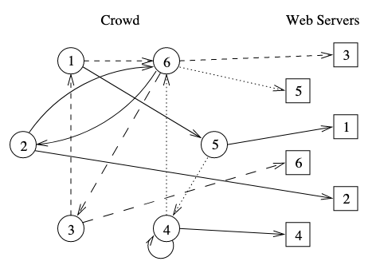

> Michael Reiter and Aviel Rubin (June 1998). "[Crowds: Anonymity for Web Transactions](https://web.archive.org/web/20051212103028/http://avirubin.com/crowds.pdf)" (PDF). ACM Transactions on Information and System Security.

<!--
OJO: esto funciona si confiamos en todos los amigos. Ellos colaborarán porque les conviene, pero hay que estar seguros de que ninguno de ellos es realmente "un topo". En este caso, el k-anonimato se reduce

CROWDS fue un sistema teórico, nunca se ha implementado como tal. Pero esta idea de k-anonimato se aprovecha en muchos otros sistemas. Además, el sistema de CROWDS es óptimo: no se puede tener más anonimato que el ofrecido por CROWDS.

Problema principal de CROWDS: no es posible predecir cuánto tiempo tardará un mensaje en salir de la red. ¡Un mensaje puede estar rebotando dentro de CROWDS para siempre!
-->

## K-anonimato
<!-- _class: smallest-font two-columns with-success -->

Paciente|Razón de ingreso|Peso|Ciudad
--|--|--|--
Juan Pérez|Cáncer de próstata|120Kg|Madrid
Juan Rodríguez|Cáncer de próstata|60Kg|Villadangos del Páramo
Fátima Bouazza|Gripe|50Kg|Casablanca
Karima Pérez|COVID|50Kg|Casablanca
Isabel Pérez|Cáncer de mama|60Kg|Madrid
Lucia Rodríguez|Embarazo|50Kg|Madrid

- "El paciente con cáncer": 3 de 5 pacientes. 3-anonimato
- "Cáncer de próstata": 2 de 5 pacientes: 2-anonimato
- "Agrupar enfermedades por ciudad": estás completamente identificado si eres de Villadangos
- "Agrupar enfermedades por país": 2-anonimato
- "Agrupar enfermedades por peso": estás completamente identificado si pesas 120Kg

Anonimizar bases de datos no es sencillo

---
<!-- _class: two-columns-33 -->

- ¿Cuántas personas viven en mi mismo código postal?
- ¿Cuántas personas de mi rango de edad viven en mi mismo código postal?
- ¿Cuántas personas tienen como serie favorita "Verano 1754"?

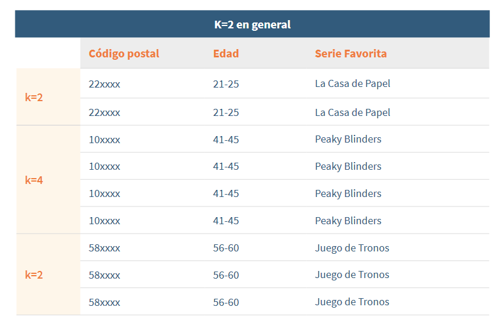

> [Guía básica de anonimización](https://www.aepd.es/documento/guia-basica-anonimizacion.pdf) Agencia Española de Protección de datos, 2022

<!-- En el ejemplo de la Agencia española de protección de datos, se muestra una base de datos de series favoritas anonimizadas con varios ejemplos de k-anonimatos -->

---
<!-- _class: with-success -->

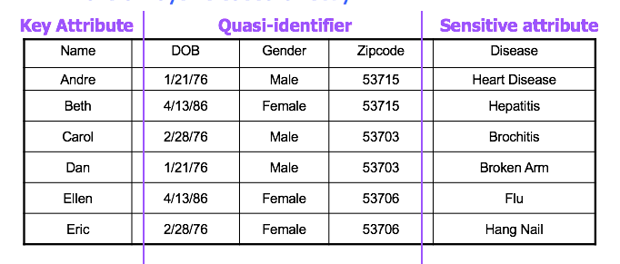

- Hay que evitar que se puedan correlar los "atributos clave" y los "sensibles" (nombre con enfermedad)
- Los "casi-identificadores" pueden dar suficiente información para identificar a una persona: hay que agruparlos en "clústeres de k-anonimato"

La anonimización de bases de datos está fuera del área de estudio, pero usamos el mismo concepto: el anonimato no es absoluto, lo que buscamos es ser anónimos en un grupo de "k" personas

## Solución 3: VPN
<!-- _class: with-warning -->

- Contrata los servicios de alguien que hace las peticiones por ti. Por ejemplo: una VPN
- La VPN hace las peticiones en nombre de sus $k$ clientes: $k$-anonimato para un observador externo
- Ningún observador externo puede correlar peticiones que entran en la VPN y las que salen (¡siempre que haya suficientes entradas!)

Problema: ¿seguro que la VPN no está logueando qué hacemos?

## Solución 4: Mix Networks

- "Encadenar VPNs entre sí": [Mix Network](https://en.wikipedia.org/wiki/Mix_network)
- Propuestas por [David Chaum](https://en.m.wikipedia.org/wiki/David_Chaum) en 1981: [Untraceable electronic mail, return addresses, and digital pseudonyms](https://doi.org/10.1145%2F358549.358563), Chaum, David L. Communications of the ACM. (1981)
- Es lo que se usa en Tor, Freenet, I2P..

# Redes mix/onion: Tor
<!-- _class: lead -->

Anonimato de cliente

## Solución completa: Tor

Tor (sigla de *The Onion Router* - El Enrutador Cebolla) es un proyecto con el objetivo de crear una red de comunicaciones de baja latencia y superpuesta sobre internet, en la que el encaminamiento de los mensajes intercambiados entre los usuarios no revela su identidad (dirección IP) y que mantiene la integridad y el secreto de la información que viaja por ella, y que además sea muy sencillo de utilizar.

- Navegador: Tor browser: https://www.torproject.org/download/
- *Daemon* de enrutamiento: para línea de comandos
- Tor Relays, ejecutados por voluntarios en Internet

## Usos
<!-- _class: with-warning -->

- Navegación anónima: "Web normal"
    - Para el usuario: anónimo
    - Para el servidor: nada especial, el servidor no tiene por qué saber que el usuario es anónimo (pero ojo: algunos servidores detectan y expulsan a los usuarios que vienen de Tor)
- Navegación .onion: "Dark web"
    - Para el usuario: anónimo
    - Para el servidor: anónimo
- Si eres un investigador analizando malware, no querrás que los malos te identifiquen: ¡utiliza navegación anónima!

<!--
Aparte de las razones que hemos visto para utilizar navegación anónima, hay una más: si eres "de los buenos", a veces querrás visitar las webs "de los malos". Y casi nunca querrás avisar de que estás investigándoles.

- Descarga del malware que están usando, sin avisarles de qué país vienes y por tanto sin avisarles de que los has descubierto: si un malo sabe que los has descubierto, puede explotar "la bomba" ransomware inmediatamente. Durante una investigación conviene que los malos no sepan quién eres.
- Visita a sus páginas web, a ver si realmente tienen información de tus clientes
- ...

Image: https://www.silicon.es/wp-content/uploads/2013/10/Fuente-Shutterstock_Autor-Tomas-Urbelionis_anonimato-anonimo.jpg
-->

## Surface, deep and dark web
<!-- _class: extra-slide -->

- **Surface web**: la web visible por Google
- **Deep web**: no visible por Google o similares. Parte privada de foros, correos electrónicos, intranets de empresa, bases de datos...
- **Dark web**: solo accesible con navegadores especiales y conociendo el enlace .onion

<!--
Deep y dark web a veces se confunden. Esta es una propuesta de definiciones muy utilizada en la literatura para distinguie la web normal que no puedes encontrar en Google, porque es privada, de la web que no puede ser accedida con normalidad.
-->

## Navegación normal

- Si usamos HTTPS, nadie sabe qué transmitimos
- Pero hay muchos actores que saben que estoy hablando con un servidor
- Y el servidor lo sabe todo

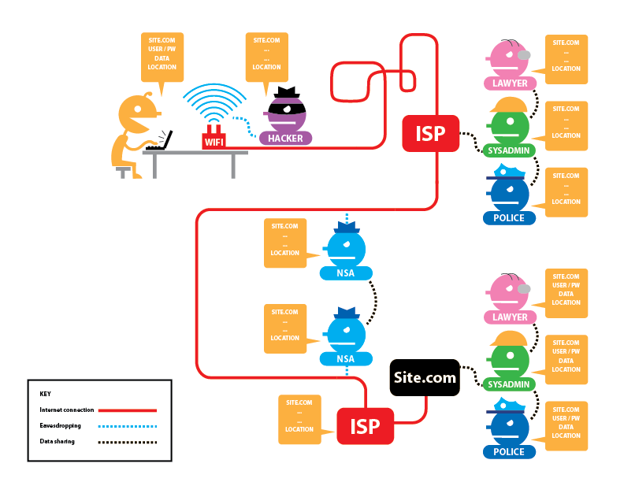

> https://www.eff.org/pages/tor-and-https

<!--
Como hemos estado viendo en todas estas sesiones, HTTPS ofrece confidecialidad, autenticidad e integridad: nadie sabe qué noticia estoy leyendo de elpais.com

- Excepto elpais.com, que sabe qué IP tengo y qué leo, y lo puede compartir con cualquiera
- Mi ISP también sabe que estoy conectándome a elpais.com
- Y los IXP, servidores de cloud, ISP destino... tienen que saber que yo estoy conectándome con elpais.com para poder enrutar mis mensajes. Auque no sepan qué página descargo, todo ellos saben que alguna página será. Incluso pueden sospechar cuál es midiendo tamaño de la conexión, tiempos de lectura...
-->

## Navegación anónima

- El servidor no sabe qué IP ha realizado la petición
- Nuestro ISP sabe que estamos usando Tor
- Los actores saben que alguien está usando Tor
- Todos saben qué servidor está respondiendo

> https://www.eff.org/pages/tor-and-https

<!--
- Si usamos comunicaciones anónimas como Tor, todo el mundo verás que hay alguien en Tor intentando conectarse a algún sitio. Pero ningún actor conoce todos los datos: la IP del cliente y la IP del servidor.
- OJO: si utilizamos un usuario y contraseña... elpais.com sabe quiénes somos aunque no sepa en qué IP estamos, y se lo puede contar a cualquiera

Fíjate que en este ejemplo el usuario es anónimo, pero el servidor no: veremos cómo anonimizar al servidor en el siguiente capítulo
-->

## Navegación anónima: proceso
<!-- _class: two-columns smaller-font -->

1. Alice **conoce** una lista de enrutadores Tor
1. Alice **crea** una cadena (circuito) de enrutadores: 1, 2, 3
1. Alice envía a $1$ el mensaje: $E_{pk1}(2|E_{pk2}(3|E_{pk3}(Bob|MSG)))$
1. $1$ descifra el mensaje, y se encuentra que es un mensaje cifrado para $2$. Lo reenvía
1. $2$ descifra el mensaje, y se encuentra que es un mensaje cifrado para $3$. Lo reenvía
1. $3$ descifra el mensaje, y se encuentra que es un mensaje para $Bob$. Lo reenvía

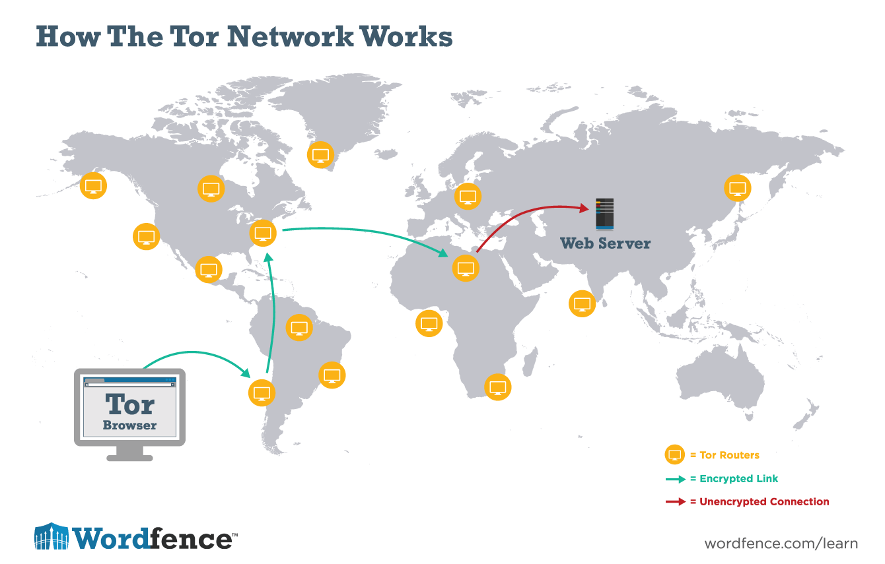

> https://www.wordfence.com/learn/the-tor-network-faq/

<!--
Este esquema se parece un poco a CROWDS, pero Alice puede controlar la longitud del circuito. Normalmente es 3 ó 4 saltos. Alice cambiará el circuido cada 10 minutos, aproximadamente. O más bien: el servicio de Tor de Alice cambiará el circuito automáticamente, sin que Alice tenga que hacer nada

Alice debería buscar relays en países bien diferenciados, y quizá aquellos entre los que no haya "buen intercambio de datos", es decir, entre diferentes "bloques mundiales"
-->

## Enrutamiento "cebolla", en detalle
<!-- _class: smaller-font -->

- Alice escoge un nodo $3$ para que reenvíe un mensaje a Bob, y lo cifra con la clave pública de $3$: $m_3=E_{pk3}(Bob|MSG)$
    - Solo $3$ puede descifrar $m_3$
    - $3$ sabe que el mensaje es para Bob así que se lo reenvía
    - Bob recibe un mensaje de $3$ y no sabe quién lo envió
- Para evitar que $3$ la identifique, Alice envía $m_3$ a $2$ pidiendo que se lo reenvíe a $3$: $m_2=E_{pk2}(3|m_3)=E_{pk2}(3|E_{pk3}(Bob|MSG))$
    - $2$ sabe que el mensaje viene de Alice, pero no sabe a dónde va: solo sabe que el siguiente paso es $3$
    - Nadie más que $2$ puede descifrar $m_2$
- Alice puede hacer esto varias veces para mejorar su anonimato: Alice envía un mensaje $m_1=E_{pk1}(2|m_2)$ a $1$ para que lo abra y se lo reenvíe a $2$, que lo abrirá y lo reenviará a $3$, que lo abrirá y lo reenviará a Bob.

<!--
Una explicación más detallada de la transparencia anterior: el enrutamiento onion es como un ogro, tiene capas. También es como las muñecas rusas, una dentro de otra.
-->

---

> https://es.wikipedia.org/wiki/Encaminamiento_cebolla

<!--
Esta es la transparencia anterior, pero con explicación gráfica del enrutamiento "cebolla"
-->

---

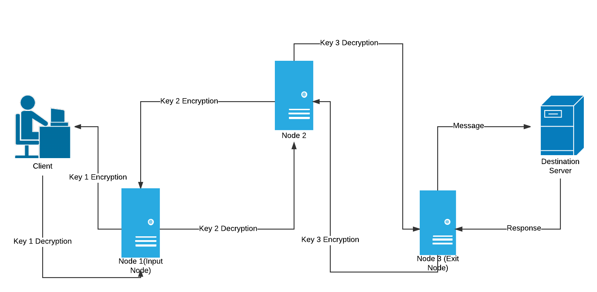

<!--
El sistema funciona también como una mix network: hay mucha gente usándolo a la vez, así que no es fácil correlar las entradas y las salidas de la red ni siquiera para un adversario muy poderoso que sea capaz de monitorizar varios nodos (gobiernos)

¿Qué pasaría si el sistema solo tuviese un usuario? ¡Un adversario que vea un mensaje en Tor sabría de quién es!

Image: https://contribute.geeksforgeeks.org/wp-content/uploads/Onion-Routing-Page-1.png
-->

## Navegación anónima
<!-- _class: smaller-font -->

Ejemplo: visitando google.com con el navegador Tor (navegador basado en Firefox)

Observa:

- El circuito de relays es de cuatro eslabones
- Google se piensa que estamos en Suiza porque el nodo de salida está en Suiza
- Curiosidad: ¡el nodo de entrada (Guard) cambia solo cada 2 o 3 meses!

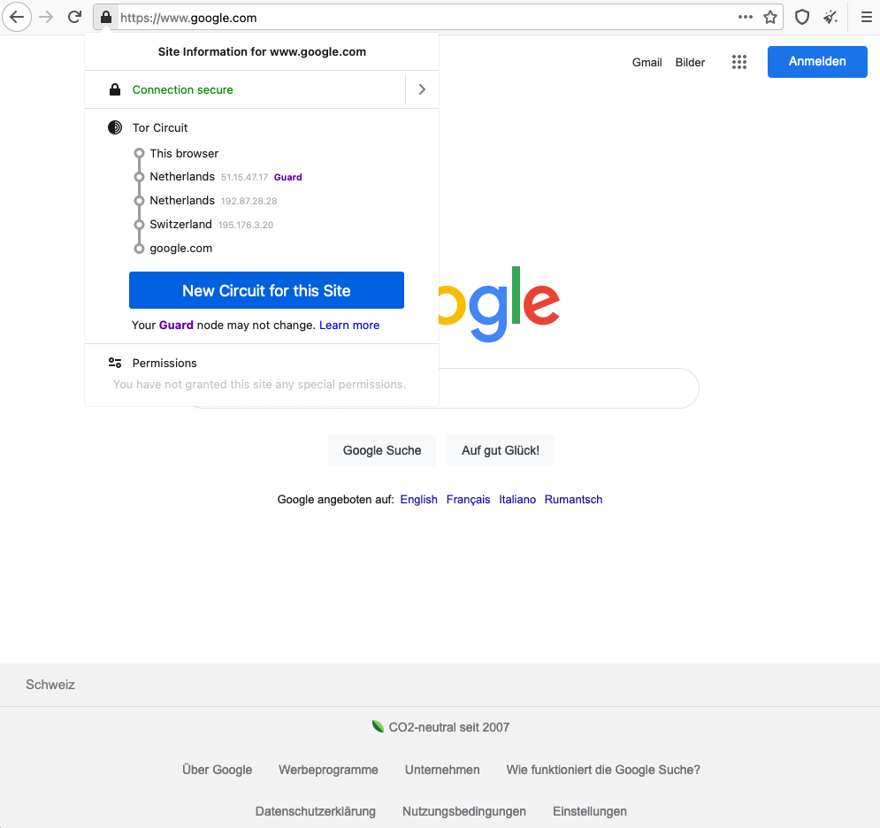

> [Tor Browser](https://www.torproject.org/)
> [Why is the first IP address in my relay circuit always the same?](https://support.torproject.org/tbb/tbb-2/)

# Servicios onion
<!-- _class: lead -->

## Servicios .onion

<!-- _class: two-columns -->

- A veces, los servidores **también** quieren permanecer anónimos: que nadie sepa dónde están ni qué IP tienen. De esta manera evitan que puedan cerrarse o atacarse
- En realidad el ejemplo de Breaking Bad ilustraría un mal uso de Tor: Gus controla el punto de encuentro, así que puede conocer a Walter sin que Walter lo reconozca (como pasó en la serie)
- Walter debería haber escogido él mismo el punto de encuentro, como en Tor

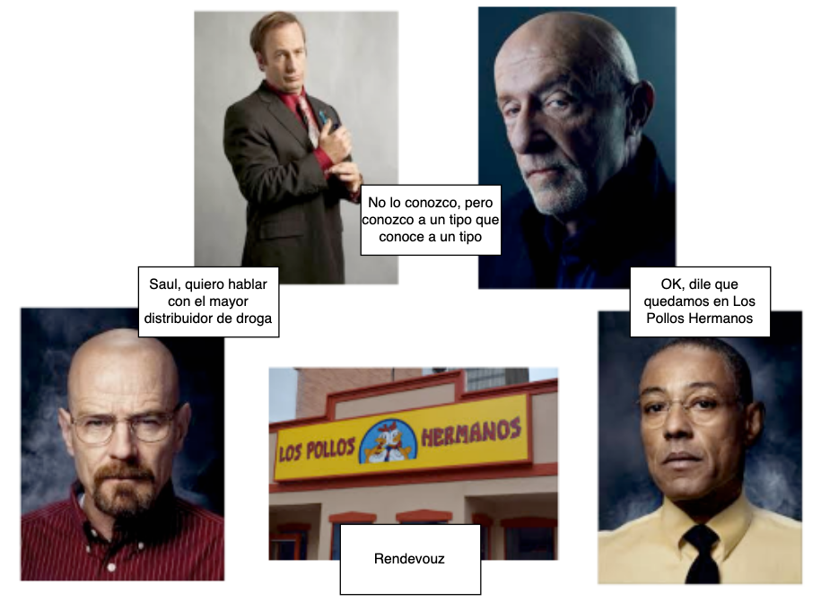

<!--
Piensa en la temporada 2 de Breaking Bad, cuanto Walter quiere hablar con un traficante (que no sabe que es Gus):

- Walter utiliza a Saul para contactar con el traficante. En realidad Saul "conoce a alquien que conoce a alguien", pero no conoce directamente a Gus. Esto es un servicio de directorio, y "alquien que conoce a alquien" las personas que aceptan mensajes en nombre de Gus.
- Cuando le vuelve el mensaje a Walter, Gus y Walter quedan en un sitio "neutral": Los Pollos Hermanos. Este es el rendezvous
-->

## Creación de un servicio oculto en Tor
<!-- _class: two-columns -->

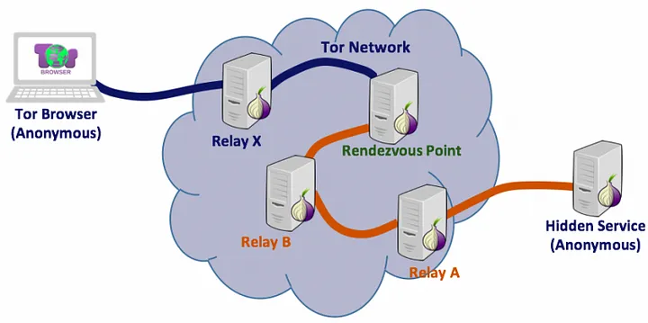

1. Crea un par de claves público/privada
1. Crea dirección .onion (hash de la clave pública)
1. Escoge un intermediario
1. Publica en base de datos distribuida dirección .onion e intermediario
1. Pregunta periódicamente al intermediario si hay mensajes para ti
1. Cuando llegue un mensaje (intento de conexión y punto de encuentro), crea un canal Tor hasta el punto de encuentro

> https://medium.com/axon-technologies/hosting-anonymous-website-on-tor-network-3a82394d7a01

---
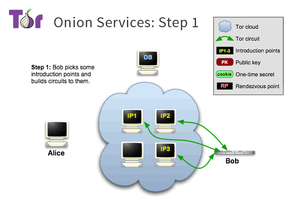 

- Cuando un servidor quiere ofrecer un servicio, crea una dirección .onion (ejemplo: https://www.bbcnewsv2vjtpsuy.onion/) y se escoge un nodo intermediario
- La dirección .onion está relacionadac con el hash de una clave pública creada ad-hoc por el servidor, y podemos validar que el servidor que nos responde es el que buscamos
- La dirección .onion y el nodo intermediario se publican en una [tabla de hash distribuida](https://es.wikipedia.org/wiki/Tabla_de_hash_distribuida)

<!--
Las direcciones .onion tiene normalmente algunos caracteres al azar detrás de ellas. Eso es porque los servicios de directorio en realidad están distribuidos (tablas de hash distribuidas) y las direcciones .onion se comportan como un hash. Normalmente, creas una dirección .onion que empiece con un nombre identificable, como bbcnewsXXXXXXX, mediante la tarea laboriosa de crear pares de claves publico/privada cuyo hash tengan la cadena que buscamos. No siempre tendremos tiempo ni recursos para esto.
-->

---

 

- Cuando alguien quiere usar el servicio, tiene que conocer **de antemano** la dirección .onion
- En el ejemplo, Alice escoge un lugar de encuentro (*rendezvous*) y envía un mensaje a Bob a través de alguno de los intermediarios

---

 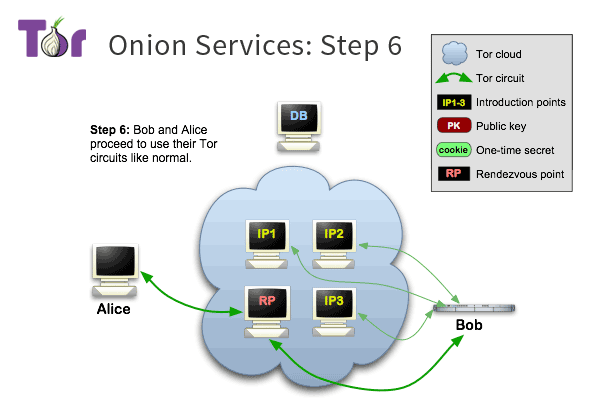

- Bob establece una conexión Tor con el *rendezvous*
- Alice también
- El *rendezvous* conecta las dos conexiones Tor

> https://2019.www.torproject.org/docs/onion-services.html.en

## DuckDuck Go

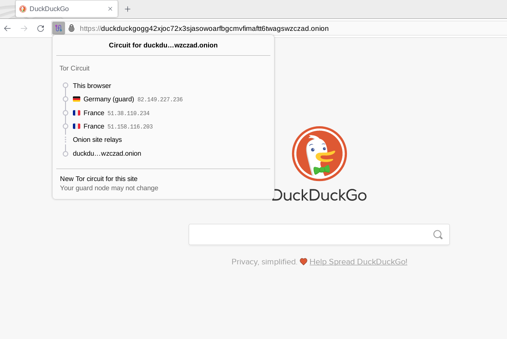

> https://duckduckgogg42xjoc72x3sjasowoarfbgcmvfimaftt6twagswzczad.onion/

## ¿Dónde encuentro direcciones .onion?

- Si eres víctima de un ataque Ransomware, tranquilo/a, te las dirán
- Repositorios (cuidado: están en la web normal):
    - https://github.com/alecmuffett/real-world-onion-sites
    - https://dark.fail/
    - https://ahmia.fi/
    - Más ideas: https://www.makeuseof.com/tag/find-active-onion-sites/

## ¿Pero quién mantiene los nodos de Tor?

Los nodos al final enrutaran mensajes que es muy posible que sean ilegales. ¿Quién querría hacer algo así?

- Gente que quiere apoyar el proyecto
- Gente que piensa que quiere apoyar el proyecto, pero venderá tu información ante cualquier problema
- Universidades haciendo investigación
- La policía intentando obtener información
- La NSA, o el equivalente europeo, ruso o chino
- Atacantes

No deberías fiarte de un nodo Tor. El sistema asume que los nodos Tor no son fiables. Si fuesen fiables, ¡serían suficientes circuitos de un solo relay!

## Vulnerabilidades

- En una red Tor no eres anónimo si anuncias quién eres: no las uses para acceder a Facebook
- Un observador sabe que estás usando una red Tor: los nodos de entrada y salidas son públicos
    - El emisor envía el primer paquete a un nodo Tor público
    - El receptor sabe que la petición viene de un nodo Tor
- *Timing attacks*: un adversario poderoso (estado) puede intentar correlar las entradas y salidas de la red: usa nodos en países diferentes
- *Sybil attacks*: un adversario poderoso puede controlar muchos nodos Tor y por tanto atraer gran parte de su tráfico, debilitando el anonimato del sistema

> https://github.com/Attacks-on-Tor/Attacks-on-Tor

## ¿Qué pasa si hay nodos Tor comprometidos?

Imagina un circuito con tres nodos Tor 1-2-3:

- Si un adversario controla los tres nodos, nadie que use ese circuito es anónimo
- Si un adversario controla el 1 y 3 (nodos de entrada y salida), puede intentar correlar entradas y salidas: puede (probabilidad) que descubra identidades
- Si un adversario controla un nodo, aprende datos estadísticos, pero es poco probable que aprenda identidades

¡Cuantos más uses, menos probable es que un solo adversario los controle todos!

---

La lista de nodos Tor es conocida aunque cambiante: es "fácil" para un servidor detectar si sus clientes están usando Tor

De hecho, si "un trabajador" intenta entrar en la VPN empresarial usando Tor... ¡muy probablemente es un atacante! Las VPN empresariales suelen detectar y bloquear las entradas desde Tor

> https://www.dan.me.uk/tornodes
> https://metrics.torproject.org/networksize.html

<!--
Ejemplos de relays Tor existentes cuando preparaba estas transparencias. La mayoría de relays Tor están en Europa, siempre ha sido así. Otros países tienen o bien poco interés de mantener nodos, o bien es peligroso hacerlo, o bien esos nodos pueden ser sospechosos de estar controlados por sus gobiernos.
-->

## Recomendaciones de uso

1. No envíes información personal
    1. No uses Tor para conectarte a Facebook, Google, Twitter...: ¡te estás identificando!
    1. No uses Tor para búsquedas Google (o cosas similares): te perfilarán
1. Mantén Tor actualizado
1. Evita que te perfilen (*fingerprinting*). Tor está diseñado para que todos sus usuarios tengan el mismo perfil. ¡No hagas nada que cambie el perfil!
    1. No cambies tamaño de ventana, ni la maximices
    1. No instales plugins nuevos
    1. Borra cookies y otros datos

> [The Web Never Forgets](https://www.esat.kuleuven.be/cosic/publications/article-2457.pdf) ACM SIGSAC Conference on Computer and Communications Security November 2014

<!--
Hay muchos sistemas para perfilar: no hay mucha gente en el mundo que tenga una pantalla de  800x600, con un navegador con soporte de AVI345 y que use Linux Debian 9. Un navegador envía toda esta información al servidor nada más presentarse!

El navegador Tor intenta no enviar nada de esto, y utiliza un User-Agent cambiante. Pero eso no evita que la web pueda identificarte por los plugins que tengas instalados o el tamaño de tu ventana. ¡No cambies estas cosas!

> Photo: https://unsplash.com/photos/RLw-UC03Gwc
-->

# Sistema de verificación de edad para el acceso a contenidos en línea
<!-- _class: lead -->

Usaremos el sistema propuesto en España como ejemplo, pero es similar al de otros países

## Sistemas anónimo de verificación de edad

En 2024, la AEPD propuso un [Decálogo de Principios](https://www.aepd.es/guias/decalogo-principios-verificacion-edad-proteccion-menores.pdf) con las siguientes características (seleccionadas)

1. garantizar que no es posible la identificación, el seguimiento o la localización de menores a través de Internet
1. anónima para los proveedores de servicios de Internet y terceras entidades
1. garantizar la no vinculación de la actividad de una persona entre distintos servicios

En julio de 2024, el gobierno de España [presentó el sistema OID4VP](https://digital.gob.es/dam/es/portalmtdfp/comunicacion/notas-de-prensa/20240701-NdP_verificacion_edad.pdf)

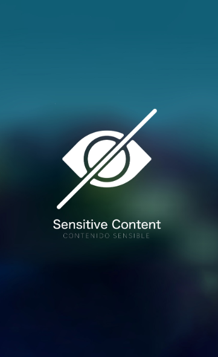

<!--
AEPD: Agencia Española de Protección de Datos personanales
-->

## Protocolo de Verificación de edad: OID4VP

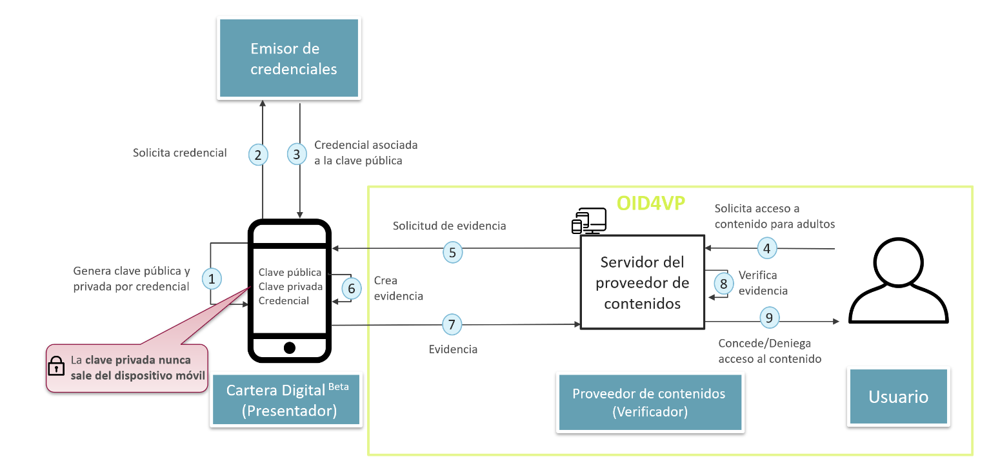

> [Protocolo de verificación de edad](https://digital.gob.es/dam/es/portalmtdfp/especificaciones_tecnicas/2024-06-30_Protocolo_de_verificacion_de_edad-v1_0.pdf.pdf) Ministerio para la Transformación Digital y de la Función Pública, Junio 2024

<!--

1. Para acceder al contenido restringido, el usario necesita previamente una "credencial de mayoría de edad" y un dispositivo móvil con una aplicación especial "Cartera Digital"
2. Para cada credencial que quiera solicitar, "Cartera Digital" general un par de claves público/privada. La clave privada nunca sale del dispositivo
3. Se solicita al emidor de credenciales (el gobierno) una credencial, y se envía la clave pública
4. El emisor envía la credencial firmada con su propia clave privada, con un tiempo de validez
5. El usuario acceder a un contenido protegido. El proveedor solicita prueba con un protocolo desafío/respuesta (tema autenticación)
6. El dispositivo responde al desafío, y solo puede hacerlo si tiene la clave privada asociada a la clave pública
7. El proveedor verifica la respuesta y da acceso

-->

---

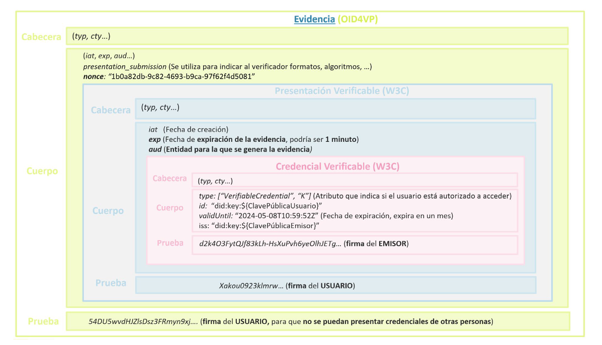

> [Protocolo de verificación de edad](https://digital.gob.es/dam/es/portalmtdfp/especificaciones_tecnicas/2024-06-30_Protocolo_de_verificacion_de_edad-v1_0.pdf.pdf) Ministerio para la Transformación Digital y de la Función Pública, Junio 2024

## Análisis y asunciones

- ¿Qué sabe cada participantes?
    - El gobierno sabe cuántos certificados has pedido
    - El gobierno no sabe dónde has usado los certificados
    - El proveedor no tiene información de la identidad de la persona que le presenta el certificado
    - Cada certificado es idealmente de un solo uso, así que no puede correlarse con otras peticiones otros días
- ¿Qué asunciones se hacen?
    - Que el proveedor de contenidos colabora y no permitirá el acceso si la evidencia no es verificable
    - Que el gobierno no preguntará a los proveedores de contenidos qué certificados se han usado

# Referencias
<!-- _class: lead -->

## Referencias

- Proyecto Tor, incluido su navegador: https://www.torproject.org/
- Tor y el Onion Routing, de tejedoresdelweb: http://tejedoresdelweb.com/w/TOR
- How Tor works?, by Hussein Nasser: https://www.youtube.com/watch?v=gIkzx7-s2RU
- Is Tor Trustworthy and Safe? https://restoreprivacy.com/tor/
- How do onion addresses exactly work? https://tor.stackexchange.com/questions/672/how-do-onion-addresses-exactly-work/674#674
- [Guía básica de anonimización](https://www.aepd.es/documento/guia-basica-anonimizacion.pdf) Agencia Española de Protección de datos, 2022
- [Protocolo de verificación de edad](https://digital.gob.es/dam/es/portalmtdfp/especificaciones_tecnicas/2024-06-30_Protocolo_de_verificacion_de_edad-v1_0.pdf.pdf) Ministerio para la Transformación Digital y de la Función Pública, Junio 2024

# ¡Gracias!
<!-- _class: last-slide -->