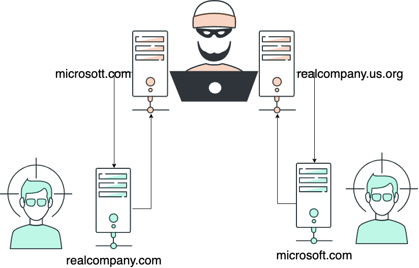
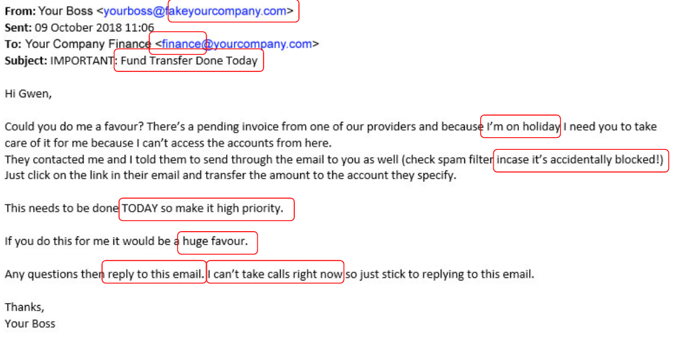

<style>
section.a-story ul li {
    list-style-type: none;
    text-align: center;
    line-height: 1.15em;
    margin-bottom: 1em;
}
section.a-story blockquote {
    margin-top: inherit;
}
</style>

# Business Email Compromise
<!-- _class: first-slide -->

Juan Vera del Campo - <juan.vera@professor.universidadviu.com>

<!--
Las transparencias de hoy están en inglés
-->

---
<!-- _class: with-warning -->

¿Qué es el *business email compromise*?

¿Cómo podemos aprovechar la criptografía para autenticar al remitente de un correo electrónico?

Esta presentación está en inglés


> Note: background stock images from pexels: https://www.pexels.com/

<!-- background: https://www.pexels.com/photo/woman-working-at-home-using-laptop-4050291/ Vlada Karpovich, free to use-->

# Contents
<!-- _class: cool-list toc -->

1. [Business Email Compromise (BEC)](#4)
1. [Types of Business Email Compromise (BEC)](#13)
1. [Investigating a BEC](#22)
1. [Prevention](#31)
1. [References](#50)

# Business Email Compromise (BEC)
<!-- _class: lead -->

---
<!-- _class: a-story -->


- You work for the finance department of a big company (100MM EUR)
- Your job involves transferring large amounts of money
- One day, you receive a phone call from an attorney

<!-- background: -->


---
<!-- _class: a-story -->


- You can google her name, she is involved in very important international operations
- She knows what she is talking about
- "Your company is in the middle of an urgen and confidential operation. We need your help. Your CEO will contact you, please check the email"

---
<!-- _class: a-story -->


Dear employeer,

We are in the middle of a very important finantial operation to acquire one of our competitors. It is of the upmost importance that this operation remains confidential until it can be safely announced.

I will be busy with the details. Please, get in touch with *important-lawyer* (in copy of this email). Keep me in the email loop.

I hope you undestand the confidentiality and urgency of this operation.

Your boss

---
<!-- _class: a-story -->


- The important lawyer sends you a document, which includes a transfer order for 4M€
- The order is signed by your boss
- You transfer the money
- ...
- A couple of days later, your boss calls you about a unauthorized money transfer you made to some unregistered location 

---

Do you believe you would never fall for this?

* ['CEO Spoofing' costs drug company $50 million](https://www.fox9.com/news/ceo-spoofing-costs-drug-company-50-million), 2015
* [Hackers siphon $47 million out of tech company's accounts](https://www.fox9.com/news/ceo-spoofing-costs-drug-company-50-million), 2015
* [Unusual CEO Fraud via Deepfake Audio Steals US$243,000 From UK Company](https://www.trendmicro.com/vinfo/us/security/news/cyber-attacks/unusual-ceo-fraud-via-deepfake-audio-steals-us-243-000-from-u-k-company), 2019
* [Un mail, una llamada y 4 millones robados a la EMT de València que volaron a Hong Kong: así fue el 'fraude del CEO' más salvaje de España ](https://www.eldiario.es/comunitat-valenciana/llamada-fabulosa-millones-emt-valencia_1_1243386.html), 2019
* [460,242 euro invoice due to pay to the Bilbao Club](https://www.majorcadailybulletin.com/news/local/2021/12/10/94245/mallorca-crime-alleged-ceo-scam-spain.html), 2021
* [Social engineering. CEO fraud of 9 million euros in the phishing scam to the biopharmaceutical company Zendal](https://kymatio.com/en/social-engineering-ceo-fraud-of-9-million-euros-in-the-phishing-scam-to-the-biopharmaceutical-company-zendal/), 2020.
* Most of them are covered up by the companies and never hit the news

---


---
<!-- _class: with-warning -->


If you work for a large company, you are receiving BEC attacks

> https://abnormalsecurity.com/blog/bec-vec-attacks

---


> https://fr.wikipedia.org/wiki/Gilbert_Chikli
> https://www.dw.com/en/france-fraudsters-sentenced-over-bizarre-impersonation-scam/a-52729296
> https://mashable.com/article/gilbert-chikli-scam

<!--
Gilbert Chickli is an international cyberattacker specialized in this kind of scam. He has a huge team and he was able to steal millions of euros. His method is still in use today.

There is movie about his life: Je Compte sur Vous
-->

# Types of Business Email Compromise (BEC)
<!-- _class: lead -->

---

- **The Bogus Invoice Scheme**: attackers pretend to be suppliers requesting fund transfers for payments to an account owned by fraudsters
- **CEO Fraud**: Attackers pose as the company CEO or any executive and send an email to employees in finance, requesting them to transfer money to the account they control
- **Account Compromise**: An executive or employee's email account is hacked and used to request invoice payments to vendors listed in their email contacts
- **Attorney Impersonation**: Attackers pretend to be a lawyer or someone from the law firm supposedly in charge of crucial and confidential matters
- **Data Theft**: Employees in HR and book-keeping are targeted to obtain personally identifiable information (PII) or tax statements of employees and executives
- **Send me the money**: Attackers pretend to be an employee that just changed the bank account, and request the next payment to be done in the new bank account

> https://www.trendmicro.com/vinfo/us/security/definition/business-email-compromise-(bec)

<!--
- BEC attackers rely heavily on social engineering tactics: attackers carefully research and closely monitor their potential target victims and their organizations
- Often, they impersonate CEO or any executive authorized to do wire transfers
- Some of the sample email messages have subjects containing words such as request, payment, transfer, and urgent, among others
-->

## BEC process

- The attacker impersonates a party sending a series of spoofed emails
    - Usually implies previous compromise to gain intelligence
- The first email may be from a legitimate **email address**
    - ... but not necessarily a legitimate **email server** 
- `Reply-to` is changed
- Addresses similar to real ones to distinguish themselves:
    - `worker@bigconnpany.com` instead of `worker@bigcompany.com`
    - `worker@bigcompany.us` instead of `worker@bigcompany.com`
    - `goodworker@bigcompany.com` instead of `good.worker@bigcompany.com`

<!--

Question: this only work in a very precise moment: near the end of the service, when billing is about to be exchanged and trust is already built between the two parties. How does the attacker now about the perfect moment?

- Infiltration
- Luck
- Assistance from an insider
- Patience

If the attacker infiltrates the infrastructure, most probably, all real emails between the two parties are going to "disappear". Check for automatic mail rules!. Beware: the compromised infrastructure maybe the victim's infrastructure or the other end of the communication!

-->


## Mail in the middle




<!--
Impersonation example: man-in-the-middle

The attacker sends an email to both ends with similar addresses but not quite the same. The text is "send further communications to..." or the "reply-to address is changed. i.e

Corporate or publicly available email accounts of employees related to finance are either spoofed or compromised

Objective: get an "email thread" where the other party is not involved

Beware: The attacker may impersonate several people: several accounts in CC, from several people...
-->

---


<!--
Most communications are transparently passed from one channel to the other: you won't find anything strange in the communication apart from the fake address

The attacker intervenes when billing information is exchanged: in this moment, he/she presents her/his bank account
-->

## CEO Fraud


<!--
This is another type of this fraud. In this case, all mails are fake. There is no need to compromise the infrastructure. Acting skills are required.
-->

---


The CEO needs something from me!

- "*I need help, fast and in confidence*"
- "*You’ll be contacted by an attorney/an important partner*"
- "*I can’t be contacted ATM*"

Some acting is usually involved. Someone might call you!

---



> Other examples: <https://www.tessian.com/blog/covid-19-real-life-examples-of-opportunistic-phishing-emails-2/>

## Sextorsion


- These fake extortions may include personal information collected from public sources!
- The sender could be your own account to "prove" it as hacked

# Investigating a BEC
<!-- _class: lead -->

## Something happened!

- The investigation usually starts with little knowledge: "I suspect we have been victim of fraud! The money just disappeared!" 
- You identify a probable BEC by running questions. Then, you review logs

---


## Objectives of the investigation

- Are we compromised, or is it the other side of the communications?
- When did the intrusion begin?
- How long did the threat actor maintain access?
- What did the threat actor learned?
- Is the actor still inside?
- Is someone internal involved? 
- How to prevent future attacks?
- Insurance: how is at fault?

> These are only an introduction for this presentation. Check: https://raw.githubusercontent.com/PwC-IR/Business-Email-Compromise-Guide/main/PwC-Business_Email_Compromise-Guide.pdf


<!-- backpground: https://www.pexels.com/photo/question-marks-on-paper-crafts-5428832/ Leeloo the first, free to use-->

---

[](https://www.youtube.com/watch?v=k0eECA2vwjQ)

## Opportunistic attacks
<!-- _class: with-warning -->

The attackers know exactly when to attack. They know...

- which person they have to contact
- When the CEO is away the office and cannot be reached
- The precise moment they have to change bank accounts
- All the partied involved

How did the attacker send the first email?

How did the attacker know it was the right moment?

A BEC attack usually begins as a phishing attack, and inboxes are controlled since long before the detection

## Identifying inbox compromise

- Check for unexpected Automatic Forwarding rules
- Identifying suspicious login activity
- Permission changes on existing or newly created accounts
- Assessing which emails or data has been accessed and/or ex-filtrated is critical for  determining the impact on an organization
- Threat intelligence is an important part of the investigative process

## Control of the inbox

Email Collection : https://attack.mitre.org/techniques/T1114/

1. Identify accounts that could have been under the control of the attackers
1. Identify **time period of the compromise**
1. **Any automatic rules: forward, move...**
1. **Authentication from unusual places**
1. Is 2FA activated? Even with 2FA: is legacy authentication activated?
1. Was the device (not the account) compromised?


<!--
When an attacker access an account, he forwards emails to his own account. He is not interested only in past emails, also in future emails: when a deal is going to be closed, is there any additional email thread I must be aware...

Most of the times, they even hide this emails. His objective is that the victim won't receive any email from the other side, he is going to control all emails.
-->

## Where are the logs?

- On-premises: Exchange, dovecot...
- "In the cloud": Google Workspace, Microsoft 365... they usually have [audit logs](https://support.google.com/a/answer/4579579?hl=en) and [litigation modes](https://docs.microsoft.com/en-us/microsoft-365/compliance/create-a-litigation-hold?view=o365-worldwide). Warning: [they cost extra](https://workspace.google.com/pricing.html) and they must be activated BEFORE the incident


> https://answers.microsoft.com/en-us/msoffice/forum/all/office-365-admin-portal-logs/70ca8227-0c69-408f-a2c3-e2c8a8cadfb5

# Prevention
<!-- _class: lead -->

## External confirmation

You can check the reputation of a domain in several sites:

- https://emailrep.io
- https://email-checker.net
- https://tools.emailhippo.com
- https://hunter.io/email-verifier
- https://trumail.io

Warning: the response from these services is just a suggestion!

## Threat intelligence

https://en.wikipedia.org/wiki/Cyber_threat_intelligence

- Learn about attacks before they happen
- Identify the registration of domains similar to your name: McDonals, ChinaExpor...
- Identify leaked passwords


<!--
BlueLiv is a company from Barcelona specialized in Threat Intelligence. If I'm not mistaken, they have open positions for students
-->


## Signing / encypting emails: PGP

Your contacts send their public keys to you manually. All communications from a contact must be signed using one of the accepted keys.

The perfect solution: sender signs the email, the receiver only accept emails from trusted parties


Bad news: PGP is rarely used in real life!

> https://docs.deistercloud.com/mediaContent/Axional%20development%20libraries.20/Server%20side%20javascript.50/AX%20Library.10/crypt/media/PGP.png

---


Tools: Mailvelope, Flowcrypt, KPGP...

<!-- This is an example of mailvelope, a commertial solution for Gmail-->

## Protecting the channel, not the emails

Protecting emails end-to-end is not going to happen in the near future

Current solution: protecting emails in the middle


<!--
Ideally, we should be able to protect emails from one side to the other. Since PGP is not well implemented out of companies, the current solution is protecting an email when they travel between servers, and trust in the authentication methods used by the servers to protect the final link to the users

Process to send an email:

1. a user sends the email to the mail server controlled by his company
2. the sender email sender sends the email to the receiver server. Here, it is possible to have several "jumps" between different servers due to aliases, groups or forwards.
3. The receiver server sends the email to the final recipients

Three tecnologies protect the communications between servers: SPF, DKIM and DMARC

Image source: > https://statics.esputnik.com/photos/shares/Blog/images/AMP/image4.png

-->

## SPF

Sender: the DNS includes the list of IP addresses of email servers allowed to send emails "from" the domain

Receiver: check if the IP of the server that sent an email is authorized


> [Short Primer on SPF, DKIM, and DMARC](https://medium.com/@pendraggon87/short-primer-on-spf-dkim-and-dmarc-9827eb2f359d)
> [SPF Records For ClickDimensions
](https://support.clickdimensions.com/hc/en-us/articles/115001162874-SPF-Records-For-ClickDimensions)

---


<!--

Tool in the screen: mxtoolbox

Command line: dig universidadviu.com TXT

-->

---
<!-- _class: with-warning -->

```
> dig universidadviu.TXT
...
universidadviu.com. TXT "v=spf1 mx ip4:5.57.227.88 include:spf.planeta.es include:_spf.explore-blue.com ~all"
...
```

- Emails from `universidadviu.com` can be send from IP `5.57.227.88` and whatever is configured in `spf.planeta.es` or `_spf.explore-blue.com`
- If you receive an email NOT from these IPs:
    - `~all` means soft fail and `-all` means hard fail. Your email client might show warnings for soft fail and classify the email as spam for hard fails.
    - `+all` means allow all mail to pass and `?all` means neutral. Not recommended, equivalent to not having SPF

Notice SPF tells receivers what to do. SPF won't protect you, but your receivers

## Email protection: DomainKeys Identified Mail (DKIM)

The receiving **server** checks the digital signature of the sending **server**

Your server (not you!) authenticates the content received from the sending **server**, not the sending **user**!

i.e.: your email provider authenticates than an email sent from <someone@gmail.com> was not modified since it left `gmail.com`


> Fuente: https://dmarcian.es/what-is-dkim/
> RFC 6376: [DomainKeys Identified Mail (DKIM) Signatures](https://www.rfc-editor.org/info/rfc6376) September 2011

---

Received mails have an additional header:

```
DKIM-Signature: v=1; a=rsa-sha256; c=relaxed/relaxed; d=blackboard.com;
 s=sep2018; t=1670602715; bh=cS05YrQmiEH2S8VAGWK3wheZ287IPz+hfGXR1TsDY70=;
  h=Date:From:Subject:Reply-To; 
  b=gGHlf9eKK51Zw09JP98lOUgODgF61ZF7juJKDLjWLBxDDndvM8QMe4122XUO2wKgC
    4SkqQkabmXk66gUsKIge9Z2pjnabs9klfTgZcCT13wxAUsIQur4SIJ+8f3a1sBnGTT
    (...)
    6miGagayTXZANUbsdmtYtoPmxxdAuoOHiClnoXrdxhBFED8VrnhH8dMjd3ADZ1LaOA
    LVRFXW1djkSrg==
```

- `d`: domain: `blackboard.com`
- `s`: selector `sep2018`
- `h`: headers fields: `Date:From:Subject:Reply-To;`
- `bh`: body **hash**
- `b`: `Base64(E_{RSA}(hash(Date:From:Subject:Reply-To:bh), DKIM_{key}))`

<!-- El campo b es la firma digital -->

## Verification process

- Get the body content, run canocalization algorithm `c`, calculate the hash value (`bh`). Check.
- Concatenate the headers in `h` and the `dkim` header (removing `b` but not `bh`)
- Download the server's public key from DNS using `d` and `s` (next slide)
- Validate the digital signature

---

Digital signature:

```
> dig blackboard.com TXT
...
blackboard.com.		28800	IN	TXT	"v=spf1 include:
_netblocks.blackboard.com ...

> dig spf.blackboardconnect.com TXT
...
spf.blackboardconnect.com. 1800	IN	TXT	"v=spf1
ip4:34.215.79.96
ip4:34.213.216.156
...
DNS Record - sep2018._domainkey.blackboard.com
Selector - sep2018
Domain - blackboard.com 

20210112.estudiantat-upc-edu.20210112.gappssmtp.com. 3600 IN TXT
v=DKIM1;k=rsa;g=*;p=MIIBIjANBgkqhkiG9w0BAQEFAAOCAQ8AMIIBCgKCAQEAvs5qVO9zW6c
82vTZNGUA9YYZKfoxtSXGdG/+QEHe0Kg9D0wIuHobngn/+NmvYSmZ2KtdnQssTF93MhXBlQ8jX3
mjndj0tIaW6Snsm0+q68sJdzA7NtJBr4ljcEQRjq3jI6RQUrhs9gJ1DaKtws3SXMR8M72pQIbku
c5vkMxPCU5GPTj6TW9QweD/dZclLZ3o2AlcgONifoQY/7x2fV5GE9r55+xGB2m8yXKGeOybEkOA
G9goPDp4/XQVPHfX6+Icv/OflXQ+mAuzutgyeWAe0NvYaO6NiN0I2MkcgXACsuOVwCnLs9lPkWb
G9grZUEVz4wsJquAXgNQkse3eCpadIQIDAQAB
```

> https://www.dmarcanalyzer.com/dkim/dkim-checker/
> https://www.metaspike.com/leveraging-dkim-email-forensics/

## X-Google-DKIM: DomainKeys Identified Mail
<!-- _class: extra-slide -->

```
X-Google-DKIM-Signature: v=1; a=rsa-sha256; c=relaxed/relaxed;
        d=1e100.net; s=20161025;
        h=x-gm-message-state:mime-version:from:date:message-id:subject:to;
        bh=s7gErmNKwESPKSP6VW9kvRoEY/oQ8b6V1OFgRMqAjtU=;
        b=lB+wgPGej/d1HNLxj7oP1L9Mi56hwji5GA3hLrVYCRKohiAs3L7uI6fEq7sp7wBXKm
         9mOGnbIrSXMeOfOa/YnAnJg/4x6U5gvVtoisigFMR/bGxoPQRO6LUqvunBhR3il6f+OX
         ZRJIsZsvigsesD1vZcarlVr5D0QL2Cw2l1o1T6zVNH3Z8cmZNTCpfzmD3YmVCm+Cgdz9
         RQgX/iL12TxzzOmx+8yInGYnL9ZyaNY6Wsbi7LOBp7kRNLWrMKVtUlwuS2WSzQ5Jvwkm
         0SZ90S524hBquiF8WAzJI95AD/L5fr69sjaN/wM6pk8l6fTapm8+K6TsMPYrEhHtRFZ2
         vLYQ==
```

Google uses another DKIM signature that uses other headers. This is probably a signature to be used only inside Google. Still, it is a valid DKIM signature.

> https://mailarchive.ietf.org/arch/msg/apps-discuss/_blROpC5GpEPk96nBqKoNUaO5rg/

## Domain-based Message Authentication, Reporting & Conformance


- An email authentication, policy, and reporting protocol
- It **builds on the widely deployed SPF and DKIM protocols**
- With DMARC you can tell the world how to handle the unauthorized use of your email domains by instituting a policy in your DNS
    - `p=none`: monitors your email traffic. No further actions are taken.
    - `p=quarantine`: sends unauthorized emails to the spam folder.
    - `p=reject`: unauthorized email doesn’t get delivered at all.

> https://dmarc.org/

---


> https://www.agari.com/blog/pros-cons-dmarc-reject-vs-quarantine

## Email authentication: summary
<!-- _class: smaller-font -->

Technology|Use|If not configured...
--|--|--
SPF|Check if the IP is authorized to send an email from the domain|Anyone in the Internet can send an email "from" mycompany.com
DKIM|Digital signature of emails sent from a domain|Anyone in the middle could change emails sent from mycompany.com
DMARC|Inform receivers about the recommended actions|Receivers "don't know what to do" if a email from mycompany.com doesn't pass SPF or DKIM
-|-|Emails from mydomain.com are going to be classified as "spam" or "suspicious" automatically

List of authorized IPs, public key and policies are announced in the domain's DNS entry

<!--
Warning: since emails without SPF/DKIM are going to be classified as spam or suspicious, the sender could request whitelisting them in your email system

Do not whitelist emails "from mycompany.com" if mycompany.com has not configured SPF!!. No SPF means anyone can send emails "from mycompany.com" and you cannot distinguish good from bad emails
-->

## The bad news...

- PGP is rarely used in real life
- Not all companies implement SPF or DKIM, but this is changing fast
- These mechanisms do not protect against an email sent from `macdonalds.com`: the attackers can configure SPF and DKIM too!
- SPF and DKIM only authenticate from the sending server to the receiving server! These technologies do not detect if a legitimate account is compromised

<!--
- Los malos pueden configurar también sus servidores
- estos mecanismos no te protegerán contra direcciones "parecidas"
- SPF y DKIM solo autentican desde el servidor. ¿Quién estaba realmente escribiendo el mensaje?
    - Si el atacante ha conseguido crear cuentas: b0ss@company.com también pasará el DKIM de company.com
    - Si el atacante ha conseguido las credenciales de boss@company.com pasará el DKIM de company.com
-->

## Recommendations
<!-- _class: two-columns-list -->

<style scoped>
    ol { list-style-type: none}
    li ul { margin-top: 1em;}
    li li { margin-left: -1em; ; width: 95%; }
</style>

1. **Admins**
    - Activate 2FA, disable legacy login
    - Activate mailbox auditing
    - Regularly, check rules
    - Train your users
1. **Users**
    - Check the address of the other participant in the communication
    - Be careful if the address changes
    - Be careful if the language of the other participants change
    - Many email clients do alert when an address changes
    - Many email clients do alert if an Internet header is spoofed

# References
<!-- _class: lead -->

---

- [What is Business Email Compromise (BEC)? How Does it Work? ](https://www.tessian.com/blog/bec-business-email-compromise/), Tessian 2021
- [Business Email Compromise](https://www.fbi.gov/scams-and-safety/common-scams-and-crimes/business-email-compromise) FBI 
- [Business Email Compromise Guide for O365](https://github.com/PwC-IR/Business-Email-Compromise-Guide) - PwC 2021
- [Phishing investigation](https://learn.microsoft.com/en-us/security/operations/incident-response-playbook-phishing) - Microsoft 2023
- [Anatomy of a Business Email Compromise Investigation](https://www.magnetforensics.com/blog/anatomy-of-a-business-email-compromise-investigation/?utm_source=Pardot&utm_medium=Email&utm_campaign=2021_MonthlyNewsletterDecember) - Magnet Forensics 2021
- [Awesome-BEC: repository of information](https://github.com/randomaccess3/Awesome-BEC/blob/main/README.md)


# ¡Gracias!
<!-- _class: last-slide -->
