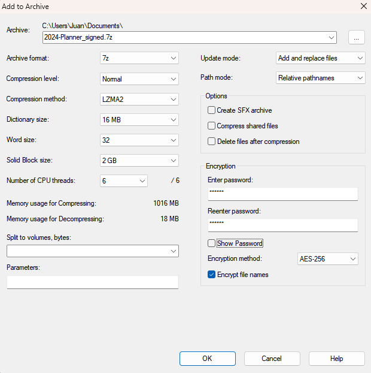

# Cifrado de dispositivos de almacenamiento
<!-- _class: first-slide -->

Juan Vera del Campo - <juan.vera@professor.universidadviu.com>

# Contents
<!-- _class: cool-list toc -->

1. [Uno](#4)
1. [Dos](#13)

# El problema de cifrar dispositivos
<!-- _class: lead -->

## Cifrado de archivos
<!-- _class: two-columns -->

- RAR, ZIP, 7Zip premiten crear archivos cifrados
- Todos ellos usan AES-256
    - En el caso de 7zip: AES-CBC
- Todos usan algún mecanismo para convertir una contraseña en una clave: [Key Derivation](https://en.wikipedia.org/wiki/Key_derivation_function)
    - [En el caso de 7zip](https://documentation.help/7-Zip/7z.htm): hashed password + salt con muchas iteraciones, similar a bcrypt
    - Otros: [PBKDF2](https://en.wikipedia.org/wiki/PBKDF2)
- Cifrado de **nombres de archivos**. 7z lo permite, Zip no

## Cifrado de discos/particiones enteros

Objetivos:

- Los datos tienen que ser confidenciales
- Las operaciones tienen que ser rápidas
- No es deseable usar más espacio de disco

Opcionales:

- Permitir que cargue el sistema operativo aunque no se carguen los datos. Ver también: [08-ransomware.html]
- Permitir acceso "random" a los archivos
- ¿Negar que existan datos? [Esteganografía](09-esteganografia.html)

# Dispositivos portátiles
<!-- _class: lead -->

# Android y MAC
<!-- _class: lead -->

# Linux
<!-- _class: lead -->

# Windows
<!-- _class: lead -->

# Referencias
<!-- _class: lead -->

---

- Uno
- Dos

# ¡Gracias!
<!-- _class: last-slide -->
