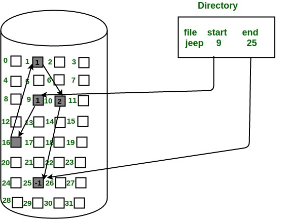
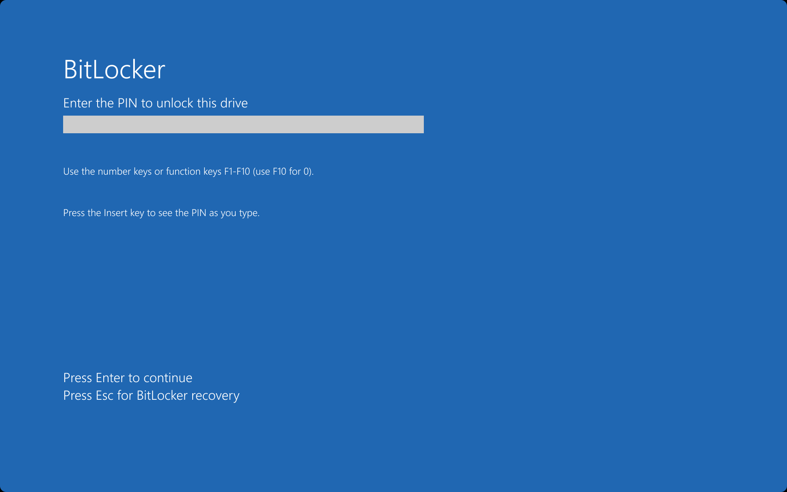
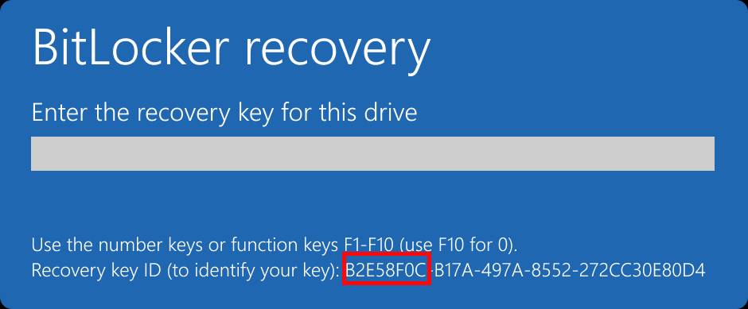
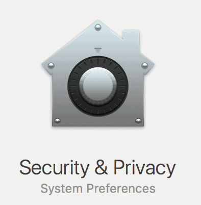
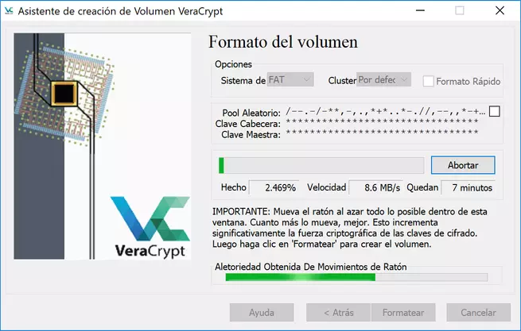
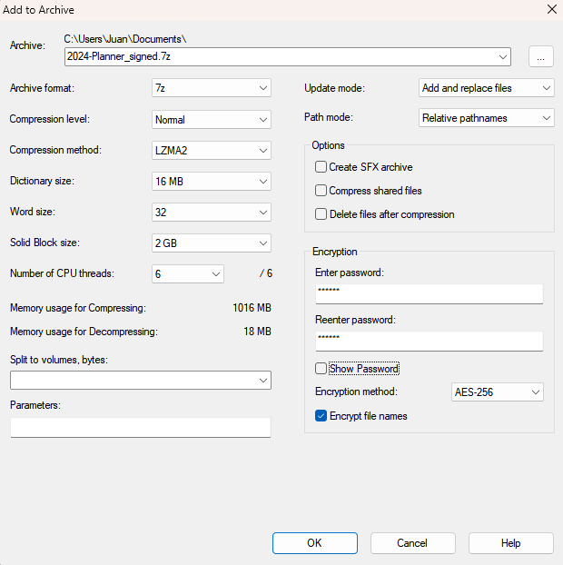

<style>
section.a-story ul li {
    list-style-type: none;
    text-align: center;
    line-height: 1.15em;
    margin-bottom: 1em;
}
section.a-story blockquote {
    margin-top: inherit;
}
</style>

# Cifrado de dispositivos de almacenamiento
<!-- _class: first-slide -->

Juan Vera del Campo - <juan.vera@professor.universidadviu.com>

# Contents
<!-- _class: cool-list toc -->

1. [Introducción al cifrado de discos](#3)
1. [BitLocker (Windows)](#15)
1. [FileVault (MacOS)](#22)
1. [LUKS (Linux)](#26)
1. [Cifrado de archivos y pendrives](#30)
1. [Recomendaciones](#34)

# Introducción al cifrado de discos
<!-- _class: lead -->


## Cifrado de dispositivos de almacenamiento
<!-- _class: cool-list -->

1. *Ventajas*
  - Protección frente a pérdida o robo del dispositivo
  - Requisito para normativas de cumplimiento. Ejemplo: [NIST SP 800-171](https://csrc.nist.gov/pubs/sp/800/171/r2/upd1/final)
  - Permite compartir equipos con menos riesgos
  - *Backups* seguros
  - Viajes con dispositivos con *dual-boot*
2. *Desventajas*
  - Posible impacto en el rendimiento
  - Riesgo de pérdida de acceso si no se gestionan bien las claves

> https://www.nist.gov/publications/guide-storage-encryption-technologies-end-user-devices

## Cómo se guardan archivos en un disco o pendrive

- Los discos de dividen en particiones/volúmenes
- Los archivos se dividen en bloques
- Los bloques pueden guardarse desordenados dentro de una partición
- Podemos cifrar:
    - El disco completo, incluyendo dotas las particiones
    - Solo una partición completa
    - Los archivos por separado



## Propiedades deseables del cifrado de disco

- Los datos deben permanecer confidenciales (¡obvio!)
- El cifrado y el descifrado de archivos debe ser eficiente, da igual dónde esté el archivo
- El cifrado de archivos no debe utilizar más espacio de disco

Opcionales:

- Permitir que cargue el sistema operativo aunque no se carguen los datos. Ver también: [08-ransomware.html]
- Permitir recuperación incluso si la clave se pierde
- ¿Negar que existan datos? [Esteganografía](09-esteganografia.html), [Plausible denialability](https://veracrypt.eu/en/Plausible%20Deniability.html)

> https://en.wikipedia.org/wiki/Disk_encryption_theory

<!--

Imagina que se utilice AES-CBC sobre un disco entero y queremos descifrar un archivo que esté al final: ¡tendríamos que descifrar primero todos los bloques anteriores!

-->

---

Capacidades esperadas de los atacantes:

- Podrían leer cualquier bloque del disco
- Podrían copiar cualquier bloque del disco en otra posición del disco
- Podrían modificar cualquier bloque del disco y pedir que se cifre

## Cifrado de Disco, Volumen y Archivo

| Tipo de Cifrado | Nivel | Ejemplos | Ventajas | Desventajas |
|----------------|-------|----------|----------|-------------|
| Disco completo | Físico | BitLocker, FileVault, LUKS | Protege todo el contenido, arranque seguro | Pérdida total si se corrompe el arranque. Solo protege mientras el dispositivo esté apagado |
| Volumen        | Lógico | VeraCrypt, LUKS en contenedor | Se puede mover entre dispositivos | Requiere montaje manual |
| Archivo        | Individual | eCryptfs, fscrypt | Gran flexibilidad y control | No protege metadatos del archivo |

## Estándar de Cifrado: XTS-AES

- [XTS-AES](https://en.wikipedia.org/wiki/Disk_encryption_theory), con claves de 128 o 256 bits:
  - Específico para cifrado de discos
  - Mejora seguridad frente a manipulación de bloques
- Ventajas:
  - Alta seguridad y eficiencia
  - Adaptado a almacenamiento en bloques
- Desventajas:
  - No protege la integridad del contenido

---

XTS-AES utiliza la técnica ["XOR-encrypt-XOR"](https://en.wikipedia.org/wiki/Xor%E2%80%93encrypt%E2%80%93xor), añadiendo dos claves que dependen de la posición del bloque en el disco

El uso de este modo también un cifrado rápido y eficiente de bloques consecutivos


---


<!--
- i es el número de sector del disco
- j es el número del bloque dentro del sector
- alpha es parte de un polinomio conocido
-->

## ¿Por qué XTS-AES es ideal para discos duros?
<!-- _class: with-success -->

- Diseñado específicamente para almacenamiento en bloques
- Evita patrones repetitivos en datos cifrados (problema en ECB)
- Usa dos claves independientes:
  - Una para el contenido del bloque
  - Otra para el direccionamiento del bloque
- Proporciona protección contra ataques de reubicación de bloques
- No protege integridad, solo confidencialidad.

XTS-AES es el estándar recomendado por [IEEE P1619](https://en.wikipedia.org/wiki/IEEE_P1619) para proteger discos duros y SSDs.


## ¿Qué es un ataque de reubicación de bloques?

- Es un tipo de ataque en el que el atacante copia bloques cifrados de una parte del disco a otra sin necesidad de descifrarlos
- Si el modo de cifrado no está bien diseñado, podría alterar el comportamiento del sistema sin modificar los datos descifrados directamente
    - Ejemplo: mover un archivo cifrado de configuración desde un usuario con menos privilegios a una zona del sistema donde sea interpretado como un archivo legítimo
- XTS-AES evita estos ataques al incorporar la dirección del bloque como parte del proceso de cifrado

---

Vamos a ver como ejemplos:

- Bitlocker: Windows
- FileVault: MacOS
- LUKS: Linux
- Pendrives y archivos individuales

# BitLocker
<!-- _class: lead -->

## BitLocker (Windows)

- Cifrado de disco completo desde arranque
- Integrado en Windows (Pro, Enterprise)
- Utiliza XTS-AES desde Windows 10
- Métodos de autenticación:
  - Contraseña
  - PIN
  - [TPM](https://en.wikipedia.org/wiki/Trusted_Platform_Module) (Trusted Platform Module), chip en la placa base
  - Clave de recuperación (para el administrador)

> https://en.wikipedia.org/wiki/BitLocker



---

- Ventajas:
  - Fácil de usar e integrar en entornos Windows
  - Fácil de integrar y gestionar en redes corporativas
  - Compatible con TPM para mayor seguridad
- Desventajas:
  - Requiere versiones específicas de Windows
  - Dependencia de herramientas Microsoft

## Clave de recuperación

En caso de que se nos olvide el PIN de desbloqueo, aún podemos usar la *clave de recuperación*

¿Dónde está esa clave?

- Es un número largo que **hemos tenido que guardar externamente** (¡no en el mismo PC!) cuando hemos cifrado el disco
- En entornos corporativos, se guarda en el *Active Directory*



> https://support.microsoft.com/en-us/windows/find-your-bitlocker-recovery-key-6b71ad27-0b89-ea08-f143-056f5ab347d6

## BitLocker y Active Directory

- Integración con *Active Directory Domain Services*
- Almacenamiento centralizado de claves de recuperación
- Políticas de grupo:
  - Activación automática en equipos unidos al dominio
  - Requerir autenticación multifactor (TPM + PIN)
  - Cifrado obligatorio para discos extraíbles (BitLocker To Go)

## Configuración básica

1. Configurar GPO (Group Policy Object):
   - Ubicación: `Directiva de equipo local > Plantillas administrativas > Componentes de Windows > Cifrado de unidad BitLocker`
2. Habilitar almacenamiento de claves de recuperación en AD
3. Aplicar GPO a equipos del dominio
4. Verificar claves en la consola de Usuarios y Equipos de Active Directory o mediante PowerShell

> https://learn.microsoft.com/en-us/windows/security/operating-system-security/data-protection/bitlocker/operations-guide?tabs=powershell


## Ejemplo práctico

Supongamos que el usuario `jfernandez` ha cifrado la unidad `C:` con BitLocker en un equipo unido al dominio. Para recuperar su clave:

1. Abre PowerShell con permisos de administrador en un controlador de dominio.
2. Ejecuta el siguiente comando para buscar la clave de recuperación:

```powershell
Get-ADObject -Filter 'objectClass -eq "msFVE-RecoveryInformation"' -SearchBase "OU=Equipos,DC=empresa,DC=com" -Property * \
| Where-Object { $_.'msFVE-RecoveryPassword' -like '*' } \
| Select-Object Name,'msFVE-RecoveryPassword','msFVE-KeyPackage','WhenCreated'
```

> https://stackoverflow.com/questions/50411539/retrieving-bitlocker-recovery-keys-from-ad

---

3. También puedes usar la interfaz gráfica:
   - Ir a "Usuarios y equipos de Active Directory"
   - Buscar el equipo (por ejemplo, PC-JFERNANDEZ)
   - Clic derecho > Propiedades > pestaña BitLocker Recovery

> https://support.microsoft.com/en-us/windows/find-your-bitlocker-recovery-key-6b71ad27-0b89-ea08-f143-056f5ab347d6

# FileVault
<!-- _class: lead -->

## FileVault (macOS)

- Cifrado de disco completo desde arranque
- Utiliza XTS-AES-128 con clave de 256 bits
- Autenticación con cuenta de usuario o clave de recuperación
- Integración con iCloud para recuperación



> https://support.apple.com/en-me/guide/mac-help/mh11785/mac

---

- Ventajas:
  - Alta integración con el sistema y Apple ID
  - Transparente para el usuario final
- Desventajas:
  - Recuperación dependiente de iCloud si no se configura MDM

## MDM y FileVault

- MDM: Mobile Device Management, para redes corporativas
- Activación remota de FileVault
- Gestión de claves de recuperación institucionales
- Integración con Apple Business Manager
- Cumplimiento normativo (GDPR, etc.)
- Ventajas:
  - Control centralizado de cifrado
  - Reducción de errores de configuración manual
- Desventajas:
  - Requiere inversión en soluciones MDM

> https://support.apple.com/guide/deployment/manage-filevault-with-mdm-dep0a2cb7686/1/web/1.0

# LUKS
<!-- _class: lead -->

## Cifrado en Linux

- LUKS (Linux Unified Key Setup):
  - Cifrado a nivel de partición
  - Compatible con `cryptsetup`
- Otros métodos:
  - eCryptfs (*deprecated*), fscrypt (para sistemas de archivos)
  - `dm-crypt`
- Métodos de autenticación: contraseña, TPM, llave USB

> https://docs.redhat.com/en/documentation/red_hat_enterprise_linux/9/html/security_hardening/encrypting-block-devices-using-luks_security-hardening

---

- Ventajas:
  - Alta personalización y control
  - Compatible con múltiples sistemas de arranque
- Desventajas:
  - Configuración más compleja
  - Menor integración visual

## Comando de configuración con LUKS:

```bash
sudo cryptsetup luksFormat /dev/sdX
sudo cryptsetup luksOpen /dev/sdX secure_volume
```

# Dispositivos USB y Pendrives
<!-- _class: lead -->

## Dispositivos USB y Pendrives

- Riesgos de pérdida y robo
- Soluciones de cifrado:
  - BitLocker To Go (Windows)
  - VeraCrypt (multiplataforma)
  - Cifrado de volúmenes con LUKS o APFS
- Buenas prácticas:
  - Contraseñas fuertes
  - Políticas de uso

---

- Ventajas:
  - Protección inmediata de datos portátiles
  - Herramientas disponibles en todos los SO
- Desventajas:
  - Posibles problemas de compatibilidad entre sistemas

## VeraCrypt



> https://www.veracrypt.fr/en/Home.html
> https://www.redeszone.net/tutoriales/seguridad/veracrypt-cifra-archivos-gratis/


## Cifrado de archivos individuales
<!-- _class: two-columns -->



- RAR, ZIP, 7Zip premiten crear archivos cifrados con AES-256. En el caso de 7zip: AES-CBC
- Todos usan algún mecanismo para convertir una contraseña en una clave: [Key Derivation](https://en.wikipedia.org/wiki/Key_derivation_function)
    - [En el caso de 7zip](https://documentation.help/7-Zip/7z.htm): hashed password + salt con muchas iteraciones, similar a bcrypt
    - Otros: [PBKDF2](https://en.wikipedia.org/wiki/PBKDF2)
- ¡No solo el contenido en sí! Cifrado de **nombres de archivos**: 7z lo permite, con Zip puedes ver qué archivos incluye el contenedor


# Recomendaciones
<!-- _class: lead -->

## Recomendaciones Generales

- Evaluar necesidades específicas (empresa, usuario individual)
- Usar cifrado por defecto en todos los dispositivos
- Integrar con herramientas de gestión centralizada en entornos corporativos (AD, MDM)
- Capacitación de usuarios
- **Establecer un proceso de recuperación de claves** para el caso de pérdida / olvido / salida del trabajador

# ¡Gracias!
<!-- _class: last-slide -->
