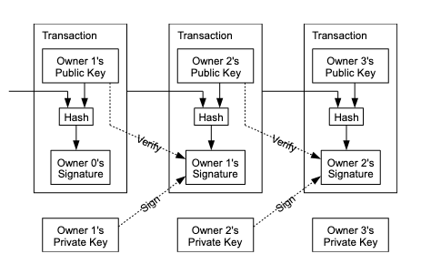
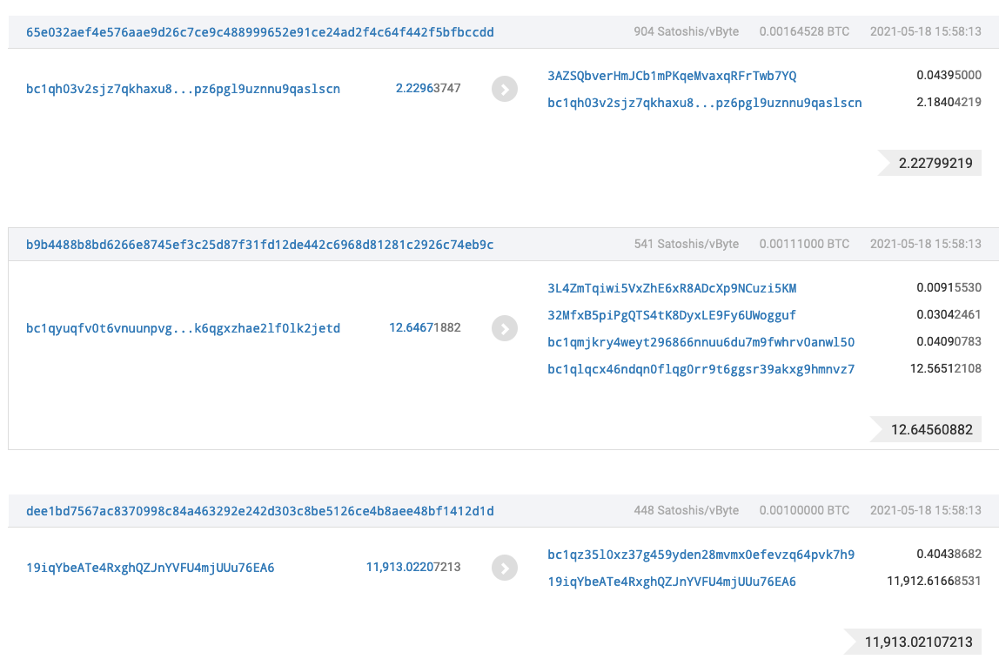
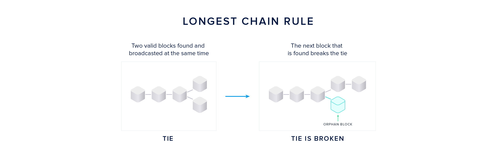

<style>
    /* You can add custom style here. VSCode supports this.
    Other editor might need these custom code in
    the YAML header: section: | */
	/* section header { display: none; } */
	/* section footer { display: none; } */
</style>

# Blockchain
<!-- _class: first-slide -->

Juan Vera del Campo - <juan.vera@professor.universidadviu.com>


# Hoy hablamos de...
<!-- _class: cool-list toc -->

1. [Blockchain](#3)
1. [Resumen y referencias](#19)

# Blockchain
<!-- _class: lead -->

---

Ya veis que los hashes tienen muchos usos en criptografía

Vamos a ver con un poco más de detalle su uso en las monedas digitales: Blockchain y BitCoin


## Bitcoin


- Inventado en 2008 por Satoshi Nakamoto (¡no se sabe quién es!)
- Sistema descentralizado de pagos digitales
- Utiliza firma digital y *proof-of-work* mediante hashes

> [Bitcoin: A Peer-to-Peer Electronic Cash System](https://bitcoin.org/bitcoin.pdf), Satoshi Nakamoto 2008


<!--
El paper original de "Satoshi Nakamoto" es sencillo de entender al menos en su primera parte, y se recomienda su lectura
-->


---


> https://www.investopedia.com/news/how-bitcoin-works/

## Transacciones



<!--
Esto es una transacción bitcoin: "X le da a Y Z bitcoins". Y el mensaje va firmado por Y.

Además, las transacciones se encadenan unas con otras: una transacción contiene también el hash de las transacción anterior. Para modificar una transacción... ¡habría que modificar todas las transacciones anteriores, y sus firmas!
-->

## Proof of work: Hashcash

Hashcash fue propuesto por Adam Back en 1997 para reducir el spam.

- Problema a resolver: queremos que un ordenador solo pueda enviar un correo electrónico por minuto.
- Solución: obligémosle a calcular 10.000.000 de hashes antes de que pueda enviar un correo.

> [Hashcash- A Denial ofServiceCounter-Measure](http://hashcash.org/papers/hashcash.pdf), Adam Back 2002


---

1. Crea una cadena con la dirección de correo destino
1. Añade la fecha de envío
1. Busca un número tal que el hash de todo esto empiece por 8 ceros

La única manera de que pueda hacer eso es "entreteniéndose" probando números uno después de otro

La idea es ajustar "el número de ceros iniciales" para que sepamos que tarde más o menos un minuto en encontrar el número


> http://ronny-roehrig.com/criptoavances/que-es-el-algoritmo-proof-of-work-pow-como-funciona/

---

```
X-Hashcash: 1:52:380119:calvin@comics.net:::9B760005E92F0DAE
```

- versión
- bits: número de bits iniciales del hash
- date: fecha
- resource: Descripción del recurso: correo electrónico, transacción...
- counter: La PoW: lo que añadido al resto del mensaje da un hash con un número determinado de ceros

```
echo -n 1:52:380119:calvin@comics.net:::9B760005E92F0DAE | sha1sum  
0000000000000756af69e2ffbdb930261873cd71  -
```

## Minería

Se adaptó el X-Hashcash. Un bloque es así:

```
* HASH DEL BLOQUE ANTERIOR
* TRANSACCION 1: ALICE LE PAGA A BOB
* TRANSACCIÓN 2: BOB LE PAGA A CHARLIE
* ...
* 1 BITCOIN PARA MÍ
* COUNTER
```

Y minar es encontrar un COUNTER tal que el hash de ese bloque empiece por el-número-de-ceros que toque

SHA2-256(bloque)=000000000000000000000000000000000000000000000000000000000000000000000001... y 185 bits más

El primero que encuentre ese COUNTER se lleva un bitcoin

---

https://blockchair.com/bitcoin?from=bitcoin.com


El número de ceros necesario se ajusta para que  más o menos cada 15 minutos alguien encuentre ese COUNTER: la dificultad es ajustable

---


---

Pincha en cualquiera de los bloques y verás las transacciones



## Consenso distribuido


Bitcoin funciona por consenso distribuidos: todos se tienen que poner de acuerdo en quién ha sido el primero en encontrar el COUNTER

Pero estamos hablando de dinero... un tema en el que pocas veces hay consenso y sí mucha competitividad

¿Qué pasa si algún nodo es egoísta y no reconoce que otro ha encontrado antes el hash?

> https://kasunindrasiri.medium.com/understanding-raft-distributed-consensus-242ec1d2f521

---

- Bit coin: red P2P de nodos
- Cada nodo está constantemente tratando de encontrar el COUNTER del bloque que provoque que el hash se inicie con un número determinado de ceros.
- Cuando lo consigue: lo anuncia a todos los nodos que conocen.
- Los demás nodos lo comprueban y reconocen y empiezan un nuevo bloque.


---
- A veces es imposible llegar a un consenso: [The Byzantine General Problem](https://es.wikipedia.org/wiki/Tolerancia_a_faltas_bizantinas)
- En Bitcoin se resuelve:
    - Creando una moneda nueva
    - Cuando los nodos en la cadena más pequeña "claudican" y desisten
- El protocolo funciona siempre que al menos la mitad de los nodos cooperen



> https://academy.binance.com/en/articles/what-is-a-51-percent-attack

## Usos adicionales

En el registro de BlockChain / Ethereum y otros, a parte de transacciones económicas, se pueden inscribir datos que quedan públicos (el ledger es público) para posterior consulta:

- "Notaría" digital
- Contratos digitales
- Non Fungible Tokens (NFTs): hash de una fotografía
- ...


# Resumen y referencias
<!-- _class: lead -->

## Referencias

- [But how does bitcoin actually work?](https://www.youtube.com/watch?v=bBC-nXj3Ng4)
- [Bitcoin: A Peer-to-Peer Electronic Cash System](https://bitcoin.org/bitcoin.pdf), Satoshi Nakamoto 2008
- [Hashcash - A Denial of Service Counter-Measure](http://hashcash.org/papers/hashcash.pdf), Adam Back 2002

---

Ejercicios: <https://colab.research.google.com/github/Juanvvc/crypto2/blob/main/ejercicios/03/Bitcoin.ipynb>

- [Firma digital](03-firma.html)
- [Blockchain](03-blockchain.html)

Siguiente tema:

- [TLS y Public Key Infrastructure](04-pki.html)

# ¡Gracias!
<!-- _class: last-slide -->
