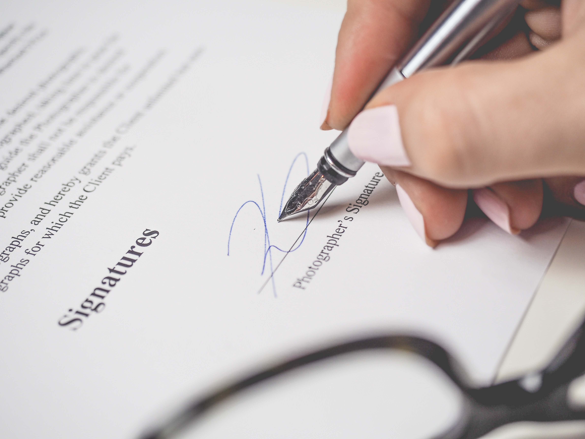
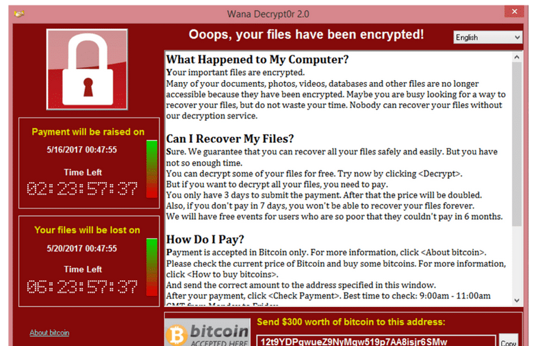

<style>
    /* You can add custom style here. VSCode supports this.
    Other editor might need these custom code in
    the YAML header: section: | */
	/* section header { display: none; } */
	/* section footer { display: none; } */
</style>

# Criptografía
<!-- _class: first-slide -->

**Tema 10: Criptografía como amenaza**

Juan Vera del Campo

juan.vera@campusviu.es

# Como decíamos ayer...

- Podemos ofrecer confidencialidad con cifrado simétrico: [tema 3](03-simetrica.html)
- Podemos ofrecer autenticidad y no repudio con cifrado asimétrico [tema 5](05-asimetrica.html) y distribución de claves públicas [tema 8](08-pki.html)
- Podemos ofrecer integridad con la firma electrónica: [tema 6](06-hashes.html)  y distribución de claves públicas: [tema 8](08-pki.html)
    - Recuerda: firma = cifrado asimétrico del hash de un mensaje

# Hoy hablamos de...
<!-- _class: with-warning -->

Cómo se usa la criptografía para atacar, y seguiremos explorando conceptos de firma electrónica y usos de cada tipo de criptografía simétrica y asimétrica

- [Business email compromise (BEC)](#4)
- [Ransomware](#32)
- [Conclusiones](#49): resumen y referencias

OBSERVA: estos dos ataques son los principales ataques contra los sistemas de una empresa en la actualidad

NOTA: Las transparencias de esta sesión están en inglés

# Business email compromise (BEC)
<!-- _class: lead -->

---
<!-- _class: a-story -->


- You work for the finance department of a big company (100MM EUR)
- Your work involves transfering large amounts of money
- One day, you receive a phone call from a lawyer

> Note: background stock images from pexels: https://www.pexels.com/

---
<!-- _class: a-story -->


- You can google her name, she is involved in HUGE international operations
- She knows what she is talking about
- "Your company is in the middle of an important and confidential operation. We need your help. The CEO will contact you, please check the email"

---
<!-- _class: a-story -->


Dear employeer,

We are in the middle of a very important finantial operation to acquire one of our competitors. It is of the upmost importance that this operation remains confidential until it can be safely announced.

I will be busy with the details. Please, get in touch with the important lawyer (in copy of this email). Keep me in the email chain.

I hope you undestand the confidentiality and urgency of this operation.

Your boss

---
<!-- _class: a-story -->



- The important lawyer sends you a document, which includes a transfer order for 4M€
* The order is signed by your boss
* You transfer the money
* ...
* A couple of days later, your boss calls you about a unplanned money transfer you made to some unregistered location 

---

Do you believe you would never fall for this?

* ['CEO Spoofing' costs drug company $50 million](https://www.fox9.com/news/ceo-spoofing-costs-drug-company-50-million), 2015
* [Hackers siphon $47 million out of tech company's accounts](https://www.fox9.com/news/ceo-spoofing-costs-drug-company-50-million), 2015
* [Unusual CEO Fraud via Deepfake Audio Steals US$243,000 From UK Company](https://www.trendmicro.com/vinfo/us/security/news/cyber-attacks/unusual-ceo-fraud-via-deepfake-audio-steals-us-243-000-from-u-k-company), 2019
* [Un mail, una llamada y 4 millones robados a la EMT de València que volaron a Hong Kong: así fue el 'fraude del CEO' más salvaje de España ](https://www.eldiario.es/comunitat-valenciana/llamada-fabulosa-millones-emt-valencia_1_1243386.html), 2019
* [Social engineering. CEO fraud of 9 million euros in the phishing scam to the biopharmaceutical company Zendal](https://kymatio.com/en/social-engineering-ceo-fraud-of-9-million-euros-in-the-phishing-scam-to-the-biopharmaceutical-company-zendal/), 2020.
* Most of them are covered up by the companies and never hit the news

---


> https://fr.wikipedia.org/wiki/Gilbert_Chikli

<!--
Gilbert Chickli es un ciberdelincuente internacional especializado en este tipo de timo durante muchos años. Tiene un gran equipo detrás y llegó a robar millones de euros. Su método sigue siendo imitado.

En la actualidad está en la cárcel y se hizo una película sobre su vida, Je Compte sur Vous
-->

## Business email compromise (BEC)

- Scam targeting companies who conduct wire transfers and have suppliers abroad
- Corporate or publicly available email accounts of employees related to finance are either spoofed or compromised
- BEC attackers rely heavily on social engineering tactics: attackers carefully research and closely monitor their potential target victims and their organizations
- Often, they impersonate CEO or any executive authorized to do wire transfers.  In addition, fraudsters also 
- Some of the sample email messages have subjects containing words such as request, payment, transfer, and urgent, among others

> https://www.trendmicro.com/vinfo/us/security/definition/business-email-compromise-(bec)

## Types of BEC

- **The Bogus Invoice Scheme**: attackers pretend to be the suppliers requesting fund transfers for payments to an account owned by fraudsters
- **CEO Fraud**: Attackers pose as the company CEO or any executive and send an email to employees in finance, requesting them to transfer money to the account they control
- **Account Compromise**: An executive or employee’s email account is hacked and used to request invoice payments to vendors listed in their email contacts
- **Attorney Impersonation**: Attackers pretend to be a lawyer or someone from the law firm supposedly in charge of crucial and confidential matters
- **Data Theft**: Employees under HR and bookkeeping are targeted to obtain personally identifiable information (PII) or tax statements of employees and executives. Such data can be used for future attacks.

## BEC process

- The attacker impersonates a party sending a series of spoofed emails
    - Usually implies previous compromise to gain intelligence
- The first email may be from a legitimate address
    - ... but not necessarily a legitimate server (check your email client warnings!)
- `Reply-to` is changed
- Addresses similar to real ones to distinguish themselves:
    - `worker@bigconnpany.com` instead of `worker@bigcompany.com`
    - `worker@bigcompany.us` instead of `worker@bigcompany.com`
    - `goodworker@bigcompany.com` instead of `good.worker@bigcompany.com`

---


## BEC: man in the middle


<!--
Ejemplo de impersonalización: ataque man-in-the-middle

- El atacante compromete la red de un proveedor y envía el primer correo desde la red del proveedor (o una red que **parece** el proveedor)
- Pero cambia la dirección **de respuesta**, ya sea por la técnica (cabecera "reply to") o por ingeniería social "a partir de ahora las comunicaciones las lleva el abogado X"
- Objetivo: abrir un "hilo de correos" con la víctima que no implique al proveedor
-->

## Some examples


---


---


Beware: these fake extortions **MAY** include personal information collected from public sources!

---


## Some RED flags

The CEO needs something from me!

- “I need help, fast and in confidence”
- “You’ll be contacted by an attorney/an important partner”
- “I can’t be contacted ATM”
Some acting is usually involved. Someone might call you!

---


## How can you prevent this? PGP

Your contacts send their public keys to you manually. All communications from a contact must be signed using one of the accepted keys.

The perfect solution: sender signs the email, the receiver only accept emails from trusted parties


Bad news: PGP is rarely used in real life!

## How can you prevent this? SPF

Check in the DNS the sender IP is authorized to send emails from that server

i.e.: you authenticate the email <someone@gmail.com> was sent from a server authorized by GMail


> https://medium.com/@pendraggon87/short-primer-on-spf-dkim-and-dmarc-9827eb2f359d

## How can you prevent this? DomainKeys Identified Mail

The receiving **server** checks the digital signature of the sending **server**

Your server (not you!) authenticates the content received from the sending **server**, not the sending **user**!

i.e.: your email provider authenticates than an email sent from <someone@gmail.com> was not modified since it left `gmail.com`


> Fuente: https://dmarcian.es/what-is-dkim/
> RFC 6376: [DomainKeys Identified Mail (DKIM) Signatures](https://www.rfc-editor.org/info/rfc6376) September 2011

---

Received mails have an additional header:

```
DKIM-Signature: v=1; a=rsa-sha256; c=relaxed/relaxed;
        d=campusviu-es.20150623.gappssmtp.com; s=20150623;
        h=mime-version:from:date:message-id:subject:to;
        bh=s7gErmNKwESPKSP6VW9kvRoEY/oQ8b6V1OFgRMqAjtU=;
        b=pkvh0yCIRyEAMsbqmkKn6YJH+0LvTdZR99sg7D5ftMNF+uSKiDe33MnPbfM2IDXAhL
         8Zx3svceJ+8EtJ1zc5vUSsZcwE22npWHCY63SlXnBt2OlZ3dOGeLrMmO7RQO8Ed907wc
         9MbtzwaQsQR5jfkxK6tu9pzNO4QLr3PsIxq2MfdRmoGqwqazkcG/qSRExH9dwVFyjDt2
         DJPxG6Zc1Z0v5HMxxPvbYfhyyJx9wjtT+pEFL/K17NutjL3Ck4s5N5eFRDyspw38gxwo
         JIzqfwys5b8r1jv82Ufcw9C3lz6ofanTg1d1GMbLxDtaYdfyt4CDxZjSQTH2roLJ+X5y
         HCvg==
```

- `d`: domain: `campusviu-es.20150623.gappssmtp.com`
- `s`: selector `20150623`
- `h`: headers fields: `mime-version`, `from`, `date`, `message-id`, `subject:to`
- `bh`: body hash
- `b`: signature of headers and body

## Verification process

- Get the body content, run a canocalization algorithm `c` and calculate the hash value (`b`). Check.
- Concatenate the headers in `h`, concatenate the `dkim` header (removing `b` but not `bh`)
- Download the server's public key from DNS using `d` and `s`

```
dig 20150623._domainkey.campusviu-es.20150623.gappssmtp.com  TXT
```

- Check the signature

> https://www.dmarcanalyzer.com/dkim/dkim-checker/
> https://www.metaspike.com/leveraging-dkim-email-forensics/

## X-Google-DKIM: DomainKeys Identified Mail
<!-- _class: extra-slide -->

```
X-Google-DKIM-Signature: v=1; a=rsa-sha256; c=relaxed/relaxed;
        d=1e100.net; s=20161025;
        h=x-gm-message-state:mime-version:from:date:message-id:subject:to;
        bh=s7gErmNKwESPKSP6VW9kvRoEY/oQ8b6V1OFgRMqAjtU=;
        b=lB+wgPGej/d1HNLxj7oP1L9Mi56hwji5GA3hLrVYCRKohiAs3L7uI6fEq7sp7wBXKm
         9mOGnbIrSXMeOfOa/YnAnJg/4x6U5gvVtoisigFMR/bGxoPQRO6LUqvunBhR3il6f+OX
         ZRJIsZsvigsesD1vZcarlVr5D0QL2Cw2l1o1T6zVNH3Z8cmZNTCpfzmD3YmVCm+Cgdz9
         RQgX/iL12TxzzOmx+8yInGYnL9ZyaNY6Wsbi7LOBp7kRNLWrMKVtUlwuS2WSzQ5Jvwkm
         0SZ90S524hBquiF8WAzJI95AD/L5fr69sjaN/wM6pk8l6fTapm8+K6TsMPYrEhHtRFZ2
         vLYQ==
```

Google uses another DKIM signature that uses other headers. This is probably a signature to be used only inside Google. Still, it is a valid DKIM signature.

> https://mailarchive.ietf.org/arch/msg/apps-discuss/_blROpC5GpEPk96nBqKoNUaO5rg/

## Domain-based Message Authentication, Reporting & Conformance


- An email authentication, policy, and reporting protocol
- It **builds on the widely deployed SPF and DKIM protocols**
- With DMARC you can tell the world how to handle the unauthorized use of your email domains by instituting a policy in your DNS
    - `p=none`: monitors your email traffic. No further actions are taken.
    - `p=quarantine`: sends unauthorized emails to the spam folder.
    - `p=reject`: unauthorized email doesn’t get delivered at all.

> https://dmarc.org/

---


## The bad news...

- PGP is rarely used in real life... unfortunately
- Not all companies implement SPF or DKIM
- These mechanisms do not protect against an email sent from `macdonalds.com`: the attackers can configure SPF and DKIM too!
- These mechanisms only authenticate from the sending server to the receiving server!


<!--
- Los malos pueden configurar también sus servidores
- estos mecanismos no te protegerán contra direcciones "parecidas"
- SPF y DKIM solo autentican desde el servidor. ¿Quién estaba realmente escribiendo el mensaje?
    - Si el atacante ha conseguido crear cuentas: b0ss@company.com también pasará el DKIM de company.com
    - Si el atacante ha conseguido las credenciales de boss@company.com pasará el DKIM de company.com
-->

## Recommendations

- Check the address of the other participant in the communication
- Be careful if the address changes
- Be careful if the language of the other participants change
- Many email clients do alert when an address changes
- Many email clients do alert if an Internet header is spoofed

# Ransomware
<!-- _class: lead -->

---

[](https://www.youtube.com/watch?v=6h9yh_A80fs)

---

- Malware that encrypts the victim's files, making them inaccessible, and demands a ransom payment to decrypt them
- recovering the files without the decryption key is an intractable problem
- difficult to trace digital currencies such as paysafecard or Bitcoin and other cryptocurrencies are used for the ransoms
- Typically carried out using a Trojan disguised as a legitimate file that the user is tricked into downloading or opening when it arrives as an email attachment 
- Also, attackers are known to compromise a company infrastructure and once they are inside, run ransomware

> https://en.wikipedia.org/wiki/Ransomware

---


> https://www.coveware.com/blog/ransomware-marketplace-report-q4-2020

<!--
El randomware es uno de los mayores peligros para una compañía, y también uno de los ataques más lucrativos...

...hasta 2020. Enseguida veremos qué ha pasado en 2020
-->

---


## Ransomware-as-a-service


- Ransomware as a service (RaaS) is a subscription-based model that enables affiliates to use already-developed ransomware tools to execute ransomware attacks
- Affiliates earn a percentage of each successful ransom payment

> https://www.upguard.com/blog/what-is-ransomware-as-a-service

<!--
- Hay mafias perfectamente organizadas detrás del ransomware y está totalmente profesionalizado
- OJO: está tan profesionalizado que si pagas, es MUY PROBABLE que recuperes tus archivos
- OJO2: si un atacante no recupera sus archivos, enseguida se correrá la voz y "el mayorista" tomaría el control
-->

## Defense against ransomware
<!-- _class: smaller-font -->

- Backup your assests!
- **Not in the same machine**
- Train your employees not to open suspicious links
- Good enpoint protection


> https://insights.sei.cmu.edu/blog/3-ransomware-defense-strategies/
> https://www.cybereason.com/blog/three-keys-to-a-reliable-ransomware-defense-strategy
> https://cloudian.com/blog/new-ransomware-protection-from-veeam-and-cloudian/

## Ransomware as an unplanned backup

Backups do not stop attackers! Asking for a ransom for NOT PUBLISHING your data is a trend in 2021 


<!--
Dado que los atacantes han visto que se reducen sus ganancias porque las empresas están usando sus backups...

Han decidido que harán extorsión con los datos. Algunos grupos, como Babyk, han anunciado (abril 2021) que no cifrarán más, que se limitarán a robar información y amenazar con publicarla
-->

---


> Check: https://www.ransomwatch.org/

<!--
Ejemplo de una página web de un grupo de atacantes que ha tenido mucho éxito durante 2021: Babyk/Babuk. Aquí se pueden ver sus últimos ataques con éxito y la amenaza de publicar los datos robrados.

Estos grupos tienen páginas en la dark web que son visitable con Tor o similares

- Los investigadors conocen estas páginas
- Los grupos de atacantes conocen estas páginas
- Si tu información está hay, es necesario darla como comprometida
- En enlace propuesto https://www.ransomwatch.org/ (gestionado por investigadores de seguridad) hace capturas periódicas de las páginas de muchos grupos conocidos que tienen sus páginas en .onion
- Podéis encontrar "List of ransomware groups" en varios sitios. Los enlaces dejan de funcionar a menudo
-->


## Entry point


---


---


## Example: Babuk

Modern Ransomware and exfiltration

- First, it kills security services: antivirus, backup services...
- Next, it **removes** existing backups and shadow copies
- It uses its own implementation of SHA256 hashing, ChaCha8 encryption, and Elliptic-curve Diffie–Hellman (ECDH) key generation and exchange algorithm to protect its keys and encrypt files

---

1. Babuk uses RtlGenRandom to generate 4 random buffers. Two of which are used as ChaCha8 keys, and the other two are used as ChaCha8 nonces.
1. It will encrypt the second ChaCha8 key using the first key and nonce. After that, the first key is then encrypted using the encrypted second key and nonce.
1. This encrypted first key is treated as the Elliptic-curve Diffie–Hellman (ECDH) private key for the local machine.
1. It generates a shared secret using the local private key and the author’s hard-coded public key.
1. This shared secret goes thorugh a SHA256 hashing algorithm to generate 2 ChaCha8 keys, which are used to encrypt files later.
1. In order to be able to decrypt files, Babuk stores the local public key in the file `ecdh_pub_k.bin` in the APPDATA folder.

---

1. Using FindFirstFileW and FindNextFileW calls, it goes through each directory to look for files and sub-directories.
1. Babuk only goes down 16 directory layers deep, so it potentially does not encrypt every single folders in the drive to save time.
1. For small files that are les than 41943040 bytes or roughly 41 MB in size, the file is mapped entirely and encrypted with ChaCha8 two times.
1. With large files, encryption is a bit different. To save time, the entire file is divided into three equally-large regions. For each of these regions, only the first 10485760 bytes or 10 MB will be encrypted.
1. Babuk uses the two ChaCha8 keys generated from the ECDH shared secret’s SHA256 hash as the encrypting keys and the first 12 bytes of the shared secret as nonce.

---


## Recommendations

- Ransomware uses state-of-the-art encryption mechanisms: files cannot be decrypted without contacting paying the attacker
- Backup your files
- Do not store the backup in the same machine or it will be encrypted as well!
- After a ransomware event, check carefully the attacker is not still inside!

# Referencias
<!-- _class: lead -->

## Referencias

- [Credit Card Scammers in the Dark Web](https://www.youtube.com/watch?v=jT-jmq8KBw0)
- [Be aware - how hackers can steal your money](https://www.youtube.com/watch?v=h8-27iLvyS4)
- [Spying on the scammers](https://www.youtube.com/watch?v=le71yVPh4uk)
- [Don’t Wake Up to a Ransomware Attack - CISA](https://www.youtube.com/watch?v=GdXLp1bEnZE)
- [Babuk Ransomware, by McAfee](https://www.mcafee.com/blogs/other-blogs/mcafee-labs/babuk-ransomware/)
- [Babuk Ransomware, by ChuongDong](http://chuongdong.com/reverse%20engineering/2021/01/03/BabukRansomware/)

---
<!-- _class: center -->

Continúa en: [Comunicaciones anónimas](11-anonimato.html)
