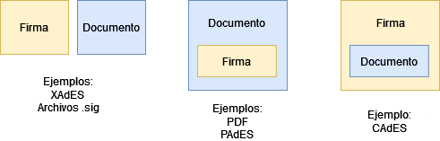
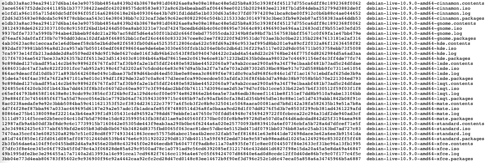
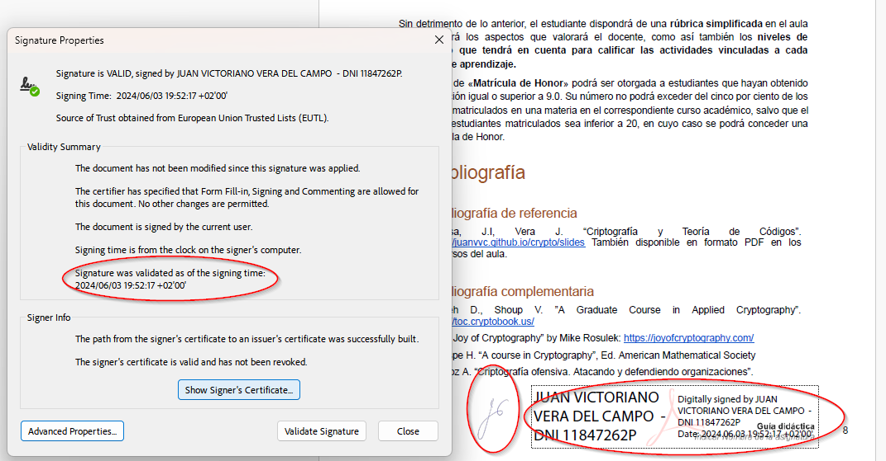
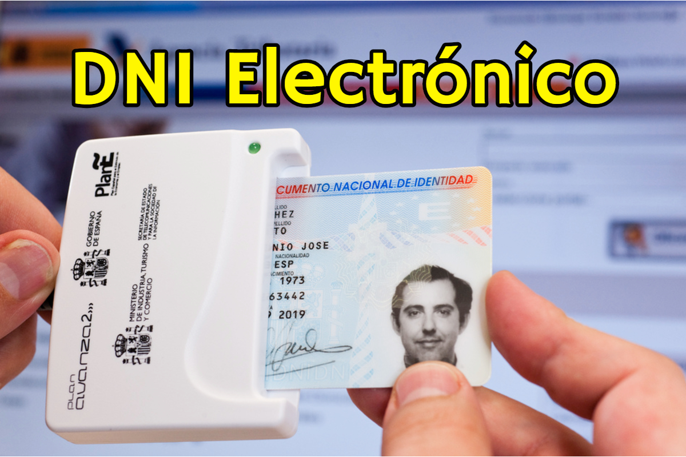

<style>
    /* You can add custom style here. VSCode supports this.
    Other editor might need these custom code in
    the YAML header: section: | */
	/* section header { display: none; } */
	/* section footer { display: none; } */
</style>


# Firma Digital
<!-- _class: first-slide -->

Juan Vera del Campo - <juan.vera@professor.universidadviu.com>


# Hoy hablamos de...
<!-- _class: cool-list toc -->

1. [Firma digital: ¿qué es?](#3)
1. [Firma digital: en la realidad](#13)
1. [Firma digital: punto de vista legal](#24)

# Firma digital: ¿qué es?
<!-- _class: lead -->

## Firma digital

Podemos proteger la **integridad, no-repudio y autenticidad de un mensaje** mediante una combinación de hash y cifrado asimétrico

- Bob tiene un documento que quiere firmar
- Bob tiene también una clave pública y otra privada
- Alice conoce la clave pública de Bob

## Esquema de firma electrónica


- Solo Bob puede cifrar con su clave $K_{priv}$ y cualquier puede descifrar con $K_{pub}$
- Pero si pueden descifrar el mensaje, **todos saben que el mensaje solo puede haberlo enviado Bob: autenticación**

---

Problema: los documentos a firmar pueden ser muy grandes

* Los algoritmos como RSA solo cifran **números enteros** de una longitud igual a la clave. Por ejemplo, 4096 bits.
* Bob podría dividir el documento en bloques de 4096B, pero eso no es eficiente
* Solución: **hash cifrado con la clave privada**
    - Bob calcula el hash de su documento de 10MB. El hash tiene 512 bytes
    - Bob cifra el hash con su clave privada
    - Cualquiera persona (eso incluye a Alice) puede conocer la clave pública de Bob y descifrar el hash
    - Si se encuentra un documento con un hash firmado por una clave pública, cualquier persona puede verificar que el autor del documento es el poseedor de la clave privada.

> https://cryptobook.nakov.com/digital-signatures/rsa-signatures

## Firma digital
<!-- _class: with-success -->

Cifrando **el hash de un mensaje** con nuestra clave privada, aseguramos que ese mensaje lo hemos enviado nosotros y cualquier puede verificarlo


Firma digital de un mensaje = cifrado del hash de un mensaje con mi clave privada


## Firma digital

Solución: cifrar solo el hash del mensaje

En firma digital se cifra el hash del mensaje con nuestra clave privada

$$
Firma_{Bob}(document) = E_{RSA}(K_{priv}^{Bob}, hash(document))
$$

$$
Verificacion(document, Firma_{Bob}) = (D_{RSA}(K_{pub}^{Bob}, Firma_{Bob}) =^? hash(document))
$$

## Proceso de firma
<!-- _class: two-columns -->

- Para firmar (Alice)
    - Alice calcula el hash de un documento
    - Alice cifra con su clave privada el hash del documento: la firma de Alice del documento
<!-- -->
- Para verificar la firma (Bob)
    - Bob obtiene la clave pública de Alice
    - Bob calcula el hash de un documento
    - Bob descifra la fila de Alice usando la clave pública de Alice
    - Compara que los dos hashes coinciden

---

- Alice (firma con su clave privada)
    - Tiene un documento `doc` que quiere firmar
    - Tiene un par de claves `(alice_pub, alice_priv)`
    - `firma = cifrado_RSA(hash_SHA256(doc), alice_priv))`
    - Envía a Bob el documento y la firma `(doc, firma)`
- Bob (verifica con la clave pública de Alice):
    - Obtiene de Alice el documento y la firma `(doc_recibido, firma)`
    - Sabe la clave pública de Alice `alice_pub`
    - Calcula `hash_doc_recibido = hash_SHA256(doc)`
    - `firma_descifrada = descifrado_RSA(firma, alice_pub)`
    - Verifica `hash_doc_recibido === firma_descifrada`
    
---


> https://wizardforcel.gitbooks.io/practical-cryptography-for-developers-book/content/digital-signatures.html

## Más cosas que Bob tiene que comprobar

- Alice también debe incluir **la fecha de firma**
- Que la clave pública de Alice **es realmente de Alice**
- Que la clave pública de Alice **era válida en el momento de la firma**
- Opcional: que la clave pública de Alice sigue siendo válida ahora

Todo este proceso se estandariza con [PKCS#7](https://en.wikipedia.org/wiki/PKCS_7)

# Firma digital: en la realidad
<!-- _class: lead -->

## ¿Dónde están las firmas?



Las firmas pueden ir (1) archivos separados; (2) firmas dentro de documento; (3) documento dentro de firma

## Archivos separados: OpenSSL

```bash
#######################
# Alice genera un par de claves
# el archivo alice_priv.pem incluye las dos, pública y privada
openssl genrsa -out alice_priv.pem 2048
# Alice puede extraer la clave pública para distribuirla al mundo
openssl rsa -in alice_priv.pem -outform PEM -pubout -out alice_pub.pem

#######################
# Alice firma archivo.txt
openssl dgst -sha256 -sign alice_priv.pem -out archivo.sig archivo.txt
# Alice envía a Bob: archivo.sig y archivo.txt

########################
# Bob verifica. Necesita alice_pub.pem, archivo.sig y archivo.txt
# (Veremos en otras sesiones cómo obtiene alice_pub.pem)
openssl dgst -sha256 -verify alice_pub.pem -signature archivo.sig archivo.txt
```

## Archivos separados: Debian firma sus imágenes



- Ejemplo: <https://danilodellaquila.com/en/blog/how-to-verify-authenticity-of-downloaded-debian-iso-images>
- Archivos: <https://cdimage.debian.org/debian-cd/current/amd64/iso-cd/>

---

(archivo anterior, *hasheado* y cifrado con clave privada de Debian)

```
-----BEGIN PGP SIGNATURE-----

iQIzBAABCAAdFiEE35ucSeqpKYQyWJ122ofoDWKUvpsFAmBfrDUACgkQ2ofoDWKU
vpsNrRAAh+bSjSbiIXcugkI9faItOdKnwM+JaqGFRrDVK68Qbc/Y5Nv4Z8KmhL/a
7nlzOrwA7dyEWFuwRiyLpoZOnlNLTXLWr8/7UJhJGt//2vJFpoHmBcXKnRFeZHfE
4XXhAq7XA/naPoTHfbuEAFVqZlnWhewBtsvwL3cn/FwyvsujCxEK9LtXl6L7ziK5
Am6LcIB6TJe3shMeUSRmvhF+d/dZ1LTYKwmm4SkCLsp0Z52dg8eRUpbq2uyQpkHM
TdtC0kE4a2u7GmDZD+VIggslfHS2tm3vE9RLfWcobjoF51bvowrPGFGm9tg+ANFt
We+sUDNv+cAUrTq9dfwoDBJueR4IRxAZoEKyl4V4mxtRsawG6w0Uzz66qrq7ROUn
isBz3sGBcNerI6uOUfP/U1mMmDMsjbaVSQCUsM9Pzpt8Y39vHgzMVwTGOkfzgUZJ
Qcf+cqyGDSpin2DjcPlUAKKtGdnnWDPVPskrgSTxzQmV8n+VgEiGRW1y46i5sh4t
dc4ETsKoz2H1JFVJY/t3kAthHCAkW/hhDX4mBM8ZPSdfNZiXNNOZGu673VwLI/bN
pN8+FgezKfD8iZHWZxHk++91Kj8sZVToVI3m8rL5nKvhEKLFNS7XDq2bmKKbtF0t
kKw8HI5Tzv55YG0P4oToeLpE6ajxxZVrCAGJvD6lMiyfftOYU2A=
=KWqY
-----END PGP SIGNATURE-----
```

## Advanced Electronic Signatures: *CAdES*


- CAdES (CMS Avanzado): Después de firmar no se puede ver el documento sin aplicaciones especializadas
    - Firma implícita: el documento está incluido dentro del archivo de firma
    - Firma explícita: el documento no está incluido en el archivo de firma
- XAdES (XML Avanzado): firma en formato XML. El documento puede o no incluirse dentro de la firma
- PAdES (PDF Avanzado): firma de archivos PDF. La firma está incluida dentro del documento. Muchos lectores de PDF incluyen un verificador de firmas.


> [CMS Advanced Electronic Signatures](https://en.wikipedia.org/wiki/CAdES_(computing))
> [The *AdES collection](https://www.codeproject.com/Articles/1256991/The-AdES-Collection-CAdES-XAdES-PAdES-and-ASiC-Imp), información técnica de implementación
> [Formatos de Firma](https://firmaelectronica.gob.es/Home/Ciudadanos/Formatos-Firma.html), portal de administración electrónica del Gobierno de España

## Perfiles

- **CAdES-B**: firma básica, contiene SignedInfo, SignatureValue, KeyInfo and SignedProperties. Fíjate que NO CONTIENE fechas
- **CAdES-T**: B-Level con token de servidor de tiempo de un Proveedor de Timestampt: la firma existía en un momento del tiempo
- **CAdES-LT**: CAdES-T, más información del estado de los certificados: ¿eran válidos en el momento de firma?
- **CAdES-LTA**: CAdES-LT, con verificaciones periódicas y su resultado, ya que los certificados caducan a los pocos años

## CAdES: Autofirma
<!-- _class: two-columns -->


- AutoFirma es un aplicativo del Gobierno de España para firma electrónica
- Permite firmas CAdES (archivos generales), PAdES (PDF) y XAdES (facturas electrónicas)
- Necesitas tener previamente instalado un certificado válido
- @Clave es otro aplicativo similar que también puede usarse

## PAdES: Firma PDFs en Acrobat



En Acrobat: All Tools -> Use a certificate -> marca donde quieres que "se vea" la firma

---

Fíjate en el ejemplo:

- La firma puede ser manuscrita y también digital
- La firma digital puede ser visible físicamente en un documento como si fuese una imagen, pero esto es solo "para ayudar a verla"
- La firma manuscrita se suele añadir a todas las páginas de un documento, mientras que la firma digital protege todo el documento, no solo la página donde está
- Modificar el PDF, o imprimirlo, deja sin efecto la firma digital
- ¡Cuidado! Que exista una imagen no quiere decir que el archivo esté correctamente firmado: hay que verificar la firma
- ¡Cuidado! Las firmas digitales están asociadas a certificados (claves públicas) que caducan después de unos años. Que un documento ya no verifique la firma no significa necesiaramente que se haya modificado: puede que la firma haya caducado

## ¿Cuándo se realizó una firma? Sello de tiempo

- En el perfil CAdES-T y superiores necesitamos una Autoridad de Sellado de Tiempo (TSA) seguros
- Los gobiernos ofrecen estos proveedores y las herramientas los usan automáticamente
- Token de tiempo: "ahora son las 22:15 del día 17 de noviembre de 2024", firmado digitalmente por el proveedor de tiempo
- Se incluye en la firma electrónica de un documento como prueba de que la firma se hizo en ese momento
- El sello de Tiempo es una firma realizada con el certificado electrónico de la Autoridad de Sellado. Cuando ese certificado caduca, el sello y, por tanto, la firma dejan de ser válidas: antes de que el certificado de la TSA caduque es necesario **resellar**

> https://administracionelectronica.gob.es/ctt/verPestanaGeneral.htm?idIniciativa=tsa
> https://freetsa.org/index_es.php


# Firma digital: punto de vista legal
<!-- _class: lead -->

## Desde un punto de vista legal...

- Firma: artículo 3.11
    - Persona física
    - Autenticación, no repudio, integridad
    - Misma función que firma manuscrita
- Sello: artículo 3.26
    - Persona jurídica
    - Autenticación e integridad


> [Reglamento (UE) 910/2014 del Parlamento Europeo y del Consejo, de 23 de julio de 2014 relativo a la identificación electrónica y los servicios de confianza para las transacciones electrónicas en el mercado interior](https://www.boe.es/doue/2014/257/L00073-00114.pdf)

## Propiedades de firmas y sellos

- Vinculadas de forma única creador
- Permite la identificación del creador: **autenticación**
- Solo controlada por el creador
- Permite probar que el creador ha tenido acceso al documento: sabe qué está firmando
- Permite detección de alteraciones en el documento: **integridad**
- Necesita la utilización de un dispositivo informático


## Firma cualificada

Firma electrónica aceptada por la administración

¡No tiene por qué ser la mejor!

Caso DNI-e en España: mínima implantación por problemas de usabilidad

Se exige personarse presencialmente en una agencia de certificación



## Fecha de firma

Además del contenido del documento, es necesario asegurar cuándo se ha realizado la firma digital, y las condiciones en las que se ha hecho:

- La fecha y hora actual, que estará firmada digitalmente por alguien confiable
- Que la firma era válida en el momento del firmado

Veremos más detalles técnicos en el tema de certificados

## Usos

La administración solo admite firmas/sellos electrónicos cualificados

En Europa, asimilables a firma manuscrita o sello de entidad

ojo: firmas no cualificadas **podrían tener también efectos jurídicos**

## Un poco de historia: ROCA

The ROCA factorization attack could potentially allow a remote attacker to reverse-calculate a private encryption key just by having a target’s public key

Algunas tarjetas utilizaban una implementación no segura

Se tuvieron que retirar todas y [no aceptar firma electrónica durante ese periodo](https://elpais.com/politica/2017/11/09/actualidad/1510217634_470836.html)


> https://crocs.fi.muni.cz/public/papers/rsa_ccs17

---

Del anuncio de la vulnerabilidad (https://crocs.fi.muni.cz/public/papers/rsa_ccs17): 

The time complexity and cost for the selected key lengths (Intel E5-2650 v3@3GHz Q2/2014):

- 512 bit RSA keys - 2 CPU hours (the cost of $0.06);
- 1024 bit RSA keys – 97 CPU days (the cost of $40-$80);
- 2048 bit RSA keys – 140.8 CPU years, (the cost of $20,000 - $40,000).

## Certificados electrónicos

- Declaración electrónica que vincula los datos de validación de un sello con una persona jurídica y confirma el nombre de esa persona
- Declaración que permite autenticar un sitio web y vincula el sitio web con la persona física o jurídica a quien se ha expedido el certificado
- La norma exige que se gestione el ciclo de vida de un certificado. Revocaciones, cambios de estado...

# ¡Gracias!
<!-- _class: last-slide -->
