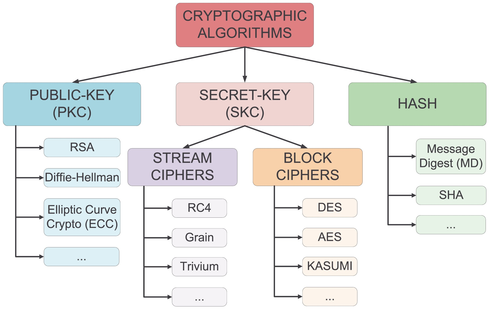
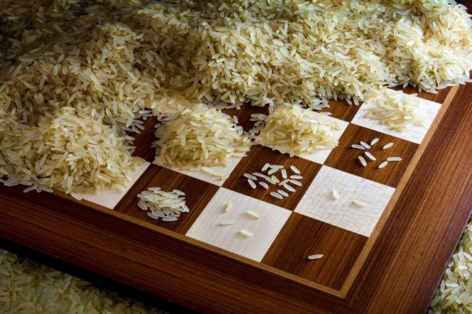

# Conceptos básicos de la criptografía
<!-- _class: first-slide -->

Juan Vera del Campo - <juan.vera@professor.universidadviu.com>

## ¿Qué es la criptografía?

Protección de la comunicaciones a través de **medios desprotegidos** entre un emisor y uno o varios destinatarios

...y eso es mucho más que mantener un mensaje secreto...

> Fondo: [(c) cottonbro](https://www.pexels.com/photo/clear-glass-bowl-on-white-table-cloth-7319077/). Free to use

<!--
Tradicionalmente hemos entendido la criptogafía como las técnicas para mantener un mensaje confidencial y que solo pueda leerlo la persona para la que está destinado.

Pero hay mucho más detrás: ¿cómo nos aseguramos que realmente solo el receptor puede leer un mensaje? ¿Es posible demostrar matemáticamente que solo el receptor puede leerlo? ¿ Y cómo se asegura el receptor que el emisor es realmente quien dice ser?
-->

## El problema que queremos resolver

Firma digital de un contrato entre dos empresas

- El contrato tiene que ser secreto para cualquiera que no participe en la comunicación
- Las empresas tienen que estar seguras de con quién están hablando
- Ninguna de las dos empresas puede cambiar unilateralmente el contrato
- Ninguna de las empresas debe poder decir que no firmó el contrato

<!--
Fondo: https://pixabay.com/photos/binding-contract-contract-secure-948442/ Uso comercial libre
-->

## Principales servicios de seguridad

[New Directions in Cryptography](https://citeseerx.ist.psu.edu/viewdoc/summary?doi=10.1.1.37.9720) (Whitfield Diffie y Martin Hellman, 1976) exploraba qué se necesitaba para que dos empresas pudiesen firmar un contrato mercantil:

- **Confidencialidad**: solo el legítimo destinatario debe poder ser capaz de leer el contenido del contrato o cualquier información asociada.
- **Integridad**: el destinatario debe ser capaz de verificar que el contenido del contrato no ha sido modificado por el camino... ni en el futuro
- **Autenticidad**: el destinatario debe ser capaz de verificar que el emisor es realmente el autor del contrato
- **No repudio**: nadie puede decir que ese no es el contrato que ha firmado
- **Otros**: autorización, acuerdo de claves, partición de secretos, PRNG...

> https://www.universidadviu.com/es/actualidad/nuestros-expertos/las-4-claves-de-la-seguridad-de-la-informacion
> Estándar: [NIST Special Publication 800-57 Part 1, Section 3](https://doi.org/10.6028/NIST.SP.800-57pt1r5)

<!--

El objetivo más evidente de un sistema criptográfico es alcanzar confidencialidad: no queremos que nadie pueda leer nuestras comunicaciones aparte de la persona a la que están destinadas

Pero un sistema que solo ofrezca confidencialidad no es seguro casi nunca. Por ejemplo, si estamos hablando con un adversario en vez de nuestro banco, da igual que nadie más pueda leer nuestras comunicaciones. Tenemos que estar seguros de que al otro lado está realmente el banco: autenticidad

En ocasiones, un adversario puede modificar un mensaje a pesar de que no sepa qué es lo que hay en él. O puede que lo realmente importante para un banco es asegurar que uno de sus clientes ordenó una trasferencia desde sus cuentas y no hacia sus cuentas.

Los objetivos de un sistema criptográfico son los servicios de seguridad que ofrece

El NIST es la agencia de estandarización de EEUU, y entre las cosas que estandariza también está la seguridad del gobierno de EEUU. Sus estándares son sencillos de leer e incluyen un glosario que viene muy bien para introducirse en la criptografía.

-->

## Otros servicios de seguridad

- **Autorización**: ¿está el interlocutor autorizado a acceder a estos datos?
- **Acuerdo de claves**: permite que un grupo de actores generen una clave sin que nadie externo al grupo la conozca
- **Partición de secretos**: permite repartir un secreto entre un grupo de actores, exigiendo un mínimo de actores para recomponerlas
- **Esteganografía**: queremos ocultar que dos personas están hablando
- **Anonimato**: el emisor quiere ocultar su identidad
- etcétera

> https://www.grouphacking.com/ciberseguridad/todos-los-principios-de-la-seguridad-de-la-informacion/

<!--
Nos centraremos en los servicios de confidencialidad, integridad y autenticación. Además, podemos conseguir no-repudio como consecuencia de juntar autenticidad e integridad.

También veremos, aunque a más alto nivel, los servicios de acuerdo de claves, PRNG, partición de secretos... porque están relacionados con los primeros

Otros servicios como la autorización, aunque sin duda son importantes para que un sistema sea seguro, quedan fuera de este curso por limitación de tiempo.
-->

## Protocolos criptográficos

La criptografía actual se basa en **composición** de técnicas primitivas:

- Composición de **operaciones matemáticas** que crean "**puertas criptográficas**" (*cryptographic gates*).
- Composición de puertas que crean **algoritmos**.
- Composición de algoritmos que crean **protocolos de seguridad**.

La composición es compleja y todo debe funcionar como un reloj.

---

<!--
- **Sin clave**: el emisor usa sólo el mensaje $m$ como argumento de la función criptográfica. Ejemplo: hash.

- **Clave simétrica**: misma clave $k$ para cifrar y descifrar un mensaje $m$. Emisor y receptor deben tener la misma clave. Ejemplo: AES, ChaCha...

- **Clave asimétrica**: claves diferentes para cifrar (pública) y descifrar (privada) un mensaje $m$. El emisor debe conoce la clave pública del receptor. Ejemplo: RSA
-->

## Servicios de seguridad a primitivas

Objetivo|Primitiva|Algoritmos
--|--|--
**Confidencialidad**|cifrado simétrico|AES, Chacha
**Integridad**|hash, firma simétrica|SHA256, algunos modos de AES
**Autenticidad**|firma asimétrica|RSA, ECDSA
**No repudio**|firma asimétrica|RSA, ECDSA
**Acordar clave**|acuerdos de clave/encapsulación|ECDH

## Gestión de claves

*La criptografía es una herramienta para convertir un montón de problemas diferentes en un problema de gestión de claves*

Lea Kissner, antigua ingeniera principal de seguridad de Google

- **Contraseña**: palabra que utilizamos para entrar en un sistema. "Sesamo"
- **Clave criptográfica**: conjunto de números que dan seguridad a un sistema: "82198329382371291821201"

<!--
Si la clave es lo único que tiene que ser secreto, tenemos que protegerla a toda costa.

En este curso no estudiaremos cómo proteger las claves, pero tened en cuenta que, al ser la pieza central de la seguridad de un sistema, es necesario que los usuarios de criptografía dispongan de algún modo de gestión segura de claves criptogrtáficas

Una contraseña no es lo mismo que una clave criptográfica. Las contraseñas suelen ser mucho más inseguras que una clave (a veces no son aleatorias o están pensadas para que las pueda recordar un humano) A veces las contraseñas serán el primer paso para entrar en un sistema seguro, pero **no son buenas claves criptográficas**

En muchas ocasiones un sistema se romperá no por que la criptopgrafía sea débil, sino porque incluye un paso de control con contraseña que es habitualmente la parte más débil de un protocolo.
-->

## Fuerza bruta
<!-- _class: center with-success -->

 

**Fuerza bruta**: probar todas las claves posibles una a una

<!--
Estos no son exactamente sistemas de cifrado, pero nos sirven para explicar lo que es la fuerza bruta.

¿Cómo abrirías la cerradura de la puerta? ¿Cómo puede un ladrón utilizar una tarjeta de crédito robada? ¿Qué estrategias se usan en cada caso para proteger el sistema?

Images: free for commercial use:

- https://pixabay.com/photos/money-cards-business-credit-card-256319/
- https://pixabay.com/photos/lock-combination-security-safety-1929089/
-->

---
<!-- _class: with-success -->

Posibles defensas contra la fuerza bruta:

- **Cerradura**: aumentando el tamaño de la clave, el atacante pasará más tiempo intentanto abrir la cerradura
- **Tarjeta**: limitamos el número de intentos antes de bloquear la tarjeta, o hacemos que cada intento cueste dinero

Que el descifrado sea costoso tiene el problema de que también le costará al receptor, que descifra legítimamente. Actualmente no se recomienda esta estrategia

Estrategia actual: **obligar al atacante a que tenga que probar muchas claves**

<!--

Por supuesto, el atacante puede intentar usar una llave maestra, o robar el PIN con ingeniería social. Ese tipo de ataques o bien es "romper un algoritmo" o bien "usar canales laterales". No vamos a considerarlos por ahora, vamos a considerar que los sistemas se usan cómo se han diseñado

-->

## Tamaños de clave
<!-- _class: with-success -->

Contraseñas: podemos aumentar el tamaño de clave aumentando tanto el número como el tipo de caracteres

Tipo|Ejemplo|# de claves diferentes|Tamaño en bits
--|--|--|--
PIN de 4 números|3659|9999|$log_2(1000)\approx13\ bits$|
4 letras mayúsculas|CASA|614656|$log_2(614656)\approx\ 19 bits$
4 letras + especiales|Ca*4|33362176|25 bits
5 letras + especiales|Ca*4S|2535525376|32 bits
41 letras + especiales|o18uIo=...9f89fdA!S|$10^{77}$|256 bits
54 mayúsculas|KJASWE...SAJKSAJF|$10^{77}$|256 bits
77 números|923821321...12998|$10^{77}$|256 bits

En criptografía solemos medir la longitud de una clave con **la cantidad de bits que necesitamos para guardarla**

Medir las claves en bits nos permite comparar "su fortaleza": mismo número de bits, misma seguridad

<!--

Fíjate en estos casos:

- a mismo número de caracteres, mayores posibilidades (números...) aumenta el tamaño en bits
- a mismo número de posibilidades, aumentar el número de caracter aumenta el tamaño en bits
- una contraseña de 54 letras mayúsculas tiene el mismo número de bits que una contraseña de letras minúsculas, mayúscuas, números y caracteres especiales: misma seguridad

-->

---

Igual que en la leyenda del ajedrez...

Cada vez que aumentamos un bit se dobla el número de claves posibles

Eso tiene un crecimiento exponencial: rápidamente llegamos a números enormes

Veremos que claves de 256 bits es el estándar actual para tamaño de clave

> https://www.pragatiedible.com/the-legend-of-rice-and-chess-exponential-growth/

## Fortaleza de un algoritmo
<!-- _class: with-success -->

Alquilando equipos en la nube por segundos, con un euro cada segundo podemos probar $10^{11}$ claves

Si estimamos que nuestro "secreto" vale 1000 €: nos hacen falta un sistema criptográfico que permita escoger entre $10^{14}$ claves diferentes para guardar el secreto durante una hora. 

Nota que $10^{14}\approx 2^{48}$. Se dice que este sistema tiene una fortaleza de 48 bits: un atacante tiene que probar $2^{48}$ claves si quiere romperlo por fuerza bruta

Con 128 bits... necesitaríamos miles de años.

**La fortaleza o seguridad de un algoritmo es el tamaño en bits de su espacio de claves.** Es decir, el número de claves diferentes posibles que se tienen que probar para romperlo por fuerza bruta. Normalmente se expresa en bits.

# Mejorando la fuerza bruta

Ejemplo de cifrado por cambio de letras: ¿podemos encontrar un método más rápido que probar los cambios de letras una a una?

**Hq** fulswrjudild, ho fliudgr Fhvdu, wdpelhq frqrflgr frpr fliudgr sru
ghvsodcdplhqwr, frgljr **gh** Fhvdu **r** ghvsodcdplhqwr **gh** Fhvdu, hv xqd gh
odv whfqlfdv gh fliudgr pdv vlpsohv b pdv xvdgdv. **Hv** xq wlsr gh
fliudgr sru vxvwlwxflrq hq ho txh xqd ohwud **hq** ho whawr ruljlqdo hv
uhhpsodcdgd sru rwud ohwud 

https://www.dcode.fr/caesar-cipher

- Mapeos posibles: $27!$ ($\approx 2^{88}$) Ese númejo es demasiado grande para romperlo por fuerza bruta
- Pero si el mensaje es suficientemente largo, **podemos analizar la frecuencia de aparición de los carácteres**

<!--

Este es un ejemplo de cifrado clásico "tipo César aleatorio": cada letra del alfabeto se ha sustituido por otra letra del alfabeto. En este caso, el mapeo entre letras es la clave de cifrado, y en un alfabeto de 27 letras hay 27! posibles mapeos diferentes. Ese es un número enorme para descifrar por fuerza bruta INCLUSO para los PCs actuales. ¿Podemos descifrarlo por otros medios?

No recuerdo qué cifré aquí, ni con que clave, pero no parece difícil descubrirlo.

- Hay letras solas, que en castellano solo pueden ser a, y, o. También e, u, pero es muy improbable. Cualquier otra letra será aún más improbable. Por eso la criptografía clásica en realidad nunca ha usado espacios: da mucha información al adversario
- Haciendo análisis de frecuencias, la h aparece muchas veces: es muy probable que sea a ó e
- Los dígrafos hv gh (varias veces...) podrían ser es, el, me, le ó se

**La información de contexto nos ayuda a descifrar (espacios, lenguaje...)**. Eso también pasa en una web actual: ¿qué es lo que tiene un mensaje cifrado a un banco inmediatamente después de visitar una tienda?
-->

## Rotura de algoritmos criptográficos
<!-- _class: with-success -->

El cifrado César, incluso con mapeos aleatorios, lleva roto como mínimo desde el siglo IX, cuando Al-Kindi describió por primera vez el análisis de frecuencia contra el cifrado César

**Un algoritmo está roto desde el punto de vista criptográfico cuando se conoce un ataque más eficiente que la fuerza bruta**.

# Resumen y referencias
<!--
_class: lead
header: ''
-->

---

- Diseña el sistema pensando que el atacante lo conoce.
- Servicios básicos de seguridad: **confidencialidad**, **integridad**, **autenticación**, **no repudio**
- Fuerza bruta: probar todas las claves una a una
- Seguridad de un algoritmo: número de claves (en bits) que un atacante tiene que probar para romperlo por fuerza bruta
- Sistema inseguro: se conoce un ataque mejor que la fuerza bruta
- La seguridad de los protocolos actuales está basada en la seguridad computacional
- Técnicas para ofrecer estos servicios: criptografía simétrica, criptografía asimétrica, intercambio de claves, firma digital, funciones de hash, protocolos (composisión de técnicas)
- La seguridad del sistema depende de que todos los engranajes encajen totalmente: algoritmos escogidos, sus parámetros de configuración, los protocolos utilizados...

## Referencias

- Primer capítulo de "[*The Joy of Cryptography*](https://joyofcryptography.com/)" de Mike Rosulek, 2021
- [Recommendation for Key Management: Part 1 – General](https://nvlpubs.nist.gov/nistpubs/SpecialPublications/NIST.SP.800-57pt1r5.pdf), NIST SP 800-57 Part 1, Revision 5, mayo 2020. Capítulos 2 (glosario) y 3 (servicios), aunque el resto serán de utilidad en el resto del curso
- Introducción del paper [Communication Theory of Secrecy Systems](http://netlab.cs.ucla.edu/wiki/files/shannon1949.pdf), Claude E. Shannon, Bell System Technical Journal, vol.28-4, page 656--715, Oct. 1949.

---

Es muy recomendable tener a mano el [glosario](../A1-glosario.html) para recordar los conceptos fundamentales

# ¡Gracias!
<!-- _class: last-slide -->
