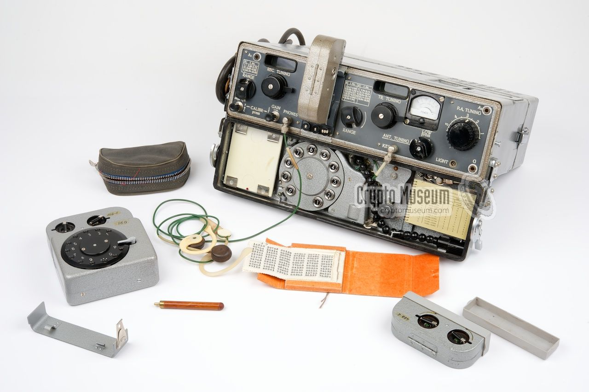

# Conceptos básicos de la criptografía
<!-- _class: first-slide -->

Juan Vera del Campo - <juan.vera@professor.universidadviu.com>

# Hoy hablamos de...
<!-- _class: cool-list toc -->

1. [Servicios criptográficos](#3)
1. [Estrategias de los sistemas seguros](#10)
1. [Breve historia de la criptografía](#18)
1. [Conclusiones](#36)

# Servicios criptográficos
<!--
_class: lead
header: 'Servicios criptográficos'
-->

¿Qué queremos proteger?

## ¿Qué es la criptografía?

Protección de la comunicaciones a través de **medios desprotegidos** entre un emisor y uno o varios destinatarios

...y eso es mucho más que mantener un mensaje secreto...

> Fondo: [(c) cottonbro](https://www.pexels.com/photo/clear-glass-bowl-on-white-table-cloth-7319077/). Free to use

<!--
Tradicionalmente hemos entendido la criptogafía como las técnicas para mantener un mensaje confidencial y que solo pueda leerlo la persona para la que está destinado.

Pero hay mucho más detrás: ¿cómo nos aseguramos que realmente solo el receptor puede leer un mensaje? ¿Es posible demostrar matemáticamente que solo el receptor puede leerlo? ¿ Y cómo se asegura el receptor que el emisor es realmente quien dice ser?
-->

## ¿Qué queremos proteger?

Recurso|Ejemplo
--|--
**El contenido de un mensaje**|¿Cuánto dinero se está transfiriendo?
**Las veces que se envía un mensaje**|¿Ha sido una transferencia o dos? Un atacante no puede repetir una transferencia, aunque no sepa de cuánto es
**Los participantes**|¿Seguro que el ordenante es Paco Pérez? ¿Seguro que está hablando con su banco?
**El no repudio**|Paco Pérez no podrá decir que no ordenó la transferencia

<!--
Solo el primer punto trata de mantener un mensaje secreto. Además vamos a querer saber con quién estamos hablando, entre otros servicios.

¡Si estamos hablando con un malo, da igual que el mensaje esté perfectamente cifrado!
 -->

## ¿Contra quién nos queremos proteger?

Atacante|Ejemplo
--|--
**Ladrón**|Persona con pocos recursos, ataques oportunistas
**Competidor**|Profesionalización, interés
**ATP - estado**|Recursos enormes, dedicación

La seguridad tiene costes:

- Coste de las tecnologías
- Complejidad en los procesos

Decidir, evaluar y asumir el riesgo de ataques contra los que no nos podemos proteger

<!--
¿Contra quién queremos proteger la información?

- Una persona que quiere consumir un servicio sin pagar
- Una persona que quiere invadir nuestra privacidad
- Un competidor que quiere acceso a nuestros documentos secretos
- Una grupo financiado por un estado nación
-->

## El problema que queremos resolver

Firma digital de un contrato entre dos empresas

- El contrato tiene que ser secreto para cualquiera que no participe en la comunicación
- Las empresas tienen que estar seguras de con quién están hablando
- Ninguna de las dos empresas puede cambiar unilateralmente el contrato
- Ninguna de las empresas debe poder decir que no firmó el contrato

<!--
Fondo: https://pixabay.com/photos/binding-contract-contract-secure-948442/ Uso comercial libre
-->

## Principales servicios de seguridad

[New Directions in Cryptography](https://citeseerx.ist.psu.edu/viewdoc/summary?doi=10.1.1.37.9720) (Whitfield Diffie y Martin Hellman, 1976) exploraba qué se necesitaba para que dos empresas pudiesen firmar un contrato mercantil:

- **Confidencialidad**: solo el legítimo destinatario debe poder ser capaz de leer el contenido del contrato o cualquier información asociada.
- **Integridad**: el destinatario debe ser capaz de verificar que el contenido del contrato no ha sido modificado por el camino... ni en el futuro
- **Autenticidad**: el destinatario debe ser capaz de verificar que el emisor es realmente el autor del contrato
- **No repudio**: nadie puede decir que ese no es el contrato que ha firmado
- **Otros**: autorización, acuerdo de claves, partición de secretos, PRNG...

> https://www.universidadviu.com/es/actualidad/nuestros-expertos/las-4-claves-de-la-seguridad-de-la-informacion
> Estándar: [NIST Special Publication 800-57 Part 1, Section 3](https://doi.org/10.6028/NIST.SP.800-57pt1r5)

<!--

El objetivo más evidente de un sistema criptográfico es alcanzar confidencialidad: no queremos que nadie pueda leer nuestras comunicaciones aparte de la persona a la que están destinadas

Pero un sistema que solo ofrezca confidencialidad no es seguro casi nunca. Por ejemplo, si estamos hablando con un adversario en vez de nuestro banco, da igual que nadie más pueda leer nuestras comunicaciones. Tenemos que estar seguros de que al otro lado está realmente el banco: autenticidad

En ocasiones, un adversario puede modificar un mensaje a pesar de que no sepa qué es lo que hay en él. O puede que lo realmente importante para un banco es asegurar que uno de sus clientes ordenó una trasferencia desde sus cuentas y no hacia sus cuentas.

Los objetivos de un sistema criptográfico son los servicios de seguridad que ofrece

El NIST es la agencia de estandarización de EEUU, y entre las cosas que estandariza también está la seguridad del gobierno de EEUU. Sus estándares son sencillos de leer e incluyen un glosario que viene muy bien para introducirse en la criptografía.

-->

## Otros servicios de seguridad

- **Autorización**: ¿está el interlocutor autorizado a acceder a estos datos?
- **Acuerdo de claves**: permite que un grupo de actores generen una clave sin que nadie externo al grupo la conozca
- **Partición de secretos**: permite repartir un secreto entre un grupo de actores, exigiendo un mínimo de actores para recomponerlas
- **Esteganografía**: queremos ocultar que dos personas están hablando
- **Anonimato**: el emisor quiere ocultar su identidad
- etcétera

> https://www.grouphacking.com/ciberseguridad/todos-los-principios-de-la-seguridad-de-la-informacion/

<!--
Nos centraremos en los servicios de confidencialidad, integridad y autenticación. Además, podemos conseguir no-repudio como consecuencia de juntar autenticidad e integridad.

También veremos, aunque a más alto nivel, los servicios de acuerdo de claves, PRNG, partición de secretos... porque están relacionados con los primeros

Otros servicios como la autorización, aunque sin duda son importantes para que un sistema sea seguro, quedan fuera de este curso por limitación de tiempo.
-->

# Estrategias de los sistemas seguros
<!--
_class: lead
header: Estrategias de seguridad
-->

*The thing is secure if its outputs look like random junk*

## Modelo de sistema criptográfico
<!-- _class: two-columns with-header -->

- **Mensaje o texto en claro**: $m$
- **Texto cifrado**: $c = e(k_1, m)$
- **Texto descifrado**: $m' = d(k_2, m)$
- $k_1$ y $k_2$: **clave criptográfica de cifrado o descifrado**: parte secreta de los algoritmos de cifrado y descifrado
- Objetivo: $m=m'$

<!--
Este es el modelo sobre el que trabajaremos: dos personas "Alice y Bob" comunicándose por un canal inseguro porque puede haber un adversario "Maloy" en medio.

Alice y Bob no tienen otra forma de comunicación: no pueden confirmar una operación bancaria enviada por correo electrónico usando una clave enviada al teléfono, por ejemplo. En criptografía asumiremos que no existen estas vías alternativas de comunicación, aunque en la realidad sí existen y los utilizamos en la vida real para mejorar aún más la seguridad del sistema.

Imagen: https://www.tutorialspoint.com/cryptography/images/cryptosystem.jpg
-->

## Principios de Kerckhoffs (1883)
<!-- _class: smaller-font -->

<https://en.wikipedia.org/wiki/Kerckhoffs%27s_principle>

1. **Si el sistema no es teóricamente irrompible, al menos debe serlo en la práctica.**
1. **La efectividad del sistema no debe depender de que su diseño permanezca en secreto.**
1. ~~*La clave debe ser fácilmente memorizable de manera que no haya que recurrir a notas escritas*~~
1. *Los criptogramas deberán dar resultados alfanuméricos*
1. ~~*El sistema debe ser operable por una única persona*~~
1. **El sistema debe ser fácil de utilizar.**

<!-- Kerckhoffs enunció sus principios en 1883.

Los principios 1, 2 y 6 guiarán todo el desarrollo de la criptografía actual

1. Confidencialidad computacional (capítulo 3)
2. No basarse en seguridad por oscuridad
3. Requisito de complejidad (capítulo 4)

Pero atención: la criptografía actual

- En cuanto a clave, tienen que ser específicamente aleatorias y por tanto no
  fácilmente memorizables.
- Los resultados son binarios, y por tanto no son alfanuméricos en general. Aún
  así y aunque no sea estrictamente necesario, la criptografía tiene como
  "costumbre" guardar claves codificadas en Base64, es decir, usando solo
  caracteres imprimibles. El principio 4 se sigue cumpliento parcialmente, aunque
  no sea estrictamente necesaria.
- El sistema completo suele necesitar de varias personas para operar, y en
  particular una "tercera parte de confianza"

Kerckhoffs definió sus principios para un contexto en que una persona solitaria
pudiese utilizar el criptosistema fácilmente y escribir el resultado. Ahora
tenemos la ayuda de ordenadores y esos principios no son ni necesarios, ni
recomendables.

Eso nos lleva a que: la seguridad a veces es cuestión de opinión. "Buenas
prácticas". "Recomendaciones". Por ejemplo, el NIST solo emite recomendaciones.
Pero son recomendaciones muy informadas.

-->

## Máxima de Shannon
<!-- _class: with-success -->

*El atacante conoce el sistema*

**Claude Elwood Shannon (1906-2001)**

Diseña el sistema asumiendo que el atacante sabe qué hacer para cifrar o descifrar, pero no conoce la clave

> [Communication Theory of Secrecy Systems](http://netlab.cs.ucla.edu/wiki/files/shannon1949.pdf), Claude E. Shannon, Bell System Technical Journal, vol.28-4, page 656--715, Oct. 1949.
> Hablaremos más de Shanon en el [tema 3](03-simetrica.html)

<!-- Shanon es un gran matemático del siglo XX, que creó la teoría de la información. Le debemos la teoría detrás de la criptografía, los archivos comprimidos, la codificación digital...

Su máxima se contrapone a la "seguridad por oscuridad". Es decir, la seguridad de un sistema secreto solo será segura mientras el sistema sea secreto. ¿Y si deja de serlo? ¿Y si pensamos que es seguro, pero no lo es?

El paper enlazado es una estupenda introducción a los conceptos fundamentales de la criptografía y se recomienda mucho su lectura

La seguridad por oscuridad es pensar que un sistema secreto es más seguro que un sistema conocido. En realidad, es muy difícil mantener un sistema en secreto. Además, la criptografía está llena de "trampas" y razonamientos no evidentes. Es muy difícil que unas pocas personas puedan diseñar un sistema realmente seguro y además mantenerlo en secreto. Eso es lo que se llama "seguridad por oscuridad", y fiar la seguridad a la oscuridad no es buena idea, como nos ha enseñado la experiencia.

Un sistema no es inseguro por ser oscuro. Es simplemente oscuro. Basar tu seguridad en la oscuridad lo consideramos una mala idea porque los hackers pueden saber más que tú. No hay ningún error lógico en querer basar tu seguridad en la oscuridad. Simplemente, la experiencia nos dice que no es buena idea, y que los sistemas cuya seguridad se basa en la oscuridad caen antes.

PERO que un sistema sea seguro de por sí, utilizando protocolos realmente seguros y buenas prácticas criptográficas, Y ADEMÁS lo ocultamos al mundo, es sin duda una buena idea que no perjudica. Tendrás a los adversarios entretenidos para intentar entender tu sistema, y cuando lo consigan verán que es un indescifrable AES-512.

No bases tu seguridad en la oscuridad, pero añadir un poco de oscuridad siempre ayuda.

-->

## Gestión de claves

*La criptografía es una herramienta para convertir un montón de problemas diferentes en un problema de gestión de claves*

Lea Kissner, antigua ingeniera principal de seguridad de Google

- **Contraseña**: palabra que utilizamos para entrar en un sistema. "Sesamo"
- **Clave criptográfica**: conjunto de números que dan seguridad a un sistema: "82198329382371291821201"

<!--
Si la clave es lo único que tiene que ser secreto, tenemos que protegerla a toda costa.

En este curso no estudiaremos cómo proteger las claves, pero tened en cuenta que, al ser la pieza central de la seguridad de un sistema, es necesario que los usuarios de criptografía dispongan de algún modo de gestión segura de claves criptogrtáficas

Una contraseña no es lo mismo que una clave criptográfica. Las contraseñas suelen ser mucho más inseguras que una clave (a veces no son aleatorias o están pensadas para que las pueda recordar un humano) A veces las contraseñas serán el primer paso para entrar en un sistema seguro, pero **no son buenas claves criptográficas**

En muchas ocasiones un sistema se romperá no por que la criptopgrafía sea débil, sino porque incluye un paso de control con contraseña que es habitualmente la parte más débil de un protocolo.
-->

## Protocolos criptográficos

La criptografía actual se basa en **composición** de técnicas primitivas:

- Composición de **operaciones matemáticas** que crean "**puertas criptográficas**" (*cryptographic gates*).
- Composición de puertas que crean **algoritmos**.
- Composición de algoritmos que crean **protocolos de seguridad**.

La composición es compleja y todo debe funcionar como un reloj.

---

<!--
- **Sin clave**: el emisor usa sólo el mensaje $m$ como argumento de la función criptográfica. Ejemplo: hash.

- **Clave simétrica**: misma clave $k$ para cifrar y descifrar un mensaje $m$. Emisor y receptor deben tener la misma clave. Ejemplo: AES, ChaCha...

- **Clave asimétrica**: claves diferentes para cifrar (pública) y descifrar (privada) un mensaje $m$. El emisor debe conoce la clave pública del receptor. Ejemplo: RSA
-->

## Servicios de seguridad a primitivas

Objetivo|Primitiva|Algoritmos
--|--|--
**Confidencialidad**|cifrado simétrico|AES, Chacha
**Integridad**|hash, firma simétrica|SHA256, algunos modos de AES
**Autenticidad**|firma asimétrica|RSA, ECDSA
**No repudio**|firma asimétrica|RSA, ECDSA
**Acordar clave**|acuerdos de clave/encapsulación|ECDH

Esto es lo que iremos viendo a lo largo de este curso

# Breve historia de la criptografía
<!--
_class: lead
header: Historia de la criptografía
-->

Seguridad de un algoritmo, fuerza bruta y confidencialidad perfecta (*one time pad*)

Encontrarás más detalles en: <https://juanvvc.github.io/crypto/02-historia.html>

---

Años 40: Alemania controla Europa y amenaza al resto del mundo

Sus comunicaciones radio están protegidas con "la cifra indescifrable"

¿Por qué pensaban que era indescifrable?

¿Cómo se descifró?

¿Qué hemos aprendido desde entonces?

## Criptografía = cifrado

Hasta los años 70 del siglo XX, la criptografía se usaba solo en el ámbito militar y solo ofrecía confidencialidad:

**El enemigo no puede saber nuestros planes**

El resultado debería ser un mensaje igual que el original

<!--

¿Recordáis la máxima de Shanon y los principios de Kerckhoffs? "El adversario conoce el sistema". Es decir: los único que debe ser secreto (a parte del mensaje, claro) es la clave de cifrado/descifrado. Se tiene que asumir que el adversario conoce las funciones e() y d()

Aún no estaban preocupados de identificar con quién estaban hablando: "si conoce la clave, será un interlocutor legítimo".

Nota: ¿Cifrar o encriptar? En este curso llamaremos a la ciencia "criptogafía" y al acto "cifrado". Encontrarás gente que utiliza "encriptar" como sinónimo de "cifrar". La RAE ha aceptado recientemente el verbo "encriptar", pero la polémica sobre si usar o no ese verbo sigue abierta en nuestro sector.
-->

## Fuerza bruta
<!-- _class: center with-success -->

 

**Fuerza bruta**: probar todas las claves posibles una a una

<!--
Estos no son exactamente sistemas de cifrado, pero nos sirven para explicar lo que es la fuerza bruta.

¿Cómo abrirías la cerradura de la puerta? ¿Cómo puede un ladrón utilizar una tarjeta de crédito robada? ¿Qué estrategias se usan en cada caso para proteger el sistema?

Images: free for commercial use:

- https://pixabay.com/photos/money-cards-business-credit-card-256319/
- https://pixabay.com/photos/lock-combination-security-safety-1929089/
-->

---
<!-- _class: with-success -->

Posibles defensas contra la fuerza bruta:

- **Cerradura**: aumentando el tamaño de la clave, el atacante pasará más tiempo intentanto abrir la cerradura
- **Tarjeta**: limitamos el número de intentos antes de bloquear la tarjeta, o hacemos que cada intento cueste dinero

Que el descifrado sea costoso tiene el problema de que también le costará al receptor, que descifra legítimamente. Actualmente no se recomienda esta estrategia

Estrategia actual: **obligar al atacante a que tenga que probar muchas claves**

<!--

Por supuesto, el atacante puede intentar usar una llave maestra, o robar el PIN con ingeniería social. Ese tipo de ataques o bien es "romper un algoritmo" o bien "usar canales laterales". No vamos a considerarlos por ahora, vamos a considerar que los sistemas se usan cómo se han diseñado

-->

## Tamaños de clave
<!-- _class: with-success -->

Contraseñas: podemos aumentar el tamaño de clave aumentando tanto el número como el tipo de caracteres

Tipo|Ejemplo|# de claves diferentes|Tamaño en bits
--|--|--|--
PIN de 4 números|3659|9999|$log_2(1000)\approx13\ bits$|
4 letras mayúsculas|CASA|614656|$log_2(614656)\approx\ 19 bits$
4 letras + especiales|Ca*4|33362176|25 bits
5 letras + especiales|Ca*4S|2535525376|32 bits
41 letras + especiales|o18uIo=...9f89fdA!S|$10^{77}$|256 bits
54 mayúsculas|KJASWE...SAJKSAJF|$10^{77}$|256 bits
77 números|923821321...12998|$10^{77}$|256 bits

En criptografía solemos medir la longitud de una clave con **la cantidad de bits que necesitamos para guardarla**

Medir las claves en bits nos permite comparar "su fortaleza": mismo número de bits, misma seguridad

<!--

Fíjate en estos casos:

- a mismo número de caracteres, mayores posibilidades (números...) aumenta el tamaño en bits
- a mismo número de posibilidades, aumentar el número de caracter aumenta el tamaño en bits
- una contraseña de 54 letras mayúsculas tiene el mismo número de bits que una contraseña de letras minúsculas, mayúscuas, números y caracteres especiales: misma seguridad

-->

---

Igual que en la leyenda del ajedrez...

Cada vez que aumentamos un bit se dobla el número de claves posibles

Eso tiene un crecimiento exponencial: rápidamente llegamos a números enormes

Veremos que claves de 256 bits es el estándar actual para tamaño de clave

> https://www.pragatiedible.com/the-legend-of-rice-and-chess-exponential-growth/

## Fortaleza de un algoritmo
<!-- _class: with-success -->

Alquilando equipos en la nube por segundos, con un euro cada segundo podemos probar $10^{11}$ claves

Si estimamos que nuestro "secreto" vale 1000 €: nos hacen falta un sistema criptográfico que permita escoger entre $10^{14}$ claves diferentes para guardar el secreto durante una hora. 

Nota que $10^{14}\approx 2^{48}$. Se dice que este sistema tiene una fortaleza de 48 bits: un atacante tiene que probar $2^{48}$ claves si quiere romperlo por fuerza bruta

Con 128 bits... necesitaríamos miles de años.

**La fortaleza o seguridad de un algoritmo es el tamaño en bits de su espacio de claves.** Es decir, el número de claves diferentes posibles que se tienen que probar para romperlo por fuerza bruta. Normalmente se expresa en bits.

# Mejorando la fuerza bruta

Ejemplo de cifrado por cambio de letras: ¿podemos encontrar un método más rápido que probar los cambios de letras una a una?

**Hq** fulswrjudild, ho fliudgr Fhvdu, wdpelhq frqrflgr frpr fliudgr sru
ghvsodcdplhqwr, frgljr **gh** Fhvdu **r** ghvsodcdplhqwr **gh** Fhvdu, hv xqd gh
odv whfqlfdv gh fliudgr pdv vlpsohv b pdv xvdgdv. **Hv** xq wlsr gh
fliudgr sru vxvwlwxflrq hq ho txh xqd ohwud **hq** ho whawr ruljlqdo hv
uhhpsodcdgd sru rwud ohwud 

https://www.dcode.fr/caesar-cipher

- Mapeos posibles: $27!$ ($\approx 2^{88}$) Ese númejo es demasiado grande para romperlo por fuerza bruta
- Pero si el mensaje es suficientemente largo, **podemos analizar la frecuencia de aparición de los carácteres**

<!--

Este es un ejemplo de cifrado clásico "tipo César aleatorio": cada letra del alfabeto se ha sustituido por otra letra del alfabeto. En este caso, el mapeo entre letras es la clave de cifrado, y en un alfabeto de 27 letras hay 27! posibles mapeos diferentes. Ese es un número enorme para descifrar por fuerza bruta INCLUSO para los PCs actuales. ¿Podemos descifrarlo por otros medios?

No recuerdo qué cifré aquí, ni con que clave, pero no parece difícil descubrirlo.

- Hay letras solas, que en castellano solo pueden ser a, y, o. También e, u, pero es muy improbable. Cualquier otra letra será aún más improbable. Por eso la criptografía clásica en realidad nunca ha usado espacios: da mucha información al adversario
- Haciendo análisis de frecuencias, la h aparece muchas veces: es muy probable que sea a ó e
- Los dígrafos hv gh (varias veces...) podrían ser es, el, me, le ó se

**La información de contexto nos ayuda a descifrar (espacios, lenguaje...)**. Eso también pasa en una web actual: ¿qué es lo que tiene un mensaje cifrado a un banco inmediatamente después de visitar una tienda?
-->

## Rotura de algoritmos criptográficos
<!-- _class: with-success -->

El cifrado César, incluso con mapeos aleatorios, lleva roto como mínimo desde el siglo IX, cuando Al-Kindi describió por primera vez el análisis de frecuencia contra el cifrado César

**Un algoritmo está roto desde el punto de vista criptográfico cuando se conoce un ataque más eficiente que la fuerza bruta**.

## Confidencialidad perfecta

**Seguridad perfecta o incondicional**: no se puede deducir ninguna propiedad del texto original en claro, incluso aunque el atacante tenga recursos infinitos (tiempo, dinero)

- Gilbert Sandford Vernam inventó y patentó una máquina de cifrado en 1917
- Shannon demostró en 1945 que esa máquina tenía cifrado perfecto

> [Communication Theory of Secrecy Systems](http://netlab.cs.ucla.edu/wiki/files/shannon1949.pdf), Claude E. Shannon, Bell System Technical Journal, vol.28-4, page 656--715, Oct. 1949.

<!-- 
excepto la longitud... y el momento de enviarlo, ...y el número de mensajes

Imagen: https://upload.wikimedia.org/wikipedia/commons/0/06/USpatent1310719.fig1.png
 -->

 ---
<!-- _class: with-success -->

Si tienes el texto cifrado "XHAJSJXXNFHFDOIOJUMNF" (21 caracteres):

- existe una clave de tamaño 21 que descifra "ATACADALASOCHOENPUNTO"
    - Clave: [XOAHSGXMNNTDWAEBUAZUR](https://www.dcode.fr/vigenere-cipher)
- existe otra clave de tamaño 21 que descifra "SEHAQUEDADOBUENATARDE"
    - Clave: [FDTJCPTUNCTEJKVOQUVKB](https://www.dcode.fr/vigenere-cipher)
- existe una clave de tamaño 21 que descifra cualquier otro mensaje que se te ocurra de 21 caracteres
- un atacante no sabe qué mensaje es el que realmente se cifró, así que aunque pruebe las claves una a una no sabrá nunca si ha acertado con "la buena"

Un cifrado perfecto no puede descifrarse ni siquiera por fuerza bruta porque un atacante no puede distinguir el mensaje real de todos los posibles mensajes falsos

## ¿A qué hora atacamos?

Imagina que unos atacantes acuerdan el siguiente mapeo, es decir, clave:

- A = 16 horas
- B = 7 horas
- C = 13 horas
- ...

El castillo captura este mensaje: "Atacamos a las F"

¿El castillo tiene alguna forma de conocer a qué hora le atacarán?

---

- La primera vez, el castillo no tiene forma saber a qué hora le atacarán ni aunque pruebe todas las claves. **Este cifrado es perfecto**
- Pero puede aprovechar el primer mensaje para descifrar los siguientes que usen la misma clave:
    - Si no le han atacado a la 1, sabe que F no es 1
    - Si no le han atacado a las 2, sabe que F no es 2
    - Si le atacan a las 3, sabe que F es 3
- Tras cada ataque, los atacantes tienen que cambiar qué significan las letras. **La clave solo puede usarse una vez**.
- Si el castillo intercepta un mensaje tio HK, sabe que H es 1 ó 2 porque no existe la "hora 37": el mapeo tiene que ser completo. Es decir, **la clave tiene que ser tan larga como el mensaje**

## Condiciones de la confidencialidad perfecta
<!-- _class: with-warning -->

Shanon (1949) demostró que para tener confidencialidad perfecta el sistema de cifrado tienen que cumplir obligatoriamente las siguientes características:

- La clave debe tan larga como el mensaje
- La clave solo se usa una vez
- Totalmente aleatoria

Problema: ¿cómo distribuimos estas claves tan largas?

El cifrado perfecto no se puede descifrar, pero la necesidad de claves largas limita su uso

> [Communication Theory of Secrecy Systems](http://netlab.cs.ucla.edu/wiki/files/shannon1949.pdf), Claude E. Shannon, Bell System Technical Journal, vol.28-4, page 656--715, Oct. 1949.

<!--
En realidad esto ya se sabía antes de que Vernan inventase su máquina. Pero el invento de Vernan permitió usar este tipo de cifrado, y además Shannon acabó formalizando la teoría matemática que empezó la criptografía moderna
-->

## One-time-pad

Vernam patentó el *one-time-pad* de una manera similar:

$c = e(k,m)=k \otimes m$
$m' = d(k,c) = e(k,c)=k \otimes c$

La longitud en bytes de $k$ es igual que la longitud en bytes de $m$.

Las claves se guardaban en hojas de papel de un solo uso. Las dos partes tenían una colección de estas hojas y se destruía en cuanto se usaba.

En 1972, la NSA tenía 86.000 *one-time-pads*

> Si lo necesitas, mira la operación XOR en [el glosario](A1-glosario.html)

<!--
El teléfono rojo entre Washington y Moscú fue en realidad un teletipo que usaba cifrado de bloque de un solo uso

La clave $k$ se intercambiaba por valija diplomática en cinta perforada que se entregaba en ambos sentidos. Mientras no hacía falta, se guardaba protegida y  se destruía después de ser usada

Además, el *one-time-pad* permitía trabajar de forma segura sin intercambiar ningún algoritmo secreto que diera ventaja técnica al enemigo

Para poder usar un *one-time-pad*, la clave se prepara por adelantado para cuando haga falta enviar algún mensaje inmediatamente.

Imagen: https://www.cryptomuseum.com/spy/r353/img/300148/191/full.jpg
-->

---

El principal problema es que la longitud en bytes de $k$ es igual a la longitud en bytes de $m$.

Cuesta tanto enviar $k$ de forma segura como enviar directamente $m$ en claro por el mismo canal seguro

> Más ejemplos: https://www.cryptomuseum.com/covert/conceal/index.htm

<!--

- Al final de la segunda guerra mundial, EEUU descifró el *one-time-pad* usado por los diplomáticos alemanes porque utilizaban contraseñas no totalmente aleatorias y podían adivinarse.
- 1944: EEUU descifró mensajes de la URSS a Australia... porque utilizaban el mismo *one-time-pad* que la URSS usaba con EEUU.
- 1962 (ataque canal lateral): las máquinas usadas para cifrar eran eléctricas y emitían un campo magnético, que Japón podría haber aprovechado para captar qué cifraba la embajada de EEUU: [TEMPEST](https://www.governmentattic.org/18docs/Hist_US_COMSEC_Boak_NSA_1973u.pdf)

-->

## Seguridad computacional

Sabemos cómo hacer cifrado perfecto, pero no es práctico.

Los sistemas actuales usan otro concepto: la seguridad computacional

**Seguridad computacional**: romper un cifrado es posible, pero se necesita invertir mucho tiempo / recursos

Lo veremos con más detalle en la siguiente sesión
# Conclusiones
<!--
_class: lead
header: ''
-->

---

- Diseña el sistema pensando que el atacante lo conoce.
- Servicios básicos de seguridad: **confidencialidad**, **integridad**, **autenticación**, **no repudio**
- Fuerza bruta: probar todas las claves una a una
- Seguridad de un algoritmo: número de claves (en bits) que un atacante tiene que probar para romperlo por fuerza bruta
- Sistema inseguro: se conoce un ataque mejor que la fuerza bruta
- La seguridad de los protocolos actuales está basada en la seguridad computacional
- Técnicas para ofrecer estos servicios: criptografía simétrica, criptografía asimétrica, intercambio de claves, firma digital, funciones de hash, protocolos (composisión de técnicas)
- La seguridad del sistema depende de que todos los engranajes encajen totalmente: algoritmos escogidos, sus parámetros de configuración, los protocolos utilizados...

## Referencias

- Primer capítulo de "[*The Joy of Cryptography*](https://joyofcryptography.com/)" de Mike Rosulek, 2021
- [Recommendation for Key Management: Part 1 – General](https://nvlpubs.nist.gov/nistpubs/SpecialPublications/NIST.SP.800-57pt1r5.pdf), NIST SP 800-57 Part 1, Revision 5, mayo 2020. Capítulos 2 (glosario) y 3 (servicios), aunque el resto serán de utilidad en el resto del curso
- Introducción del paper [Communication Theory of Secrecy Systems](http://netlab.cs.ucla.edu/wiki/files/shannon1949.pdf), Claude E. Shannon, Bell System Technical Journal, vol.28-4, page 656--715, Oct. 1949.

---

Es muy recomendable tener a mano el [glosario](../A1-glosario.html) para recordar los conceptos fundamentales

# ¡Gracias!
<!-- _class: last-slide -->
