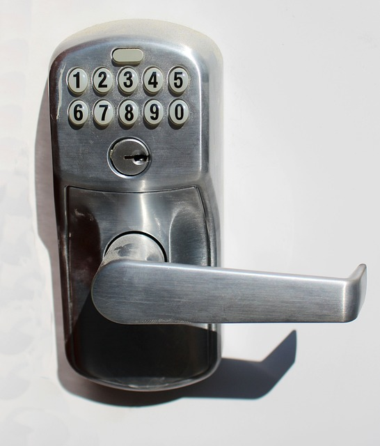
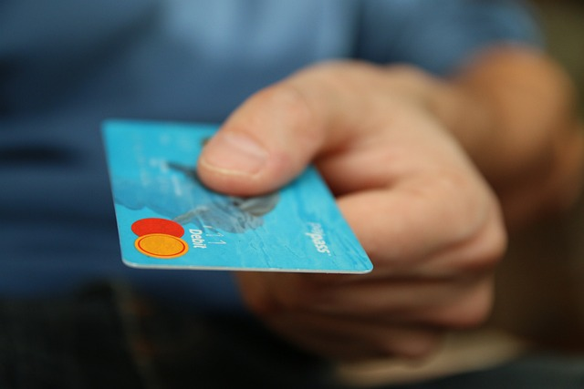
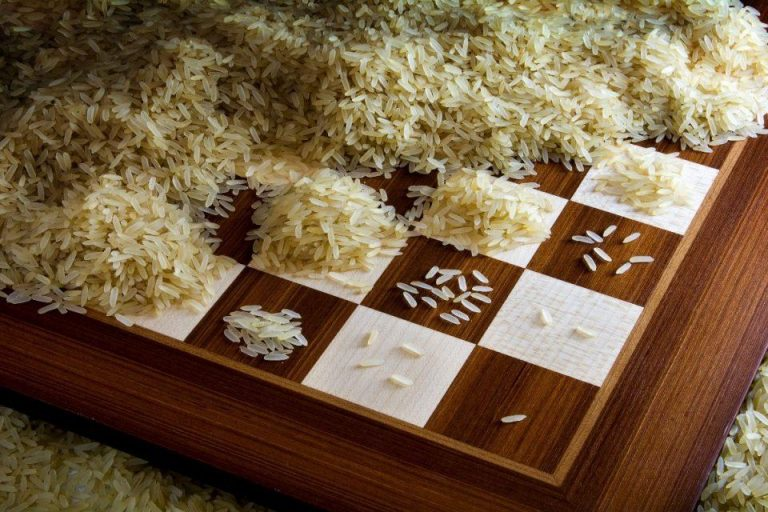
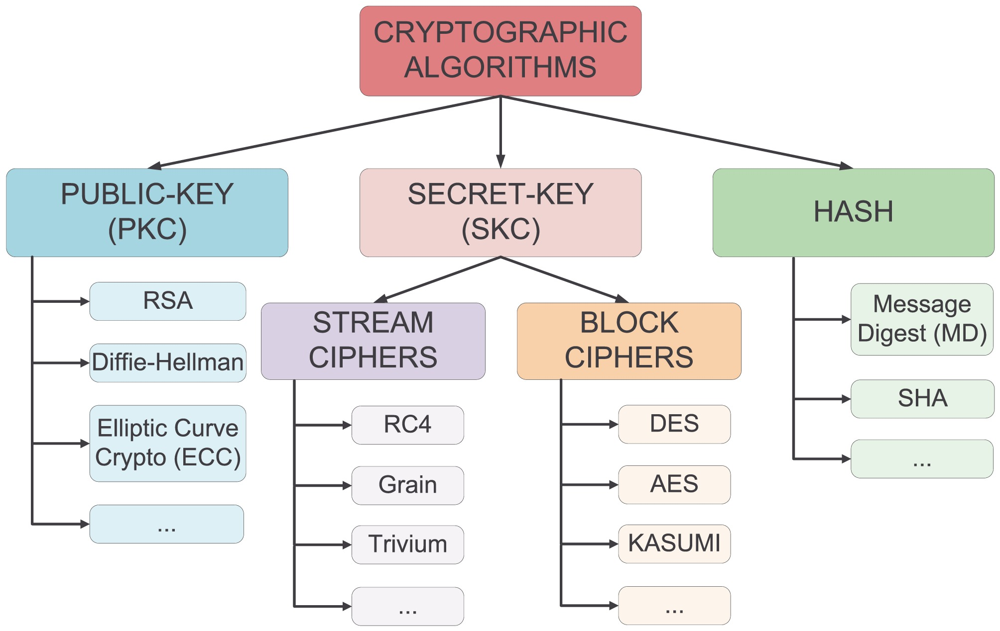
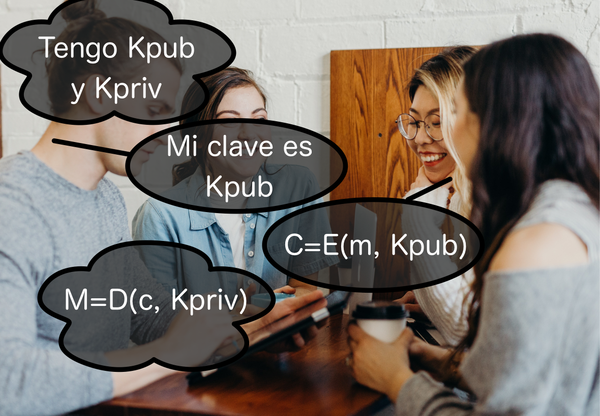
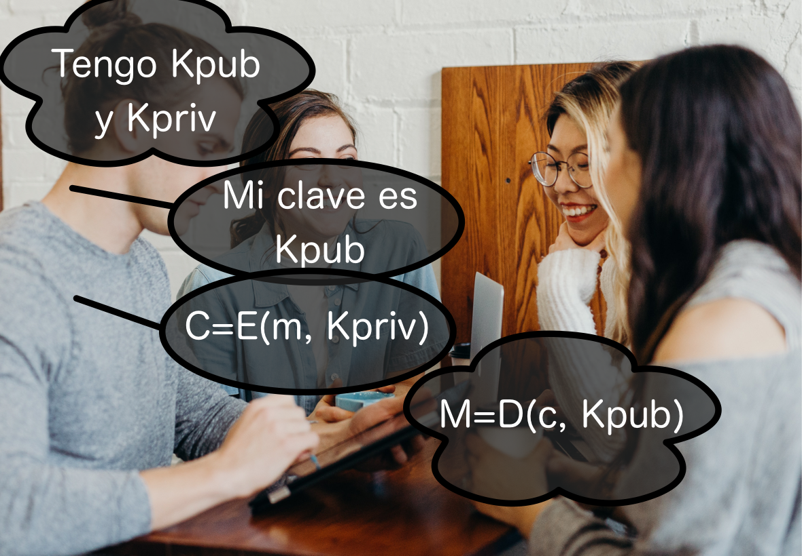
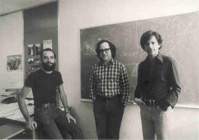
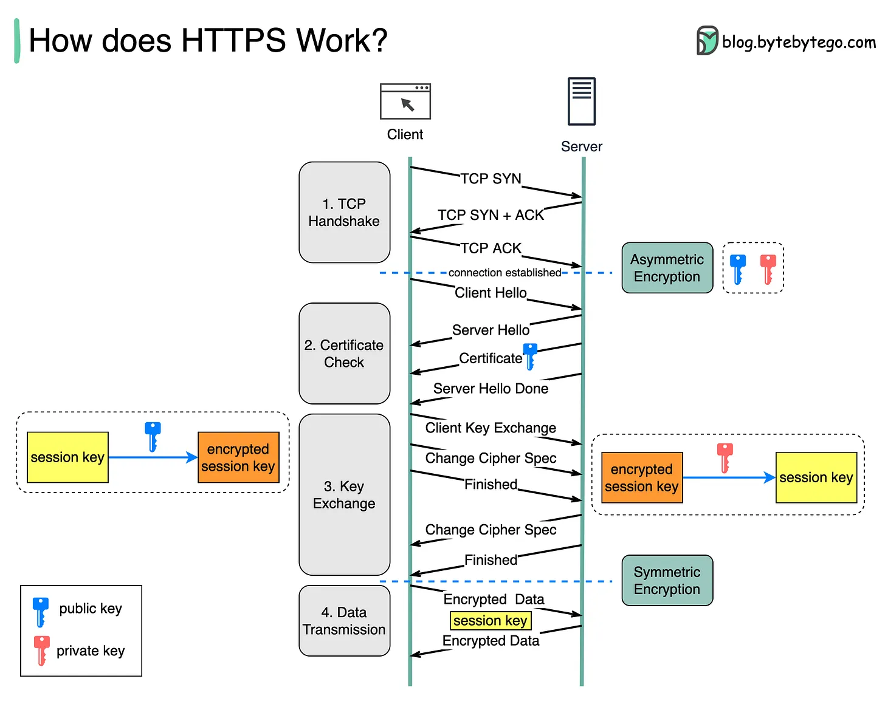

<style>
    /* You can add custom style here. VSCode supports this.
    Other editor might need these custom code in
    the YAML header: section: | */
	/* section header { display: none; } */
	/* section footer { display: none; } */
	section.a-story ul li {
 		list-style-type: none; text-align: center;
 	}
</style>

# Sistemas de cifrado
<!-- _class: first-slide -->

**Cifrado simétrico y cifrado de clave pública**

Juan Vera del Campo - <juan.vera@professor.universidadviu.com>

# Hoy hablamos de...
<!-- _class: cool-list toc -->

1. [Servicios de seguridad](#5)
1. [Cifrado simétrico de bloque: AES](#11)
1. [Criptografía de clave pública / asimétrica](#26)
1. [Resumen y referencias](#50)

---
<!-- _class: with-info -->

Esta sesión es un resumen de la asignatura "Criptografía y teoría de códigos", donde desarrollamos los mismos conceptos en 4 ó 5 sesiones. Encontrarás aquí más detalles técnicos de cada tema:

- <https://juanvvc.github.io/crypto/02-historia.html>
- <https://juanvvc.github.io/crypto/03-simetrica.html>
- <https://juanvvc.github.io/crypto/04-complejidad.html>
- <https://juanvvc.github.io/crypto/05-asimetrica.html>

Este tema es denso pero no se pretende aprender los detalles. Objetivo de la sesión: saber qué son los sistemas de cifrado simétrico y de clave pública, por qué son necesarios los tipos y cuándo se usa cada uno. **Fíjate en estos cuadros azules**

# Confidencialidad
<!-- _class: lead -->

## Seguridad computacional (*computational secrecy*)
<!-- _class: with-info -->


Un sistema es seguro computacionalmente si cualquier algoritmo probabilístico en tiempo polinomial solo puede romper el algoritmo con probabilidad negligible en $\|n\|$

...aunque la tecnología mejora y quizá en el futuro sea más fácil

Con la seguridad computacional hay que definir el objetivo: "quiero un sistema criptográfico que mantenga este mensaje secreto durante los próximos 100 años"

**Seguridad computacional**: un atacante puede romper el cifrado, pero necesitará gastar una cantidad desproporcionada de recursos para el valor del mensaje

> Introducción más detallada y matemática: https://intensecrypto.org/public/lec_02_computational-security.html

<!-- Desde que los matemáticos entraron en la criptografía, existe definiciones de todos los términos tan exactas y formales como incomprensibles para un profano. Esta definición matemática está puesta para mostraros que hay una teoría matemática detrás de todo lo que decimos, pero en este curso no entraremos en las matemáticas de la criptografía

Lo importante es que relajamos el sistema lo suficiente como para que, por un tiempo determinado, ningún atacante con unos recursos razonables pueda descifrar el mensaje -->

## Fuerza bruta
<!-- _class: center with-info -->


 

**Fuerza bruta**: probar todas las claves posibles una a una

<!--
Estos no son exactamente sistemas de cifrado, pero nos sirven para explicar lo que es la fuerza bruta.

¿Cómo abrirías la cerradura de la puerta? ¿Cómo puede un ladrón utilizar una tarjeta de crédito robada? ¿Qué estrategias se usan en cada caso para proteger el sistema?

Images: free for commercial use:

- https://pixabay.com/photos/money-cards-business-credit-card-256319/
- https://pixabay.com/photos/lock-combination-security-safety-1929089/
-->

---
<!-- _class: with-success -->

Posibles defensas contra la fuerza bruta:

- **Cerradura**: aumentando el tamaño de la clave, el atacante pasará más tiempo intentanto abrir la cerradura
- **Tarjeta**: limitamos el número de intentos antes de bloquear la tarjeta, o hacemos que cada intento cueste dinero

Que el descifrado sea costoso tiene el problema de que también le costará al receptor, que descifra legítimamente. Actualmente no se recomienda esta estrategia

Estrategia actual: **obligar al atacante a que tenga que probar muchas claves**

<!--

Por supuesto, el atacante puede intentar usar una llave maestra, o robar el PIN con ingeniería social. Ese tipo de ataques o bien es "romper un algoritmo" o bien "usar canales laterales". No vamos a considerarlos por ahora, vamos a considerar que los sistemas se usan cómo se han diseñado

-->

## Tamaños de clave
<!-- _class: with-info -->

<style scoped>
table { font-size: 60%; }
p {font-size: 75%; }
</style>

Contraseñas: podemos aumentar el tamaño de clave aumentando tanto el número como el tipo de caracteres

Tipo|Ejemplo|# de claves diferentes|Tamaño en bits
--|--|--|--
PIN de 4 números|3659|9999|$log_2(1000)\approx13\ bits$|
4 letras mayúsculas|CASA|614656|$log_2(614656)\approx\ 19 bits$
4 letras + especiales|Ca*4|33362176|25 bits
5 letras + especiales|Ca*4S|2535525376|32 bits
41 letras + especiales|o18uIo=...9f89fdA!S|$10^{77}$|256 bits
54 mayúsculas|KJASWE...SAJKSAJF|$10^{77}$|256 bits
77 números|923821321...12998|$10^{77}$|256 bits

En criptografía solemos medir la longitud de una clave con **la cantidad de bits que necesitamos para guardarla**

Medir las claves en bits nos permite comparar "su fortaleza": mismo número de bits, misma seguridad

<!--

Fíjate en estos casos:

- a mismo número de caracteres, mayores posibilidades (números...) aumenta el tamaño en bits
- a mismo número de posibilidades, aumentar el número de caracter aumenta el tamaño en bits
- una contraseña de 54 letras mayúsculas tiene el mismo número de bits que una contraseña de letras minúsculas, mayúscuas, números y caracteres especiales: misma seguridad

-->

---

Igual que en la leyenda del ajedrez...

Cada vez que aumentamos un bit se dobla el número de claves posibles

Eso tiene un crecimiento exponencial: rápidamente llegamos a números enormes

Veremos que claves de 256 bits es el estándar actual para tamaño de clave




> https://www.pragatiedible.com/the-legend-of-rice-and-chess-exponential-growth/

---



<!--
- **Sin clave**: el emisor usa sólo el mensaje $m$ como argumento de la función criptográfica. Ejemplo: hash.

- **Clave simétrica**: misma clave $k$ para cifrar y descifrar un mensaje $m$. Emisor y receptor deben tener la misma clave. Ejemplo: AES, ChaCha...

- **Clave asimétrica**: claves diferentes para cifrar (pública) y descifrar (privada) un mensaje $m$. El emisor debe conoce la clave pública del receptor. Ejemplo: RSA
-->


# Cifrado simétrico: AES
<!-- _class: lead -->

Y sus "modos" de cifrado

## Criptografía simétrica o de clave secreta (SKC)
<!-- _class: with-info -->


- Ventajas: muy rápido
- Desventajas: ¿cómo compartimos la clave?
- Ejemplos actuales: **AES** (es el que veremos en detalle), ChaCha
- Ejemplos rotos y obsoletos: RC4, DES, TDES

Una sola clave cifra y descifra. **Ambas partes tienen que conocer la clave**


<!-- Se llama cifrado simétrico o de clave secreta porque cifrar y descifrar es lo mismo, y con la misma clave, que tiene que permanecer secreta para todas las personas que no estén en la conversación -->

## Advanced Encryption System (AES)
<!-- _class: with-info -->

Es un **cifrado simétrico**: misma clave para cifrar y descifrar

[AES (FIPS 197, 2001)](https://nvlpubs.nist.gov/nistpubs/FIPS/NIST.FIPS.197.pdf) desarrollado por Vincent Rijmen y Joan Daemen (aka: Rijndael), que ganaron el concurso celebrado por el NIST para sustituir a DES en 2001


AES: sistema de cifrado simétrico por bloques y dos variantes: claves de 128 ó 256 bits

<!--
AES fue desarrollado por Vincent Rijmen y Joan Daemen en el COSIC de la KU Leuven, Bélgica.

Es totalmente ubicuo en la seguridad actual: se usa para todo, en todos lados. ChaCha20 es el único algoritmo que puee hacerle sombra.

Hay hardware especializado en cifrar y descifrar AES, entre ellas las CPUs de computadora de sobremesa.
-->


## AES: Cifrado de bloque

Divide el mensaje a cifrar en bloques de 128bits (16B) y cifra cada bloque por separado


<!--
Nota importante: la figura muestra un cifrado de bloque totalmente inseguro, como veremos en un momento

Fíjate: los bloques no tienen memoria, al contrario de lo que pasaba en el cifrado de flujo. Veremos que esto es una de sus debilidades.
-->

---

Práctica:

<https://colab.research.google.com/github/Juanvvc/crypto/blob/master/ejercicios/03/Demo_AES.ipynb>

## Modos de operación
<!-- _class: with-warning -->

Ordenación de los bloques de cifrado para evitar repeticiones, añadir autenticación, eficiencia en el cifrado o descifrado...

En la imagen, modo GCM


Cada modo de operación tiene ventajas y desventajas según para qué queremos usar el sistema

## Ejemplo: modo ECB (Electronic Code-Book). El loro que repite


---

Si siempre ciframos igual el mismo mensaje, ¡un atacante sabrá que estamos repitiendo lo mismo que antes!

**Vector de inicialización**: valor al azar **no secreto** que añadimos al mensaje para hacerlo diferente cada vez

Los mensaje siguientes dependen de los anteriores: **modos de operación** 


## Ejemplo: modo CBC (Cipher Block Chaining)


Rápido para descifrar, no tanto para cifrar

## Ejemplo: modo OFB (Output Feedback)


Rápido para cifrar, no tanto para descifrar

## Problema del cifrado simétrico
<!-- _class: with-info -->


El cifrado simétrico permite enviar mensajes computacionalmente seguros

Solo necesitamos que las dos partes tenga una clave secreta en común

¿Cómo conseguimos que las dos personas que no se han visto nunca tengan una clave secreta común?

<!--
Parecería que con lo que conocemos ya hemos resuelto el problema de comunicar dos personas de forma secreta

Pero en realidad tenemos un "elefante en la habitación": ¿cómo se intercambian una clave de forma segura dos personas que no han hablado nunca antes, ni tienen otra forma de comunicació que Internet?

Este es el problema de intercambio de clave. No fue resuelto hasta 1976 con una serie de conceptos completamente nuevos: cada persona tiene dos claves, una pública conocida por todo el mundo y otra privada y secreta. El algoritmo inventado en 1976 se llama Diffie-Hellman, y aún lo estamos utilizando.

Antes de empezar necesitaremos un poco de teoría de complejidad. Vamos allá.
-->

# Criptografía de clave pública / asimétrica
<!-- _class: lead -->

Diffie-Hellman, RSA y curvas elípticas

## Criptografía de clave pública / asimétrica
<!-- _class: with-info -->


Cada persona tiene dos claves:

- $pk$: clave pública de una persona, todos la conocen
- $sk$: clave privada. Solo el propietario la conoce, **nadie más puede conocer mi clave privada, ni siquiera las personas con las que hablo**

Una clave para cifrar y otra diferente para cifrar (relacionadas entre sí)

> Compara con criptografía simétrica: misma clave para cifrar y descifrar, Bob y Alice tienen que manetenarla en secreto
> Nota: para no confundirnos al hablar, usaremos siempre "de clave pública" y no "asimétrica", pero son sinónimos

## Esquema de cifrado



- Todos conocen la clave $K_{pub}$ de Bob, solo Bob conoce la clave $K_{priv}$
- **Cualquier puede cifrar un mensaje para Bob, solo Bob puede descifrarlo**: confidencialidad
- Cuidado: con este tipo de cifrado solo podemos cifrar mensajes pequeños

## Esquema de firma electrónica



- Solo Bob puede cifrar con su clave $K_{priv}$ y cualquier puede descifrar con $K_{pub}$
- Pero si pueden descifrar el mensaje, **todos saben que el mensaje solo puede haberlo enviado Bob: autenticación**

## Protocolo Diffie-Hellman: intercambio de claves simétricas

Utilizado para **acordar una clave simétrica entres dos personas antes de las comunicaciones**

Idea básica:

1. Bob envía a Alice una parte de la clave simétrica que usarán, cifrándola con la clave pública de Alice.
1. Alice envía a Bob una parte de la clave simétrica que usarán, cifrándola con la clave pública de Bob.
1. La clave final es la combinación de ambas partes, que solo las conocen Alice y Bob


## RSA: claves públicas y privadas



Fue el primer método de cifrado conocido que usaba claves públicas y privadas

Sigue usándose en la actualidad

[A method for obtaining digital signatures and public-key cryptosystems](https://citeseerx.ist.psu.edu/viewdoc/summary?doi=10.1.1.607.2677), Ron **R**ivest, Adi **S**hamir, Leonard **A**dleman, 1978

Está basado en la dificultad en factorizar números grandes

> Background: https://hsto.org/getpro/habr/post_images/453/10e/602/45310e602d784a489301bf1996edef68.jpg

<!--
Fundaron la empresa RSA Security LLC, que sigue siendo uno de los mayores proveedores de seguridad del mundo

- Hablamos de Ron Rivest en el tema 3, creador de RC4
- Adi Shamir hizo más aportaciones fundamentales a la criptografía
- Leonard Adleman ha seguido investigando en teoría de la complejidad
-->

## El protocolo RSA: generación de par de claves
<!-- _class: smaller-font -->

1. Escoge dos números $p$, $q$ primos
1. Calcula: $n = pq$. Su número de bits es el **tamaño de clave**
1. Calcula:
    - Protocolo original: $\phi = (p-1)(q-1)$
    - Versión moderna: $\phi = mcm(p-1, q-1)$
1. Escoge al azar $e \lt \phi$ que sea coprimo de $\phi$ (sin factores en común)
1. Calcula: $d = e^{-1} \mod \phi$
1. Claves:
    - $sk=\{d, n\}$
    - $pk=\{e, n\}$
1. Se descartan $p$, $q$, $\phi$

---

```
Pública
(n=2630603903462120558125809399396223450806040372680184917638400134004105630494370342493606659294555239865975926870363332336960041351773437802844996
2255029778102289989887357059605220044360970230381740652986600375646373696626242320610515650620076120340628081660475500146892077996033767236927270182
8537602215507414332799741425399475043531193746968563077377733376432359188825062279559903677141193673153091026840234999533292241421899721978869014020
8976283873838133577327435068449969167496626845188284509563364587386450894233747711870685037802983577824461259620598113905244407969412571310155268827
7552820737028751605315371203,
e=65537,
)

Privada = (
 d=65966797154963181580662243579012213409634054816077176295723464611273744 5784209368657570206786645224675792016267924778145044323047983895563893008
 3840888153077224847625063240552390082229128053637009883905401282841148183 7313880619813772290479521644222050476532200834210308353422618818019634896
 5958329069626433396024443191332697619398764123276960421002286251863686698 7965253240001168546075012919946518601626499930973209433719541266102718357
 0159396494300709365681041634009027640598440177603208560540166080774664796 4863173392223008002189330713551460482658358006754041112981200147901797910
 7023936819256886594902951886215961,
 p=15822697433369222355195074603863028629561696669534834883621867737110843 4794283515182294734634893277974643854046993128130398000368136353140552823
 7493745905709679206798571773440040727909231340545918102174124482089157401 5605088840535382614556806210730724645276338593685838358134428454905802529
 9034018350606553019,
 q=16625508479447490830085422502172652004940406193549490218563143957880705 6440258428473283984392352130053211679280853003187348953863348572315206383
 2212176953714405103622793546369616228204678810506794297563950807636241311 2894942897951312307129681995544553786274227219646959297229170241434933080
 0995119347515600537,
 u=30088390481144180897480895140640860431430673453228981590701663357531214 5271086939508602764777052098733559342685009059287845166869379637330760407
 3641229883757561839424495924348864139753204431984483442776861335698636851 0894818412987303676062484214645876169072495669175070328712630890572849776
 0624230899012969)
```

Observa:

- Las claves RSA son números muy largos
- Hay una relación entre la clave pública y la privada, pero si un atacante tiene la clave pública solo podría obtener la privada por fuerza bruta


## El protocolo: cifrado y descifrado

Cifrado: Para enviar un mensaje a Alice, obtengo su clave pública $pk_A=\{e, n\}$ y calculo:

$$c=m^e \mod n$$

Descifrado: Alice utiliza su clave privada $sk_A=\{d, n\}$

$$m'=c^d \mod n$$

---

```
- Mensaje: 15
['- Cifrado: 11383802449161344350546832178226978312769309764351458181932',
 '5884150859852715868196703424496486345974985183893431270220618898117243',
 '4074085942357664667616949933359742818670009369869295239555869272197041',
 '7020148341206050989756453017030709933803245840985556605690245075625974',
 '4824619122348481566547445114274307863274834976209360938117505178524351',
 '8625517598374787237599491455109425834142763325667103578756108900333176',
 '9469681010573259781173212314493268678653351108939467583746792211641767',
 '9369248678561075313076494330212825885965313134794742288632771011791982',
 '96868029138582228042383220689872478270738650868856170833992652968076']
```

Observa:

- En RSA solo podemos cifrar números. Si queremos cifrar un mensaje de texto, primero lo convertimos a un número
- El resultado también es un número
- RSA puede cifrar como máximo números tan largos como la clave

## Velocidad de proceso
<!-- _class: with-info -->

Para crear el par de claves hay que buscar:

- números muy grandes que sean primos (y otras condiciones): $p$ y $q$
- número muy grande $e$ que sea coprimo de $pq$
- inversos de un número entero: $d=e^{-1} \mod \phi$

Es decir: la elección de un par de claves **es un proceso muy lento**. Segundos, minutos, horas si las claves son grandes

A cambio: el cifrado y descifrado **son relativamente rápidos** comparados con otros sistemas de cifrado de clave pública

El cifrado de clave pública es muy lento comparado con cualquier proceso de cifrado simétrico

## Tamaño de claves
<!-- _class: with-info -->


Hemos visto que tanto Diffie-Hellman como RSA necesitan números primos

Los números primos están muy separados entre sí: el número de primos menores que $N$ es $\approx \ln(N)$

Ejemplo: hay $\approx\ln(2^{4096})=2839$ números primos menores de $2^{4096}$

"Son pocos primos"

La criptografía de clave pública necesita claves mucho más largas que la criptografía simétrica

> Fuente: https://en.wikipedia.org/wiki/Prime_number_theorem
> Gráfico: https://en.wikipedia.org/wiki/Ulam_spiral

## Tamaño de clave
<!-- _class: smaller-font -->

Simétrica|RSA|D-H ($p$, $q$)
--|--|--
80|1024|1024, 160
128|3072|3072, 224
192|7680|7680, 384
256|15360|15360, 512

Es decir: para intercambiar una clave AES-256 aprovechando todos sus bits, necesitamos claves RSA de 15360 bits

Si usamos tamaños de clave RSA de 4096 bits (tamaño típico), podremos intercambiar una clave simétrica equivalente a AES-128

La gran ventaja de las curvas elípticas en criptografía (EEC) es que nos permiten utilizar criptografía de clave pública con una clave **mucho más pequeña** y pone la criptografía de clave pública al alcance de pequeños dispositivos

> https://www.keylength.com/en/compare/


<!--
Nota: podemos intercambiar claves AES-256 con un D-H de 1024 bits. Solo que, de forma efectiva, solo estaremos escogiendo 80 bits de la clave AES-256. Es decir, sería equivalente a un (no existente) AES-80

A cambio, las curvas elípticas son más complejas de entender y programar pero eso como usuarios no es algo que importe

-->

## Usos de la criptografía de clave pública
<!-- _class: with-info -->

¿Por qué no la usamos para todo?

- Es mucho más lenta que la ciptografía de clave privada como AES/ChaCha
- Solo permite cifrar textos muy cortos

Pero tiene otras ventajas:

- La otra parte solo tiene que conocer nuestra clave pública para poder comunicarse, y la clave pública no es secreta
- Es la única que nos permite firmas digitales
- A través de las firmas podemos autenticar a la otra parte

Problema de la criptografía de clave pública: ¿cómo hacemos llegar nuestra clave pública a nuestros interlocutores sin que un atacante pueda cambiarla y hacerse pasar por notrosos?

## Criptografía híbrida: lo mejor de los dos mundos

1. Usamos **criptografía de clave pública** para:
    - Identificar con quién estamos hablando: RSA
    - Intercambiar una clave secreta: Diffie-Hellman (y su versión moderna ECDH)
1. Una vez que tenemos la clave, seguimos cifrando con **cifrando simétrico** AES



> https://blog.bytebytego.com/p/how-https-works-youtube-diagram-as

# Resumen y referencias
<!-- _class: lead -->

## Criptografía simétrica o de clave secreta (SKC)


- Una sola clave cifra y descifra. **Ambas partes tienen que conocer la clave**
- Ventajas: muy rápido
- Desventajas: ¿cómo compartimos la clave?
- Cifrado simétrico de bloque (AES):
    - Se divide el mensaje en bloques, cada bloque se cifra por separado.
    - Es necesario utilizar el modo de funcionamiento más conveniente

<!-- Se llama cifrado simétrico o de clave secreta porque cifrar y descifrar es lo mismo, y con la misma clave, que tiene que permanecer secreta para todas las personas que no estén en la conversación -->

## Criptografía de clave pública / asimétrica


Cada persona tiene dos claves:

- $pk$: clave pública de una persona, todos la conocen
- $sk$: clave privada. Solo el propietario la conoce, **nadie más puede conocer mi clave privada, ni siquiera las personas con las que hablo**
- Desventaja: mucho más lento que la criptografía simétrica
- Ejemplos: RSA, ECDSA, Diffie-Hellman (DH) y sus versiones sobre curvas elípticas

---

Característica|Cifrado simétrico|Cifrado de clave pública
--|--|--
Eficiencia|Muy rápido|Lento
Claves|1 (secreta, compartida)|2 (una pública y otra privada)
Tamaño de clave|256 bits|15360 bits (RSA), 512 bits (curvas elípticas)
Servicios|Confidencialidad|Intercambio de claves simétricas (Diffie-Hellman), firma digital (RSA)
Ejemplos|AES, ChaCha|RSA, ECDSA, ECDH

<!--
ECDSA: Elliptic Curve DSA
ECDH: Elliptic Curve Diffie-Hellman
-->

## Servicios de seguridad a primitivas

Objetivo|Primitiva|Algoritmos
--|--|--
**Confidencialidad**|cifrado simétrico|AES, Chacha
**Integridad**|hash, firma simétrica|SHA256, algunos modos de AES
**Autenticidad**|firma digital|RSA, ECDSA
**No repudio**|firma digital|RSA, ECDSA
**Acordar clave**|acuerdos de clave/encapsulación|ECDH (Diffie-Hellman)

## Referencias

- [Block Cipher Techniques](https://csrc.nist.gov/projects/block-cipher-techniques), NIST
- [Recommendation for Key Establishment Using Symmetric Block Ciphers](https://csrc.nist.gov/CSRC/media/Publications/sp/800-71/draft/documents/sp800-71-draft.pdf), NIST 800-71, 2018
- [Algorithms, key size and parameters report 2014](https://www.enisa.europa.eu/publications/algorithms-key-size-and-parameters-report-2014), ENISA, 2014
- [Nuevas direcciones en la criptografía](https://citeseerx.ist.psu.edu/viewdoc/summary?doi=10.1.1.37.9720) Whitfield Diffie y Martin Hellman, 1976
- [Asymmetric Encryption - Simply explained](https://www.youtube.com/watch?v=AQDCe585Lnc)
- [Diffie-Hellman Key Exchange explained (Python)](https://medium.com/@sadatnazrul/diffie-hellman-key-exchange-explained-python-8d67c378701c)


# ¡Gracias!
<!-- _class: last-slide -->
