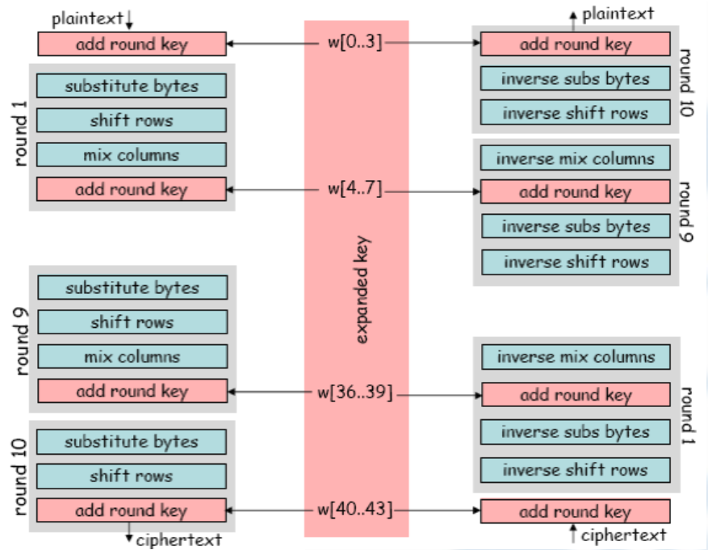
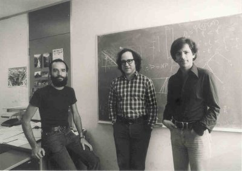
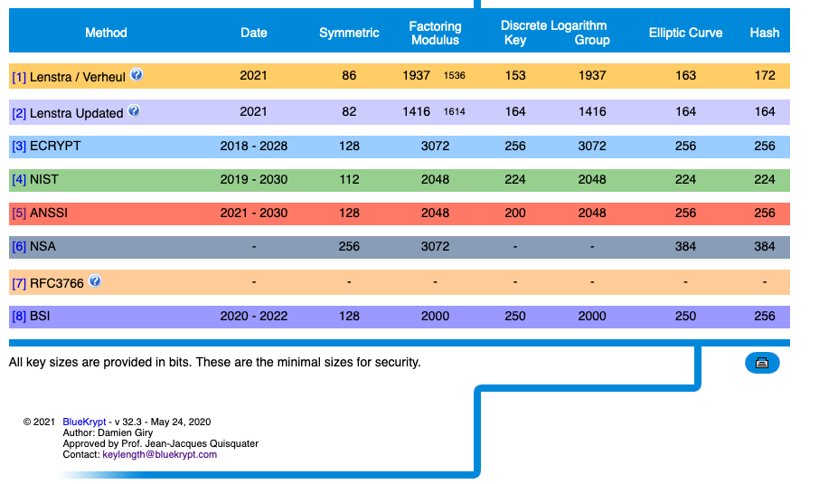

<style>
    /* You can add custom style here. VSCode supports this.
    Other editor might need these custom code in
    the YAML header: section: | */
	/* section header { display: none; } */
	/* section footer { display: none; } */
	section.a-story ul li {
 		list-style-type: none; text-align: center;
 	}
</style>

# Confidencialidad: sistemas de cifrado
<!-- _class: first-slide -->

**Seguridad computacional, cifrado asimétrico y cifrado asimétrico**

Juan Vera del Campo - <juan.vera@professor.universidadviu.com>

## Recordatorio: servicios de seguridad

- **Confidencialidad**: solo el legítimo destinatario debe poder ser capaz de leer el contenido del contrato o cualquier información asociada.
- **Integridad**: el destinatario debe ser capaz de verificar que el contenido del contrato no ha sido modificado por el camino... ni en el futuro
- **Autenticidad**: el destinatario debe ser capaz de verificar que el emisor es realmente el autor del contrato
- **No repudio**: nadie puede decir que ese no es el contrato que ha firmado

Hoy hablaremos del primero, confidencialidad, y empezaremos a poner las bases para los demás

# Hoy hablamos de...
<!-- _class: cool-list toc -->

1. [Confidencialidad perfecta y computacional](#5)
1. [Tipos de algoritmos de cifrado](#12)
1. [Cifrado simétrico de flujo: ChaCha](#16)
1. [Cifrado simétrico de bloque: AES](#24)
1. [Criptografía asimétrica o de clave pública](#40)
1. [Conclusiones](#63)

---
<!-- _class: with-info -->

Esta sesión es un resumen de la asignatura "Criptografía y teoría de códigos", donde desarrollamos los mismos conceptos en 4 ó 5 sesiones. Encontrarás aquí más detalles técnicos de cada tema:

- <https://juanvvc.github.io/crypto/02-historia.html>
- <https://juanvvc.github.io/crypto/03-simetrica.html>
- <https://juanvvc.github.io/crypto/04-complejidad.html>
- <https://juanvvc.github.io/crypto/05-asimetrica.html>

Este tema es denso pero no se pretende aprender los detalles. Objetivo de la sesión: saber qué son los sistemas de cifrado simétrico y asimétrico, por qué son necesarios los tipos y cuándo se usa cada uno. **Fíjate en estos cuadros azules**

# Confidencialidad perfecta y computacional
<!-- _class: lead -->

## Confidencialidad perfecta (perfect secrecy)
<!-- _class: with-info -->

Un sistema es perfectamente seguro **si y solo si** para cualquier distribución de probabilidad sobre el espacio de mensajes en claro, y para todos los mensajes en claro y para todos los textos cifrados posibles, la probabilidad condicionada de $m$ dado $c$ y la probabilidad de $m$ coinciden:

$$
P[m|c] = P[m]
$$

Ejemplos (explicaciones en el [tema 1](01-conceptos.html). ):

- "Atacaremos a las X"
- *One time pad*

Sistema con confidencialidad perfecta: un atacante no podría descifrarlo nunca, invierta el dinero que invierta e independientemente de por cuántos siglos lo intente

<!--
Desde que los matemáticos entraron en la criptografía, existe definiciones de todos los términos tan exactas y formales como incomprensibles para un profano. Esta definición matemática está puesta para mostraros que hay una teoría matemática detrás de todo lo que decimos, pero en este curso no entraremos en las matemáticas de la criptografía

-->

## La confidencialidad perfecta no es práctica

Tenemos confidencialidad perfecta **si y solo si** usamos un cifrado con clave tan larga como el mensaje y que no se vuelva a usar nunca jamás ("*one time pad*")

Actualmente preferimos sistemas:

- Que usen claves pequeñas
- Que nos permitan resusar la misma clave muchas veces

Es imposible con estos requitos crear un sistemas con confidencialidad perfecta, pero ¿puede ser lo suficientemente seguro? Hay que definir qué es "suficientemente seguro"

## Seguridad computacional (*computational secrecy*)
<!-- _class: with-info -->


Un sistema es seguro computacionalmente si cualquier algoritmo probabilístico en tiempo polinomial solo puede romper el algoritmo con probabilidad negligible en $\|n\|$

...aunque la tecnología mejora y quizá en el futuro sea más fácil

Con la seguridad computacional hay que definir el objetivo: "quiero un sistema criptográfico que mantenga este mensaje secreto durante los próximos 100 años"

Confidencialidad computacional: un atacante puede romper el cifrado, pero necesitará gastar una cantidad desproporcionada de recursos para el valor del mensaje

> Introducción más detallada y matemática: https://intensecrypto.org/public/lec_02_computational-security.html

<!-- Desde que los matemáticos entraron en la criptografía, existe definiciones de todos los términos tan exactas y formales como incomprensibles para un profano. Esta definición matemática está puesta para mostraros que hay una teoría matemática detrás de todo lo que decimos, pero en este curso no entraremos en las matemáticas de la criptografía

Lo importante es que relajamos el sistema lo suficiente como para que, por un tiempo determinado, ningún atacante con unos recursos razonables pueda descifrar el mensaje -->

---

La criptografía es una de las ramas más pesimistas de la ciencia. Asume la existencia de adversarios con capacidad ilimitada de ataque, los cuales pueden leer todos tus mensajes, generar información ilegítima o modificar tus claves aleatorias a su antojo.

Curiosamente, también es una de las ramas más optimistas, mostrando cómo incluso en el peor escenario inimaginable el poder de las matemáticas y la algoritmia puede sobreponerse a cualquier dificultad.

[Alfonso Muñoz, Evasión de antivirus y seguridad perimetral usando esteganografía, 2021](https://github.com/mindcrypt/libros/blob/master/Libro%20Estegomalware%20-%20Evasi%C3%B3n%20de%20antivirus%20y%20seguridad%20perimetral%20usando%20esteganograf%C3%ADa%20-%20Dr.%20Alfonso%20Munoz%20-%20mindcrypt%2028-10-2023.pdf)

## Ataques de fuerza bruta
<!-- _class: with-info -->

La criptografía computacionalmente segura permite tamaño de la clave mucho menores que el tamaño del mensaje $\|k\| \ll \|m\|$. Esto impone un compromiso:

- Es un cifrado práctico: la clave es fácil de distribuir
- Pero si es demasiado pequeña, es posible hacer fuerza bruta: probar todas las posibles claves una a una hasta que encontremos la que es

Hay que usar un espacio de claves lo suficientemente grande como para que no sea posible hacer fuerza bruta **hoy en día**, y lo suficientemente pequeño como para que sea práctico

<!-- Recordad: en el cifrado de one-time-pad del tipo "atacaremos a las X" no sabíamos si habíamos encontrado una clave porque, dado un mensaje cifrado, existe una clave que puede dar cualquier mensaje imaginable con la misma longitud que el original

Ahora no sucede así: si al descifrar por fuerza bruta encontramos algo con sentido, con gran probabilidad hemos encontrado la clave y el mensaje es el original

Recordad: los ordenadores mejoran constantemente.

Los algoritmos se diseñan para que, con la tecnología actual, se tarde miles de años en hacer fuerza bruta. Pero la tecnología mejora con el tiempo, y eso también se tiene en cuenta: aunque "se venda" que un cifrado "no puede romperse en miles de años", en realidad eso es relativo a la tecnología actual y el algoritmo tiene una caducidad de unas pocas décadas.

La mejor estrategia puede ser simplemente esperar 20 años para tener un ordenador que haga esa misma fuerza bruta de forma instantánea
-->


---
<!-- _class: with-success -->

- podemos probar $10^6$ clave/CPU/s $\approx 2^{20}$ clave/CPU/s
- ó $10^{13}$ clave/CPU/año $\approx 2^{43}$ clave/CPU/año
- ó $10^{19}$ clave/año con $10^6$ CPU $\approx 2^{63}$ clave/año
- ó $10^{25}$ claves con $10^6$ CPU un millón de años $\approx 2^{83}$ 
- ó $10^{29}$ claves con $10^6$ CPU desde el Big Bang $\approx 2^{96}$ 

(Números calculados en 2020). Cada año podremos probar más claves por segundo


**Fortaleza de un cifrado**: números de pruebas (en bits) que tiene que hacer un atacante para descifrar un mensaje


<!-- algunos sistemas necesitan claves mucho más largas que la media de claves que tiene que probar un atacante para descifrarlos. Esto sucede en los sistemas asimétricos, por ejemplo. La fortaleza en estos sistemas es menor que la longitud de la clave -->

# Tipos de algoritmos de cifrado
<!-- _class: lead-->

## Criptografía simétrica o de clave secreta (SKC)
<!-- _class: two-columns -->


- Usa la misma clave para cifrar que para descifrar
- Ambas partes tienen que conocer la clave
- Rapido y sencillo
- Ejemplos actuales: AES, ChaCha
- Ejemplos rotos y obsoletos: RC4, DES, TDES


## Criptografía asimétrica / clave pública (PKC)
<!-- _class: two-columns -->


- Existe una clave para cifrar, y una clave diferente para descifrar
- Normalmente, una de las dos claves es pública (todos la conocen)
- Problema:
    - No supimos cómo hacerla hasta los años 70
    - Es lenta y compleja
- Usos: autenticación, firma digital, intercambio de claves simétricas

---


<!--
Estos son los algoritmos de seguridad computacional que utilizamos

Esta sesión estudiaremos las dos primeras ramas: clave pública y clave secreta. Observa que las algoritmos de cifrado de clave secreta/simétrica se dividen a su vez en bloque y flujo

La próxima sesión estudiaremos los algoritmos de hash
-->


# Cifrado simétrico de flujo: ChaCha
<!-- _class: lead -->


## Criptografía simétrica: tipos

Flujo|Bloque
--|--
Cifra un stream continúo de datos|Divide los datos en bloques, que se cifran separadamente
Más rápido|Más lento (a menos que exista ayuda del hardware)
Fácil de programar: pequeños dispositivos|Más complejo
Implementado en software|Implementado en hardware
RC4, **ChaCha20**|3DES, **AES**

<!--
Nosotros veremos en detalle los algoritmos ChaCha20 y AES, que los dos más utilizados actualmente

- **Cifrado de flujo**. Heredero de "la idea" *one-time-pad*: el mensaje llega como un flujo de bytes que se cifra según va llegando.
- **Cifrado de bloque**. Heredero de "la tradición" Vigenère: el mensaje se divide en bloques que se cifran por separado

-->

## Cifrado de flujo

Basado en los bloques de una solo uso (*one-time-pad*)

Idea: crea una clave tan larga como el mensaje:

$$
\|k_{\text{generada}}\| = \|m\|
$$

...a partir de una clave $k$ de longitud corta...

$$
k \overset{PRNG}{\longrightarrow} k_{\text{generada}}
$$

para después hacer:

$$
c = k_{\text{generada}} \oplus m
$$


<!--
PRNG: *Pseudo Random Number Generator* es un generador de bits que tiene como entrada una **semilla** (que será la clave de cifrado $k$) y tiene como salida el flujo de bits que aplicaremos sobre el mensaje para cifrarlo con *XOR*

La velocidad del cifrado depende totalmente de la velocidad del PRNG, porque el XOR es instantáneo
 -->
 
 ---


La seguridad del cifrado depende del generador PRNG utilizado...

...**y de que nunca se envíen dos mensajes cifrados con la misma clave**

(vamos a repetir esto muchas veces en el curso)

[Lorenz SZ](https://en.wikipedia.org/wiki/Lorenz_cipher#Cryptanalysis) fue una máquina alemana de cifrado de flujo, rota porque un operador envió dos mensajes diferentes seguidos sin cambiar la clave.

## *Nonce*: *number used only once*

Para evitar enviar dos mensajes con la misma clave, podemos usar una contador que se añade a la clave

SESAMO_1, SESAMO_2, SESAMO_3...

El contador va a ser conocido por el atancante, pero  **¡esto es correcto!**: la seguridad que añade el uso de un contador contrarrestra la pérdida de seguridad porque el atacante lo conozca


Este elemento se conoce como *nonce* y forma parte de muchos algoritmos criptográficos


## ChaCha
<!-- _class: with-info -->

Cifrado de flujo, derivado del Salsa20 y probablemente la única alternativa al AES en TLS 1.3

- Tamaño de clave: $\|k\|=256\ bits$
- Usa un $\|nonce\|=64\ bits$


ChaCha es el algoritmo de cifrado simétrico de flujo más usado


<!--

**Nota**: hasta hace poco, un buen algoritmo PRNG no es sencillo de hacer, o no es rápido. Hasta la aparición de Salsa20, la falta de buenos algoritmos PRNG hacían preferir el cifrado simétrico de bloque que veremos en un momento.

-->

---

```c
#define ROTL(a,b) (((a) << (b)) | ((a) >> (32 - (b))))
#define QR(a, b, c, d) (			\
	a += b,  d ^= a,  d = ROTL(d,16),	\
	c += d,  b ^= c,  b = ROTL(b,12),	\
	a += b,  d ^= a,  d = ROTL(d, 8),	\
	c += d,  b ^= c,  b = ROTL(b, 7))
#define ROUNDS 20
 
void chacha_block(uint32_t out[16], uint32_t const in[16])
{
	int i;
	uint32_t x[16];

	for (i = 0; i < 16; ++i)	
		x[i] = in[i];
	// 10 loops × 2 rounds/loop = 20 rounds
	for (i = 0; i < ROUNDS; i += 2) {
		// Odd round
		QR(x[0], x[4], x[ 8], x[12]); // column 0
		QR(x[1], x[5], x[ 9], x[13]); // column 1
		QR(x[2], x[6], x[10], x[14]); // column 2
		QR(x[3], x[7], x[11], x[15]); // column 3
		// Even round
		QR(x[0], x[5], x[10], x[15]); // diagonal 1 (main diagonal)
		QR(x[1], x[6], x[11], x[12]); // diagonal 2
		QR(x[2], x[7], x[ 8], x[13]); // diagonal 3
		QR(x[3], x[4], x[ 9], x[14]); // diagonal 4
	}
	for (i = 0; i < 16; ++i)
		out[i] = x[i] + in[i];
}
```

> Fuente: [Wikipedia](https://en.wikipedia.org/wiki/Salsa20#ChaCha_variant))

<!-- ChaCha es tan sencillo que podemos meterlo en una sola página -->

## Variantes de ChaCha

... la comunidad aún no está segura de cómo usarlo ...

Nonce length|Description|Max data|If random nonce and same key
--|--|--|--
8 bytes (default)|The original ChaCha20 designed by Bernstein.|No limitations|Max 200 000 mensajes, el contador limita
12 bytes|The TLS ChaCha20 as defined in RFC7539.|256 GB|Max 13 billions messages
24 bytes|XChaCha20, still in draft stage.|256 GB|No limitations

> [The Salsa20 family of stream ciphers](https://cr.yp.to/snuffle/salsafamily-20071225.pdf), Daniel J. Bernstein, 2007

# Cifrado simétrico de bloque: AES
<!-- _class: lead -->

Y sus "modos" de cifrado

## Cifrado de bloque
<!-- _class: with-info -->

Alternativa al cifrado de flujo: cortar el texto en claro en bloques de la misma longitud de la clave y cifrar cada uno de los bloques


El cifrado de bloque es el muy utilizado: es rápido, no necesita exigentes o lentos algoritmos PRNG y ya tenemos hardware especializado en su cifrado/descifrado

<!--
Nota importante: la figura muestra un cifrado de bloque totalmente inseguro, como veremos en un momento

Fíjate: los bloques no tienen memoria, al contrario de lo que pasaba en el cifrado de flujo. Veremos que esto es una de sus debilidades.
-->

## Modos de operación
<!-- _class: with-warning -->

Los cifrados de bloque se organizan como "modos de operación": como ordenamos las cajas de cifrados y descifrados. Tener modos permite paralelizar el cifrado/descifrado, o añadir autenticación, o protegerse ante ciertos ataques, o resistir canales ruidosos...

En la imagen, modo GCM


Además de escoger un cifrado de bloque, hay que decidir cómo organizamos los bloques: modos. Cada modo de operación tiene ventajas y desventajas según para qué queremos usar el sistema

## Ejemplo: modo ECB (Electronic Code-Book)


---
<!-- _class: center with-info -->

Fallo obvio: está usando la misma clave para cifrar mensajes diferentes.

**Eso nunca se puede hacer.**

 

No se debe usar un cifrado de bloque en modo ECB

## Ejemplo: modo CBC (Cipher Block Chaining)


## Ejemplo: modo OFB (Output Feedback)


## Ejemplo: modo CTR (Counter)


## Vector de Inicialización (IV)

Los distintos encadenados requieren de una semilla inicial para empezar el encadenado: vector de inicialización (IV), que cumple la misma función que un *nonce*

Se envía al principio de la comunicación así que los atacantes pueden conocer el IV

Esto hace que en lugar de transmitir $n$ bloques como en ECB, haga falta transmitir $n+1$

- IV en CBC: es el hipotético bloque cifrado $−1$
- IV en OFB: es el bloque que se cifra constantmente $e(e(e(...e(IV))))$ y se aplica sobre los bloques en claro (con $\otimes$)
- IV en CTR: es el valor inicial del contador que se cifra ECB, y se aplica sobre los bloques en claro (con $\otimes$)

`AES_128_CTR` es efectivamente un cifrado de flujo, siendo $k$ la semilla, y el IV el *nonce*

## Cómo escoger el modo adecuado

- Rápido para descifrar, no tanto para cifrar: CBC
- Simula un "cifrado de flujo": CTR, OFB, CFB
- Cifrados de discos: XEX, XTS (bitlocker)
- Con autenticación de mensajes: GCM (quizá el más usado en la actualidad), OCB


Ahora veremos con más detalle cada una de esas cajas de cifrado: AES

> https://stackoverflow.com/questions/1220751/how-to-choose-an-aes-encryption-mode-cbc-ecb-ctr-ocb-cfb

## Advanced Encryption System (AES)

Desarrollado por Vincent Rijmen y Joan Daemen (aka: Rijndael), que ganaron el concurso celebrado por el NIST para sustituir a DES en 2001.

[AES (FIPS 197, 2001)](https://nvlpubs.nist.gov/nistpubs/FIPS/NIST.FIPS.197.pdf) es un cifrado de bloque:

- longitud de bloque: 128 bits (16 Bytes)
- longitud de clave: 128, 192 ó 256 bits


> background: https://whatsupcourtney.com/wp-content/uploads/2017/10/Things-to-do-in-Leuven-52-e1560945504897.jpeg

<!--
AES fue desarrollado por Vincent Rijmen y Joan Daemen en el COSIC de la KU Leuven, Bélgica.

Es totalmente ubicuo en la seguridad actual: se usa para todo, en todos lados. ChaCha20 es el único algoritmo que puee hacerle sombra.

Hay hardware especializado en cifrar y descifrar AES, entre ellas las CPUs de computadora de sobremesa.
-->

## Algoritmo de "cada caja" AES



No es tan sencillo como ChaCha...

## Comparación flujo y bloque
<!-- _class: center -->

 
Flujo|Bloque
--|--
Más rápido|Más lento (a menos que exista ayuda del hardware)
Fácil de programar: pequeños dispositivos|Más complejo
Implementado en software|Implementado en hardware, mucho soporte ya desplegado
RC4, **ChaCha20**|3DES, **AES**

## Tamaños recomendados de clave para impedir fuerza bruta


Tamaños recomendados de clave en bits según varios institutos internacionales. Nota: NIST y NSA son de EEUU, ECRYPT de Europa

> OFuente: <https://www.keylength.com/en/compare/>


## Problema del cifrado simétrico


El cifrados de flujo (ej. ChaCha) y de bloque  (ej. AES) permiten enviar mensajes computacionalmente seguros

Solo necesitamos que las dos partes tenga una clave secreta en común

¿Cómo conseguimos que las dos personas que no se han visto nunca tengan una clave secreta común?

<!--
Parecería que con lo que conocemos ya hemos resuelto el problema de comunicar dos personas de forma secreta

Pero en realidad tenemos un "elefante en la habitación": ¿cómo se intercambian una clave de forma segura dos personas que no han hablado nunca antes, ni tienen otra forma de comunicació que Internet?

Este es el problema de intercambio de clave. No fue resuelto hasta 1976 con una serie de conceptos completamente nuevos: cada persona tiene dos claves, una pública conocida por todo el mundo y otra privada y secreta. El algoritmo inventado en 1976 se llama Diffie-Hellman, y aún lo estamos utilizando.

Antes de empezar necesitaremos un poco de teoría de complejidad. Vamos allá.
-->

---

El protocolo de intercambio de claves Diffie-Hellman permitió por primera vez en la historia que dos personas cualquiera que no se conocían mantuviesen una conversación confidencial por medios dgitales...

...pero su artículo no se llamó "Solución al problema de intercambio de claves". Tenía un título mucho más ambicioso: [Nuevas direcciones en la criptografía](https://citeseerx.ist.psu.edu/viewdoc/summary?doi=10.1.1.37.9720)

¿Qué direcciones eran esas?


> Foto: https://www.publicdomainpictures.net/en/view-image.php?image=363738&picture=signpost-giving-directions (CC0)

# Criptografía asimétrica o de clave pública
<!-- _class: lead -->

Diffie-Hellman, RSA y curvas elípticas

## Criptografía asimétrica

También conocida como **criptografía de clave pública**


Cada persona tiene dos claves:

- $pk$: clave pública, todos la conocen
- $sk$: clave secreta, **nadie más la conoce**

A veces son intercambiables: lo que se cifra con una se descifra con la otra

> Compara con criptografía simétrica: misma clave para cifrar y descifrar, Bob y Alice tienen que manetenarla en secreto

## Usos de la criptografía asimétrica
<!-- _class: with-success -->

Según si usamos la clave pública o la privada para cifrar, podemos hacer dos cosas:

- acuerdo de la clave secreta a usar por un algoritmo simétrico
- cifrar mensajes --> servicio de confidencialidad
- firmar digitalmente mensajes --> servicio de autenticación

Ejemplos: RSA, Diffie-Hellman, DSA...

La criptografía simétrica también nos permitía cifrar, pero no firmar

No supimos cómo conseguir criptografía simétrica hasta 1976

## Esquema de cifrado


- Todos conocen la clave $K_{pub}$ de Bob, solo Bob conoce la clave $K_{priv}$
- **Cualquier puede cifrar un mensaje para Bob, solo Bob puede descifrarlo**: confidencialidad

## Esquema de firma electrónica


- Solo Bob puede cifrar con su clave $K_{priv}$ y cualquier puede descifrar con $K_{pub}$
- Pero si pueden descifrar el mensaje, **todos saben que el mensaje solo puede haberlo enviado Bob: autenticación**

## ¿En qué se base la criptografía simétrica?

Funciones "trampa": son problemas difíciles de resolver, excepto si conoces "un atajo" (que será la clave privada)

Ejemplos:

- Factorización de números primos
- Problema del logaritmo discreto
- Curvas elípticas

## Problema del Logaritmo Discreto
<!-- _class: a-story -->

Resuelve la $x$:

- $$2^x = 1024$$
* $$x = \log_2(1024) = 10$$
* Eso es fácil y se puede extender a cualquier problema similar:
* Si te dan $n$ y $N$ y te preguntan $n^x=N$...
* $x = \log_n N$

> Para más detalles de este problema, consulta [Tema de complejidad](../04-complejidad.html)

---
<!-- _class: a-story -->

¿Qué sucede si metemos la operación módulo?

Resuelve la $x$:

- $2^x \mod 19 = 13$
* Ten en cuenta: $0 \le x \lt 19$. Puedes probar los números uno a uno
* Solución: $x = 5$
* Si no has podido resolverlo, no es porque no tengas suficientes conocimientos... es que no sabemos hacerlo rápidamente: [Problema del Logaritmo Discreto](https://es.wikipedia.org/wiki/Logaritmo_discreto) (DLP)
* ...pero calcular  $2^5 \mod 19 = 13$ es rápido
* El DLP es una *trap door function*

<!--
en realidad no sabemos si el DLP es difícil: solo lo sospechamos muy fuertemente
-->

## Protocolo Diffie-Hellman: intercambio de claves simétricas

Utilizado para acordar una clave simétrica entres dos personas antes de las comunicaciones

Idea básica:

1. Bob envía a Alice una parte de la clave simétrica que usarán, cifrándola con la clave pública de Alice.
1. Alice envía a Bob una parte de la clave simétrica que usarán, cifrándola con la clave pública de Bob.
1. La clave final es la combinación de ambas partes, que solo las conocen Alice y Bob

---
<!-- _class: smaller-font -->

Dos usuarios $Alice$ y $Bob$ que no se han visto nunca:

1. Acuerdan $g$ y $p$ primos entre sí
1. Escogen números en secreto $a$ y $b$
1. Se envían entre ellos:
    - $Alice \rightarrow Bob: A=g^{a} \mod p$
    - $Bob \rightarrow Alice: B=g^{b} \mod p$
1. Calculan en secreto:
    - $Alice$: $s = B^{a} \mod p = g^{ab} \mod p$
    - $Bob$: $s = A^{b} \mod p = g^{ab} \mod p$
1. Y usan $s$ como clave de cifrado un algoritmo simétrico  


**Observa**: para que un atacante que solo conoce $g$, $p$, $A$ y $B$ (claves públicas) pueda calcular $s=A^b$, tiene que resolver $B=g^b \mod p$, que se supone difícil

## Claves secretas y claves públicas
<!-- _class: with-info -->

Paso 1 |Qué sabe Alice|Qué sabe Bob|Qué es público
--|--|--|--
1|$g$, $p$|$g$, $p$|$g$, $p$
2|$a$, $g^a$|$b$, $g^b$|
3|$g^b$|$g^a$|$g^a$, $g^b$
4|$g^{ab}$|$g^{ab}$|

Alice y Bob, que no se habían visto nunca antes, puede utilizar $s=g^{ab}$ como clave de un cifrado simétrico de flujo o bloque como ChaCha20 ó AES

## Nuevas direcciones

El DLP, en la versión D-H de 1976, no una solución completa: permite hacer acuerdo de claves, pero no cifrado

En pocos años aparecieron nuevas funciones basadas en esas ideas: **RSA**, ElGammal, DSA, Pailier...

Luego, las soluciones se refinaron con curvas elípticas: ECDH (*Elliptic Curves Diffie-Hellman*), ECDSA (*Elliptic Curves DSA*)...

## RSA: claves públicas y privadas



Fue el primer método de cifrado conocido que usaba claves públicas y privadas

Sigue usándose en la actualidad

[A method for obtaining digital signatures and public-key cryptosystems](https://citeseerx.ist.psu.edu/viewdoc/summary?doi=10.1.1.607.2677), Ron **R**ivest, Adi **S**hamir, Leonard **A**dleman, 1978

Está basado en la dificultad en factorizar números grandes

> Background: https://hsto.org/getpro/habr/post_images/453/10e/602/45310e602d784a489301bf1996edef68.jpg

<!--
Fundaron la empresa RSA Security LLC, que sigue siendo uno de los mayores proveedores de seguridad del mundo

- Hablamos de Ron Rivest en el tema 3, creador de RC4
- Adi Shamir hizo más aportaciones fundamentales a la criptografía
- Leonard Adleman ha seguido investigando en teoría de la complejidad
-->

## El protocolo RSA: generación de par de claves
<!-- _class: smaller-font -->

1. Escoge dos números $p$, $q$ primos
1. Calcula: $n = pq$. Su número de bits es el **tamaño de clave**
1. Calcula:
    - Protocolo original: $\phi = (p-1)(q-1)$
    - Versión moderna: $\phi = mcm(p-1, q-1)$
1. Escoge al azar $e \lt \phi$ que sea coprimo de $\phi$ (sin factores en común)
1. Calcula: $d = e^{-1} \mod \phi$
1. Claves:
    - $sk=\{d, n\}$
    - $pk=\{e, n\}$
1. Se descartan $p$, $q$, $\phi$


## El protocolo: cifrado y descifrado

Cifrado: Para enviar un mensaje a Alice, obtengo su clave pública $pk_A=\{e, n\}$ y calculo:

$$c=m^e \mod n$$

Descifrado: Alice utiliza su clave privada $sk_A=\{d, n\}$

$$m'=c^d \mod n$$

## Velocidad de proceso
<!-- _class: with-info -->

Para crear el par de claves hay que buscar:

- números muy grandes que sean primos (y otras condiciones): $p$ y $q$
- número muy grande $e$ que sea coprimo de $pq$
- inversos de un número entero: $d=e^{-1} \mod \phi$

Es decir: la elección de un par de claves **es un proceso muy lento**. Segundos, minutos, horas si las claves son grandes

A cambio: el cifrado y descifrado **son relativamente rápidos** comparados con otros sistemas de cifrado asimétrico

El cifrado asimétrico es muy lento comparado con cualquier proceso de cifrado simétrico

## Tamaño de claves
<!-- _class: with-info -->


Hemos visto que tanto Diffie-Hellman como RSA necesitan números primos

Los números primos están muy separados entre sí: el número de primos menores que $N$ es $\approx \ln(N)$

Ejemplo: hay $\approx\ln(2^{4096})=2839$ números primos menores de $2^{4096}$

"Son pocos primos"

La criptografía asimétrica necesita claves mucho más largas que la criptografía simétrica

> Fuente: https://en.wikipedia.org/wiki/Prime_number_theorem
> Gráfico: https://en.wikipedia.org/wiki/Ulam_spiral

## Curvas elípticas
<!-- _class: with-info -->

Propuestas como *trap door function* en 1987 por Neal Koblitz y Victor S. Miller de forma independiente

- **Ventaja**: necesitan menos proceso y memoria, se pueden implementar en máquinas pequeñas: móviles, tarjetas inteligentes...
- **Problema**: teoría matemática compleja


Necesitan claves **más cortas** que la criptografía asimétrica basadas en DLP o RSAP para ofrecer una **seguridad equivalente**

## Tamaño de clave
<!-- _class: smaller-font -->

Simétrica|RSA|D-H ($p$, $q$)|Curvas elípticas
--|--|--|--
80|1024|1024, 160|160
128|3072|3072, 224|256
192|7680|7680, 384|384
256|15360|15360, 512|512

Es decir: para intercambiar una clave AES-256 aprovechando todos sus bits, necesitamos claves RSA de 15360 bits

Si usamos tamaños de clave RSA de 4096 bits (tamaño típico), podremos intercambiar una clave simétrica equivalente a AES-128

La gran ventaja de las curvas elípticas en criptografía (EEC) es que nos permiten utilizar criptografía asimétrica con una clave **mucho más pequeña** y pone la criptografía asimétrica al alcance de pequeños dispositivos

<!--
Nota: podemos intercambiar claves AES-256 con un D-H de 1024 bits. Solo que, de forma efectiva, solo estaremos escogiendo 80 bits de la clave AES-256. Es decir, sería equivalente a un (no existente) AES-80

A cambio, las curvas elípticas son más complejas de entender y programar pero eso como usuarios no es algo que importe

-->

---



NOTA: RSA está basado en "factorización", DSA y D-H en "logaritmo discreto"

> https://www.keylength.com/en/compare/

## Adaptación a curvas elípticas

Varios algoritmos clásicos se han adaptado a curvas elípticas:

- DH (Diffie-Hellman) -> Elliptic Curces Diffie-Hellman (ECDH)
- DSA (similar a RSA, no lo hemos visto en esa sesión) -> ECDSA
- RSA no se ha adaptado a curvas elípticas

## Usos de la criptografía asimétrica

¿Por qué no la usamos para todo?

- Es mucho más lenta que la ciptografía de clave privada como AES/ChaCha
- Solo permite cifrar textos muy cortos

Pero tiene otras ventajas:

- Es la única que nos permite firmas digitales
- A través de las firmas podemos autenticar a la otra parte

## Criptografía híbrida: lo mejor de los dos mundos

1. Usamos criptografía asimétrica para intercambiar una clave: ECDH
1. Una vez que tenemos la clave, seguimos cifrando en AES ó ChaCha

# Conclusiones
<!-- _class: lead -->

---

Característica|Cifrado simétrico|Cifrado asimétrico
--|--|--
Eficiencia|Muy rápido|Lento
Claves|1 (secreta, compartida)|2 (una pública y otra privada)
Tamaño de clave|256 bits|15360 bits (RSA), 512 bits (curvas elípticas)
Servicios|Confidencialidad|Autenticación, integridad, intercambio de claves simétricas (Diffie-Hellman)
Ejemplos|AES, ChaCha|RSA, ECDSA, ECDH

<!--
ECDSA: Elliptic Curve DSA
ECDH: Elliptic Curve Diffie-Hellman
-->
 
## Resumen
<!-- _class: smaller-font -->

- Confidencialidad computacional: hoy en día no es práctico romperla (en 30 años, quizá sí)
- Fortaleza de un algoritmo: "esfuerzo" necesario para romper un sistema. Relacionado con la longitud de la clave.
- Cifrados simétricos: misma clave para cifrar y descifrar
	- Cifrado de flujo:
		- A partir de una clave corta, generamos un flujo "pseudoaleatorio" tan largo como el mensaje. cifrado y descifrado=`RANDOM XOR MENSAJE`.
		- Ejemplos: RC4 (antiguo), ChaCha20
	- Cifrado de bloque:
		- Se divide el mensaje en bloques, cada bloque se cifra por separado.
		- Es necesario utilizar el modo de funcionamiento adecuado
        - Ejemplos: 3DES (no se usa en protocolos modernos), AES
- Es necesario evitar cifrar dos mensajes diferentes con la misma clave

---

- Criptografía asimétrica: cada persona tiene dos claves, una para cifrar y otra para descifrar. Una de esas claves es pública (es decir, cualquiera puede conocer la clave pública de otra persona) y la otra es secreta
- Muchísimo **más lenta** que el cifrado simétrico
- Se utiliza para:
    - intercambiar claves simétricas (ECDH)
    - firmado e identidad digital (RSA, ECDSA)
- Ejemplos clásicos: RSA, DSA, D-H. Están basados en el problema de la factorización de números primos y logaritmo discreto. Necesitan tamaños de clave grandes y eso dificulta su implementación
- Las curvas elípticas (EC) permite claves mucho más pequeñas = más rápidos
- Ejemplos modernos: ECDH, ECDSA, que son adaptaciones de D-H y DSA sobre curvas elípticas

## Referencias

- [The Salsa20 family of stream cipher](https://cr.yp.to/snuffle/salsafamily-20071225.pdf), Daniel J. Bernstein, 2017
- [Block Cipher Techniques](https://csrc.nist.gov/projects/block-cipher-techniques), NIST
- [Recommendation for Key Establishment Using Symmetric Block Ciphers](https://csrc.nist.gov/CSRC/media/Publications/sp/800-71/draft/documents/sp800-71-draft.pdf), NIST 800-71, 2018
- [Algorithms, key size and parameters report 2014](https://www.enisa.europa.eu/publications/algorithms-key-size-and-parameters-report-2014), ENISA, 2014

---

- [Nuevas direcciones en la criptografía](https://citeseerx.ist.psu.edu/viewdoc/summary?doi=10.1.1.37.9720) Whitfield Diffie y Martin Hellman, 1976
- [Asymmetric Encryption - Simply explained](https://www.youtube.com/watch?v=AQDCe585Lnc)
- [Diffie-Hellman Key Exchange explained (Python)](https://medium.com/@sadatnazrul/diffie-hellman-key-exchange-explained-python-8d67c378701c)

Las curvas elípticas son un concepto complejo. Esto son algunas propuestas explicativas:

- [¿Por qué pueden utilizarse las curvas elípticas para cifrar?](https://www.youtube.com/watch?v=vi2wvAQsy-A), píldoras CriptoRED
- [Elliptic Curve Cryptography Overview](https://www.youtube.com/watch?v=dCvB-mhkT0w), de John Wagnon. No asume conocimientos de álgebra.
- [Elliptic Curve Diffie Hellman](https://www.youtube.com/watch?v=F3zzNa42-tQ): Vídeo sobre ECDH y curvas elípticas en general de Robert Pierce. Asume conocimientos de álgebra.

# ¡Gracias!
<!-- _class: last-slide -->
