

# Casos prácticos (2 sesiones)
<!-- _class: first-slide -->

Juan Vera del Campo - <juan.vera@professor.universidadviu.com>

# Hoy hablamos de...
<!-- _class: cool-list toc -->

1. [Cifrado de discos](#3)
1. [Business Email Compromise](#5)
1. [Bambu Labs](#7)
1. [Supernote](#27)

# Cifrado de discos
<!-- _class: lead -->

---

Visita: [Cifrado de discos](../14-disk.html)

¡Luego volveremos aquí!

# Business Email Compromise
<!-- _class: lead -->

---

Visita: [Business Email Compromise](../13-bec.html)

¡Luego volveremos aquí!

# Bambu Labs
<!-- _class: lead -->

## Impresoras 3D

Existen varias marcas: Anycubic, Elegoo, Bambu...

Vamos ver un caso que sucedió en Enero de 2025 con BambuLabs

---

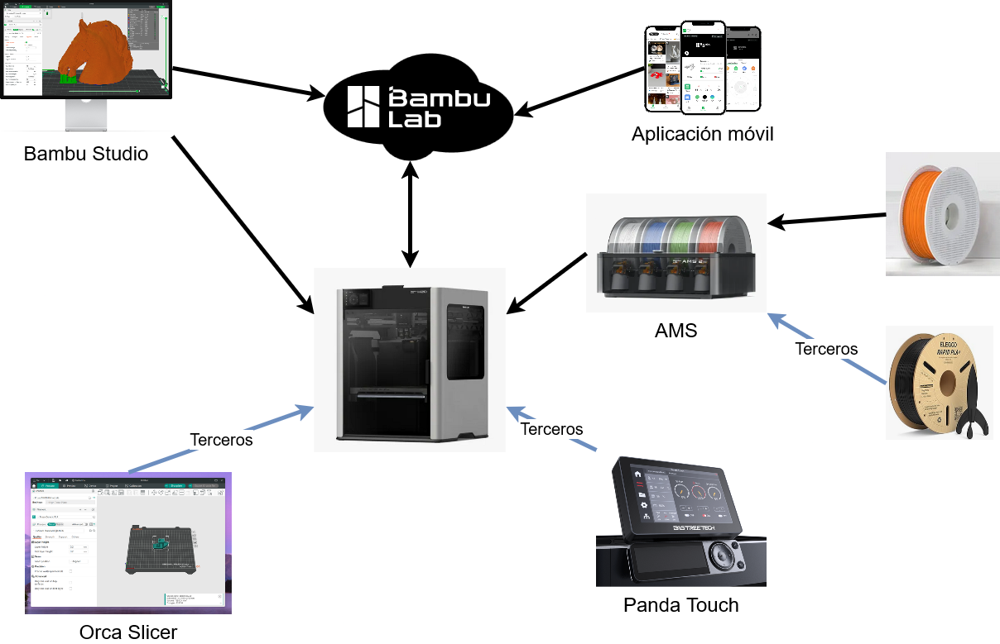

<!--

Puedes conectar a la la impresora:

- Con Studio desde red local
- Con Studio desde la nube
- Con la aplicación móvil
- Con la interfaz táctil de Bambu
- Gestor de filamento AMS
    - Con filamento marca Bambu
    - Con filamento de terceros
- De terceros:
    - Interfaz táctil extra
    - Aplicaciones extra

-->

## Actualización de seguridad enero de 2025

*As part of our ongoing commitment to enhance the overall security of our products, we are introducing an authorization and authentication protection mechanism for the connection and control of Bambu Lab 3D printers. This step is a significant security enhancement to ensure only authorized access and operations are permitted.*

*This change is mitigating any risk of [remote hacks](https://www.bitdefender.com/en-au/blog/hotforsecurity/someone-is-hacking-3d-printers-to-warn-owners-of-a-security-flaw) or [printer exposure issues](https://www.csoonline.com/article/566223/over-3700-exposed-3d-printers-open-to-remote-attackers.html) that have happened in the past and also lower the risk of [abnormal traffic or attacks](https://wiki.bambulab.com/en/security-incidents-cloud-traffic)* 

> [Firmware Update Introducing New Authorization Control System](https://blog.bambulab.com/firmware-update-introducing-new-authorization-control-system-2/)

---

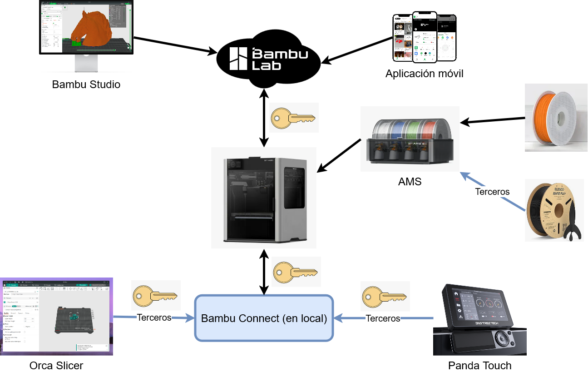

Fíjate: se añade autenticación mediante firma digital en todas las conexiones

## El anuncio provocó "una revuelta" en la comunidad

- 16 de enero de 2025: [Anuncio inicial de Bambu](https://blog.bambulab.com/firmware-update-introducing-new-authorization-control-system-2/)
    - Actualización de firmware que exigirá control de acceso mediante firma gitial para el uso de la impresora
- 17 de enero: [Why you should care about Bambu Labs removing third-party printer access, and what you can do about it ](https://www.reddit.com/r/BambuLab/comments/1i3gq1t/why_you_should_care_about_bambu_labs_removing/)
    - Llamadas a "boicot" / "desactiva actualizaciones" / "este es el primero paso hacia el modelo de impresión en papel de HP"
- 20 de enero, [respuesta de Bambu](https://blog.bambulab.com/updates-and-third-party-integration-with-bambu-connect/)
    - Posibilidad de uso de un "developer mode" que desactiva la seguridad de las impresoras 

---

- Bambu dice que quiere evitar:
    - Que no se pueda imprimir sin autorización: Access Control
    - "Hackeos": que se pueda usar la impresora como medio de acceso a una red
    - [Dar soporte de seguridad a granjas comerciales](https://blog.zaxe.com/how-to-start-and-maintain-a-3d-printing-farm/)
    - Uso excesivo de su propia cloud
- Los usuarios temen:
    - "Bambu quiere que todo pase por sus servidores"
    - Bambu quiere evitar que se use filamento / software / interfaces de terceros
    - ¿Se puede imprimir sin conexión a Internet?

## Problemas
<!-- _class: with-warning -->

1. La importancia de la comunicación en seguridad
1. ¿Realmente es necesario?
1. ¿Cómo se actualiza un hardware?
1. ¿Realmente es una solución?

No te quedes en el detalle de impresoras 3D. Todos estos problemas se pueden aplicar también a otros escenarios

## La importancia de la comunicación en seguridad

O cómo tener un problema reputacional cuando intentas solucionar un problema de seguridad

- Los usuarios no perciben que sea una necesidad... incluso persiben que están perdiendo funcionalidad
- No hubo comunicación previa con terceros afectados: [Panda](https://biqu3d.com/blogs/news/pandas-love-bamboo), [Orca](https://github.com/SoftFever/OrcaSlicer/pull/8103#issuecomment-2612855023)
- Comunicación definiciente: [Bambu's Gaslighting Masterclass: Denying their own documented restrictions ](https://www.youtube.com/watch?v=W6MybDJfmmY)

---

Los equipos de seguridad necesitamos comunicar conceptos complejos a gente que no tiene ningún interés en ellos

- Cómo "vender" algo que el cliente no ha pedido
- Empatía
- Comunicación efectiva de qué ha sucedido y por qué
- Comunicar sin alarmar
- Dificultades añadidas en entornos internacionales

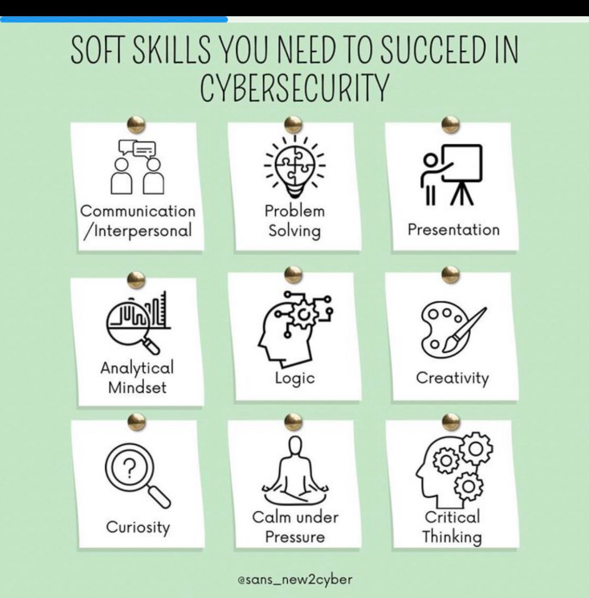

> [The myth of "soft skills": Why intelligence teams need strong communicators](https://redcanary.com/blog/threat-intelligence/strong-communicators/)
> [The Essential Soft Skills that Cybersecurity Professionals Need to Succeed](https://www.eccu.edu/blog/cybersecurity/soft-skills-cybersecurity-professionals/   )
> [Essential Soft Skills in Cyber Security for Beginners](https://www.institutedata.com/blog/essential-soft-skills-in-cyber-security/)

## ¿Reamente es necesario?

[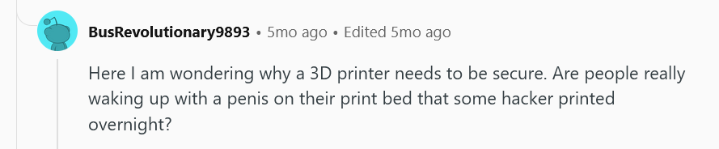](https://www.reddit.com/r/BambuLab/comments/1i3euzi/comment/m7m6ar2/)

---

- La seguridad de tu casa / oficina es tan fuerte como el eslabón más débil
- Peligro de [movimiento lateral](https://www.crowdstrike.com/en-us/cybersecurity-101/cyberattacks/lateral-movement/)
- Riesgo de [redes de bots](https://www.a10networks.com/glossary/what-is-a-botnet-iot-botnet/)
- [Consumo excesivo de recursos](https://wiki.bambulab.com/en/security-incidents-cloud-traffic)
- Problemas de reputación de Bambu por hardware / software de terceros
- Necesidad de sistemas robustos para controlar [granjas de impresión](https://www.reddit.com/r/BambuLab/comments/1an244o/i_was_told_you_guys_might_think_my_bambu_farm_is/)
- [Ya](https://www.bitdefender.com/en-au/blog/hotforsecurity/someone-is-hacking-3d-printers-to-warn-owners-of-a-security-flaw) [ha](https://www.csoonline.com/article/566223/over-3700-exposed-3d-printers-open-to-remote-attackers.html?ref=blog.bambulab.com) [pasado](https://wiki.bambulab.com/en/security-incidents-cloud-traffic)

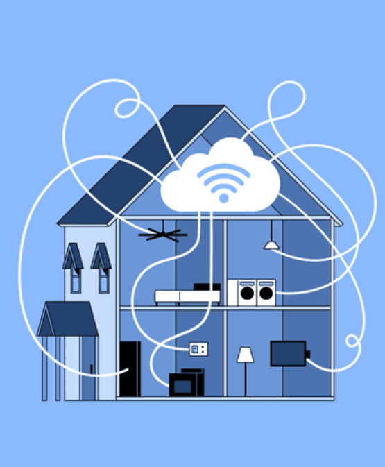

> background: https://www.investopedia.com/terms/s/smart-home.asp

## ¿Cómo se actualiza un hardware?

**Problema**: ecosistemas con muchos dispositivos diseñados para durar décadas: [IoT](https://es.wikipedia.org/wiki/Internet_de_las_cosas), pero también redes [SCADA](https://es.wikipedia.org/wiki/SCADA) e [infrastructuras críticas](https://es.wikipedia.org/wiki/Infraestructura_cr%C3%ADtica)   

**Problema**: ¿cómo evitar que un atacante "actualizar" un dispositivo (luz de iluminación / router / impresora...) con un firmware comprometido?

**Solución**: firma digital de las actualizaciones de firmware

**Problema**: los certificados tienen una fecha de caducidad, ¿podrán actualizarse los dispositivos DESPUÉS de la fecha de caducidad del certificado del fabricante? ¿Y si se rompen los algoritmos de cifrado? ¿O se compromete la clave privada del fabricante? ¿Es un caso de obsolescencia programada?

---

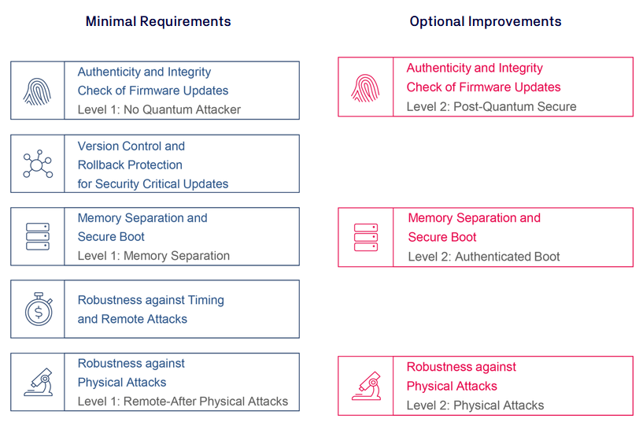

- Integridad y autenticidad... con y sin un atacante con capacidades cuánticas
- Posibilidad de volver atrás
- ¿Acceso físico? ¿Carga segura del sistema operativo? "Hackeo" de la Nintendo Switch

> [Firmware Security: Testing & Certification of your Firmware Update Loader](https://www.tuvit.de/en/services/hardware-software-evaluation/secure-firmware-updates/)
> [Next Steps for the Cybersecurity for IoT Program in the Development of a Federal Profile of NISTIR 8259A](https://pages.nist.gov/FederalProfile-8259A/nontechnical/update/   )

---
<!-- _class: with-success -->

Fases recomendadas por el CCN/CERT para la migración a [sistemas de criptografía post-cuántica](../10-postcuantica.html)

La recomendación del CCN/CERT es acabar la fase 1 **durante 2025**

> [Recomendaciones para una transición postcuántica segura](https://www.ccn-cert.cni.es/es/seguridad-al-dia/novedades-ccn-cert/12234-recomendaciones-para-una-transicion-postcuantica-segura-de-ccn-pytec.html). CCN-TEC 009. Diciembre 2022

## ¿Bambu Connect es una solución?

* Bambu Connect solo se autentica a sí mismo, no al usuario
* Bambu Connect (una aplicación que instalas en tu PC) **incluye la clave privada de Bambu** para poder hacer firmas digitales
* Al día siguiente de presentar Bambu Connect... [Bambu Connect’s Authentication X.509 Certificate And Private Key Extracted](https://hackaday.com/2025/01/19/bambu-connects-authentication-x-509-certificate-and-private-key-extracted/)

[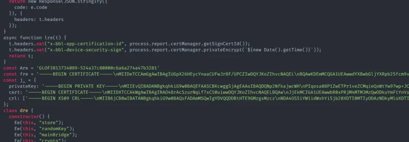](https://hackaday.com/2025/01/19/bambu-connects-authentication-x-509-certificate-and-private-key-extracted/)

---

Cuidado: hemos visto mecanismos de autenticación de entidades diferentes

- En la sesión de firma electrónica, vimos la diferencia entre firma electrónica, sello y firma cualificada
    - Todas esas opciones usan exactamente la misma tecnología (clave pública y certificados)
    - Pero la firma es para personas físicas, el sello para personas jurídicas y la firma cualificada es una firma electrónica que sigue los requisitos legales para probar la identidad
- En la sesión de BEC, vimos que el DKIM es una firma electrónica que se añade a los correos electrónicos e identifica al proveedor de correo, no al remitente
- En la sesión de autenticación, vimos el OAuth son unos tokens para delegar autorizaciones y autenticación a al aplicación, no al usuario
- La solución de Bambu Connect... solo identifica al propio Bambu Connect frente a la impresora, no al usuario

---
<!-- _class: with-success -->

- Todos los clientes (impresora, software, usuarios...) deberían usar tokens gestionados con OAuth (o similar) para autenticarse en la cloud
- Confirmación física en la impresora para comandos "peligrosos"
-  Cifrado extremo a extremo (desde el cliente a la impresora) de los comandos que se envían, de forma que la cloud no pueda leerlos: [modelo WhatsApp](https://faq.whatsapp.com/820124435853543)
- API estable y comunicación con todas las partes involucradas

No implementes la seguridad, usa mecanismos conocidos

> [The Best Architecture Design to Solve All Those Security Issues](https://www.reddit.com/r/BambuLab/comments/1i5t1fy/the_best_architecture_design_to_solve_all_those/)

## Para los curiosos, más argumentos contra Bambu
<!-- _class: with-success -->

- [Why Bambu's “developer mode” breaks security and how they can fix it](https://www.youtube.com/watch?v=iA9dVMcRrhg) Video muy recomendable sobre los problemas de añadir elementos de seguridad en el desarrollo de software, y sistemas de clave pública / asimétrica en particular
- [[Mega Thread] Discussion on Authorization Control System / Third-Party Integration / Bambu Connect ](https://www.reddit.com/r/BambuLab/comments/1i5xvgc/mega_thread_discussion_on_authorization_control/)
- [The real reason Bambu is locking down their firmware… (and why Developer Mode is NOT enough)](https://www.youtube.com/watch?v=yJPWP1Yti1I)

Estado actual de la situación... uso de un modo desarrollador sin seguridad

## Lecciones aprendidas

- Piensa en la gestión de comunicaciones, incluso aquellas para mejorar la seguridad
- La gestión de las actualización de firmware es un problema complejo
- El peligro de las soluciones parciales como Bambu Connect 
- No reinventes la rueda, usa soluciones conocidas: OAuth, claves público/privadas, cifrado extremo-a-extremo...

# Supernote
<!-- _class: lead -->

## Libretas en sistemas de tinta electrónica

Tablets con pantalla de tinta electrónica

Varias marcas: reMarkable, Supernote, Boox, Kindle...

Vamos a estudiar el caso de Supernote

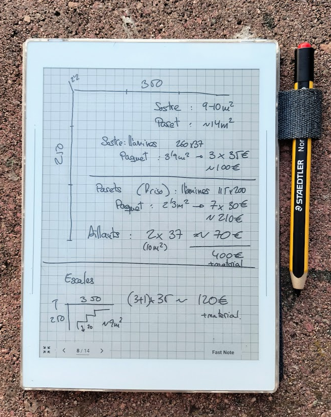

## Problemas de seguridad

- Seguridad física del dispositivo
- Sistemas de DRM
- Gestión de información confidencial: DLP en empresas

## Seguridad física del dispositivo
<!-- _class: with-warning -->

- Sin un control eficaz de acceso:
    - Autenticación del usuario: solo por PIN de desbloqueo... pero si conectas por cable USB tienes acceso libre a todo el contenido
    - Posibilidad de limitación de acceso con contraseñas a libretas individuales... pero no están cifradas
- **Sin cifrado de disco**
- Sistema operativo con problemas de seguridad
    - [Versión de Android que ya no recibe actualizaciones de seguridad](https://github.com/TA1312/supernote-a5x) 
    - Permiso para instalar cualquier aplicación Android
    

 Con acceso físico, el dispositivo no debería considerarse seguro

> [ Supernote Users: How Secure Do You Feel About Your Data? ](https://www.reddit.com/r/Supernote/comments/1eqttur/supernote_users_how_secure_do_you_feel_about_your/)

<!-- Nota que eso no impide que sea un dispositivo útil -->

## Sistemas de DRM

Uno de los usos de estas libretas es la lectura de libros con protección anticopia: sistemas de DRM

- Los dispositivos tienen que autenticarse con el proveedor de contenidos
- Los contenidos tienen que ir marcados
- Trazabilidad de las operaciones

## Ejemplo: HDCP / DRM en contenido de vídeo

High-Bandwidth Digital Content Protection (HDCP) funciona cifrando la señal digital entre la fuente (como un reproductor de Blu-ray o un dispositivo de streaming) y la pantalla (como un televisor o un monitor). 

- **Autenticación**: Al conectar una fuente compatible con HDCP a una pantalla, se realiza un protocolo de enlace (handshake) para verificar que ambos dispositivos estén autorizados.
- **Cifrado**: Si la autenticación es correcta, el contenido se cifra antes de la transmisión.
- **Descifrado**: El dispositivo receptor descifra el contenido para su visualización.
- **Verificación continua**: Este proceso se repite periódicamente para garantizar la seguridad de la conexión.

> https://www.hp.com/us-en/shop/tech-takes/what-is-hdcp#:~:text=Authentication:%20When%20you%20connect%20an,decrypts%20the%20content%20for%20display

---

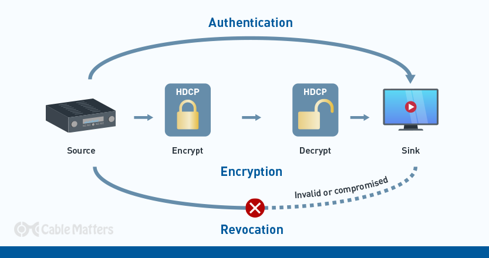

> https://www.cablematters.com/Blog/HDMI/what-is-hdcp-the-complete-guide

---

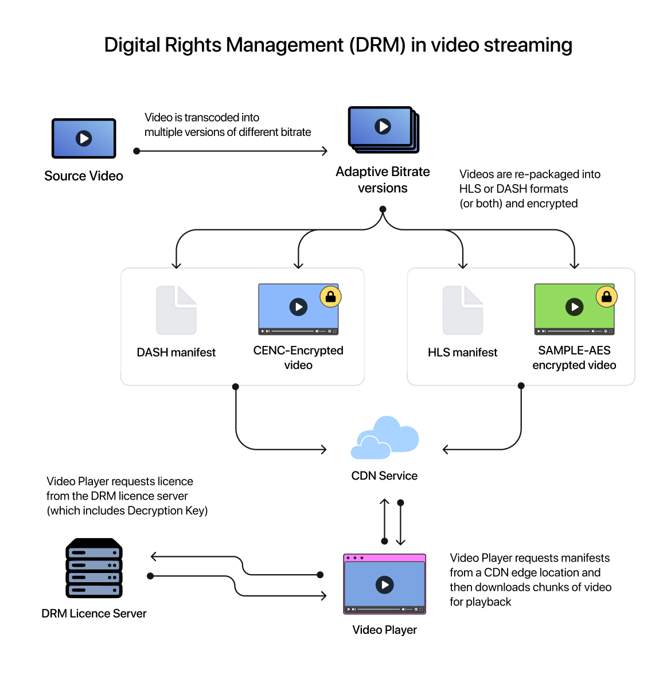

El proceso finciona de una forma similar en el streaming de video: el video está cifrado, y como cliente pides de clave de descifrado al gestor de derechos (DRM), y solo te devolverá la clave de descifrado después de comprobar tu identidad y permisos

> https://callaba.io/what-is-drm-how-it-works-for-video-streaming

## DRM en documentos

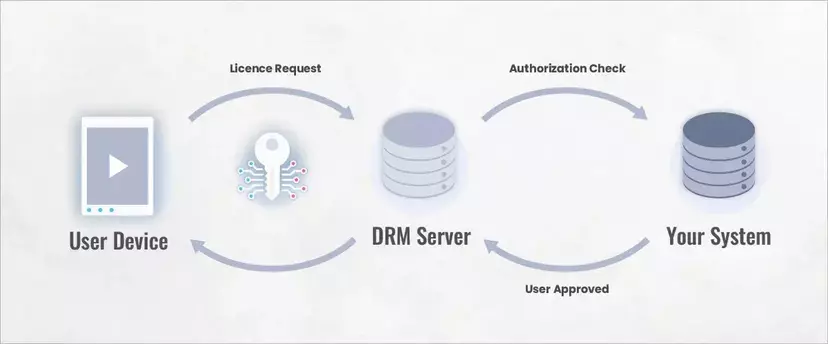

- Prueba que el cliente ha pagado por acceder al documento
- Que el cliente está utilizando una aplicación visora permitida
- Que solo se pueden realizar las acciones que se han contratado (lectura, escritura, impresión...)
- En caso de que el documento aparezca online, permite identificar qué cliente lo ha publicado: watermarking

> [How Does DRM Work? A Comprehensive Guide to DRM Protection](https://www.vitrium.com/blog/how-does-drm-work-comprehensive-guide-drm-protection)

---

Cada proveedor puede implementar el DRM de una forma diferente, y de hecho no son compatibles entre sí. Típicamente, la clave de descifrado de un documento está formada por varias claves encadenadas

- **Clave del documento**
- **Clave del usuario**, de forma que solo un usuario específico puede verlo
- **Clave de aplicación/dispositivo**, de forma que solo puede verse en una aplicación aceptada por el editor

Diferentes documentos del mismo usuario y dentro del mismo dispositivo tendrán claves de descifrado diferentes

> [Complete guide on ePUB DRM security](https://kitaboo.com/epub-drm-security-guide/#adobes-drm)
> [EPUB 3.3. W3C Recommendation 27 March 2025](https://www.w3.org/TR/epub-33/#sec-container-metainf-encryption.xml)

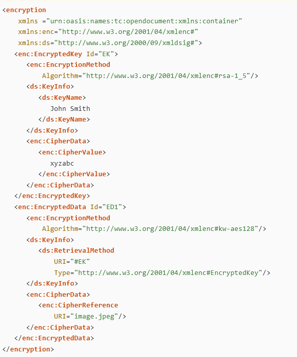

---

Finalmente, es habitual que los documentos incluyan marcas invisibles (*watermarking*) para identificar quién publicó un documento que no debería publicarse. Más información en la [sesión de estagonografía](../09-esteganografia.html)

## Gestión de información confidencial: DLP en empresas

Supernote permite sincronizar documentos en su propia nube, en Dropbox, en Google o en OneDrive

Para uso particular, decide si es adecuado para ti. Para uso empresarial, las políticas de uso de dispositivos informáticos decidirán por ti

¿Cómo pueden las empresas identificar si se están compartiendo datos?

## Data Loss Precention: técnicas
<!-- _class: smaller-font  -->

Técnica|Descripción
--|--
Indexed Document Matching (IDM)|Fingerprint (hasehs, watermarking) de documentos	
Exact Data Matching (EDM)|Palabras clave sensibles
Described Content Matching (DCM)|patrones de datos (tarjetas de créditos, nóminas...)
Optical Character Recognition (OCR)|Conversión de imagen a texto
Custom data classification tags|Etiquetas
True file type filtering|Tipos de archivo
File size filtering|Tamaño de las comunicaciones 

> https://docs.fortinet.com/document/fortigate/7.6.1/administration-guide/153498/data-loss-prevention   

## Pero... ¿las comunicaciones no van cifradas?

Si las comunicaciones van cifradas... ¿cómo sabe la empresa qué documentos estoy compartiendo?

- Agentes en el dispositivo
- SSL inspection

## Agentes en el dispositivo: endpoint DLP

- La empresa instala aplicaciones especiales en tu dispositivo
- Recuerda: las comunicaciones van cifradas en internet, pero no para el sistema operativo
- Implementación:
    - Netskope: "agente" monitorizando las comunicaciones a webs especiales (Google Drive o similares)
    - Trellix: "plugins" del navegador web
    - GPOs que prohiben conexión de dispositivos externos en tu PC

> [What is Endpoint Data Loss Prevention (DLP)?](https://www.crowdstrike.com/en-us/cybersecurity-101/data-protection/endpoint-data-loss-prevention-dlp/)

## SSL inspection
<!-- _class: smaller-font  -->

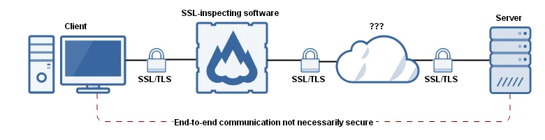

- Es, literalmente, un ataque man-in-the-middle: el firewall empresarial se pone entre tú y el banco y se hace pasar por el banco
    - La empresa ha instalado en tu PC su propio certificado como Root-CA
    - Cuando te conectas con una web a través del firewall, el firewall inicia una conexión segura con la web y contigo de forma separada
    - Tú recibes un certificado firmado por la empresa "esta es la clave pública de la web", pero en realidad es la del firewall
    - Aceptas esa clave pública como la de la web a inicas una conexión "segura" que en realidad está siendo desifrada en el firewall

> [The Risks of SSL-inspection](https://insights.sei.cmu.edu/blog/the-risks-of-ssl-inspection/)

## Lecciones aprendidas

- Es necesario evaluar la seguridad física de los dispositivos y decidir si es conveniente para nosotros
- DRM: mecanismos para la protección del visionado de documentos (libros, vídeos...) en dispositivos no permitidos
- DLP: detección por parte de las empresas cuándo un empleado está filtrando información confidencial hacia el exterior. Implementación:
    - Sistemas de watermarking
    - Endpoint DLP
    - SSL inspection

# ¡Gracias!
<!-- _class: last-slide -->