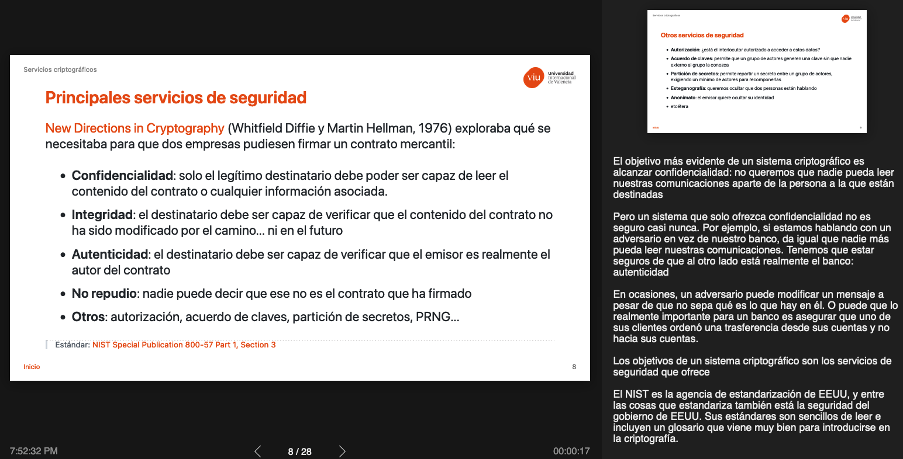

# Criptografía y autenticación
<!-- _class: first-slide -->

**Presentación**

Juan Vera del Campo - <juan.vera@professor.universidadviu.com>

## Temario
<!-- _class: cool-list smaller-font -->

1. [Conceptos básicos](01-conceptos.html)
1. [Sistemas de cifrado](02-cifrado.html)
1. [Firma digital](../A4-firmadigital.html)
1. [Sistemas de autenticación](../11-autenticacion.html)
1. [Anonimato](../12-anonimato.html)
1. *Estudio de casos prácticos (2 sesiones)*
    - [Business Email Compromise](../13-bec.html)
    - [Cifrado de discos](../14-disk.html)
    - [Otros casos](A5-casospracticos.html)

# Presentación
<!-- _class: lead -->

## Sobre mí

Dr. Juan Vera (Juanvi)

<juan.vera@professor.universidadviu.com>

Intereses:

- DFIR: [*Digital Forensics and Incident Response*](https://en.wikipedia.org/wiki/Computer_security_incident_management)
- Miembro del Cyber Incident Response Team de [Valeo](https://es.wikipedia.org/wiki/Valeo)
- Cualquier cosa que vuele

## Objetivos

- Criptografía moderna
  - Para qué se usa y por qué es tan complicada
  - Firma digital
  - Sistemas de autenticación
- Que te convenzas de que la mejor estrategia para evitar errores de seguridad son los protocolos y algoritmos abiertos
- Descubrir otros usos de la criptografía: ransomware, bitcoin...

## Intrucciones de uso de las transparencias

- Acceso directo HTML: <http://juanvvc.github.io/crypto/crypto2>
    - Pulsa `p` para notas de presentación
    - Puedes "Imprimir a PDF" las presentaciones si usas Chrome o Edge, pero no en Firefox o Safari
- Código Markdown: <https://github.com/juanvvc/crypto>

Es muy recomendable seguir los enlaces que aparecen en la presentación

<!-- 
Esto es un ejemplo de notas de profesor. Aquí habrá información adicional, aclaraciones, referencias o explicaciones más largas de los conceptos de la transparencia
-->

## Instrucciones de las actividades
<!-- _class: with-info -->

1. Después de las algunas sesiones se incluirán enlaces a Google Colab en la zona de Actividades de la asignatura
1. Los ejercicios son notebook de Google Colab. Comandos básicos:
    - INTRO: edita línea actual
    - SHIFT+INTRO: ejecuta línea actual
1. Las actividades deben resolverse individualmente
1. No es necesario saber programar: son preguntas de texto libre
1. Entregad en un documento separado en formato PDF que sólo incluya el texto de las preguntas y su respuesta

Las actividades incluyen información adicional que no está en las clases

## Evaluación

- Puntuación. Dos partes:
    - 50% examen
    - 50% actividades
- Es necesario superar con nota media de 5 **cada parte por separado**
- Actividades:
    - No es  necesario superar las actividades individuales, solo que **la media de todos las actividades sea superior a 5**
    - Las actividades no presentados se puntúan como 0
    - Se pueden presentar las actividades hasta el día del examen correspondiente
- En segunda convocatoria, se mantiene la nota de aquella parte que fue superada en primera convocatoria

## Bibliografía
<!-- _class: smaller-font -->

- Del profesor: <https://juanvvc.github.io/crypto/>
- "[*A Graduate Course in Applied Cryptography*](http://toc.cryptobook.us/)".  Dan Boneh   and   Victor Shoup. Con vídeos en:
    - <https://crypto.stanford.edu/~dabo/courses/OnlineCrypto/>
    - https://www.coursera.org/learn/crypto
    - https://www.coursera.org/learn/crypto2
    - https://www.coursera.org/learn/cryptography
- "[*The Joy of Cryptography*](https://joyofcryptography.com/)" de Mike Rosulek, 2021
- "[*A Course in Cryptography*](https://www.cs.cornell.edu/courses/cs4830/2010fa/lecnotes.pdf)" Rafael Pass & Abhi Shelat. Más ligero que el anterior.
- "[*Handbook of Applied Cryptography*](http://cacr.uwaterloo.ca/hac/)" Alfred J. Menezes. Un clásico para conceptos fundamentales.
- "A Course in Cryptography" Heiko Knospe.
- "Criptografía Ofensiva. Atacando y defendiendo organizaciones". Dr. Alfonso Muñoz.

# ¡Gracias!
<!-- _class: last-slide -->
