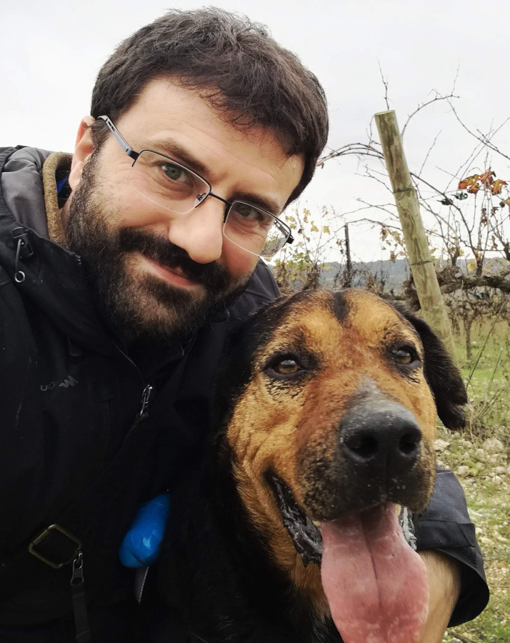

# Criptografía
<!-- _class: first-slide -->

**Presentación**

Juan Vera del Campo

juan.vera@campusviu.es

## Temario

1. [Conceptos básicos](01-conceptos-basicos.html)
    - Anexo: [Glosario](A1-glosario.md)
1. [Criptografía clásica](02-historia.html)
1. [Criptografía de clave simétrica: AES y ChaCha](03-simetrica.html)
    - Anexo: [RNG y HSM](A2-rng.html)
1. [Teoría complejidad y acuerdo Diffie-Hellman](04-complejidad.html)
1. [Criptografía de clave pública: RSA](05-asimetrica.html)

---

6. [Funciones de Hash y Blockchain](06-hashes.html)
1. [Autenticación](07-autenticacion.html)
1. [Firma digital y PKI](08-pki.html)
    - Anexo: [BEC y Ransomware](10-amenazas.html)
1. [Protocolo TLS](09-protocolos.html)
    - Anexo: [Comunicaciones anónimas](A4-anonimato.html)

# Presentación
<!-- _class: lead -->

## Sobre mí

Dr. Juan Vera (Juanvi)

juan.vera@campusviu.es

Intereses:

- DFIR: Análisis forense e *Incident Response*
- Protección de la privacidad
- Cualquier cosa que vuele

<!-- ## La asignatura: Criptografía y Teoría de Códigos

En esta asignatura estudiaremos los mecanismos de seguridad necesarios para mantener nuestras comunicaciones seguras: historia de la criptografía, criptografía simétrica y asimétrica, protocolos criptográficos y firma digital.

- Opcional de cuarto curso, segundo cuatrimestre
- Jueves entre el 11 de febrero y el 29 de abril, excepto el 8 de abril.
- 11 sesiones, más los exámenes
- CET: de 20:00 horas a 22:00 horas
- UTC (hasta abril): de 19:00 horas a 21:00 horas
- UTC (a partir de abril): de 18:00 horas a 20:00 horas

-->

## Intrucciones de uso de las transparencias
<!-- _class: smaller-font -->

Versión más actualizada:

- Acceso directo HTML: <http://juanvvc.github.io/crypto/slides>
    - Puedes pulsar `p` para ver las notas de presentación
    - El "Inicio" (en pie de cada trasparencia) puedes ir a la primera, que incluye un índice de temas.
    - Encontrarás la versión en PDF entre los recursos de la asignatura
- Código Markdown: <https://github.com/juanvvc/crypto>

Durante el estudio personal es muy recomendable seguir los enlaces que aperecen en las transparencias para completar el tema.

El curso está basado [las notas de Jordi Íñigo Griera](https://github.com/jig/crypto), antiguo profesor de la asignatura

 Esta obra esta sujeta a una licencia de [Atribución 4.0 Internacional de Creative Commons](http://creativecommons.org/licenses/by/4.0/)

## Instrucciones de uso de los ejercicios

Los ejercicios son notebook de Jupyter:

1. Instala Jupyter como módulo de Python (Windows, MacOS, Linux): `python3 -m pip install jupyter`
1. En el directorio de ejercicios, ejecuta `jupyter notebook`
1. Comandos básicos:
    - INTRO: edita línea actual
    - SHIFT+INTRO: ejecuta línea actual
1. Tutoriales:
    - https://www.youtube.com/watch?v=jZ952vChhuI
    - https://www.dataquest.io/blog/jupyter-notebook-tutorial/

## Conocimientos necesarios

- Álgebra, teoría de conjuntos, probabilidad
- Conocimientos básicos de programación: ejemplos en Python
- Conocimientos básicos de Linux: comandos en consola
- Conocimientos básicos de redes: cómo funciona la WWW.

## Bibliografía
<!-- _class: smaller-font -->

- Del profesor: <https://juanvvc.github.io/crypto/slides/>
- "[*A Graduate Course in Applied Cryptography*](http://toc.cryptobook.us/)".  Dan Boneh   and   Victor Shoup. Con vídeos en:
    - <https://crypto.stanford.edu/~dabo/courses/OnlineCrypto/>
    - https://www.coursera.org/learn/crypto
    - https://www.coursera.org/learn/crypto2
    - https://www.coursera.org/learn/cryptography
- "[*A Course in Cryptography*](https://www.cs.cornell.edu/courses/cs4830/2010fa/lecnotes.pdf)" Rafael Pass & Abhi Shelat. Más ligero que el anterior.
- "[*Handbook of Applied Cryptography*](http://cacr.uwaterloo.ca/hac/)" Alfred J. Menezes. Un clásico para conceptos fundamentales.
- "A Course in Cryptography" Heiko Knospe.
- "Criptografía Ofensiva. Atacando y defendiendo organizaciones". Dr. Alfonso Muñoz.

---
<!-- _class: center -->

Continúa en: [Conceptos básicos](01-conceptos-basicos.html)
